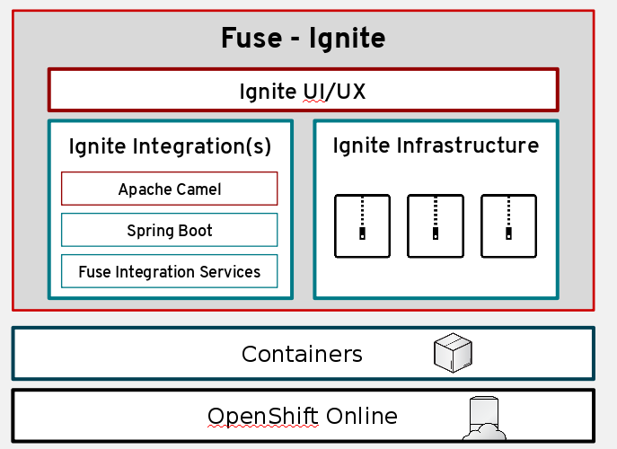

:data-uri:
:numbered!:
:noaudio:

:scrollbar:

== Technical Architecture

* Container driven
* Powered by Red Hat OpenShift Container Platform

ifdef::showscript[]

=== Transcript

Red Hat Fuse Online uses Fuse Ignite technology infrastructure. The code base is packaged into containers and hosted on OpenShift Online.
Therefore, Red Hat Fuse Online is highly scalable and able to cater to differing types of user workloads.

endif::showscript[]
