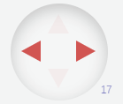
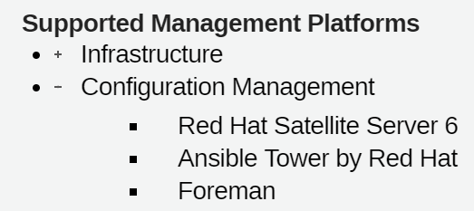
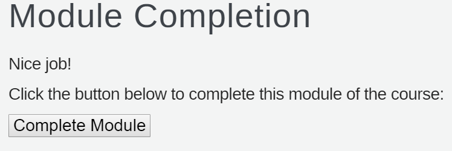

:scrollbar:
:data-uri:
:noaudio:

== Course Navigation Tips

[.noredheader,cols="5,2"]
|===
a|* To move between slides, click the arrows in the lower-right corner
** If you do not see the arrows, move your cursor to that region and the arrows will appear
^|
a|* To display the audio transcript, press `S`
** If the transcript does not display, click the slide and press `S` again
|
a|* To expand or collapse an item, click the *+* or *-* symbol that appears between the bullet symbol and the text
|
a|* To receive credit for completing a module, you must click the *Module Complete* button on the Module Completion slide

** To confirm that you received credit for completing a module, look for a check mark next to the module name on the left side of the screen
|
|===

ifdef::showscript[]

=== Transcript

Here are a few tips to help you navigate through this course. 

To move between slides, click the arrows in the lower-right corner. If you do not see the arrows, move your cursor to the lower-right corner and the arrows will appear.

To display the audio transcript, press the "S" key.

Some lists have expandable items. To expand an item, click the "+" symbol that appears between the bullet symbol and the text. To collapse an item, click the "-" symbol that appears between the bullet symbol and the text. 

To receive credit for completing a module, you must click the *Module Complete* button on the Module Completion slide. Once you receive credit for completing a module, the x next to the module name on the left side of the screen  changes to a check mark.

endif::showscript[]
