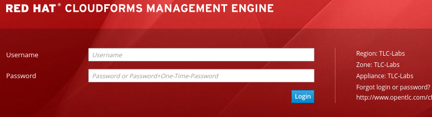
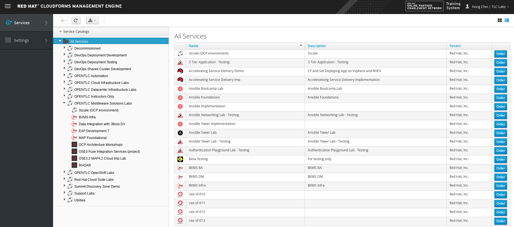
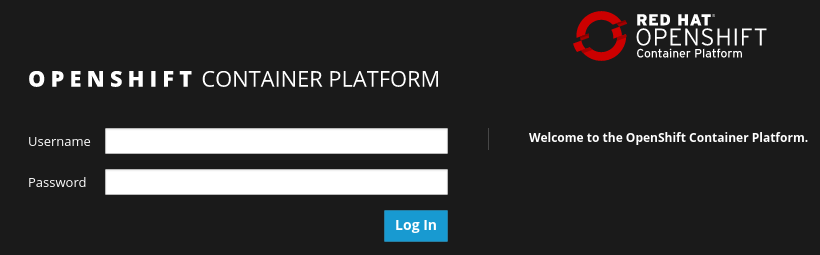

:scrollbar:
:data-uri:
:toc2:
:linkattrs:
:coursevm:

== Fuse Ignite Environment Setup Lab

This course includes at least one lab per module. Each lab is hands-on and typically takes about an hour to complete. Completing the course labs prepares you to correctly answer many of the final assessment questions.

.Goals
* Provision a Red Hat Fuse Ignite lab environment

.Requirements
* Red Hat OPENTLC credentials
* OpenShift Container Platform CLI (`oc` utility) has to be link:https://access.redhat.com/documentation/en-us/openshift_container_platform/3.7/html/cli_reference/cli-reference-get-started-cli#installing-the-cli[downloaded] to your local PC, unarchived and setup for command line use
* A command line SSH client must be setup on your local PC
* Active Internet connection must be provided
+
[IMPORTANT]
Sufficient memory and disk space must be provided on your local PC.

.Lab Conventions
The following environment variable is used in this lab to reference an installation directory:

* `${lab_code}` refers to the lab assets directory. It contains a pom.xml file and its directory path should contain `../ipaas-<version_number>/code`

:numbered:

=== Remote OpenShift Environment

This course provides an OpenShift environment in the cloud. Red Hat strongly recommends that you use this remote OpenShift lab environment.

=== Sign Up
. Identify your Red Hat OPENTLC username.
+
[TIP]
If you are unsure of your Red Hat OPENTLC credentials, reset them from the link:https://www.opentlc.com/pwm/private/Login[OPENTLC Account Management^] page. If you continue to have problems, email `open-program@redhat.com`.

. Using your OPENTLC credentials, log in to the link:https://labs.opentlc.com/[OPENTLC lab portal^]:
+

. Navigate to *Services -> My Services*.
. Delete all previous services that you may still have active.
* Doing so allows you to order a service for this course.

. Navigate to *Services -> Catalogs -> OPENTLC Middleware Solutions Labs*.
. Select *Fuse Ignite (OCP environment)*:
+

. On the next page, click *Order*, and on the form that appears, click *Submit*.
* Expect to receive an email from Red Hat with information about the course.

=== Connect

. Check your email for a message from Red Hat similar to the following:
+
.Sample Email
[source,text]
-----
You have been enrolled in the Red Hat OPENTLC FUSE IGNITE OpenShift environment.
You can access your Fuse Ignite environment by going to https://master.<GUID>.openshift.opentlc.com and logging in using <YOUR OPENTLC ID>.
You can access the Coolstore Product Catalog Microservice by going to http://<GUID>.product-catalog-service.apps.na1.openshift.opentlc.com/ .

NOTICE: Your environment will expire and be deleted in 14 day(s) at 2018-03-24 00:00:00 -0400. In order to conserve resources we cannot archive or restore any data in this environment. All data will be lost upon expiration.
-----

. Identify your OpenShift lab environment GUID.
* In the example shown above, the GUID is `na1`. Your email contains a unique GUID. Make a note of your GUID to use throughout this course.

. Open a web browser window on your host machine and navigate to the URL to the *Fuse Ignite* environment identified from the confirmation email.
. Click through the warnings from your browser indicating that it has no knowledge of the Certificate Authority associated to your OpenShift Container Platform web console.
* The _OpenShift Container Platform web console_ in your lab environment is secured by default using a self-signed certificate.

. From the OpenShift Container Platform web console login page, log in using your `OPENTLC` credentials:
+

. Open another web browser window on your host machine and navigate to the URL for the *Coolstore Product Catalog Microservice* identified from the confirmation email.
. Notice the JSON output from the Microservice, displayed in the web browser window.
. You now have a working Fuse Ignite lab environment from which to conduct labs. In addition, you can use the Microservice for your labs.

[NOTE]
There is a total two software applications hosted on the OPENTLC OpenShift Container Platform lab environment:
1. Fuse Ignite - for Integration tooling
2. Coolstore Product Catalog Microservice - for specific integration lab use

=== Define Environment Variables

You need to set a few environment-specific variables in your shell terminal that can be leveraged throughout various commands in this course.

. As the super user of your local PC, execute each of the following commands, one at a time.
. Set an environment variable with your lab environment GUID:
+
[source,text]
-----
$ echo "export GUID=<your OCP lab environment GUID as provided in the confirmation email>" >> ~/.bashrc
-----

. Set an environment variable with your OpenShift user Id:
+
-----
$ echo 'export OCP_USER_ID=<your OCP USER ID>' >> ~/.bashrc
-----
+
NOTE:  This value will be your OPENTLC User ID.

. Enable the new environment variables in your existing shell:
+
[source,text]
-----
$ source ~/.bashrc
-----

=== Authenticate into OpenShift Using `oc` Utility

From your local PC, the `oc` utility allows you to interact from the command line with your provisioned OpenShift Container Platform environment.

. Authenticate to your OpenShift Container Platform environment as follows:

. Ensure that you are logged in as the super user of your local PC.
. Execute the login command to OpenShift:
+
[source,text]
-----
$ oc login https://master.$GUID.openshift.opentlc.com -u $OCP_USER_ID
-----

. Notice the message, similar to this:
+
[source,text]
-----
Logged into "https://master.$GUID.openshift.opentlc.com:443" as "$OCP_USER_ID" using existing credentials.
-----

You are now ready for enterprise integration work using Red Hat Fuse Ignite.

:numbered!:
