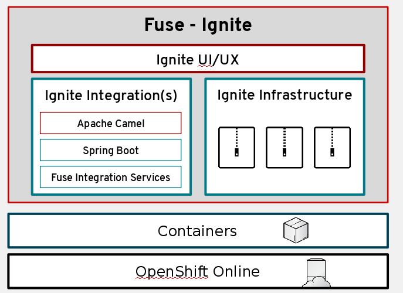

:data-uri:
:numbered!:
:noaudio:

:scrollbar:

== Technical Architecture

* Container-driven architecture
** enables modularity in deployment
** ease of management and troubleshooting
* Powered by Red Hat OpenShift Container Platform
** Kubernetes support - enables security, scalability and manageability

ifdef::showscript[]

=== Transcript

Red Hat Fuse Online uses Fuse Ignite technology infrastructure. The code base is packaged into containers and hosted on OpenShift Online. This enables modularity during deployment and ease of mangement and troubleshooting during operations.
Therefore, Red Hat Fuse Online is highly scalable and able to cater to differing types of user workloads. With Kubernetes support in Red Hat OpenShift, operational concerns of Fuse Ignite like security, scalability and manageability are made easy.

endif::showscript[]
