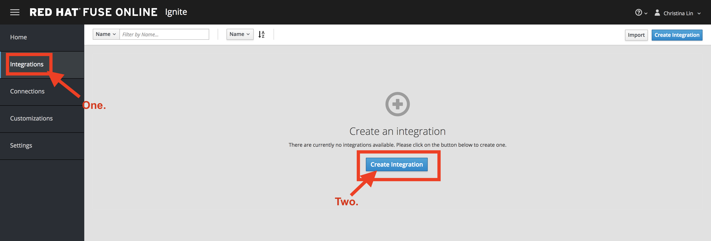

# Simple SaaS integration with Swagger Document

## Prerequisites
* A valid [Fuse Online](https://www.redhat.com/en/explore/fuse-online) account 

## Background

Utility payment management system has offered an online service to pay for the water utility bill -- Water Company. You job is read from the input of a frontend application and setup re-occurring payment for different account. 
 

To access the frontend application go to 
> **https://todo-*YOUR_FUSE_IGNITE_URL*/index.php**

This data are stored in the default embedded Fuse Online database. 

The **Water Company** API has a backend dashboard that display all the payment. You will be able to view the result of the payment. 
(Data cleans every three hours.)
https://water-company-tp3demo.4b63.pro-ap-southeast-2.openshiftapps.com/main

## Low Code Integration

### Step One - Setup Connector and Connection

In the Ignite navigation panel, click Customizations, and click on *Create API Connector*

 

Click *Use a URL* and enter the swagger location

> https://raw.githubusercontent.com/weimeilin79/fuse7tp3demo/master/waterpayment.yml
  
 

Follow the instruction and click through to the final step. 
 
 
 

In the Ignite navigation panel, click Connections, and click on *Create Connection*

Selects "Pay Water Bill" as the Connection Type.

Enter "/" as the Base path, and select *"Next"*

Name your Connection.

### Step Two - Integration

In the Ignite navigation panel, click Integrations, and click on *Create Integration*

On the Choose a Start Connection page, click the default PostgresDB connection.

Choose *Periodic SQL Invocation* to setup the re-occurr payment.

Enter following input. 

* **SQL Statement:** *SELECT TASK FROM TODO WHERE TASK LIKE 'reoccurring%';*
* **Period:** *30000*

On the Choose a Finish Connection page, click **PayBill** connection that you created.

On the Choose an Action page, click **Payment**, which will kick off water utility bill payment.

In the left panel, hover over the plus sign between the TODO *PERIODIC SQL INVOCATION* step and the finish *PAYMENT* connection to display a pop-up in which you click Add a Step.

On the Choose a Step page, click Data Mapper. 

In the data mapper, the Sources panel on the left displays the fields in the output from the Todo step. The Target panel on the right displays the fields from the Water Company API. In the Target panel, expand the body field. Drag the **Task** field from Souce panel to the **senderid** in the Target Panel.

On the Mappiung Detail Panel, Under Action, select **Separate**.

On the same Mappiung Detail Panel, Under Targets, enter 2 in the Separate Index, and select *Add Transformation* and select **Trim**. And Click on *Add Target*

Enter **amount** in the new popup target section. Make sure the index is set to **3**

Click Done. 

Click on *Save as Draft* to save this integration. And name the integration. Click on *Publish* to start the integration.

Wait until the integration become active.

### Step Three - Integration Result

Go to the frontend TODO application

> **https://todo-*YOUR_FUSE_IGNITE_URL*/index.php**

Enter *reoccurring YOUR_NAME BILLING_AMT* in the TODO form.

Go to the *Water Company* backend dashboard and view the result of the integration. 
> https://water-company-tp3demo.4b63.pro-ap-southeast-2.openshiftapps.com/main

Enter another name *reoccurring YOUR_NAME BILLING_AMT* in the TODO form.

Go to the *Water Company* backend dashboard and view the result of the integration. 
> https://water-company-tp3demo.4b63.pro-ap-southeast-2.openshiftapps.com/main

Delete all entry in frontend TODO application

Deactivate the integration.

## Resource
[Fuse Online] (https://www.redhat.com/en/explore/fuse-online) - https://www.redhat.com/en/explore/fuse-online
[Demo Video](https://vimeo.com/257550267) - https://vimeo.com/257550267