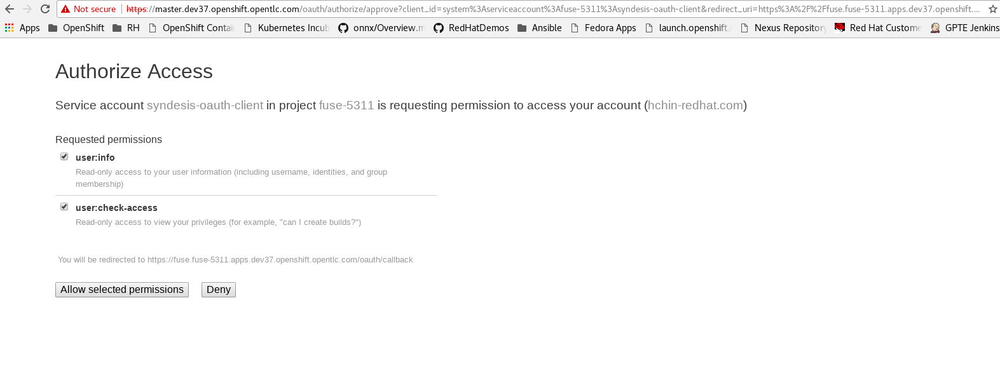
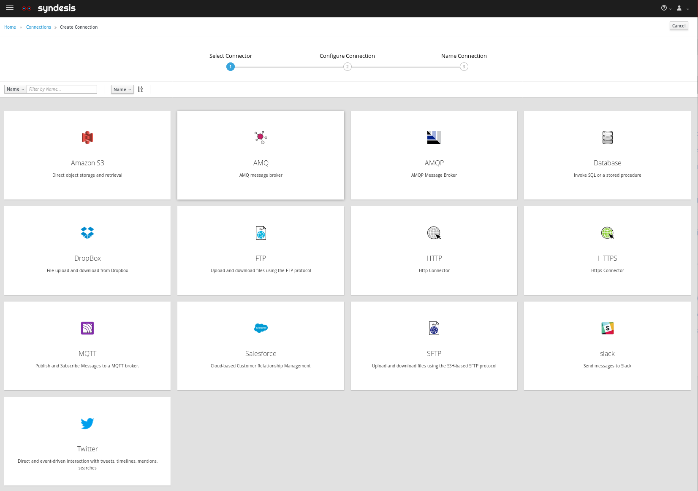

:scrollbar:
:data-uri:
:toc2:
:linkattrs:
:coursevm:

== Integration Lab - Data Synchronization on the Cloud: Microservice to Flat File scenario

//Describe business scenario - repeat architecture diagram

This course includes at least one lab per module. Each lab is hands-on and typically takes about an hour to complete. Executing the course labs prepares you to correctly answer many of the final assessment questions.

.Goals
* Design an integration for a cloud-based data persistence solution, where JSON data from a Microservice is synchronized and persisted to a Flat File on a remote server
* Implement the planned integration using Red Hat Fuse Ignite

.Requirements
* Provisioned a Fuse Ignite environment

In this lab, you will fulfill the requirements for a cloud-based data synchronization solution, by integrating a provider of JSON data, namely a Microservice, to a remote file hosting server designated to host the destination copy of the data.

The data will be persisted into a flat file, which will be created upon the initial synchronization with the Microservice using a Fuse Ignite integration. This integration scenario will be real-time and will be active indefinitely (does not ever stop, if you allow it).

As the Integration actively polls the Microservice for Product Catalog data of an e-commerce business, called Coolstore, the flat file is constantly refreshed with the most current data that the Microservice offers. This allows the users of the Product Catalog data to confidently download the data from the remote file hosting server anytime they require it for use in their business operations.

:numbered:

=== Logon to Red Hat Fuse Ignite

. Check your email inbox for the same email you received earlier, containing a link to Red Hat Fuse Ignite.
+
CAUTION: Red Hat Fuse Ignite is supported for the following web browsers: Google Chrome, Mozilla Firefox, Microsoft Edge
+
. Click this link to display the Red Hat Fuse Ignite login page.

. Log in using your OPENTLC account.

. A webpage launches, prompting you to authorize Red Hat Fuse Ignite access to your OPENTLC account credentials:
+

+
. Select both available checkboxes and click the *Allow selected permissions* button.
+
NOTE: This authorization page will appear only once. The next time you log in, the console for Fuse Ignite appears instead of this authorization page.

=== Create a HTTP connection to the Microservice

You will setup a connection to the Microservice that provides Product Catalog data in JSON format.

. On the left-hand pane of Fuse Ignite console, click *Connections*.
. Select the Connection named *HTTP*.
. Provide `coolstore-product-catalog-microservice` as the name of the HTTP connection.
. Provide the URL to the *Coolstore Product Catalog Microservice* as earlier identified from the confirmation email.
. Click *Create* to complete the connection creation process.

=== Setup a web hosting account

You will utilize a remote file hosting server in order to provide the environment for hosting the destination endpoint (which is a flat file) of the Fuse Ignite Integration.

. Setup a user account with a free web-hosting service provider. Ensure that you are able to utilize FTP and SFTP services using this account.
+
[NOTE]
The following lab involves an account from link:https://infinityfree.net/[Infinity Free]
. Note the Login ID and Password for your new account, as the Fuse Ignite integration creation process will require these particulars.

=== Create an FTP connection to the web hosting service provider

You will setup a connection to the web hosting service where the flat file containing JSON data will be stored.

. On the left-hand pane of Fuse Ignite console, click *Connections*.
. Select the Connection named *FTP*.
+

+
. Provide `hosting-server` as the name of the FTP connection.
. Proceed to populate the form with the Login ID and Password of your web hosting service account.
. Click *Create* to complete the connection creation process.

=== Create an Integration from the HTTP connection to the FTP connection

You will setup an integration between the Microservice and the web hosting service.

. On the left-hand pane of Fuse Ignite console, click *Integrations*.
. Click *Create Integration*.
. Select the Salesforce connection, on the *Choose a Start Connection* page.
. Click the *On create* option, on the *Choose an Action* page.
. On the *On create* page, select *Lead* from the list of choices in the *Object name* field.
. Click *Done*. The HTTP connection is now officially the *start connection* in the Integration.
. In the Fuse Ignite console, select the *Finish Connection* page.
. Select the `hosting-server` connection icon.
. Specify the value of the *File name expression* field, as `product-catalog.txt`.
. Specify the value of the *FTP Directory* field, as `./htdocs`.
. Click *Done*. The `hosting-server` connection is now part of the Integration.

//=== Add a data mapping step

. At the top-left hand corner of the Fuse Ignite console, select the field with the text `Enter integration name...`
. Provide _Microservice to File_ as the name for the integration.
. At the upper right corner of the console, click *Publish*.
. While the integration is being deployed, click the *Done* button.
. Once the green checkbox icon appears next to the _Microservice to File_ integration, it indicates that the integration has been successfully deployed.

Now, testing of the data synchronization integration can proceed.

=== Test the _Microservice to File_ Integration

You will setup a connection to the web hosting service where the flat file containing JSON data will be stored.

. Click *Integrations*, in the left-hand pane of the Fuse Ignite console.
. Select the _Microservice to File_ integration.
. Validate that the _Microservice to File_ integration is active.
. In a separate web browser window, access the *Coolstore Product Catalog Microservice* using the URL earlier identified from the confirmation email.
. Notice the JSON output, provided by the Microservice, displayed in the web browser window.
* Question: Can you identify the individual products listed as well as their attributes?
. Using an FTP client, or a web-based console (if available), login and navigate to the root directory of your web hosting service account.
. Navigate to the `./htdocs` subdirectory.
. Locate and download the `product-catalog.txt` file to your local PC.
. Locate the `product-catalog.txt` file on your local PC and open it using your favorite text editor.
. Compare the contents of the `product-catalog.txt` file, with the JSON output from the *Coolstore Product Catalog Microservice* which is displayed in the web browser window.
* Question: Does the flat file contents differ from the JSON output in the web browser window? What are your conclusions regarding the function of the _Microservice to File_ integration?

[NOTE]
If you are using the Fuse Ignite Technology Preview release, exactly one integration at a time can be active (ie: in publish state).
Though you can create another Fuse Ignite integration, you cannot publish it while another integration is active.
As a good housekeeping practice, it is recommended to unpublish any integration that you no longer wish to test.

=== Housekeeping

You will clean up the integration.

. In the left-hand pane, click *Integrations*.
. Locate the entry for the _Microservice to File_ integration.
. Click the icon displaying three black dots in a vertical sequence, located right of the green check box. A drop down list appears.
. Select *Unpublish* from the drop down list, followed by selecting *OK* in the pop-up window. This will deactivate the integration.
* At this stage, any other integration can be published and tested.
+
[NOTE]
The next few steps are optional. Use them only when you are certain that the integration will never be required again.
+
. Locate the entry for the _Microservice to File_ integration.
. Click the icon displaying three black dots in a vertical sequence, located right of the green check box. A drop down list appears.
. Click *Delete Integration*, followed by clicking *OK*, at the bottom of the summary pane.

You have completed, tests and cleaned up your integration in Fuse Ignite.

ifdef::showscript[]

endif::showscript[]
