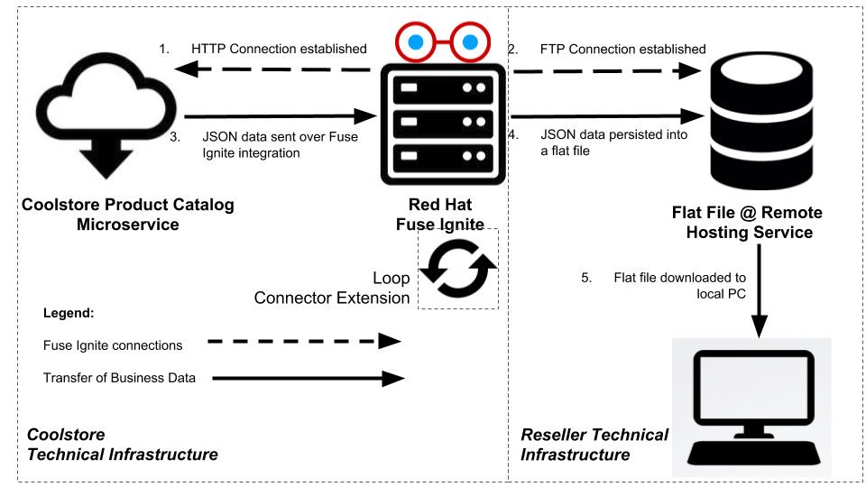
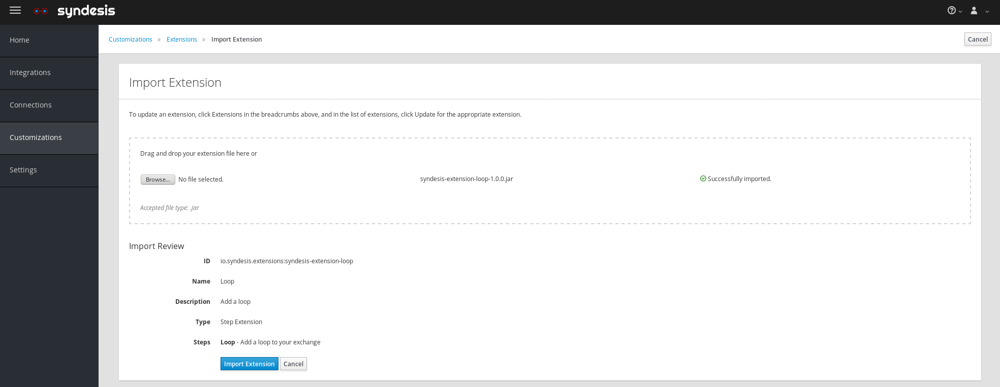
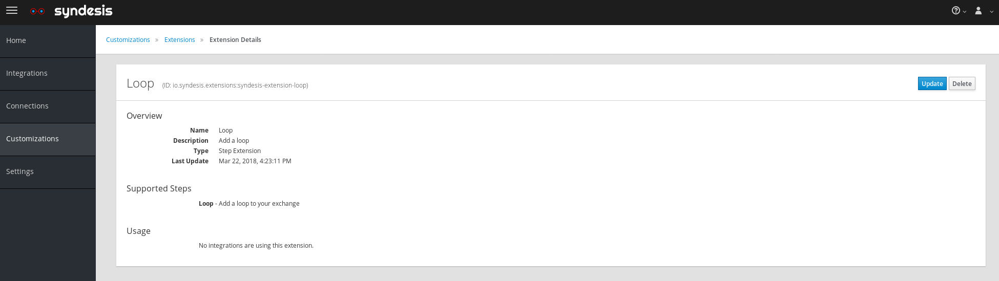
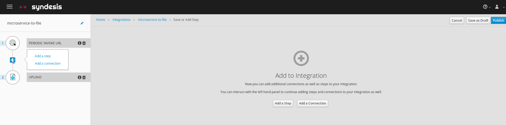
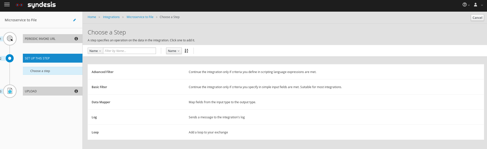
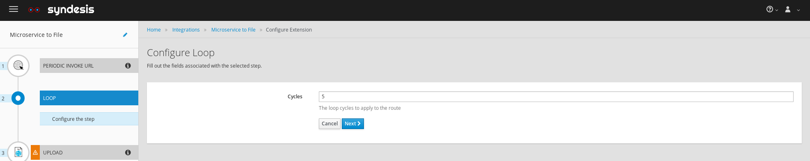

:scrollbar:
:data-uri:
:toc2:
:linkattrs:
:coursevm:

== Connector Technical Extensions Lab - Customize and implement an existing technical extension as a connector

This course includes at least one lab per module. Each lab is hands-on and typically takes about an hour to complete. Executing the course labs prepares you to correctly answer many of the final assessment questions.

.Goals
* Customize an existing technical extension
* Implement technical extension as a connector
* Using Fuse Ignite, create an integration using this connector extension
* Test the integration

.Pre-requisites
* Completion of *Integration Lab - Data Synchronization on the Cloud: Microservice to Flat File scenario* in Module 2
* Apache Maven must be installed on your local PC
** Download link:https://maven.apache.org/download.html[Apache Maven].
** Complete the installation by following this https://maven.apache.org/install.html[guide].

This lab involves an enhancement to an existing integration: the _Microservice to File_ integration from Module 2.
The enhancement involves adding a technical extension that adds loop cycles to the synchronization process.

:numbered:

=== Logon to Red Hat Fuse Ignite

You will proceed to utilize the Fuse Ignite environment.

. Check your email inbox for the same email you received earlier, containing a link to Red Hat Fuse Ignite.
+
CAUTION: Red Hat Fuse Ignite is supported for the following web browsers: Google Chrome, Mozilla Firefox, Microsoft Edge
+
. Click this link to display the Red Hat Fuse Ignite login page.

. Log in using your OPENTLC account. The Fuse Ignite console page appears.

=== Compile the technical extension

You will compile a pre-developed technical extension as part of the integration.

//include an image of a Application Developer handing over a technical extension to a Citizen Developer

An application developer can build a technical extension which serves as the implementation for a custom step. The application developer then transfers the technical extension, as a .jar archive, over to the citizen developer, who proceeds to upload the technical extension into the Fuse Ignite project environment. The citizen developer then creates a custom step using this technical extension, and reuses it in multiple integrations.

[NOTE]
Learn how a technical extension is developed with the link:https://access.redhat.com/documentation/en-us/red_hat_jboss_fuse/6.3/html/tooling_user_guide/igniteextension/[JBoss Fuse Tooling Guide]. You will appreciate from this guide that certain conventions regarding a custom developed technical extension’s JSON file contents must be observed.

The community project for Fuse Ignite is called `Syndesis`. Extension archetypes have to be compiled prior to the compilation and use of technical extensions within a Fuse Ignite integration.

. Using a command-line terminal window, clone a repository containing the code base for `Syndesis` into a working directory which is referred to here as `$lab_dir`
+
----
$ cd $lab_dir
$ git clone https://github.com/gpe-mw-training/syndesis
----
+
. In the terminal window, navigate to the subdirectory called `/syndesis/tools/bin` and execute the command to compile the `Syndesis` code:
+
----
$ cd $lab_dir/syndesis/tools/bin
$ ./syndesis build
----
+
. A successful compilation will result in the following messages:
+
----
[INFO] --- maven-install-plugin:2.5.2:install (default-install) @ ui ---
[INFO] Installing /hong/syndesis/app/ui/pom.xml to /root/.m2/repository/io/syndesis/ui/ui/1.3-SNAPSHOT/ui-1.3-SNAPSHOT.pom
[INFO] Installing /hong/syndesis/app/ui/target/ui-1.3-SNAPSHOT-dist.tar.gz to /root/.m2/repository/io/syndesis/ui/ui/1.3-SNAPSHOT/ui-1.3-SNAPSHOT-dist.tar.gz
[INFO] ------------------------------------------------------------------------
[INFO] Reactor Summary:
[INFO]
[INFO] Syndesis ........................................... SUCCESS [  5.967 s]
[INFO] Common ............................................. SUCCESS [  1.292 s]
[INFO] Common :: Util ..................................... SUCCESS [ 56.218 s]
[INFO] Common :: Model .................................... SUCCESS [ 36.371 s]
[INFO] Extension .......................................... SUCCESS [  0.163 s]
[INFO] Extension :: API ................................... SUCCESS [ 17.801 s]
[INFO] Extension :: Annotation Processor .................. SUCCESS [ 15.057 s]
[INFO] Extension :: Archetype :: Spring Boot .............. SUCCESS [ 16.070 s]
[INFO] Extension :: Archetype :: Java ..................... SUCCESS [  1.857 s]
[INFO] Extension :: Archetype :: Camel XML ................ SUCCESS [  1.407 s]
[INFO] Extension :: Bill of Materials (BOM) ............... SUCCESS [  0.089 s]
[INFO] Extension :: Converter ............................. SUCCESS [ 24.066 s]
[INFO] Extension :: Maven Plugin .......................... SUCCESS [ 59.604 s]
[INFO] Extension :: Example :: Log Step ................... SUCCESS [  4.359 s]
[INFO] Integration ........................................ SUCCESS [  0.257 s]
[INFO] Integration :: API ................................. SUCCESS [  8.266 s]
[INFO] Integration :: Component Proxy ..................... SUCCESS [ 26.747 s]
[INFO] Integration :: Runtime ............................. SUCCESS [ 54.052 s]
[INFO] Integration :: Project Generator ................... SUCCESS [ 17.176 s]
[INFO] Connector .......................................... SUCCESS [  8.055 s]
[INFO] Connector :: Support :: Util ....................... SUCCESS [  6.197 s]
[INFO] Connector :: Support :: Verifier ................... SUCCESS [  3.445 s]
[INFO] Connector :: Support :: Maven Plugin ............... SUCCESS [  7.517 s]
[INFO] Connector :: Twitter ............................... SUCCESS [  2.590 s]
[INFO] Connector :: FTP ................................... SUCCESS [  2.008 s]
[INFO] Connector :: SFTP .................................. SUCCESS [  1.636 s]
[INFO] Connector :: DropBox ............................... SUCCESS [  7.517 s]
[INFO] Connector :: AWS S3 ................................ SUCCESS [01:03 min]
[INFO] Connector :: Support :: Test ....................... SUCCESS [  3.098 s]
[INFO] Connector :: ActiveMQ .............................. SUCCESS [ 39.478 s]
[INFO] Connector :: AMQP .................................. SUCCESS [ 11.485 s]
[INFO] Connector :: SQL ................................... SUCCESS [01:22 min]
[INFO] Connector :: MQTT .................................. SUCCESS [ 20.804 s]
[INFO] Connector :: HTTP .................................. SUCCESS [  8.053 s]
[INFO] Connector :: Salesforce ............................ SUCCESS [ 14.954 s]
[INFO] Connector :: Slack ................................. SUCCESS [  2.755 s]
[INFO] Connector :: Support :: Catalog .................... SUCCESS [  4.150 s]
[INFO] Connector :: OData ................................. SUCCESS [  0.023 s]
[INFO] Connector :: OData :: Model ........................ SUCCESS [ 13.588 s]
[INFO] Connector :: OData :: Create ....................... SUCCESS [ 27.206 s]
[INFO] Connector :: OData :: Retrieve ..................... SUCCESS [  8.018 s]
[INFO] Connector :: OData :: Replace ...................... SUCCESS [  7.945 s]
[INFO] Connector :: OData :: Update ....................... SUCCESS [  2.479 s]
[INFO] Connector :: OData :: Delete ....................... SUCCESS [  2.424 s]
[INFO] Connector :: REST Swagger .......................... SUCCESS [ 13.790 s]
[INFO] Server ............................................. SUCCESS [  0.130 s]
[INFO] Server :: DAO ...................................... SUCCESS [ 23.987 s]
[INFO] Server :: Connector Generator ...................... SUCCESS [ 55.221 s]
[INFO] Server :: OpenShift Services ....................... SUCCESS [ 21.559 s]
[INFO] Server :: Controller ............................... SUCCESS [ 11.512 s]
[INFO] Server :: Credential ............................... SUCCESS [ 32.745 s]
[INFO] Server :: JsonDB ................................... SUCCESS [ 19.015 s]
[INFO] Server :: Verifier ................................. SUCCESS [  8.684 s]
[INFO] Server :: Inspector ................................ SUCCESS [ 11.952 s]
[INFO] Server :: Endpoint ................................. SUCCESS [ 48.063 s]
[INFO] Server :: Logging :: JsonDB ........................ SUCCESS [ 18.670 s]
[INFO] Server :: FileStore ................................ SUCCESS [  9.780 s]
[INFO] Server :: Metrics :: JsonDB ........................ SUCCESS [ 20.300 s]
[INFO] Server :: Metrics :: Prometheus .................... SUCCESS [ 15.546 s]
[INFO] Server :: Builder :: Maven Plugin .................. SUCCESS [ 13.601 s]
[INFO] Server :: Runtime .................................. SUCCESS [07:09 min]
[INFO] Server :: Builder :: Image Generator ............... SUCCESS [  7.863 s]
[INFO] S2I ................................................ SUCCESS [ 16.589 s]
[INFO] Meta ............................................... SUCCESS [ 22.880 s]
[INFO] UI ................................................. SUCCESS [05:53 min]
[INFO] ------------------------------------------------------------------------
[INFO] BUILD SUCCESS
[INFO] ------------------------------------------------------------------------
[INFO] Total time: 31:08 min
[INFO] Finished at: 2018-03-21T23:19:50+08:00
[INFO] Final Memory: 420M/878M
[INFO] ------------------------------------------------------------------------
----
+
. Using a new web browser, download the latest technical extensions link:https://github.com/syndesisio/syndesis-extensions/releases[*release*] for Fuse Ignite.
. Extract the archive, containing the technical extensions, into the working directory `$lab_dir`.
. Using a command-line terminal window, navigate to the subdirectory containing the code for the technical extension `syndesis-extension-loop`.
. Within this subdirectory `syndesis-extension-loop`, compile the technical extension using the command:
+
----
$ mvn -N install
----
+
. A successful compilation of the technical extension results in the following message:
+
----
Downloading from oss-sonatype-snapshots: https://oss.sonatype.org/content/repositories/snapshots/io/syndesis/extension/extension-converter/1.3-SNAPSHOT/maven-metadata.xml
[INFO] Looking in for annotated classes in: /hong/syndesis-extensions-master/syndesis-extension-loop/target/generated-sources/annotations
[INFO] Loading annotations properties from: /hong/syndesis-extensions-master/syndesis-extension-loop/target/generated-sources/annotations/io/syndesis/extension/loop/LoopAction-loop.json
[INFO] HV000001: Hibernate Validator 5.3.5.Final
[INFO] Looking for configuration to override at Maven Plugin configuration level.
[INFO] Created file /hong/syndesis-extensions-master/syndesis-extension-loop/target/classes/META-INF/syndesis/syndesis-extension-definition.json
[INFO]
[INFO] --- maven-jar-plugin:2.4:jar (default-jar) @ syndesis-extension-loop ---
[INFO] Building jar: /hong/syndesis-extensions-master/syndesis-extension-loop/target/syndesis-extension-loop-1.0.0.jar
[INFO]
[INFO] --- extension-maven-plugin:1.3-SNAPSHOT:repackage-extension (default) @ syndesis-extension-loop ---
[INFO] Resolving artifact io.syndesis.extension:extension-bom:pom:1.3-SNAPSHOT from [central (https://repo.maven.apache.org/maven2, default, releases)]
[INFO]
[INFO] --- maven-install-plugin:2.4:install (default-install) @ syndesis-extension-loop ---
[INFO] Installing /hong/syndesis-extensions-master/syndesis-extension-loop/target/syndesis-extension-loop-1.0.0.jar to /root/.m2/repository/io/syndesis/extensions/syndesis-extension-loop/1.0.0/syndesis-extension-loop-1.0.0.jar
[INFO] Installing /hong/syndesis-extensions-master/syndesis-extension-loop/pom.xml to /root/.m2/repository/io/syndesis/extensions/syndesis-extension-loop/1.0.0/syndesis-extension-loop-1.0.0.pom
[INFO] ------------------------------------------------------------------------
[INFO] BUILD SUCCESS
[INFO] ------------------------------------------------------------------------
[INFO] Total time: 8.539 s
[INFO] Finished at: 2018-03-22T00:13:23+08:00
[INFO] ------------------------------------------------------------------------
----

=== Import the technical extension

You will import the compiled technical extension into Fuse Ignite, which will form a part of the integration that you will develop.

. Click on the *Customizations* tab on the left-hand pane of the Red Hat Fuse Ignite console.
. Select the *Extensions* tab located on the top of the console.
. Click the *Import Extension* button.
. Click *Browse* and select the JAR file containing the `syndesis-extension-loop` technical extension.
+
[TIP]
Should import of an archive file containing an extension fail, it is likely that the extension contains invalid code that causes the validation (by the rules contained in the *Meta* OpenShift pod ) to fail. Analyze and debug the code in the JBoss Developer Studio tooling before attempting the import process again.
+

+
. Click *Import Extension*.
+

+
[NOTE]
On the Fuse Ignite console, the name, ID, type, description and time of last update of the technical extension are listed. In addition, the supported steps (the objective of the extension) and the integrations using this extension are indicated in the *Extension Details* page.
+
. Click the *Update* button.
. In the left-hand pane, click *Integrations*.
. Note the details of the *Loop* technical extension displayed, which includes the function of the step as well as the name of the extension.

The technical extension, that you have just imported, is now available for use with any integration.

=== Adding a custom step

You will add the newly imported technical extension as a custom step to an integration.

. In the left-hand pane of Fuse Ignite console, click *Integrations*.
. Select the _Microservice to File_ integration. If you have not completed the lab in Module 2, this will be the time to do so.
. Click on the *Edit Integration* button on the top right hand corner of the console.
. On the *Integration Editor* page, move your mouse cursor over the Data Mapper custom step, between the *Start Connection* and the *Finish Connection*.
. Click on the icon of the trash bin. The custom step is deleted.
. Click the *Add a Step* button located at the centre of the Fuse Ignite console. Alternatively, you can also move your mouse cursor of the `+` sign located between both connections and select *Add a step*.
+

+
. On the *Choose a Step* page, select the custom step *Loop*. This step is now available as you have imported the technical extension in the earlier lab section.
+

+
. Assign a positive value for the *Cycles* field and click *Next*.
+

+
. Click *Publish*.

Once the integration is active (a green checkbox appears and the state of the integration becomes *Published*), testing of the integration can proceed.

=== Test the integration

You will test the integration and validate the results.

. Logon to your remote hosting service and delete the previous file containing the product catalog data.
. Logoff from the remote hosting service.
. Wait for a few minutes.
. Logon back to your remote hosting service. This time validate that the file containing the product catalog data is present.

=== (Optional) Replace loop extension with other extensions

You will experiment with the use of other connector extensions.

. Replace the existing *Loop* connector extension with other link:https://github.com/syndesisio/syndesis-extensions[extensions] from the upstream community project
. Test the integration upon implementing each extension and observe the various results.
* *Question:* Does the behavior of the integration change, and can you compile a list of the behavioral changes - referencing each extension used?

=== Housekeeping

You will clean up the integration. as a housekeeping best practice.

. In the left-hand pane, click *Integrations*.
. Locate the entry for the _Microservice to File_ integration.
. Click the icon displaying three black dots in a vertical sequence, located right of the green check box. A drop down list appears.
. Select *Unpublish* from the drop down list, followed by selecting *OK* in the pop-up window. This will deactivate the integration.
* If you are utilizing the Fuse Ignite Technical Preview, some other integration can now be published and tested.
+
[NOTE]
The next few steps are optional. Use them only when you are certain that the integration will never be required again.
+
. Locate the entry for the _Microservice to File_ integration.
. Click the icon displaying three black dots in a vertical sequence, located right of the green check box. A drop down list appears.
. Click *Delete Integration*, followed by clicking *OK*, at the bottom of the summary pane.

You have successfully implemented and tested a connector extension as a custom step in an integration.

ifdef::showscript[]

=== Examine existing technical extensions

Next, register Fuse Ignite as a client application for the online Twitter service. With this accomplished, any number of integrations connecting Twitter can be created.

. At the Fuse Ignite console, copy the Fuse Ignite URL from URL field in the web browser.
. On the left-hand panel of the Fuse Ignite console, click *Settings*.
. On the *OAuth Application Management* webpage, notice the _Twitter_ icon.
. On the left of the _Twitter_ icon, click the *Register* button.
. Notice both the *Client ID* and *Client Secret* fields are displayed.
. Launch another web browser window, and type `http://apps.twitter.com` in the URL field.
. After typing, hit the *Enter* button on your keyboard.
. When the login page is fully loaded, log into your *Twitter* account.
. Click *Create New App*.
. In the _Name_ field, provide the name of this new app.
+
NOTE: The app name must be unique among all other apps registered using your *Twitter* account.
+
. In the _Description_ field, enter helpful information. Twitter requires some input in this field.

. In both the _Website_ and _Callback URL_ fields, paste your Fuse Ignite URL (which you copied earlier into the clipboard) .

. Remove the URI suffix `dashboard` from the end of the value in the _Callback URL_ field.
. Append the string `api/v1/credentials/callback` to the value in the _Callback URL_ field.
+
NOTE: For example: https://app-proj9128.7b63.fuse-ignite.openshiftapps.com/api/v1/credentials/callback.
+
. Click *Yes*, and thereby agreeing to the terms and conditions of the *Twitter* developer agreement.
. Click *Create your Twitter application*.
. Select the *Keys and Access Tokens* tab.
. The `Consumer Key` appears on the web page. Copy it.
. In the other web browser window, select the *Settings* tab on the Fuse Ignite console.
. Paste the *Twitter* `Consumer Key` into the *Twitter Client ID* field.
. In the web browser window for your Twitter account, locate the *Twitter Keys and Access Tokens* tab.
. Copy the `Consumer Secret`.
. Paste the string into the *Twitter Client Secret* field in the Fuse Ignite console.
. Click *Save*. followed by clicking *OK*.

You have completed the setup of Fuse Ignite as a Twitter client application.

=== Create Salesforce Connection

Before an integration can be created, a connection has to be created for each cloud service endpoint that will be integrated. These cloud services have to support the link:https://oauth.net/2[OAuth protocol].

. On the Fuse Ignite console, click the *Connections* tab.

=== Create Twitter Connection

. On the Fuse Ignite console, click the *Connections* tab.

=== Create Integration between Salesforce and Twitter

The integration starts by accessing the Salesforce application from which data is retrieved from.

. Select the Salesforce connection. This is the *start* connection point of the integration you are creating.
. Select the *action* that the *start* connection has to perform.
. As an option (and this varies among connections), provide configuration information to the *start* connection. For instance, indicate if the action involves either a Salesforce lead or a Salesforce opportunity.
. Select the Twitter connection. This is the *finish* connection which accesses the application that consumes the data retrieved by the *start* connection, thereby completing the integration.
. Select the *action* that the *finish* connection is required to perform. Similarly to the earlier *action* selected, this *action* can involve data update.
. As an option, provide configuration information to the *finish* connection.
. Click *Publish* to begin testing the integration.
+
NOTE: As the business use case evolves, additional connections to other applications can be introduced as part of the integration. These connections can exist anywhere between the *start* connection and the *finish* connection.
+
. OPTIONAL: Add new connections into the integration.
. OPTIONAL: Add several steps in order to manipulate the data used in the integration. _Data filtering and _data mapping_ are recommended steps to introduce.

endif::showscript[]
