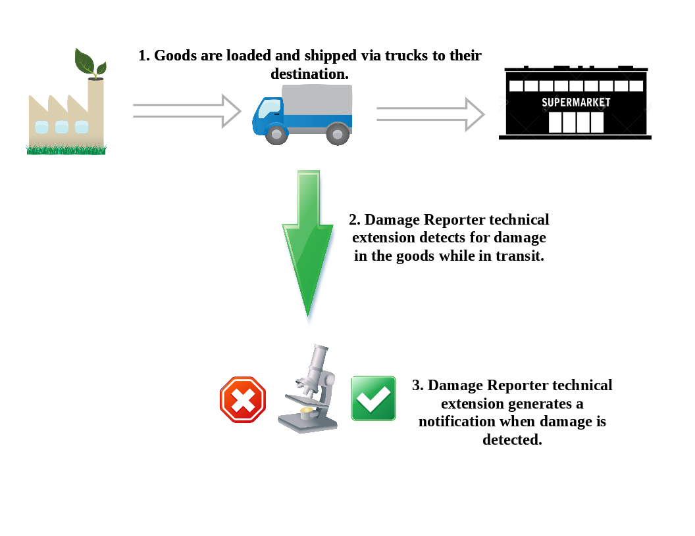

:scrollbar:
:data-uri:
:toc2:
:linkattrs:
:coursevm:

== Technical Extensions Lab

This course includes at least one lab per module. Each lab is hands-on and typically takes about an hour to complete. Executing the course labs prepares you to correctly answer many of the final assessment questions.

.Goals
* Create a custom step in Red Hat Fuse Ignite using a technical extension
* Create an Integration using this custom step

In this lab, you will examine a pre-packaged technical extension, create a custom step this technical extension and then utilize the custom step in a new integration, using Red Hat Fuse Ignite.

This lab simulates the use of a sensor application, called Damage Reporter, which detects damage to manufactured goods.
In a supply chain integration scenario, where manufactured goods (like smart phones, lamp shades, canned food, bottled beverages) are shipped to their destinations (for instance: warehouses, seaports, airports, supermarkets), damage to the goods occur periodically during shipment.

Damage Reporter senses for changes to the condition of goods shipment, generates a report and sends the report as a notification through an integration developed in Red Hat Fuse Ignite, upon detecting a deterioration in the shipment condition.

//needs a screenshot on the damage report

:numbered:

=== Logon to Red Hat Fuse Ignite

. Check your email inbox for the same email you received earlier, containing a link to Red Hat Fuse Ignite.
+
CAUTION: Red Hat Fuse Ignite is supported for the following web browsers: Google Chrome, Mozilla Firefox, Microsoft Edge
+
. Click this link to display the Red Hat Fuse Ignite login page.

. Log in using your OPENTLC account. The Fuse Ignite console page appears.

=== Implement a custom step

A selection of native steps are available in Red Hat Fuse Ignite. They are developed for consumption and manipulation of integration data.

//include an image of a Application Developer handing over a technical extension to a Citizen Developer

An application developer can build a technical extension which serves as the implementation for a custom step. The application developer then transfers the technical extension, as a .jar archive, over to the citizen developer, who proceeds to upload the technical extension into the Fuse Ignite project environment. The citizen developer then creates a custom step using this technical extension, and reuses it in multiple integrations.

[NOTE]
Learn how a technical extension is developed with the link:https://access.redhat.com/documentation/en-us/red_hat_jboss_fuse/6.3/html/tooling_user_guide/igniteextension/[JBoss Fuse Tooling Guide]

//include an image of a custom step identifying damaged goods

This supply chain integration scenario require the use of a custom step which identifies electronic goods (like smart phones, computer monitors, wireless network routers) that are damaged during transport.

Now, create such a custom step using a pre-developed technical extension, that will identify the damaged goods.

. Using a new web browser, download the technical extension  link:https://github.com/syndesisio/fuse-online-tp3-sample-extension/releases[*Damage Reporter*]

. Download the archive containing the technical extension `damage-reporter-1.2.9.jar`.

//screenshots!

. Select the *Customizations* tab on the left-hand pane of Red Hat Fuse Ignite.

. Select the *Extensions* tab.

. Click the *Import Extension* button.

. Click *Browse* and select the JAR file containing the Damage Reporter technical extension.
+
[NOTE]
The archive file is validated and extracted. On the Fuse Ignite console, the technical extension’s name, ID, and description are listed, additionally Damage Reporter is indicated as the custom step that the technical extension defines.

. Click *Import*. The custom step becomes available for use in any integration, with the details of the technical extension displayed.
+
[NOTE]
Certain conventions regarding the technical extension’s JSON file contents must be observed.
The entrypoint must correspond to a Camel endpoint - for technical extensions based on an Apache Camel route, and not a bean. Specify both the input data shape and the output data shape, for a technical extension that transforms data types.

=== Create a REST API connector

//needs screenshots

You can use Fuse Ignite to create connectors for REST APIs over the Hypertext Transfer Protocol (HTTP)/1.0 or HTTP/1.1. A valid Swagger 2.0 specification document that describes the REST API has to be provided to Fuse Ignite.

Fuse Ignite provides a *To Do* app, which has is accessible through a REST API. Use the Swagger specification for the API in the creation of the REST API connector.

. Construct the URL of the Swagger specification for the *To Do* app:
.. Click the *Home* tab of the left-hand pane of the Fuse Ignite console.
.. Copy the URL of the console and save it into a text document.
.. Append *todo-* to the front of the beginning of the URL.
.. Replace the `/dashboard` string with `swagger.json`.
.. An example of the URL of the Swagger specification for the *To Do* app is `https://todo-app-fuse-fuse3151.opentlc.openshift.com/swagger.json`
. In the Fuse Ignite console, click *Customizations*.
. Click *Create API Connector*.
. Select *Use a URL*.
. Paste the URL for the Swagger specification in the text field. Select *Next*.
. Select *Next* on the *Review Swagger Actions* page. Ignore any warning messages.
. Select *Next* in order to accept HTTP Basic Authorization, as the mechanism to authorize the use of the REST API.
. Paste the URL for the Swagger specification in the *Host* field, located on the *General Connector Info* page.
. Remove `/swagger.json` from the tail end of the URL. For instance the new URL is `https://todo-app-fuse-fuse3151.opentlc.openshift.com`
. Review and accept the default values in all fields. Select *Create Connector*.
. The *API Client Connectors* tab contains a new entry for the *To Do* App REST API.

ifdef::showscript[]

=== Examine existing technical extensions

Next, register Fuse Ignite as a client application for the online Twitter service. With this accomplished, any number of integrations connecting Twitter can be created.

. At the Fuse Ignite console, copy the Fuse Ignite URL from URL field in the web browser.
. On the left-hand panel of the Fuse Ignite console, click *Settings*.
. On the *OAuth Application Management* webpage, notice the _Twitter_ icon.
. On the left of the _Twitter_ icon, click the *Register* button.
. Notice both the *Client ID* and *Client Secret* fields are displayed.
. Launch another web browser window, and type `http://apps.twitter.com` in the URL field.
. After typing, hit the *Enter* button on your keyboard.
. When the login page is fully loaded, log into your *Twitter* account.
. Click *Create New App*.
. In the _Name_ field, provide the name of this new app.
+
NOTE: The app name must be unique among all other apps registered using your *Twitter* account.
+
. In the _Description_ field, enter helpful information. Twitter requires some input in this field.

. In both the _Website_ and _Callback URL_ fields, paste your Fuse Ignite URL (which you copied earlier into the clipboard) .

. Remove the URI suffix `dashboard` from the end of the value in the _Callback URL_ field.
. Append the string `api/v1/credentials/callback` to the value in the _Callback URL_ field.
+
NOTE: For example: https://app-proj9128.7b63.fuse-ignite.openshiftapps.com/api/v1/credentials/callback.
+
. Click *Yes*, and thereby agreeing to the terms and conditions of the *Twitter* developer agreement.
. Click *Create your Twitter application*.
. Select the *Keys and Access Tokens* tab.
. The `Consumer Key` appears on the web page. Copy it.
. In the other web browser window, select the *Settings* tab on the Fuse Ignite console.
. Paste the *Twitter* `Consumer Key` into the *Twitter Client ID* field.
. In the web browser window for your Twitter account, locate the *Twitter Keys and Access Tokens* tab.
. Copy the `Consumer Secret`.
. Paste the string into the *Twitter Client Secret* field in the Fuse Ignite console.
. Click *Save*. followed by clicking *OK*.

You have completed the setup of Fuse Ignite as a Twitter client application.

=== Create Salesforce Connection

Before an integration can be created, a connection has to be created for each cloud service endpoint that will be integrated. These cloud services have to support the link:https://oauth.net/2[OAuth protocol].

. On the Fuse Ignite console, click the *Connections* tab.

=== Create Twitter Connection

. On the Fuse Ignite console, click the *Connections* tab.

=== Create Integration between Salesforce and Twitter

The integration starts by accessing the Salesforce application from which data is retrieved from.

. Select the Salesforce connection. This is the *start* connection point of the integration you are creating.
. Select the *action* that the *start* connection has to perform.
. As an option (and this varies among connections), provide configuration information to the *start* connection. For instance, indicate if the action involves either a Salesforce lead or a Salesforce opportunity.
. Select the Twitter connection. This is the *finish* connection which accesses the application that consumes the data retrieved by the *start* connection, thereby completing the integration.
. Select the *action* that the *finish* connection is required to perform. Similarly to the earlier *action* selected, this *action* can involve data update.
. As an option, provide configuration information to the *finish* connection.
. Click *Publish* to begin testing the integration.
+
NOTE: As the business use case evolves, additional connections to other applications can be introduced as part of the integration. These connections can exist anywhere between the *start* connection and the *finish* connection.
+
. OPTIONAL: Add new connections into the integration.
. OPTIONAL: Add several steps in order to manipulate the data used in the integration. _Data filtering and _data mapping_ are recommended steps to introduce.

endif::showscript[]
