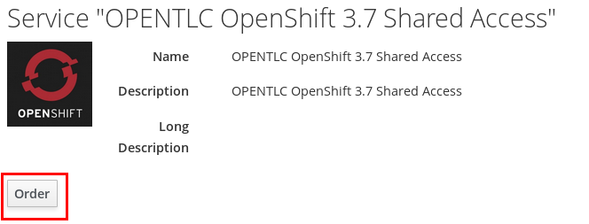
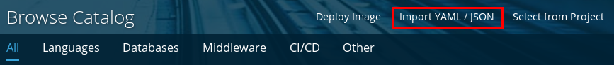
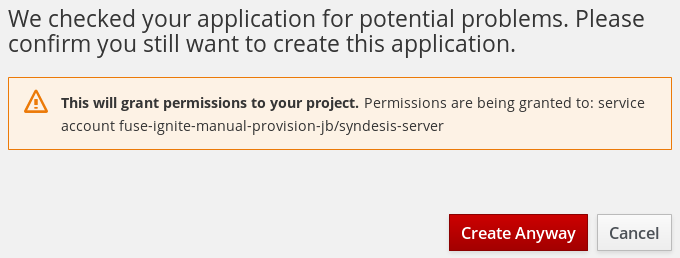
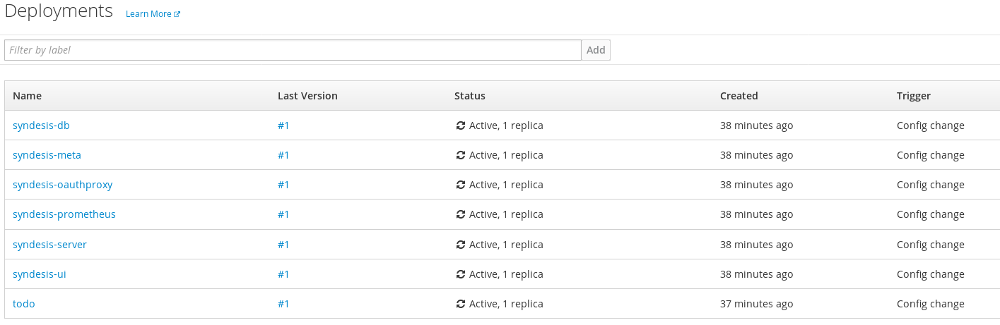
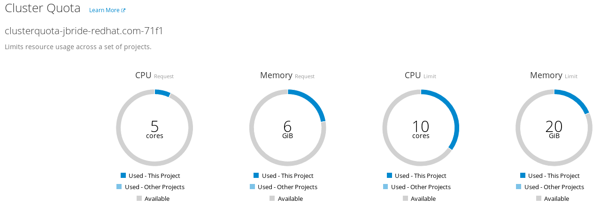

:scrollbar:
:data-uri:
:toc2:
:ignite_template: link:https://raw.githubusercontent.com/syndesisio/syndesis/master/install/syndesis.yml[Fuse Ignite template]
:ignite_sa: link:https://raw.githubusercontent.com/syndesisio/syndesis/master/install/support/serviceaccount-as-oauthclient-restricted.yml[OAuth Client Service Account]

= Fuse Ignite Provision Lab

.Goals
* Provision the Fuse Ignite product in an OpenShift environment

:numbered:

== Overview

The Red Hat Fuse Ignite product can be made available through either of the following:

. link://https://manage.openshift.com/[OpenShift Online] as a Software as a Service offering.
+
This lab does not discuss access to nor utilization of this approach.

. In an OpenShift Container Platform environment
+
The focus of this lab is on this approach.

The Fuse Ignite product will be provisioned in a single remote Openshift project.
For the purpose of this lab, this single remote OpenShift project is provided to you; you do not need to install the OpenShift Container Platform.

== Install `oc` utility
The vast majority of the Fuse Ignite installation procedure described in this lab makes use of the OpenShift Web Console.

There is one step in the process that does need to be executed at the command line using the OpenShift `oc` utility.

If you don't already have version 3.7 of the `oc` utility, then please download that version from the link:https://access.redhat.com/downloads/content/290[Red Hat support portal] and install on your local machine.

== Register for access to an OpenShift Container Platform environment

In this section of the lab, you register for the ability to create a project in your remote OpenShift lab environment.

. In your browser, navigate to the link:https://labs.opentlc.com/[OPENTLC lab portal]:
+
image::images/cf_home.png[]

. Enter your OPENTLC username and password and click *Login*.
. Navigate to *Services -> Catalogs -> OPENTLC OpenShift Labs -> OPENTLC OpenShift 3.7 Shared Access*:
+

. Click *Order* in the panel on the right.

. In the next panel, check the confirmation checkbox and then click *Submit* in the lower right corner.

. Expect to receive an email with contents similar to the following:
+
-----
Your OTLC-ADM-jbride-redhat.com-PROD_SHARED_DEVELOPER_ENV-f044 has been provisioned.
Please take note of your unique identifier, GUID: f044

Access to the requested environment will be granted as soon as the environment deployment is complete.
Your environment will be hosted in our shared cluster, accessible at: https://master.na37.openshift.opentlc.com
-----
+
This email confirms access to a remote OpenShift Container Platform environment.
Please save this email.
+
Pay particular attention to the URL of the OCP master node referenced in this email.
You will be navigating to this OCP master node for the duration of this course.

. Using your browser, log into the master node of the Openshift Container Platform mentioned in the lab confirmation email.
+
Use your OPENTLC user credentials to authenticate.

. In the top right the homepage, click the `Create Project` button:
+
image::images/create_ocp_project.png[]

. Fill in the pop-up form with the following values:

.. *Name*: _fuse-ignite-manual-provision-<your initials>_
.. *Display Name*: _Manually Provisioned Fuse Ignite_
.. *Description*: _Manually Provisioned Fuse Ignite_

. Click on the new project and navigate to the following to view Quotas and Limit Ranges: `Resources -> Quota`
.. The top section details the `ClusterQuota` assigned to your user account.
+
It is set by the OpenShift system administrator to define resource limits at an aggregate level.
.. The bottom section details the `LimitRange` automatically assigned to your OCP project.
+
It also is set by the OpenShift system administrator to define limits and defaults on individual pods and containers.
+
The clusterquota and limitranges assigned allow for a successfull deployment of Fuse Ignite.

. At the command line, authenticate into your Openshift environment using the `oc` utility:
+
-----
$ oc login <openshift master URL> -u <opentlc userId>
-----

Now that you have access to an OCP lab environment and have created a project, you are now prepared to provision the Red Hat Fuse Ignite product in that project.

== Fuse Ignite artifacts

The Fuse Ignite product includes an OpenShift template that defines most of the artifacts to be provisioned for a Fuse Ignite deployment.

Templates are intended to be tweaked as needed by application developers.
However, for the purpose of this lab, this out of the box {ignite_template} is sufficient.

. Point your browser to the {ignite_sa} and save a copy to your local filesystem so that you can more easily study it.
+
[red]#TO-DO:  What does this SA actually do ?#

. Point your browser to the {ignite_template} and save a copy to your local filesystem so that you can more easily study it.
. Open the template in a text editor and notice the following about it:
.. The majority of the template consists of a list of `parameters` (starting at around line 19) and a list of template `objects` (starting at around line 132).
.. There are two `DeploymentConfig` artifacts defined that when started will create two pods:
... _syndesis-ui : Web application that provides Fuse Ignite web interface
... _syndesis-db_ : A postgresql based database useful for integration use cases that may need use of a relational database
... _syndesis-meta_ :
... _syndesis-oauthproxy_ : Interacts with the OAuth2 provider implementation of OpenShift to proxy authentication and authorization needs for the Fuse Ignite web application
... _syndesis-server_ : Red Hat JBoss Fuse server were camel based routes are executed at runtime
... _todo_: Simple PHP based example web app that tracks todo items in the _syndesis-db_ postgresql database
... _syndesis-prometheus_ :

. Study the template and test your understanding of the template by answering the following questions:
.. What is the name of the parameter to pass to this template that defines the memory limit assigned to the _syndesis-server_ container ?
.. How many persistent volumes are needed by a Fuse Ignite deployment ?

ifdef::showscript[]

Answers:

endif::showscript[]

. One remaining artifact that is needed is a `Service Account` used by the _syndesis-oauth-client_ functionality.
+
[red]#TO-DO:  What does this do ?#

. At this time save a copy of the {ignite_sa} to your local filesystem.

== Provision

. In the OpenShift web console, navigate to the homepage of your _Manually Provisioned Fuse Ignite_ project.

. Import the syndesis OAuth service account:
..  In the `Get started with your project` section, click the button: `Browse Catalog`
+
image::images/browse_catalog.png[]
.. In the header of the page, click `Import YAML/JSON`
+

.. Populate the form as follows:
... *Add to Project*: Select your project from the selection list.
... Click `Browse` and select the _serviceaccount-as-oauthclient-restricted.yml_ file that you previously downloaded to your local filesystem.
.. Once the `Create` button is enabled, click it.
+
image::images/import_sa_yaml.png[]
.. A notice will appear that indicates that the serviceaccount has been successfully imported your project.

. Determine the token associated with your new _syndesis-oauth-client_ service account.
.. Using the `oc` utility, execute the following:
+
-----
$ oc sa get-token syndesis-oauth-client -n fuse-ignite-manual-provision-<your initials>

...

eyJhbGciOiJSUzI1NiIsInR5cCI6IkpXVCJ9.eyJpc3MiOiJrdWJlcm5ldGVzL3NlcnZpY2VhY2NvdW50Iiwia3ViZXJuZXRlcy5pby9zZXJ2aWNlYWNjb3VudC9uYW1lc3BhY2UiOiJmdXNlLWlnbml0ZS1tYW51YWwtcHJvdmlzaW9uLWpiIiwia3ViZXJuZXRlcy5pby9zZXJ2aWNlYWNjb3VudC9zZWNyZXQubmFtZSI6InN5bmRlc2lzLW9hdXRoLWNsaWVudC10b2tlbi1jdnpidiIsImt1YmVybmV0ZXMuaW8vc2VydmljZWFjY291bnQvc2VydmljZS1hY2NvdW50Lm5hbWUiOiJzeW5kZXNpcy1vYXV0aC1jbGllbnQiLCJrdWJlcm5ldGVzLmlvL3NlcnZpY2VhY2NvdW50L3NlcnZpY2UtYWNjb3VudC51aWQiOiJiZTI4NDY4NS0yZTJmLTExZTgtOGMyZi0wMjM3YWJjMTM2MWUiLCJzdWIiOiJzeXN0ZW06c2VydmljZWFjY291bnQ6ZnVzZS1pZ25pdGUtbWFudWFsLXByb3Zpc2lvbi1qYjpzeW5kZXNpcy1vYXV0aC1jbGllbnQifQ.Z_wdbqQbyYLGlrh_AofgCxIhpt9X4awRh-h8zpPWs004VLpFNkL_8-56QZXCIeFGT3WdO6j6ZnfQubXiOKmIZ66IIroGaaSBYolZwCiiSmQZuywq4uXn6-rvk_ctTEs9ssMovsiQ1SqCg_B_jIawYdIcrlnqUaQsdW6C8R9ZFHmp06sAsRjJ2BbQetBuM5EFfyzYK6IJ41sysGujJ0P8n-MDw1-9i600qXG8eQGDG4CyBtQRuBXbSMyyCCTk9LlRMrsLbmRxTQ_4S4K8YDbkgP6OZQRW4yOhDICrGXCquENzjrkBW4B0dbNh51YvLvbQGY8v8sWI_e1etbBWe7kghg
-----
.. You'll copy and paste this long token string as a parameter of the Fuse Ignite template.

. Import Fuse Ignite template
.. Follow the same procedure as before to navigate to the `Import YAML/JSON` pop-up.
.. Populate the form as follows:
... *Add to Project*: Select your project from the selection list.
... Click `Browse` and select the _syndesis.yml_ template that you previously downloaded to your local filesystem.
.. Once the `Create` button is enabled, click on it.
+
image::images/import_yaml.png[]
.. At the `Add Template` pop-up, ensure the `Process the Template` checkbox is checked and then click `Continue`.
.. Change the values of the following template parameters as follows:
... *ROUTE_HOSTNAME*:
+
.... The value of this parameter will be a String of the following convention:
+
`{openshift project}.{openshift apps domain}`
.... For example: `fuse-ignite-manual-provision-jb.apps.na37.openshift.opentlc.com`
`
... *OpenShift project to deploy into*: your openshift project name
... *OPENSHIFT_OAUTH_CLIENT_SECRET*: copy and paste the token string of your _syndesis-oauth-client_

.. Click `Create`
.. At the new prompt, click the `Create Anyway` button to grant permissions to the `syndesis-server` service account access to your OpenShift project.
+

== Verify

. Return to the homepage of your `Manually Provisioned Fuse Ignite` project.
. Navigate to: `Builds -> Builds`
+
Notice that a build called `todo` example PHP web app should be in-progress and working toward completion.
. Once the `todo` build is in a completed status, navigate to: `Applications -> Deployments`
. Wait a few minutes and the following list of deployments should all be in an _Active_ status with 1 replica:
+

. Check on the resultant pods by navigating to: `Applications -> Pods`.
+
With the exception of the _todo_ builder pod, all other pods should be in a status of `Runing` and there should not be a pod whose name has a suffix of: `*-deploy`

. Return to the page in the OpenShift web console that provides details of your quotas and limit ranges.
+
Notice that your Fuse Ignite deployment should be well within the limits defined by the ClusterQuota:
+

. Review routes by navigating to: `Applications -> Routes`
. Click on the link of the _Hostname_ associated with the route called:  `syndesis`.
. Accept the self-signed certificates and authenticate at the login prompt enter your opentlc credentials.
. Authentication and resource authorization occurs with the `Authorization Code Flow` of the OAuth2 protocol.
+
Once authenticated, click the button the  `Allow selected permissions` that grants the Fuse Ignite application access to your user info and status.
+
image::images/authorize_access.png[]
. Once you login you should be able to see the Fuse Ignite Home perspective:
+
image::images/fi_home.png[]

== Conclusion
Congratulations, during this lab you provisioned the Fuse Ignite product in an Openshift Container Platform environment.
