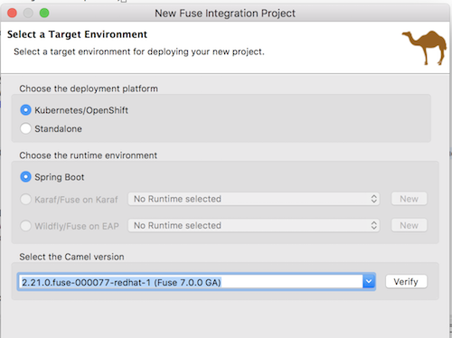

# Migrate the Rider-Auto-WS component to SpringBoot standalone

Fuse 7 introduces SpringBoot as a standalone container for Fuse integration apps.  Some key new topics centered around SpringBoot support are:

* Not everything contained in the Fuse 7 SpringBoot BOM are supported.  Examples are Spring Data REST, Spring MVC, RabbitMQ and Spring Integration.  Instead, we  encourage the use of RestDSL, CXF, AMQ and Camel as supportable (and better) alternatives.

* Use of JBDS Templates versus OIO Missions.  JBDS Templates are useful for Integrators who want to make use of the drag-and-drop tooling or develop with SpringXML.  OIO Missions are IDE-agnostic, therefore useful for power developers wanting an easily downloadable kickstart template project

* Spring encourages the use of JavaDSL over SpringXML.  There are various tradeoffs between the two DSL's.  JavaDSL is better for power developers, IDE agnostic and better suited to the Spring bean-injection model.  SpringXML is better for Integrators who use the JBDS IDE tooling or prefer XML over Java for creating their integrations.

Additionally, there are some cool features built into SpringBoot which are often overlooked, including:

* Secrets mounting in SpringBoot apps
* ConfigMap property injection

This project demonstrates the migration of a Karaf-based SOAP webservice from [Rider Auto](https://github.com/RedHatWorkshops/rider-auto-osgi/tree/master/rider-auto-ws) to Fuse 7 standalone SpringBoot.

### Prerequisites

1. Ensure you have JBoss Developers Studio version 11.2 + with the latest Fuse Tooling
2. Ensure AMQ 7.x is running locally

### Procedure

To begin, we need to create a Fuse SpringBoot project in JBDS.

1. Open JBDS
2. Right-click on the Project Explorer and select "New", then "Fuse Integration Project"


3. Type in the project name "rider-auto-ws".  Click "Next".


4. Select Fuse 7 as the **Target Runtime**.
 - Or select 2.21.0.000033-fuse-000001-redhat-1 as the **Camel Version**.



5. Choose the predefined template under "JBoss Fuse", then select "Fuse on OpenShift", "SpringBoot on OpenShift" and "Spring DSL".  Click Finish.


6.  Now that we have a template project, let's update the pom.xml file.  Update the `artifactId` name to **rider-auto-ws**.  Underneath **camel-spring-boot-starter** component in dependencies, paste the following:

```
		<dependency>
			<groupId>org.apache.camel</groupId>
			<artifactId>camel-core</artifactId>
		</dependency>
		<dependency>
			<groupId>org.apache.camel</groupId>
			<artifactId>camel-spring</artifactId>
		</dependency>
		<dependency>
			<groupId>org.apache.camel</groupId>
			<artifactId>camel-cxf</artifactId>
		</dependency>
		<dependency>
			<groupId>org.apache.camel</groupId>
			<artifactId>camel-amqp</artifactId>
		</dependency>
		<dependency>
			<groupId>org.apache.camel</groupId>
			<artifactId>camel-bindy</artifactId>
		</dependency>
		<dependency>
			<groupId>org.apache.camel</groupId>
			<artifactId>camel-csv</artifactId>
		</dependency>
		<dependency>
			<groupId>org.apache.camel</groupId>
			<artifactId>camel-jaxb</artifactId>
		</dependency>
		<dependency>
			<groupId>org.apache.cxf</groupId>
			<artifactId>cxf-rt-transports-http-jetty</artifactId>
		</dependency>
		<dependency>
			<groupId>org.apache.cxf</groupId>
			<artifactId>cxf-rt-frontend-jaxws</artifactId>
		</dependency>
```

7. Replace the contents of the camel-context.xml file with:

```
<?xml version="1.0" encoding="UTF-8"?>
<beans xmlns="http://www.springframework.org/schema/beans"
    xmlns:cxf="http://camel.apache.org/schema/cxf"
    xmlns:xsi="http://www.w3.org/2001/XMLSchema-instance" xsi:schemaLocation="        http://www.springframework.org/schema/beans http://www.springframework.org/schema/beans/spring-beans.xsd        http://camel.apache.org/schema/spring http://camel.apache.org/schema/spring/camel-spring.xsd        http://camel.apache.org/schema/cxf http://camel.apache.org/schema/cxf/camel-cxf.xsd    ">
    <bean class="org.apache.qpid.jms.JmsConnectionFactory" id="jmsConnectionFactory">
        <property name="remoteURI" value="amqp://localhost:5672"/>
        <property name="username" value="admin"/>
        <property name="password" value="admin"/>
    </bean>
    <bean class="org.apache.camel.component.amqp.AMQPComponent" id="amqp">
 <property name="connectionFactory" ref="jmsConnectionFactory" />

    </bean>
    <cxf:cxfEndpoint address="http://localhost:8183/cxf/order"
        id="orderEndpoint" serviceClass="org.fusesource.camel.ws.OrderEndpoint"/>
    <camelContext id="rider-auto-ws" trace="true" xmlns="http://camel.apache.org/schema/spring">
        <route customId="true" id="ws-to-jms">
            <from id="_from1" uri="cxf:bean:orderEndpoint"/>
            <setBody id="_setBody1">
                <simple>${in.body[0]}</simple>
            </setBody>
            <marshal id="_marshal1">
                <jaxb contextPath="org.fusesource.camel.model"/>
            </marshal>
            <inOnly id="_inOnly1" uri="amqp:incomingOrders"/>
            <transform id="_transform1">
                <constant>OK</constant>
            </transform>
        </route>
    </camelContext>
</beans>
```

Notice we've updated the JMS endpoint to point to AMQ 7 using the AMQP protocol.

8. Save the camel-context.xml file.
9. Now we need to migrate the Order POJO and Endpoint. First, create a new source package called `org.fusesource.camel.model`. Copy [`../10-artifacts/Order.java`](https://raw.githubusercontent.com/RedHatWorkshops/fusev7-workshop/master/labs/10-artifacts/Order.java) to the new package.
10.  Do the same for [`../10-artifacts/OrderEndpoint.java`](https://raw.githubusercontent.com/RedHatWorkshops/fusev7-workshop/master/labs/10-artifacts/OrderEndpoint.java), except paste it into a new package called `org.fusesource.camel.ws`.
11. Create a new package structure under `src/main/resources/org/fusesource/camel/model/`.  Copy [`../10-artifacts/jaxb.index`](https://raw.githubusercontent.com/RedHatWorkshops/fusev7-workshop/master/labs/10-artifacts/jaxb.index) to the new package.
12. If everything compiles, try right-clicking on the `camel-context.xml` file and selecting "Run As" and then "Local Camel Context".


13.  Try hitting the WSDL page [here](http://localhost:8183/cxf/order?wsdl) in a web browser.  If everything is working, it should display.

14.  Using PostMan or SOAP UI, copy the WSDL URL and send a sample SOAP request message.  You should receive an OK response message, and your request should end up on the AMQ `incomingOrders` queue.


