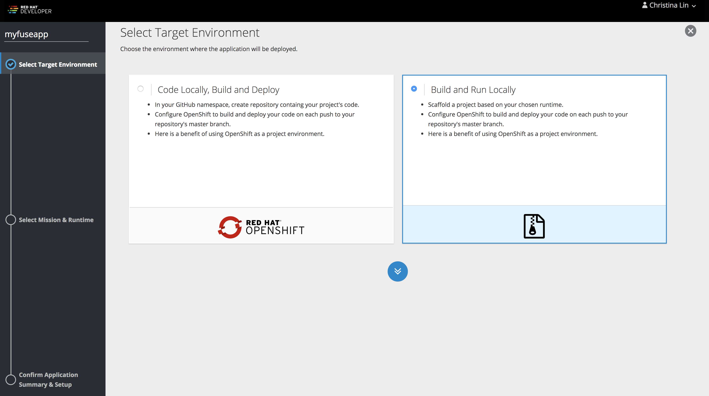
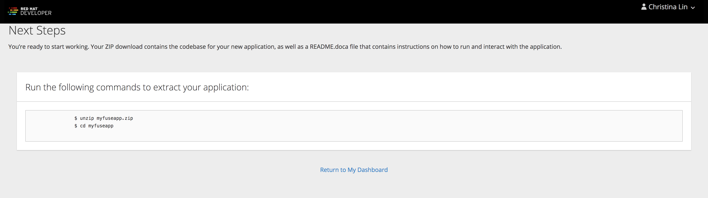

# Using OpenShift.IO Missions to create a Fuse 7 SpringBoot project with Swagger

Not all Integrators are created equal.  Some people like using drag-and-drop tooling, while others prefer to write everything in JavaDSL using their preferred IDE.  OpenShift.IO Missions give developers the freedom to kickstart their Fuse 7 project by simply downloading a project ZIP.  That way, they can import it into the IDE of their choice without fussing over JBDS.

This project demonstrates a simple API-first SpringBoot project created using OpenShift.IO Missions.

### Prerequisites

1. Ensure you have installed a Java IDE.  JBDS is also suffice for this lab.
2. An account with [OpenShift.IO](https://launch.openshift.io/)

### Procedure

To begin, we need to download the booster-circuitbreaker project from OpenShift.IO.

1. Login to https://launch.openshift.io/
2. Click **Launch your Project** and login as necessary.


3. Click **I will build and run locally**.



4. Select the **Circuit Breaker** Mission then click **Next**.


5. Select **Fuse** as the Runtime then click **Next**.


6.  Select **7.0.0(Red Hat Fuse )** as the **Runtime Version**.  Leave other fields with their default settings.  Click **Next**.




7. On the **Review Summary** page, click **Download as ZIP File**.  The `booster-circuit-breaker-fuse.zip` will download to your local Downloads directory.


8. Unzip the `booster-circuit-breaker-fuse.zip` file to a local directory, and import the **greetings-service** Maven project into the IDE of your choice.


9. Try running the default project as a standalone SpringBoot project (right-click on the project and select **Run As > 2 Maven build ...**.  Put **spring-boot:run** in the Goal. You should be able to view the simple console that prints our someone's name (found at http://localhost:8080), plus the Hystrix Dashboard for the name and greetings service.  Experiment by killing the name-service and monitoring the behavior on the Hystrix Dashboard.  You should notice the Circuit Break opening and shutting, depending on whether the service is running or not.

#### Add Swagger Docs

For the next part of the lab, we want to extend the RestDSL to include Swagger annotations which we can expose as Swaggers docs.

1.  Open the `greetings-service/pom.xml` and append the following text after the `camel-jsonpath-starter` in the `<dependencies>` section:

```
		<dependency>
			<groupId>org.apache.camel</groupId>
			<artifactId>camel-swagger-java</artifactId>
		</dependency>
		<dependency>
			<groupId>io.springfox</groupId>
			<artifactId>springfox-swagger2</artifactId>
			<version>2.8.0</version>
		</dependency>
		<dependency>
			<groupId>io.springfox</groupId>
			<artifactId>springfox-swagger-ui</artifactId>
			<version>2.8.0</version>
		</dependency>
```

2. To include the Swagger UI, we need to setup the Docket API which is part of the `springfox-swagger-ui` community project.  Open the `greetings-service/src/main/java/com/redhat/fuse/boosters/cb/Application.java` class and append the following text to the class:

```
    @Configuration
    @EnableSwagger2
    public class SwaggerConfig {                                    
        @Bean
        public Docket api() { 
            return new Docket(DocumentationType.SWAGGER_2)  
              .select()
              .apis(RequestHandlerSelectors.any())              
              .paths(PathSelectors.any())                          
              .build();                                           
        }
    }
```

3.  Open `greetings-service/src/main/java/com/redhat/fuse/boosters/cb/CamelRouter.java` and add two additional class variables, `serverHost` and `serverPort`.  In addition, add the "swagger api-doc out of the box" block of text to the `restConfiguration()` declaration:

```
public class CamelRouter extends RouteBuilder {

...

    @Value("${server.host}")
    String serverHost;

    @Value("${server.port}")
    String serverPort;
    
...
    
        // @formatter:off
        restConfiguration()
            .component("servlet")
            .bindingMode(RestBindingMode.json)            
            // add swagger api-doc out of the box
            .host(serverHost)
            .port(serverPort)
            .dataFormatProperty("prettyPrint", "true")
            .contextPath("/camel")
            .apiContextPath("/api-docs")
            .apiProperty("api.title", "Greetings Service API")
            .apiProperty("api.version", "1.2.3")
            // and enable CORS
            .apiProperty("cors", "true");
        
...
```

4. Open the `application.properties` file found in `greetings-service/src/main/resources`.  Add the following properties to this file:

```
server.host=localhost
springfox.documentation.swagger.v2.path=/camel/api-docs
```

5. Save all the updates files.

6. Restart the greetings-services process.  This time navigate to http://localhost:8080/swagger-ui.html.  You should see your Swagger docs displayed using the nicely formated Swagger UI. Try hitting the name-service using this page ensuring that you get a valid response back.


