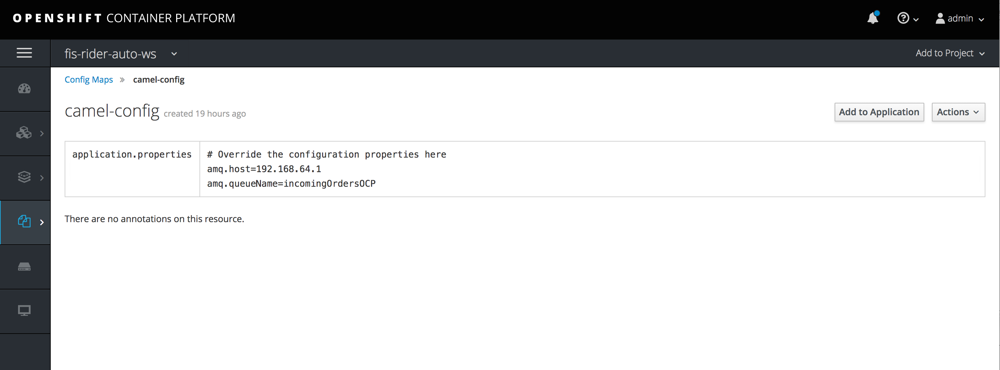

# Add a Config Map & Secrets to your SpringBoot FIS project

Sometimes you need to externalize environment variables like queue / host / port names in your Camel route.  SpringBoot and Kubernetes have a useful concept called Config Maps and Secrets to address variables or credentials which can easily be updated at runtime, without having to restart your application.

### Prerequisites

1. Ensure you have completed the previous FIS SpringBoot [project](./20-migrate-rider-auto-ws-fis.md).

### Procedure

To begin, we need to create a FIS SpringBoot project in JBDS.

1. In JBDS, open the pom.xml file in your **fis-rider-auto-ws** project

2.  Underneath the `cxf-rt-frontend-jaxws` component in dependencies, paste the following:

```
		<!-- Spring-Cloud-Kubernetes -->
		<dependency>
			<groupId>io.fabric8</groupId>
			<artifactId>spring-cloud-kubernetes-core</artifactId>
		</dependency>
```

This is a very important dependency addition which allows SpringBoot to reload your configuration changes without restarting your app. 

3. Copy [`../21-artifacts/sample-configmap.yml`](https://raw.githubusercontent.com/RedHatWorkshops/fusev7-workshop/master/labs/21-artifacts/sample-configmap.yml), [`../21-artifacts/sample-secret.yml`](https://raw.githubusercontent.com/RedHatWorkshops/fusev7-workshop/master/labs/21-artifacts/sample-secret.yml), and [`../21-artifacts/sa.yml`](https://raw.githubusercontent.com/RedHatWorkshops/fusev7-workshop/master/labs/21-artifacts/sa.yml) to the root directory of **fis-rider-auto-ws**.  These files allow us to override specific external parameters during our deployment to OpenShift.  We've chosen to override the AMQ username/password (using secrets), and the AMQ host and queue name using the configmap.
4. Copy [`../21-artifacts/deployment.yml`](https://raw.githubusercontent.com/RedHatWorkshops/fusev7-workshop/master/labs/21-artifacts/deployment.yml), and [`../21-artifacts/rb.yml`](https://raw.githubusercontent.com/RedHatWorkshops/fusev7-workshop/master/labs/21-artifacts/rb.yml) to the `src/main/fabric8` directory.  Open each file and read the comments that explain the importance of each new parameter.
5. Copy [`../21-artifacts/AmqConfiguration.java`](https://raw.githubusercontent.com/RedHatWorkshops/fusev7-workshop/master/labs/21-artifacts/AmqConfiguration.java) to `src/main/java/org/mycompany`.  This new bean maps to our custom properties defined in the **application.properties** file.
6.  Override the existing `src/main/resources/aplication.properties` file with [`../21-artifacts/application.properties`](https://raw.githubusercontent.com/RedHatWorkshops/fusev7-workshop/master/labs/21-artifacts/application.properties).  There are a bunch of new properties that allow for the hot reload of properties, plus a new amq property for the dynamic queue name.
7.   Override the existing `src/main/java/org/mycompany/Application.java` with the [`../21-artifacts/Application.java`](https://raw.githubusercontent.com/RedHatWorkshops/fusev7-workshop/master/labs/21-artifacts/Application.java).  Notice the updated reference to our AmqConfiguration bean we created, plus the uploaded references to the AMQ username / password secrets.
8.  Copy our startup configuration of Spring-cloud-kubernetes located in [`../21-artifacts/bootstrap.yml`](https://raw.githubusercontent.com/RedHatWorkshops/fusev7-workshop/master/labs/21-artifacts/bootstrap.yml) to `src/main/resources` folder.
9.  To test all of our changes, let's try running our updated SpringBoot configuration locally.  To run it locally and pickup our properties in the application.properties file, run `mvn spring-boot:run  -Dspring.cloud.kubernetes.enabled=false` via the CLI (or within your JBDS Maven run config).  Using SOAP UI, send another request to `http://localhost:8183/cxf/order`.  Ensure that your request is routed to the "localhost" broker and ends up in the **incomingOrders** queue.

Now that everything is running perfectly in your local environment, let's try deploying to our SpringBoot container on Minishift.

10. Startup minishift / CDK.
11. Login via the CLI using `oc login -u developer`.
12. Create a new project using the command `oc new-project fis-rider-auto-ws`
 - _This project might already exist from the previous lab._
13. Via the CLI, cd to your mvn project and execute `oc create -f sa.yml` to create the service account.
14. Using the same CLI, execute `oc create -f sample-secret.yml` to create the secret.
15. Using the same CLI, execute `oc create -f sample-configmap.yml` to create the configmap.
16. Using the same CLI, execute `oc secrets add sa/qs-camel-config secret/camel-config` to add the secret to the service account.
17. Using the same CLI, execute `oc policy add-role-to-user view system:serviceaccount:fis-rider-auto-ws:qs-camel-config` to give the 'view' permision to the service account.
18. Via the CLI, cd to your mvn project and execute `mvn fabric8:deploy`.

The build will be begin and via binary streams, deploy to your Minishift environment.

19.   Via the OpenShift webconsole, login using the admin/admin credentials and navigate to Routes.
20.  Click on the route that was created and verify the WSDL is accessible.  The URI context is `/cxf/order?wsdl`
21.  Using PostMan or SOAP UI, copy the WSDL URL and send a sample SOAP request message.  You should receive an OK response message, and your request should end up on the AMQ `incomingOrdersOCP` queue using the overriden properties taken from the configmap.  Play around with modifying the amq.queueName property in the configmap UI and watch your messages end up in a new queue dynamically via the AMQ console.



