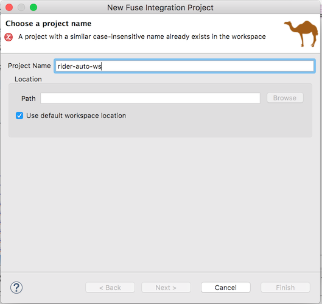
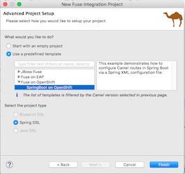

# Add a Config Map to your SpringBoot FIS project

Sometimes you need to externalize environment variables like queue / host / port names in your Camel route.  SpringBoot and Kubernetes have a useful concept called Config Maps to address variables which can easily be updated at runtime.

### Prerequisites

1. Ensure you have completed the previous FIS SpringBoot [project](./20-migrate-rider-auto-ws-fis.md).

### Procedure

To begin, we need to create a FIS SpringBoot project in JBDS.

1. Open JBDS
2. Right-click on the Project Explorer and select "New", then "Fuse Integration Project"


3. Type in the project name "fis-rider-auto-ws".  Click "Next".



4. Select Fuse 7 as the **Target Runtime**.


5. Choose the predefined template under "Fuse on OpenShift", then select "SpringBoot on OpenShift" and "Spring DSL".  Click Finish.



6.  Now that we have a template project, let's update the pom.xml file.  Update the `artifactId` name to `fis-rider-auto-ws`.  Underneath `camel-spring-boot-starter` component in dependencies, paste the following:

```
    		<dependency>
			<groupId>org.apache.camel</groupId>
			<artifactId>camel-amqp</artifactId>
		</dependency>
		<dependency>
			<groupId>org.apache.camel</groupId>
			<artifactId>camel-bindy</artifactId>
		</dependency>
		<dependency>
			<groupId>org.apache.camel</groupId>
			<artifactId>camel-csv</artifactId>
		</dependency>
		<dependency>
			<groupId>org.apache.camel</groupId>
			<artifactId>camel-jaxb</artifactId>
		</dependency>
		<dependency>
			<groupId>org.apache.camel</groupId>
			<artifactId>camel-cxf</artifactId>
		</dependency>
		<dependency>
			<groupId>org.apache.cxf</groupId>
			<artifactId>cxf-rt-transports-http-jetty</artifactId>
			<version>3.2.1</version>
		</dependency>
		<dependency>
			<groupId>org.apache.cxf</groupId>
			<artifactId>cxf-rt-frontend-jaxws</artifactId>
		</dependency>
```

7. Replace the contents of the camel-context.xml file with:

```
<?xml version="1.0" encoding="UTF-8"?>
<beans xmlns="http://www.springframework.org/schema/beans"
    xmlns:cxf="http://camel.apache.org/schema/cxf"
    xmlns:xsi="http://www.w3.org/2001/XMLSchema-instance" xsi:schemaLocation="        http://www.springframework.org/schema/beans http://www.springframework.org/schema/beans/spring-beans.xsd        http://camel.apache.org/schema/spring http://camel.apache.org/schema/spring/camel-spring.xsd        http://camel.apache.org/schema/cxf http://camel.apache.org/schema/cxf/camel-cxf.xsd    ">
    <cxf:cxfEndpoint address="http://0.0.0.0:8183/cxf/order"
        id="orderEndpoint" serviceClass="org.fusesource.camel.ws.OrderEndpoint"/>
    <camelContext id="rider-auto-ws" trace="false" xmlns="http://camel.apache.org/schema/spring">
        <route customId="true" id="ws-to-jms">
            <from id="_from1" uri="cxf:bean:orderEndpoint"/>
            <setBody id="_setBody1">
                <simple>${in.body[0]}</simple>
            </setBody>
            <marshal id="_marshal1">
                <jaxb contextPath="org.fusesource.camel.model"/>
            </marshal>
            <inOnly id="_inOnly1" uri="amqp:incomingOrders"/>
            <transform id="_transform1">
                <constant>OK</constant>
            </transform>
        </route>
    </camelContext>
</beans>
```

8. Save the camel-context.xml file.
9. Now we need to migrate the Order POJO and Endpoint.  Copy `../20-artifacts/Order.java` to your new rider-auto-ws project, and paste it into a new source package called `org.fusesource.camel.model`.
10.  Do the same for `../20-artifacts/OrderEndpoint.java`, except paste it into a new package called `org.fusesource.camel.ws`.
11. Create a new package structure under `src/main/resources/org/fusesource/camel/model/`.  Copy `../20-artifacts/jaxb.index` to the new package.
12. Copy `../20-artifacts/application.properties` to `src/main/resources` and override the existing file.
13. Copy the following block to `src/main/java/org/mycompany/Application.java`:

```
	@Autowired
	private Environment env;

	@Bean
	AMQPConnectionDetails securedAmqpConnection() {
		return new AMQPConnectionDetails("amqp://" + env.getProperty("amq.host") + ":" + env.getProperty("amq.port"),
				env.getProperty("amq.user"), env.getProperty("amq.password"));
	}
```
14. If everything compiles, try right-clicking on the `camel-context.xml` file and selecting "Run As" and then "Local Camel Context".


15.  Try hitting the WSDL page [here](http://localhost:8183/cxf/order?wsdl) in a web browser.  If everything is working, it should display.

Now let's try running our SpringBoot container on Minishift.

16. Copy both `../20-artifacts/route.yml` and `../20-artifacts/services.yml` to the `src/main/fabric8` directory.
17. Uncomment the `amq.host=192.168.1.64` in the `src/main/resources/application.properties` file so that your local AMQ environment can be reached from Minishift.  Comment out the `amq.host=localhost` property and save the file.
18. Startup minishift / CDK.
19. Login via the CLI using `oc login -u developer`.
20. Create a new project using the command `oc new-project fis-rider-auto-ws`
21. Via the CLI, cd to your mvn project and execute `mvn fabric8:deploy`.

The build will be begin and via binary streams, deploy to your Minishift environment.

21.   Via the OpenShift webconsole, login using the developer/developer credentials and navigate to Routes.
22.  Click on the route that was created and verify the WSDL is accessible.  The URI context is `/cxf/order?wsdl`
23.  Using PostMan or SOAP UI, copy the WSDL URL and send a sample SOAP request message.  You should receive an OK response message, and your request should end up on the AMQ `incomingOrders` queue.


