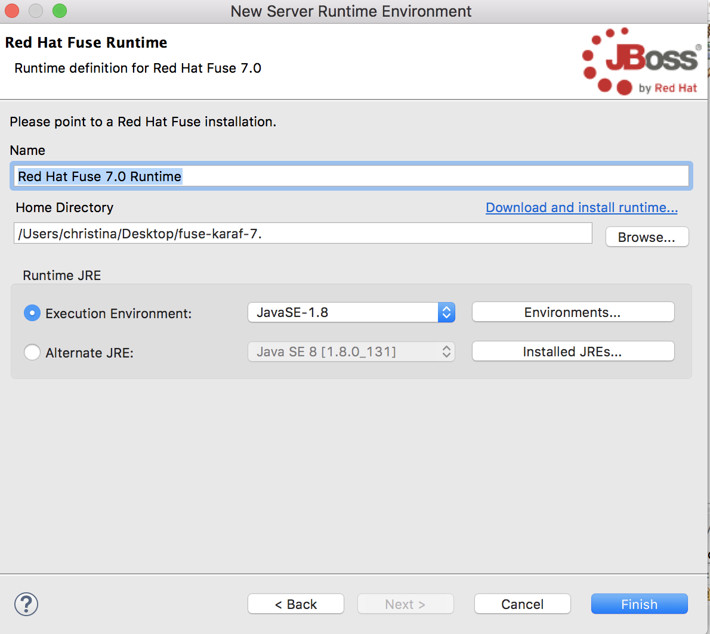
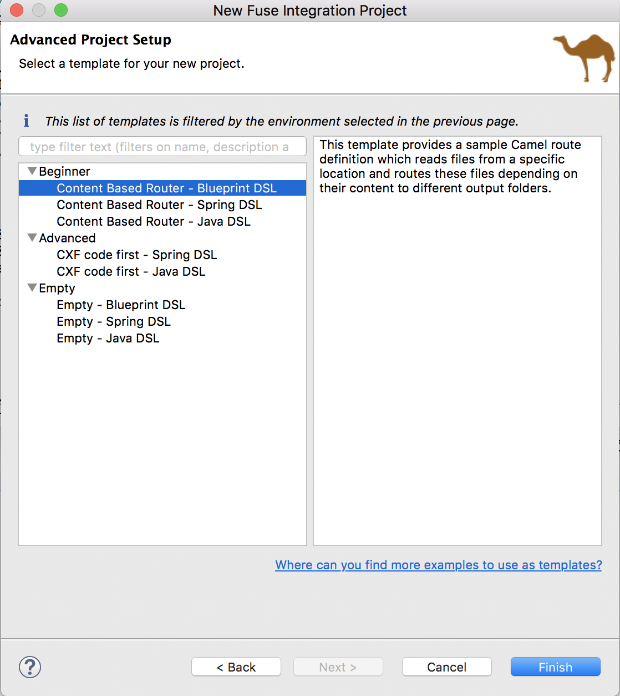

# Create a standalone Fuse Karaf 4 project

Fuse 7 introduces a new version of the Karaf OSGi container, Karaf 4.  One of the significant changes are the renaming of the OSGi commands.  The following table lists the key CLI differences between Karaf 2 and 4:

| Karaf Two                    | Karaf Four                   |
| ---------------------------- | ---------------------------- |
| admin:change-opts | instance:opts-change |
| admin:change-rmi-registry-port | instance:rmi-registry-port-change |
| admin:change-rmi-server-port | instance:rmi-server-port-change |
| admin:change-ssh-port | instance:ssh-port-change |
| admin:clone | instance:clone |
| admin:connect | instance:connect |
| admin:create | instance:create |
| admin:destroy | instance:destroy | 
| admin:list | instance:list |
| admin:rename	 | instance:rename |
| admin:start | instance:start |
| admin:status	 | instance:status |
| admin:stop | instance:stop |
| dev:create-dump | dev:dump-create |
| | feature:start |
| |	feature:stop |
| features:add-url | feature:repo-add |
| features:chooseurl | feature:repo-add |
| features:info | feature:info |
| features:install | feature:install |
| features:listVersions | feature:version-list |
| features:list | feature:list |
| features:listRepositories | feature:repo-list |
| features:listUrl | feature:repo-list |
| features:refreshUrl | feature:repo-refresh |
| features:removeRepository | feature:repo-remove |
| features:removeUrl | feature:repo-remove |
| features:uninstall | feature:uninstall |
| jaas:pending | jaas:pending-list |
| jaas:realms | jaas:realm-list |
| jaas:users | jaas:user-list |
| jaas:manage | jaas:realm-manage |
| jaas:roleadd | jaas:role-add |
| jaas:roledel | jaas:role-delete |
| jaas:useradd | jaas:user-add |
| jaas:userdel | jaas:user-delete |
| | jaas:group-role-delete |
| | 	jaas:su |
| | 	jaas:sudo |
| config:propappend | config:property-append |
| config:propdel | config:property-delete |
| config:proplist | config:property-list |
| config:propset | config:property-set |
| dev:dynamic-import | bundle:dynamic-import |
| dev:framework | system:framework |
| dev:print-stack-traces | shell:stack-traces-print |
| | shell:less |
| | shell:stack-traces-print |
| | shell:threads |
| | shell:while |
| | shell:edit |
| | shell:env |
| dev:restart | system:shutdown |
| dev:show-tree | bundle:tree-show |
| dev:system-property | system:property |
| dev:wait-for-service | service:wait |
| dev:watch | bundle:watch |
| log:display-exception | log:exception-display |
| | log:list |
| obr:addUrl | obr:url-add |
| obr:listUrl | obr:url-list |
| obr:refreshUrl | obr:url-refresh |
| obr:removeUrl | obr:url-remove |
| osgi:bundle-level | bundle:start-level |
| osgi:classes | bundle:classes |
| osgi:find-class | bundle:find-class |
| osgi:headers | bundle:headers |
| osgi:info | bundle:info |
| osgi:install | bundle:install |
| osgi:bundle-services | bundle:services |
| osgi:list | bundle:list |
| | bundle:capabilities |
| | bundle:diag |
| | bundle:id |
| | bundle:load-test |
| | bundle:requirements |
| | bundle:resolve |
| osgi:ls | service:list |
| osgi:name | system:name |
| osgi:refresh | bundle:refresh |
| osgi:resolve | bundle:resolve |
| osgi:restart | bundle:restart |
| osgi:shutdown | system:shutdown |
| osgi:start | bundle:start |
| osgi:start-level | bundle:start-level |
| osgi:stop | bundle:stop |
| osgi:uninstall | bundle:uninstall |
| osgi:update | bundle:update |
| osgi:version | system:version |
| | system:name |
| packages:exports | package:exports |
| packages:imports | package:imports |

### Prerequisites

1. Ensure you have JBoss Developers Studio version 11.3 + with the latest Fuse Tooling
2. Ensure [Fuse 7.x](https://drive.google.com/open?id=1oQJm9gAfEVvOheppanGadoji0J7aK3dj) is unzipped to a local directory
 - To add a user:

 - Open InstallDir/etc/users.properties in your favorite text editor.
 - Locate the following lines:

   #admin = admin,_g_:admingroup
   
   #_g_\:admingroup = group,admin,manager,viewer,systembundles,ssh
   
   Note that the first line has the syntax USER=PASSWORD,_g_:GROUP,…​. In this example, the first line specifies a user, admin, with the password, admin, and the role group, admingroup.

- Uncomment both lines by removing the leading # character.
- Change the first admin to the desired user name.
- Change the second admin to the desired password.
- Save the changes.

### Procedure

To begin, we need to create a Fuse Karaf project in JBDS using one of the fabulous Fuse 7 archetypes.

1. Open JBDS
2. Right-click on the Project Explorer and select "New", then "Fuse Integration Project"

3. Type in the project name "karaf-standalone".  Click "Next".

4. Select Fuse 7 as the **Target Runtime**, or select **2.21.0.000033-fuse-000001-redhat-1** as the **Camel Version**. Click "Next".

5. Choose "Use a predefined template", then select "Beginner", "Content Based Router" and "Blueprint DSL".  Click Finish.

6.  We need to setup a Fuse 7 server in JBDS.  To do this, right-click on the Servers palette and select "New" then "Server".

7.  Accept the default settings, then click "Finish".

8. Right-click on the newly created server and click "Start".

9. If the Fuse 7 Karaf server starts correctly, you should be presented with a Terminal window displaying the Karaf 4 console.

10.  Return to the karaf-standalone project you created earlier, and right-click then select "Run As" then "Maven install".  The unit test should complete successfully and OSGi jar should be installed in your Maven repository.

11.  Return to the Karaf 4 console, and type the following command: `bundle:install -s mvn:com.mycompany/camel-blueprint-cbr/1.0.0-SNAPSHOT`.  If successful, type `bundle:list` to verify the OSGi bundle started correctly.  The bundle should show as "Active".

12.  Type `log:tail` to review the Karaf log.

13.  Copy an `order*.xml` file from `/src/main/data` to the following directory `<Fuse 7 install dir>/work/cbr/input`.  The file should be consumed and you should see "Done processing order1.xml" in the log.

