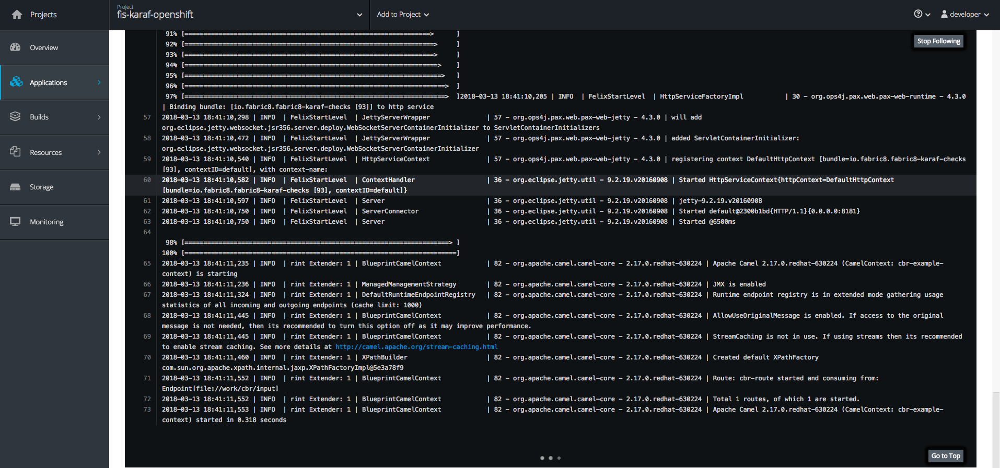
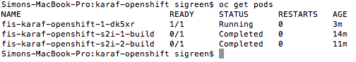
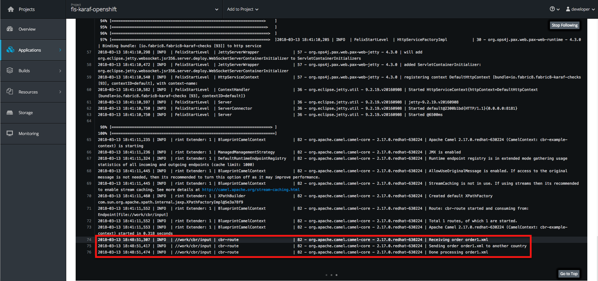

# Create a Fuse Karaf 4 FIS project for OpenShift

The following lab demonstrates the new FIS Karaf 4 FIS image running on OpenShift.  

### Prerequisites

1. Ensure you have JBoss Developers Studio version 11.2 + with the latest Fuse Tooling
2. Ensure you have CDK 3.3.x running locally
3. Completed karaf-standalone lab

### Procedure

To begin, we need to take the standalone Fuse Karaf project we created in the previous exercise and migrate it to make use of the FIS image.

1. Open JBDS
2. Right-click on the `karaf-standalone` project and click "Copy".  Paste a duplicate copy of the project in the Project Explorer and call it `karaf-openshift`.
3.  Now that we have a template project, let's update the pom.xml file.  Update the `artifactId` name to `fis-karaf-openshift`.  Replace the `dependencyManagement` section with the following:

```
	<dependencyManagement>
		<dependencies>
			<dependency>
				<groupId>io.fabric8</groupId>
				<artifactId>fabric8-project-bom-fuse-karaf</artifactId>
				<version>${fabric8.version}</version>
				<type>pom</type>
				<scope>import</scope>
			</dependency>
		</dependencies>
	</dependencyManagement>
```

Additionally, add the following properties to the `properties` section:

```
		<fabric8.version>2.2.170.redhat-000010</fabric8.version>
		<karaf.maven.plugin.version>4.0.8.redhat-000026</karaf.maven.plugin.version>
		<fabric8.maven.plugin.version>3.1.80.redhat-000010</fabric8.maven.plugin.version>
		<maven-install-plugin.version>2.5.2</maven-install-plugin.version>		
```

Add the following to the `dependencies` section:

```
		<!-- Karaf microcontainer dependencies -->
		<dependency>
			<!-- scope is compile so all features (there is only one) are installed 
				into startup.properties, and the feature repo itself is not added in etc/org.apache.karaf.features.cfg 
				file -->
			<groupId>org.jboss.fuse</groupId>
			<artifactId>fuse-karaf-framework</artifactId>
			<type>kar</type>
			<!-- no need to download kar dependencies -->
			<exclusions>
				<exclusion>
					<groupId>*</groupId>
					<artifactId>*</artifactId>
				</exclusion>
			</exclusions>
		</dependency>
		<dependency>
			<groupId>io.fabric8.kubernetes</groupId>
			<artifactId>kubernetes-karaf</artifactId>
			<classifier>features</classifier>
			<type>xml</type>
		</dependency>
		<dependency>
			<groupId>io.fabric8</groupId>
			<artifactId>fabric8-karaf-features</artifactId>
			<classifier>features</classifier>
			<type>xml</type>
		</dependency>
```

And finally, to the `<builds>/<plugins>` section, add the following block:

```
             <!-- plugin goals have to be executed in order -->
			<!-- 1. install the bundle -->
			<plugin>
				<groupId>org.apache.maven.plugins</groupId>
				<artifactId>maven-install-plugin</artifactId>
				<version>${maven-install-plugin.version}</version>
				<executions>
					<execution>
						<id>default-install</id>
						<goals>
							<goal>install</goal>
						</goals>
						<phase>install</phase>
					</execution>
				</executions>
			</plugin>

			<!-- 2. create Karaf assembly -->
			<!-- karaf-maven-plugin creates custom micro-service distribution -->
			<plugin>
				<groupId>org.apache.karaf.tooling</groupId>
				<artifactId>karaf-maven-plugin</artifactId>
				<version>${karaf.maven.plugin.version}</version>
				<extensions>true</extensions>
				<executions>
					<execution>
						<id>karaf-assembly</id>
						<goals>
							<goal>assembly</goal>
						</goals>
						<phase>install</phase>
					</execution>
				</executions>
				<configuration>
					<!-- we are using karaf 2.4.x -->
					<karafVersion>v24</karafVersion>
					<useReferenceUrls>true</useReferenceUrls>
					<archiveTarGz>false</archiveTarGz>
					<!-- do not include build output directory -->
					<includeBuildOutputDirectory>false</includeBuildOutputDirectory>
					<startupFeatures>
						<feature>karaf-framework</feature>
						<feature>shell</feature>
						<feature>scr</feature>
						<feature>jaas</feature>
						<feature>aries-blueprint</feature>
						<feature>camel-blueprint</feature>
						<feature>kubernetes-client</feature>
						<feature>openshift-client</feature>
						<feature>fabric8-karaf-blueprint</feature>
						<feature>fabric8-karaf-checks</feature>
					</startupFeatures>
					<startupBundles>
						<bundle>mvn:${project.groupId}/${project.artifactId}/${project.version}</bundle>
					</startupBundles>
				</configuration>
			</plugin>

			<!-- 3. create Docker image -->
			<plugin>
				<groupId>io.fabric8</groupId>
				<artifactId>fabric8-maven-plugin</artifactId>
				<version>${fabric8.maven.plugin.version}</version>
				<executions>
					<execution>
						<id>generate-resource</id>
						<phase>generate-resources</phase>
						<goals>
							<goal>resource</goal>
						</goals>
					</execution>
					<execution>
						<id>build-image</id>
						<phase>install</phase>
						<goals>
							<goal>build</goal>
						</goals>
					</execution>
				</executions>
			</plugin>

			<!-- Create the Features file for standalone Karaf -->
			<plugin>
				<groupId>org.codehaus.mojo</groupId>
				<artifactId>build-helper-maven-plugin</artifactId>
				<executions>
					<execution>
						<id>attach-artifacts</id>
						<phase>package</phase>
						<goals>
							<goal>attach-artifact</goal>
						</goals>
						<configuration>
							<artifacts>
								<artifact>
									<file>${project.build.outputDirectory}/features.xml</file>
									<type>xml</type>
									<classifier>features</classifier>
								</artifact>
							</artifacts>
						</configuration>
					</execution>
				</executions>
			</plugin>
```
5. Copy `../30-artifacts/features.xml` to `src/main/resources`.
6.  Startup minishift / CDK.
7. Login via the CLI using `oc login -u developer`.
8. Create a new project using the command `oc new-project fis-karaf-openshift`
9. Via the CLI, cd to your mvn project and execute `mvn clean install`.  If that executes successfully, run `mvn fabric8:deploy`.

The build will be begin and via binary streams, deploy to your Minishift environment.

10. Once the build has completed, login to the Web UI and click on the `fis-karaf-openshift` project.  Navigate to the Karaf pod log.



11.  Via the CLI, type `oc get pods` to locate the unique pod ID for our running fis-karaf pod



12.  Via the CLI, type `oc rsh fis-karaf-openshift-1-<your unique pod ID>` to rsh into the running pod

13.  Now that we're inside the pod, `cd` to the `/tmp` directory and create a new file called `order1.xml`.  Copy the contents of `../30-artifacts/order1.xml` using vi or your editor or choice and save the file to the `/tmp` directory.

14.  Copy `/tmp/order1.xml` to `/deployments/fis-karaf-openshift-1.0.0-SNAPSHOT/work/cbr/input`.

15.  Navigate back to the OpenShift Web UI, and notice the following entry in the karaf log:




