# Fabric Migration

Start Fuse 6.3 version, by pulling from an existing docker image. 

```
docker pull weimeilin/fusefabric:naenablement

docker run -it -p 8181:8181 -p 8182:8182 -p 8184:8184 fusefabric

# Sometimes, the process will stop, just re-run the fuse server to start up the root instance. 
sh jboss-fuse/bin/fuse
```
Once everything is up, check the status 

```
curl http://localhost:8182/cxf/status/status/custId/123
```

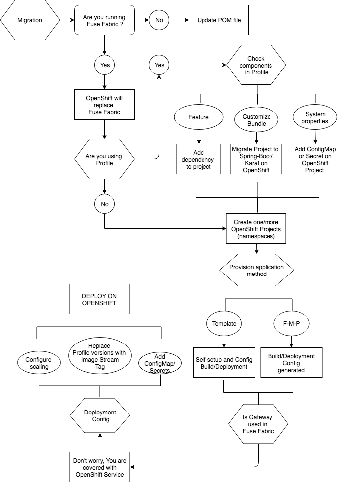

## Profiles → Fuse projects

###Fuse 6.x
In Fuse 6.x, a profile is a description of how a logical group of containers needs to be provisioned. It could possibly contain: 

- System properties
- OSGi Configuration Admin PIDs
- Maven artifact repositories
- Bundles
- Karaf feature repositories
- Features
- and also defines the OSGi framework that is going to be used.

Each profile can have none, one or more parents, and this allows you to have profile hierarchies and a container can be assigned to one or more profiles. 

Profiles are also versioned, which allows you to keep different versions of each profile and then upgrade or rollback containers by changing the version of the profiles they use.

Each profile may also define none, one or more dependents. This allows a profile to specify any containers that must be active for it to start, an example would be requiring that a MongoDB container is active so that a profile can use it as a database.

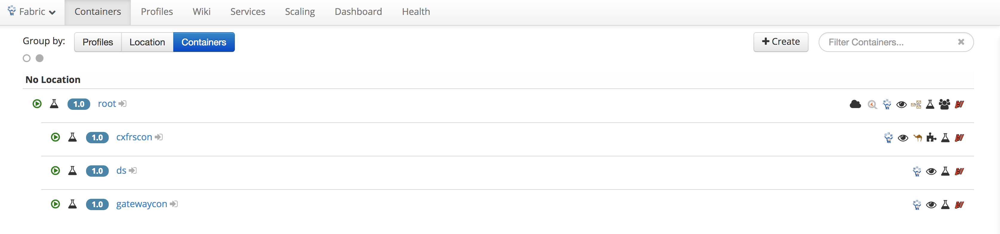

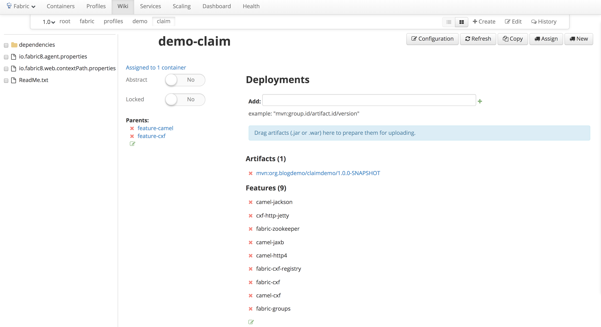

###Fuse 7.x
In OpenShift, a project is a Kubernetes namespace with additional annotations, and is the central vehicle by which access to resources for regular users is managed. A project allows a community of users to organize and manage their content in isolation from other communities. Users must be given access to projects by administrators, or if allowed to create projects, automatically have access to their own projects.

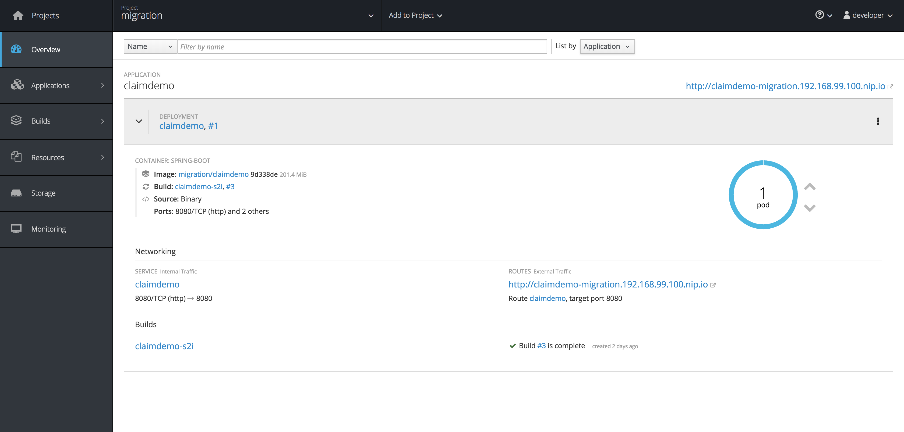

Using Karaf Container, 

```
<configuration>
	<!-- we are using karaf 2.4.x -->
	<karafVersion>v24</karafVersion>
   <useReferenceUrls>true</useReferenceUrls>
	<!-- do not include build output directory -->
	<includeBuildOutputDirectory>false</includeBuildOutputDirectory>
	<!-- no startupFeatures -->
	<startupFeatures>
	  <feature>karaf-framework</feature>
	  <feature>shell</feature>
	  <feature>jaas</feature>
	  <feature>aries-blueprint</feature>
	  <feature>camel-blueprint</feature>
	  <feature>camel-cxf</feature>
	  <feature>camel-jetty</feature>
	  <feature>camel-jackson</feature>
	  <feature>camel-websocket</feature>
	</startupFeatures>
	<startupBundles>
	  <bundle>mvn:${project.groupId}/${project.artifactId}/${project.version}</bundle>
	</startupBundles>
</configuration>
```

Using Spring-boot Container, 

```
	<dependency>
      <groupId>org.apache.camel</groupId>
      <artifactId>camel-spring-boot-starter</artifactId>
    </dependency>
    <dependency>
      <groupId>org.springframework.boot</groupId>
      <artifactId>spring-boot-starter-undertow</artifactId>
    </dependency><dependency>
      <groupId>org.apache.camel</groupId>
      <artifactId>camel-swagger-java-starter</artifactId>
    </dependency>
    <dependency>
      <groupId>org.apache.camel</groupId>
      <artifactId>camel-jackson-starter</artifactId>
    </dependency>
   	<dependency>
      <groupId>org.apache.camel</groupId>
      <artifactId>camel-undertow-starter</artifactId>
    </dependency>
    <dependency>
      <groupId>org.springframework.boot</groupId>
      <artifactId>spring-boot-starter-actuator</artifactId>
    </dependency>
```

Adding all to OpenShift Project 

```
oc new-project migration
```

##Container Creation → OpenShift s2i
Child containers refers to an Apache Karaf concept of child containers; which basically means a separate child process on the same machine as a root container; with the root container starting and stopping the child containers and the children sharing some disk space (installation jars etc) with the root container to minimise disk footprint.

Child containers are the most common containers you'll probably use since you'll probably start playing with fabric8 on your laptop. e.g. if you enable the Auto Scaler and define some requirements then the fabric you spin up on your laptop will automatically create some child containers (i.e. child processes).

Traditionally child containers were Karaf only; but now we support child Process Containers and child Java Containers.

Build Config 
Deploy Config


##Provisioning → OpenShift Kubernetes 

###Versioning

- OpenShift uses Image Stream Tags for pointing to different version of applications.

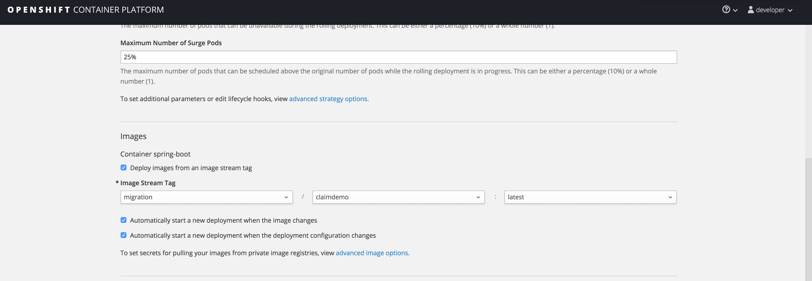


- OpenShift uses **Image Stream** and it's **Tags** for pointing to different version of applications.

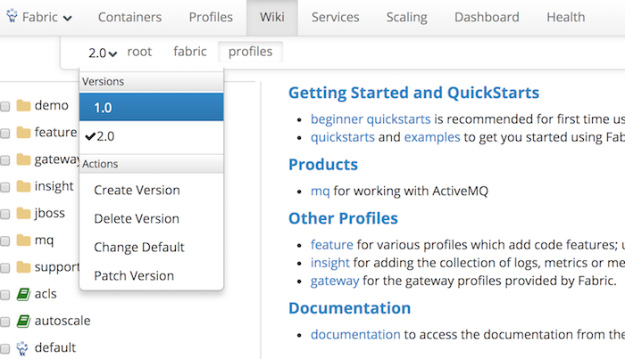


###Scaling
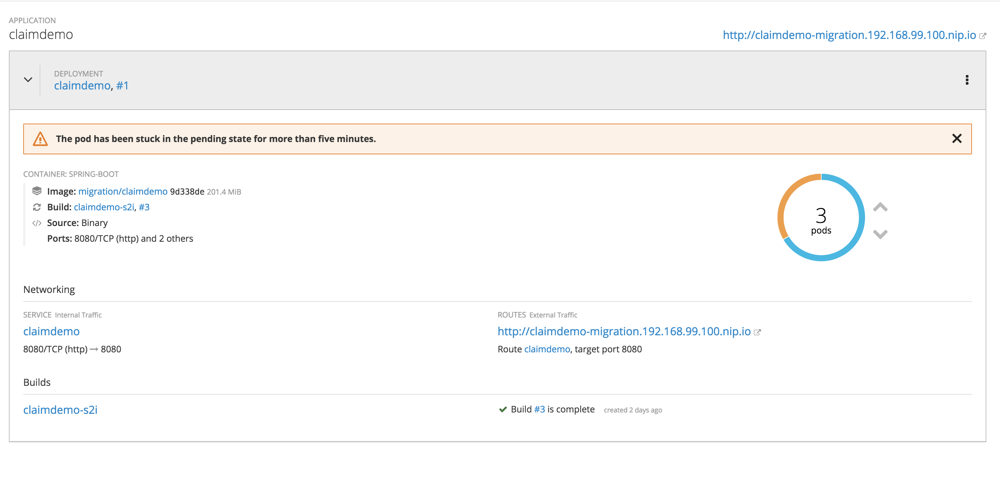


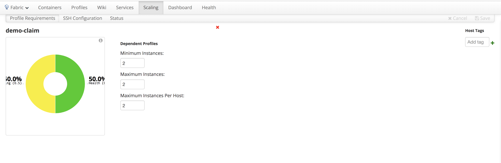


##Insight → OpenShift EFK

Fuse is built for distributed deployments: distributed across container, VMs & datacentres. Each container logs & gathers metrics which is great, but viewing those logs & metrics across a distributed deployment isn't going to be easy. So Fabric8 provides a consolidated view on logs & metrics collected in your fabric, making it easy to know exactly what's going on in your entire deployment.

Logs & Metrics
Insight collects logs & metrics separately, allowing you to choose what you want to collect & where you want to store your data. Out of the box, Fabric8 Insight collects a reasonable amount of data so you have to think about how you're going to deploy Insight. Currently, Insight stores log data in Elasticsearch & metrics data can be stored in either Elasticsearch, Cassandra (through RHQ Metrics), or InfluxDB (only available when using Fabric8 with Docker). This can all be run on one node (see installation below), but in a production deployment you are recommended to deploy a separate cluster of nodes to collect your data. This cluster can all be managed through Fabric8 profiles.


##Gateway → OpenShift Kubernetes Router and Services

The Gateway provides a TCP and HTTP/HTTPS gateway for discovery, load balancing and failover of services running within a Fabric8. This allows simple HTTP URLs to be used to access any web application or web service running withing a Fabric; or for messaging clients with A-MQ using any protocol (OpenWire, STOMP, MQTT, AMQP or WebSockets) they can discover and connect to the right broker letting the gateway deal connection management and proxy requests to where the services are actually running.


##Configuration Management → ConfigMap

- **Config Properties in Profile**

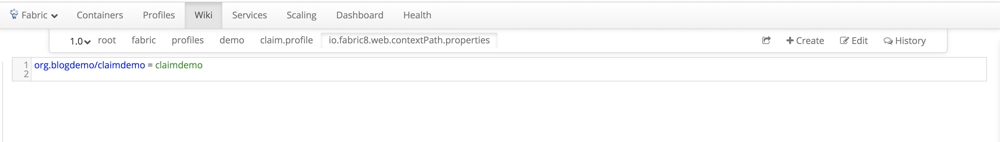

- **ConfigMap**

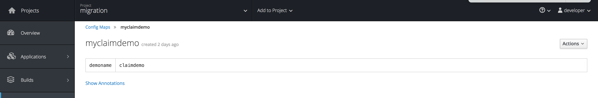

or

```
kind: ConfigMap
apiVersion: v1
metadata:
  name: example-config
  namespace: default
data: 
  example.property.1: hello
  example.property.2: world
  example.property.file: |-
    property.1=value-1
    property.2=value-2
    property.3=value-3
 ```
 
##Monitoring → OpenShift HawtIO

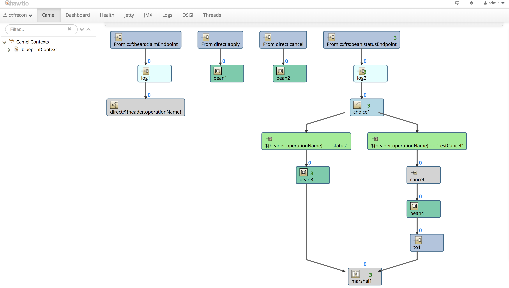
