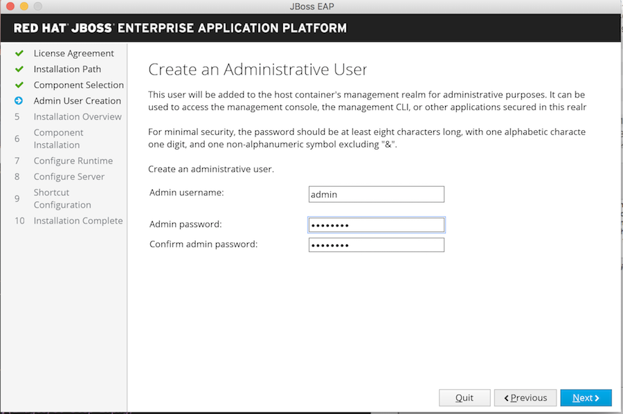

# Running Camel in EAP

### Prerequisites

1. Ensure you have JBoss Developers Studio version 11.2 + with the latest Fuse Tooling
2. Ensure Fuse 7.x is unzipped to a local directory
3. Download EAP 7.1 from [here](https://developers.redhat.com)

### Procedure

We are going to start with installing and setting EAP. 

- Installing EAP 7.1 to any directory in your machine

```
java -jar jboss-eap-7.1.0-installer.jar
```





- Install Fuse plugin on EAP 

```
java -jar fuse-eap-installer-7.0.0.XXXX-fuse-XXXX-redhat-1.jar <EAP_INASTALLED_PATH>

Install fuse-eap-distro-XXXX-fuse-XXXX-redhat-1
Run command: java -Djboss.home=. -jar jboss-modules.jar -mp modules org.wildfly.extras.config --configs camel --enable
Processing config for: camel
	Writing 'layers=fuse' to: ./modules/layers.conf
	Enable camel configuration in: ./standalone/configuration/standalone.xml
	Enable camel configuration in: ./standalone/configuration/standalone-full.xml
	Enable camel configuration in: ./standalone/configuration/standalone-full-ha.xml
	Enable camel configuration in: ./standalone/configuration/standalone-ha.xml
Red Hat Fuse Integration Platform - Version 7.0.0.XXXX-fuse-XXXX-redhat-1
```


To create a Fuse EAP project in JBDS. 

- Open JBDS

- Right-click on the Project Explorer and select "New", then "Fuse Integration Project"


- Type in the project name "currency-exchange-eap".  Click "Next".


- Select **Standalone** as target runtime, choose **Wildfly/Fuse on EAP**, 


- Click on *"New"* button right next to the it, and choose Red Hat JBoss Enterprise Application Platform 7.1 


- Under "Home Dirctory" browse to your EAP installation path and click "Finish" button. 
 


- Click next to continue.


- Select the *Spring Bean -Spring DSL template*


- When your project is ready, let's deploy it onto EAP. First we are going yo define EAP in the server view. If you don't see your server view in the tool. Go to ** Window -> Show view -> Others** and type **Servers** in the top search textarea.  


Doule click on the seach result to bring up Server view.


- Now in the Servers view, right click and select **New -> Server**


- Select JBoss Enterprise Application Platform 7.1
 


- Click Finish. 
  


- Select the currency exchange app from the avaliable app and click on ***Add*** to add it in the server that we have just configured in JBDS.


- To start up the EAP server in Servers view, right click on the *Red Hat JBoss Enterprise Application Platform 7.1* and select Start. 


- In commad line window, enter 

```
curl http://localhost:8080/camel-test-spring?name=YOUR_NAME
```

and server will reply ***Hello YOUR_NAME***

- To stop the EAP server in Servers view, right click on the *Red Hat JBoss Enterprise Application Platform 7.1* and select Stop.


