#Introducing CDI, CXF and JNDI in EAP

One of the nice features of the Camel subsystem is that it takes care of bootstrapping Spring for you.

All you need to do is to have appropriately named XML file(s) somewhere within your deployment. More on that here:

### Prerequisites

- Ensure you have JBoss Developers Studio version 11.2 + with the latest Fuse Tooling
- Insure both Red Hat EAP and Fuse Plugin are installed properly.
- Install the archetype into local maven repository

```
git clone FUSE_WORKSHOP_URL.git
cd fusev7-workshop/labs/60-artifacts/archetype/eap-lab-archetype
mvn install
```

- Just in case you have not done so, make sure you have pointed JBDS to your local catalog. Go to Preferences -> Maven -> Archetypes, click on **Add Local Catalog**

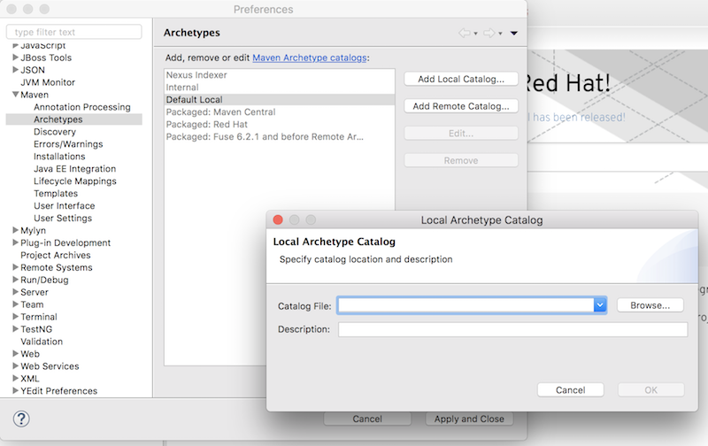

- Enter your local catalog location, *MAVEN_HOME/repository/archetype-catalog.xml* as the Catalog File and local for the description. And Click OK.

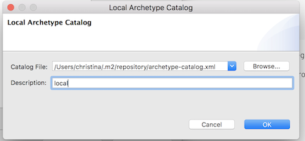
### Procedure

- We are going to start with importing a blank project by creating a base project. 
Under Project Explorer, right click on it and choose "New" -> "Project"

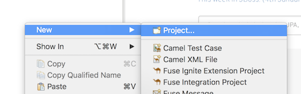

- Choose Maven -> Maven Project and click *Next*

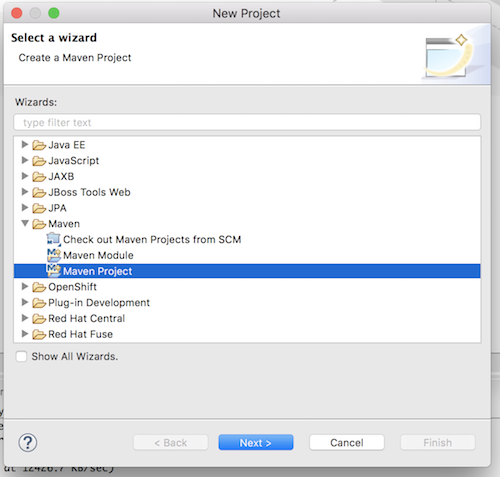

- *Next*

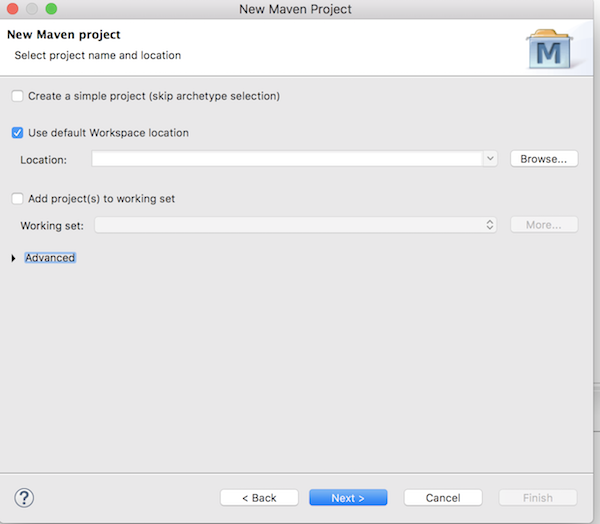

- Select *com.redhat.fuse* with Artifact Id *eap-lab-archetype* version *1.0.0* and click *Next*

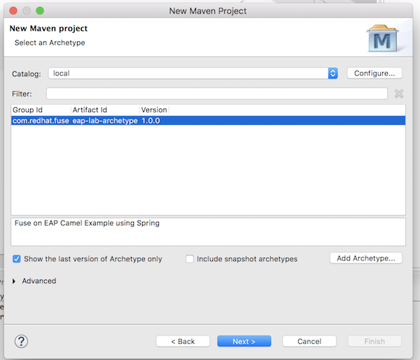

- Enter **com.redhat.fuse** as Group Id and **eap-lab** as Artifact Id and click *Finished*

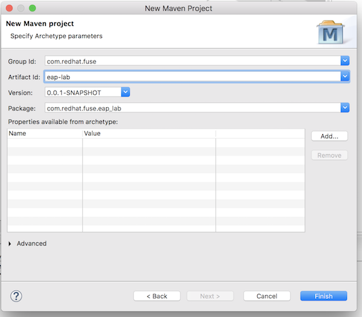

## CDI

Camel CDI automatically deploys and configures a CamelContext bean. That CamelContext bean is automatically instantiated, configured and started when the CDI container initializes. 

###Auto-detecting Camel routes

Camel CDI automatically collects all the RoutesBuilder beans in the application, instantiates and add them to the CamelContext bean instance when the CDI container initializes. The wildfly camel extension will scan the project and load files ends with ***-camel-context.xml***,a deployment may contain multiple -camel-context.xml files.
(http://wildfly-extras.github.io/wildfly-camel/#_features)

Create an Camel file, under *webapp/META-INF* called *my-camel-context.xml* this will be automatically imported the Camel XML DSL file and inject the Camel Context.  

- Under the newly created eap-lab project -> src/main/webapp/META-INF -> *Camel XML File*, and name it as ***my-camel-context.xml***
 
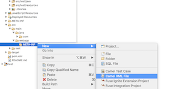

- In the Design view, start with *direct* by draging the **Direct** component from the Palette. And in the properties view below, enter ***direct:start*** in the uri property.

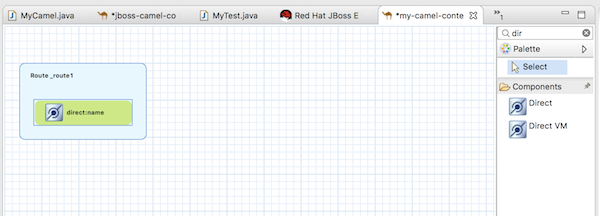
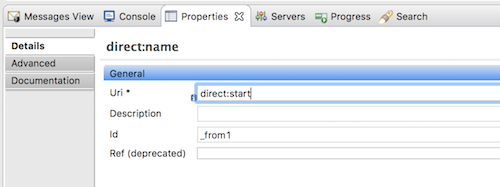

- Add *Set Body* by draging the **Set Body** Transformation from the Palette. And in the properties view below, select ***simple*** as Language and **Hello World** in the Expression.

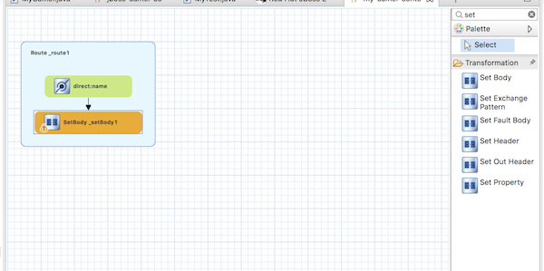
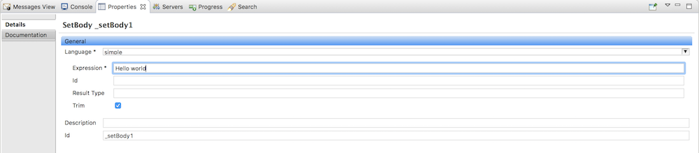

## CXF
WebService support is provided through the cxf component which integrates with the EAP WebServices subsystem that also uses Apache CXF. JAX-RS consumers can also be represented by REST DSL, by using the default undertow component Camel will automatically binds it to the default EAP web server.

- In your *my-camel-context.xml* add the following REST Configuration.
 
```
<camelContext>
<!--....-->
<restConfiguration component="undertow" port="8080" bindingMode="auto" />
<rest path="/say">
  <get uri="/default">
	<to uri="direct:default"/>
  </get>
</rest>
<!--....-->
</camelContext>
```

***CAUTION*** -- 
The Camel on EAP Subsystem only supports the camel-servlet and camel-undertow components for use with the REST DSL. Attempts to configure other components will not work. To make it avaliable in the XML. 

## JNDI
When used in conjunction with the camel-cdi component, Java EE annotations can make a datasource available to Camel. Add the following fragment to the *my-camel-context.xml* schema.

```
xmlns:jee="http://www.springframework.org/schema/jee"
xmlns:jdbc="http://www.springframework.org/schema/jdbc"

http://www.springframework.org/schema/jee http://www.springframework.org/schema/jee/spring-jee.xsd
http://www.springframework.org/schema/jdbc http://www.springframework.org/schema/jdbc/spring-jdbc.xsd
```

So it looks like this

```
<beans xmlns="http://www.springframework.org/schema/beans"
    xmlns:camel="http://camel.apache.org/schema/spring"
    xmlns:jee="http://www.springframework.org/schema/jee"
    xmlns:jdbc="http://www.springframework.org/schema/jdbc"
    xmlns:xsi="http://www.w3.org/2001/XMLSchema-instance" xsi:schemaLocation="
    http://www.springframework.org/schema/beans http://www.springframework.org/schema/beans/spring-beans-3.0.xsd        
    http://camel.apache.org/schema/spring http://camel.apache.org/schema/spring/camel-spring.xsd	
    http://www.springframework.org/schema/jee http://www.springframework.org/schema/jee/spring-jee.xsd
    http://www.springframework.org/schema/jdbc http://www.springframework.org/schema/jdbc/spring-jdbc.xsd">
```

Look up the DataSource in the Camel Context, by adding the following configuration in *my-camel-context.xml*  

```
<jee:jndi-lookup id="myCamelDS" jndi-name="java:jboss/datasources/ExampleDS"/>
<jdbc:initialize-database data-source="myCamelDS">
	<jdbc:script location="classpath:db-init.sql"/>
</jdbc:initialize-database>
```

Add a new route to the Camel file:

First add a new Route from dragging from right Palette and add the SQL select content in route.

- 
	- **Direct** URI as *direct:database*
	- **SQL** URI as *sql:select returnname from information_schema.users?dataSource=#myCamelDS*
	- **Log** message as *${body}*
	- **setBody** Expression as *Hello ${body[0][RETURNNAME]}* and Language as *simple*

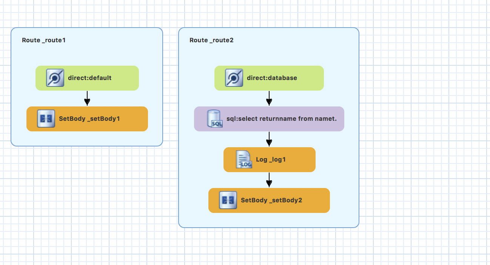

Add the another REST endpoint to the camel context

```
<get uri="/db/{dbno}">
	<to uri="direct:database"/>
</get>
```

## Deploy application

You should be able to deploy this application by now. Go back to the previous intro lab if you are not sure how to do it. 


## Test the application

When deploy successfully, you should be able to execute following CURL command and get the returned response. 

```
curl http://localhost:8080/say/default

#Hello World
```

```
curl http://localhost:8080/say/db/1

#Hello James
```
