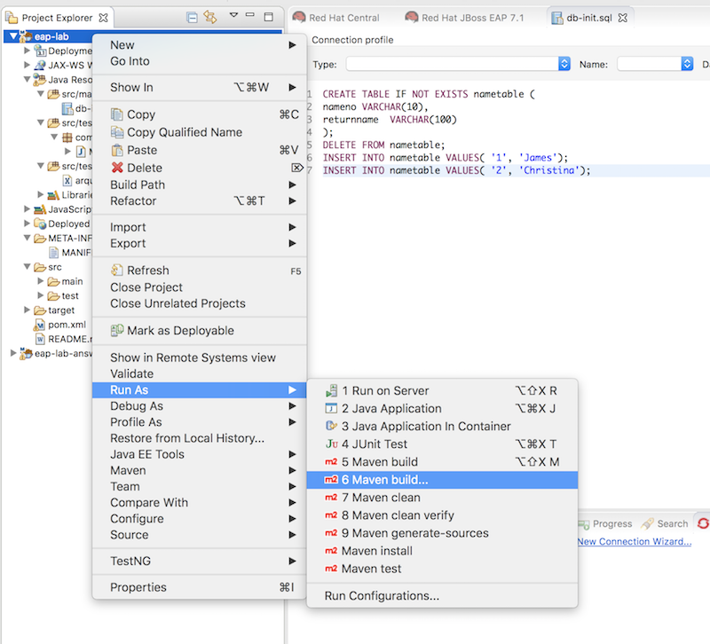
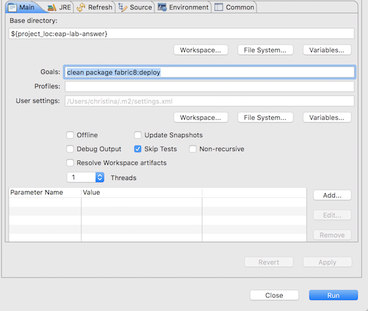
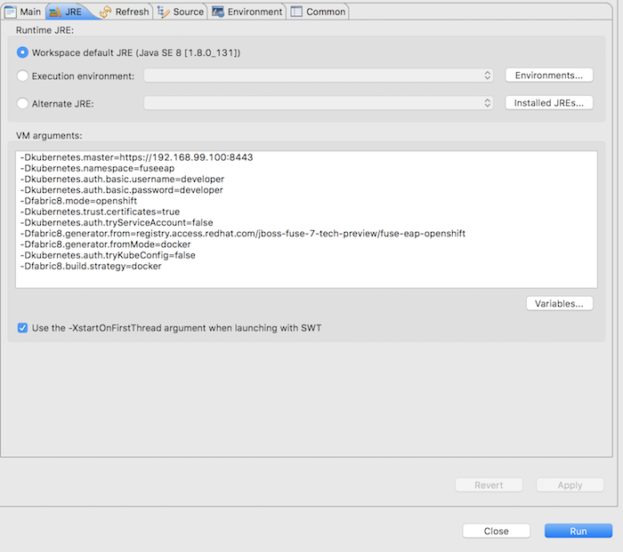
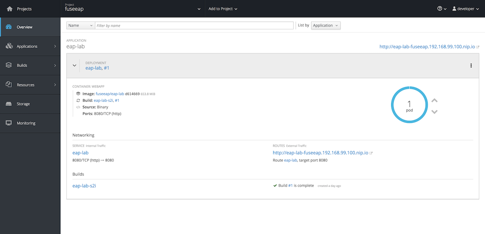

#Installing Fuse EAP on OpenShift

### Prerequisites

Install the Requisite Client-Side Tools

- **OpenShift client**
If you are using CDK, you can add the oc binary to your PATH using minishift oc-env which displays the command you need to type into your shell (the output of oc-env will differ depending on OS and shell type):

```
minishift oc-env
export PATH="/Users/christina/.minishift/cache/oc/v1.5.0:$PATH"
# Run this command to configure your shell:
# eval $(minishift oc-env)
```

- Have an OpenShift/Minishift running

- Install Fuse EAP image stream. For this you will need to have admin right. (For enablment, please skip this step)

```
#ie. For minishift user
oc login OPENSHIFT_URL -u system:admin

# Add all Fuse image stream into openshift.
oc create -f https://github.com/jboss-fuse/application-templates/blob/master/fis-image-streams.json -n openshift
```
- Complete Fuse on EAP, CDI, CXF and JNDI lab

### Procedure

- In your command line, login to openshift

```
oc login OPENSHIFT_URL -u YOUR_USER
```

- Create a new project in OpenShift

```
oc new-project YOURUSERID-fuseeap
```

- Go back to JBoss developer studio, in *Project Explorer* locate your *eap-lab* project, right click on the project and select Run AS -> **6 Maven build...**



- In the pop up panel, under Goals, add the following execute command and check Skip Tests. (Click on offline if you already have the repo pre-downloaded)

```
clean package fabric8:deploy
```


- Under the same panel, go to the **JRE** tab, under VM Arguments, paste the following configurations. 

Make sure you replace the Master URL, username, password.  

```
-Dkubernetes.master=https://YOUR_OPENSHIFT_URL
-Dkubernetes.namespace=YOURUSERID-fuseeap 
-Dkubernetes.auth.basic.username=YOUR_USERNAME 
-Dkubernetes.auth.basic.password=YOUR_PASSWORD 
-Dfabric8.mode=openshift 
-Dkubernetes.trust.certificates=true 
-Dkubernetes.auth.tryServiceAccount=false 
-Dfabric8.generator.from=registry.access.redhat.com/fuse7/fuse-eap-openshift 
-Dfabric8.generator.fromMode=docker 
-Dkubernetes.auth.tryKubeConfig=false 
-Dfabric8.build.strategy=docker
```


or run following command line in the project directory. 

```
mvn clean package fabric8:deploy -o \
-Dkubernetes.master=https://YOUR_OPENSHIFT_URL \
-Dkubernetes.namespace=fuseeap \
-Dkubernetes.auth.basic.username=YOUR_USERNAME \
-Dkubernetes.auth.basic.password=YOUR_PASSWORD \
-Dfabric8.mode=openshift \
-Dkubernetes.trust.certificates=true \
-Dkubernetes.auth.tryServiceAccount=false \
-Dfabric8.generator.from=registry.access.redhat.com/fuse7/fuse-eap-openshift \
-Dfabric8.generator.fromMode=docker \
-Dkubernetes.auth.tryKubeConfig=false \
-Dfabric8.build.strategy=docker
```

- Go to your OpenShift instance, login and go to the fuseeap project. You should be able to see the eap-lab has successfully deployed. 



or check with command line, you should be able to see the running eap-lab instance.

```
oc get pod

NAME                  READY     STATUS      RESTARTS   AGE
eap-lab-1-nnv57       1/1       Running     0          1d
eap-lab-s2i-1-build   0/1       Completed   0          1d

```
Use CURL command to test the application, you should be able to execute following CURL command and get the returned response. 

```
curl http://eap-lab-fuseeap-YOUR_OPENSHIFT_URL/say/default

#Hello World
```

```
curl hhttp://eap-lab-fuseeap-YOUR_OPENSHIFT_URL/say/db/1

#Hello James
```


### Challenges

- There are many other EAP Quickstart Templates avaliable online. Have fun and deploy the application of your choice on OpenShift.

| Name	| Description| 
|-----------------------|-------------------------------------------------|
|[JBoss Fuse 7.0 Camel A-MQ with EAP](https://raw.githubusercontent.com/jboss-fuse/application-templates/master/quickstarts/eap-camel-amq-template.json)| Demonstrates using the camel-activemq component to connect to an AMQ message broker running in OpenShift. It is assumed that the broker is already deployed.|
|[JBoss Fuse 7.0 Camel CDI with EAP](https://raw.githubusercontent.com/jboss-fuse/application-templates/master/quickstarts/eap-camel-cdi-template.json)| Demonstrates using the camel-cdi component to integrate CDI beans with Camel routes.|
|[JBoss Fuse 7.0 CXF JAX-RS with EAP](https://raw.githubusercontent.com/jboss-fuse/application-templates/master/quickstarts/eap-camel-cxf-jaxrs-template.json)| Demonstrates using the camel-cxf component to produce and consume JAX-RS REST services.|
|[JBoss Fuse 7.0 CXF JAX-WS with EAP](https://raw.githubusercontent.com/jboss-fuse/application-templates/master/quickstarts/eap-camel-cxf-jaxws-template.json)| Demonstrates using the camel-cxf component to produce and consume JAX-WS web services.|
|[JBoss Fuse 7.0 Camel JPA + MySQL (Ephemeral) with EAP](https://raw.githubusercontent.com/jboss-fuse/application-templates/master/quickstarts/eap-camel-jpa-template.json)| Demonstrates how to connect a Camel application with JBoss Fuse on EAP to a MySQL database and expose a REST API. This example creates two containers, one container to run as a MySQL server, and another running the Camel application which acts as as a client to the database.|


### NOTE
 -  **TODO** Current F-M-P has a bug (https://github.com/fabric8io/fabric8-maven-plugin/pull/1193) so using the community 3.5.38 version. And not using the S2i, but using docker as the build strategy. 
