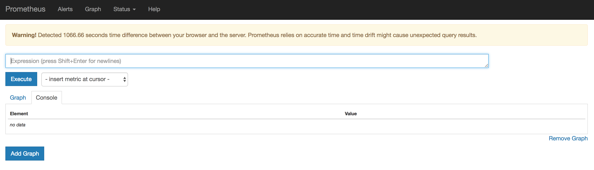
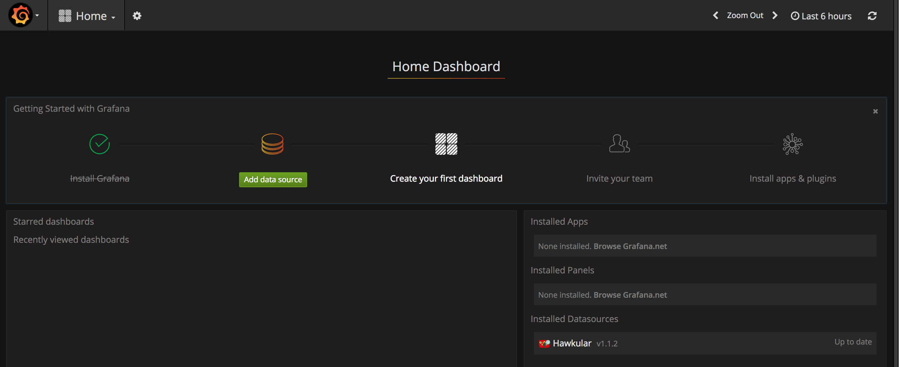
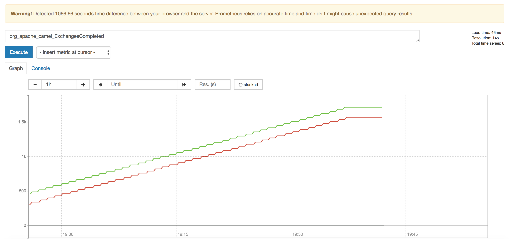

# Management and Monitoring

Management and Monitoring is implemented using Prometheus and Grafana in Fuse 7.  These are best demonstrated on OpenShift, or for the purpose of this lab, Minishift / CDK.

### Prerequisites

1. Ensure you have JBoss Developers Studio version 11.2 + with the latest Fuse Tooling
2. Ensure AMQ 7.x is running locally
3. Ensure you have Minishift / CDK running locally

### Procedure

To begin, we need to properly setup minishift.

1. Git clone `https://github.com/minishift/minishift-addons` to a local directory

2. Via the CLI, enter

```
export MINISHIFT_ENABLE_EXPERIMENTAL=y
minishift start --memory 4GB --service-catalog
```

There might be a few startup errors (which can be ignored).  Verify minishift has started by typing `minishift status`

3.  Login to OpenShift using oc tools as the admin user:

```
oc login -u admin
oc new-project management-demo
```

4. Via the CLI, use the addons to install prometheus and grafana

```
cd minishift-addons/add-ons/grafana
minishift addons install .
minishift addon apply grafana --addon-env namespace=grafana

cd ../prometheus
minishift addons install .
minishift addon apply prometheus --addon-env namespace=management-demo

cd ../management-infra
minishift addons install .
minishift addon apply management-infra
```

5. Now that we have grafana and prometheus installed, navigate to your OpenShift web console and check the routes are working for each app.  Prometheus should look like the following:


  
6. Verify Grafana app is accessible:



7. Git clone the following project to a local directory: `https://github.com/cunningt/prometheus-demo`

8. Via the CLI, execute the following:

```
cd prometheus-demo/democonfig 
#Update the fabric8 version to 3.0.11.fuse-000039-redhat-1
mvn install
mvn fabric8:deploy
```

9.  Once the democonfig project has started up, you can check the prometheus dashboard for the Camel Exchage completed metric.  Type ***org_apache_camel_ExchangesCompleted*** in the field and hit ***Execute***.  You should see a graph appear showing the number of completed exchanges since start-up.  Play around with adding more pods to see an Aggregated view of your metric.



