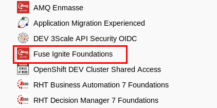
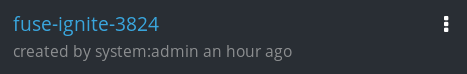
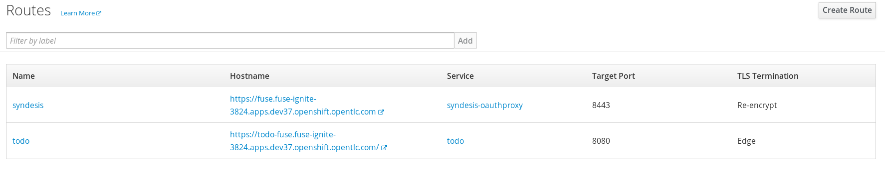
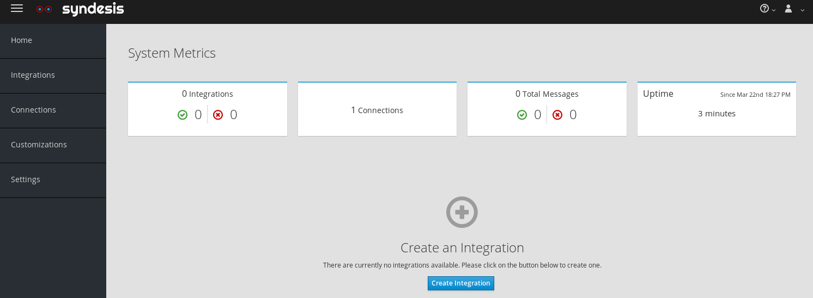

:scrollbar:
:data-uri:
:toc2:
:linkattrs:
:coursevm:

= Fuse Ignite Environment Setup Lab

This course includes at least one lab per module.
Each lab is hands-on and typically takes about an hour to complete.
Completing the course labs prepares you to correctly answer many of the final assessment questions.

.Goals
* Provision a Red Hat Fuse Ignite lab environment

.Requirements
* Red Hat OPENTLC credentials
* Either Mozilla Firefox, or Google Chrome, web browser installed on your PC
* Broadband internet connection

.Lab Conventions
The following environment variable is used in this lab to reference an installation directory:

* `${lab_code}` refers to the lab assets directory.
It contains a pom.xml file and its directory path should contain `../ipaas-<version_number>/code`

:numbered:

== Remote OpenShift Environment

This course provides an OpenShift environment in the cloud.
This OpenShift environment is also pre-provisioned with the following:

. Fuse Ignite (release tag *fuse-ignite-1.3*)
. _Product Catalog_ service that exposes a RESTful API with swagger documentation.
+
This _Product Catalog_ service will support several labs in this course.

Red Hat strongly recommends that you use this remote OpenShift environment for the remainder of the labs of this course.

== Sign Up

If you are attending an instructor-led training, skip this section and proceed to the next section titled *Connect*.

. Identify your Red Hat OPENTLC username.
+
[TIP]
If you are unsure of your Red Hat OPENTLC credentials, reset them from the link:https://www.opentlc.com/pwm/private/Login[OPENTLC Account Management^] page. If you continue to have problems, send an email to `open-program@redhat.com` requesting for assistance.

. Using your OPENTLC credentials, log in to the link:https://labs.opentlc.com/[OPENTLC lab portal^]:
+
image::images/cf_login.png[]

. Navigate to *Services -> My Services*.
. Delete all previous services that you may still have active.
* Doing so allows you to order a service for this course.

. Navigate to *Services -> Catalogs -> OPENTLC Middleware Solutions Labs*.
. Select *Fuse Ignite Foundations*:
+

. On the next page, click *Order*, and on the form that appears, click *Submit*.
* Expect to receive an email from Red Hat with information about the course.

. Check your email inbox for an email from *Red Hat OPENTLC* (with a sender's email address like `noreply@opentlc.com`). Contents of that email should resemble the following:
+
.Sample Email
[source,text]
-----
You have been enrolled in the Red Hat OPENTLC FUSE IGNITE OpenShift environment.
You can access the OpenShift evironment, where Fuse Ignite is hosted, by going to https://master.<$Environment_ID>.openshift.opentlc.com and logging in using <YOUR OPENTLC ID>.

NOTICE: Your environment will expire and be deleted in 14 day(s) at 2018-03-24 00:00:00 -0400. In order to conserve resources we cannot archive or restore any data in this environment. All data will be lost upon expiration.
-----
+
[TIP]
For instance, the URL to the management console for a particular OpenShift instance could be `http://master.ap2.openshift.opentlc.com` where `ap2` is the *$Environment_ID*

== Connect

=== OpenShift web console

. Open a web browser window on your host machine and navigate to the URL to the OpenShift web console listed in your lab confirmation email.
* Click through the warnings from your browser indicating that it has no knowledge of the Certificate Authority associated to your OpenShift Container Platform web console.
* The _OpenShift Container Platform web console_ in your lab environment is secured by default using a self-signed certificate.

. From the OpenShift Container Platform web console login page, log in using your `OPENTLC` credentials:
+
image::images/ocp_login.png[]

. Once authenticated into the OpenShift web console, navigate to the top-right panel called:  _My Projects_.
. You should see a project whose name has the following convention:  `fuse-ignite-$GUID`  (where *$GUID* equals a unique identifier assigned to your project).
+

+
[TIP]
The URL for your Fuse Ignite application should resemble `http://fuse.fuse-ignite-<$GUID>.apps.<$Environment_ID>.openshift.opentlc.com`
For instance, the URL to a particular Fuse Ignite application could be `https://fuse.fuse-ignite-3824.apps.ap2.openshift.opentlc.com/` where `3824` is the *$GUID* and `ap2` is the *$Environment_ID*
+
. Click on the link associated with your Fuse Ignite project.

=== Fuse Ignite web console

. Once you have navigated to your Fuse Ignite project in your OpenShift web console, navigate to: `Applications -> Routes`
. Click the link associated with the _syndesis_ route:
+

. Accept the self-signed certificates used to secure your Fuse Ignite web console
. Authenticate using your OPENTLC credentials
+
Once authenticated, click the button the  `Allow selected permissions` that grants the Fuse Ignite application access to your user info and status.
+
image::images/authorize_access.png[]
. Once you login you should be able to see the Fuse Ignite web console, from the perspective of *Home*:
+

+
. On the web console, *System Metrics* are displayed. These describe:
.. The number of connections available
.. The number of integrations in use
.. The total number of messages serviced by integrations
.. The uptime for Fuse Ignite
+
. Click on the person icon located at the top right hand corner of the console.
. Notice the *Logout* option, selecting this will end your session with the Fuse Ignite console and be logged out.
. Click on the question mark icon located at the top right hand corner of the console.
. Notice the options for a tutorial, a user guide and support information appear. If you require help with Fuse Ignite, these will provide the necessary assistance to you.
. Click on the icon of three horizontal bars located on the top left hand corner of the console.
. Notice that the left-hand panel containing options like *Integrations* and *Customizations* disappears. Click the icon to have the panel re-appear.
. Navigate through the other aspects of left-hand panel on your own. Detailed explanation on the use of these features are provided in the subsequent labs.

=== Coolstore product catalog microservice

. Construct the URL for the *Coolstore Product Catalog Microservice*, by replacing the first occurrence of `fuse` in the URL for the console of the Fuse Ignite project, with `catalog-service` instead.
+
[TIP]
The URL for your Microservice should resemble `http://catalog-service-fuse-ignite-<$GUID>.<$Environment_ID>.openshift.opentlc.com`
For instance, the URL to a particular instance of this Microservice could be `http://catalog-service-fuse-ignite-3824.apps.ap2.openshift.opentlc.com`
+
. Open another web browser window on your host machine and navigate to the URL for the *Coolstore Product Catalog Microservice* identified from the email from *Red Hat OPENTLC*.
. Notice the JSON output from the Microservice, displayed in the web browser window.
. You now have a working Fuse Ignite lab environment from which to conduct labs. In addition, you can use the Microservice for your labs.

There is a total two software applications hosted on the OPENTLC OpenShift Container Platform lab environment:
1. Fuse Ignite - for Integration tooling
[NOTE]
2. Coolstore Product Catalog Microservice - for specific integration lab use

=== Cloud services account registration

The course will involve the use of Cloud services, so accounts for these Cloud services have to be registered as a pre-requisite.

. link:https://aws.amazon.com/free/start-your-free-trial/[Register] for a trial Amazon Web Services (AWS) account.
. link:https://developer.salesforce.com/signup/[Register] for a Salesforce Developer Edition account.
. link:https://help.twitter.com/en/create-twitter-account[Register] for a Twitter account.
. Register for a free web hosting service account.

You are now ready to proceed with enterprise integration work using Red Hat Fuse Ignite.

:numbered!:
