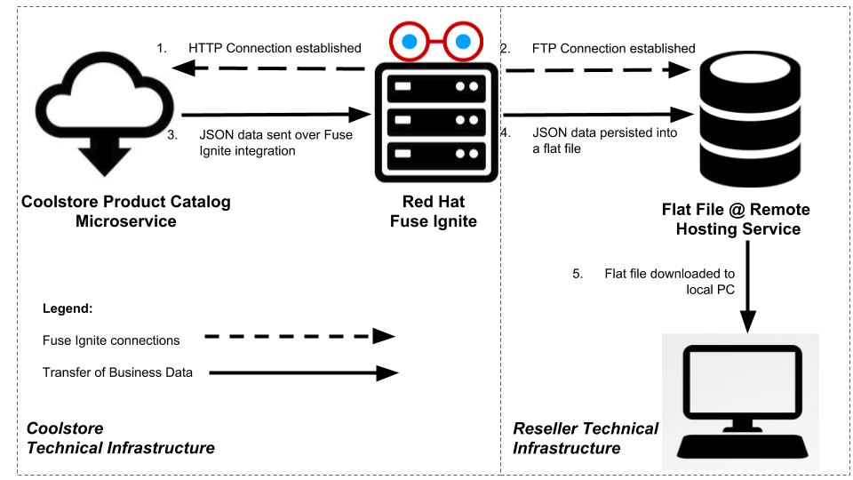
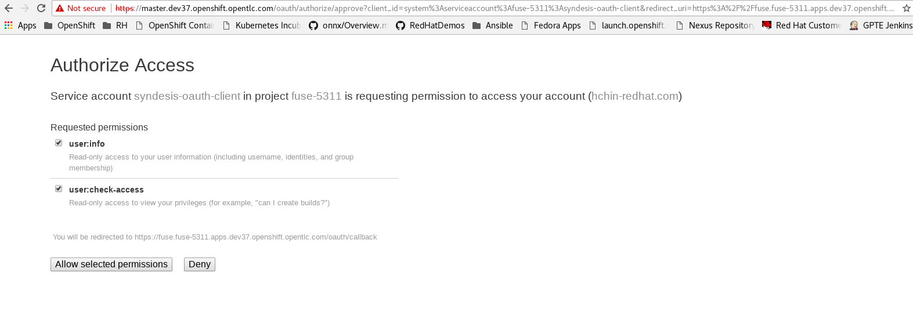
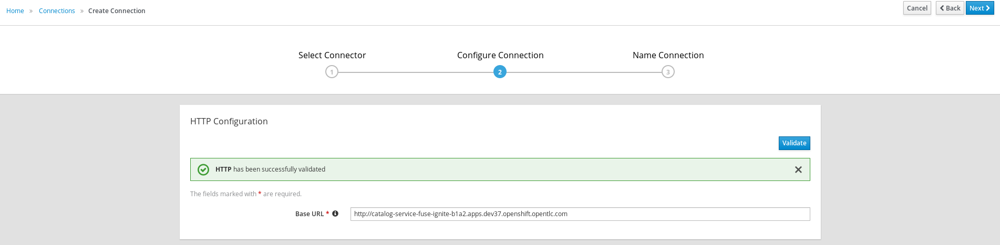
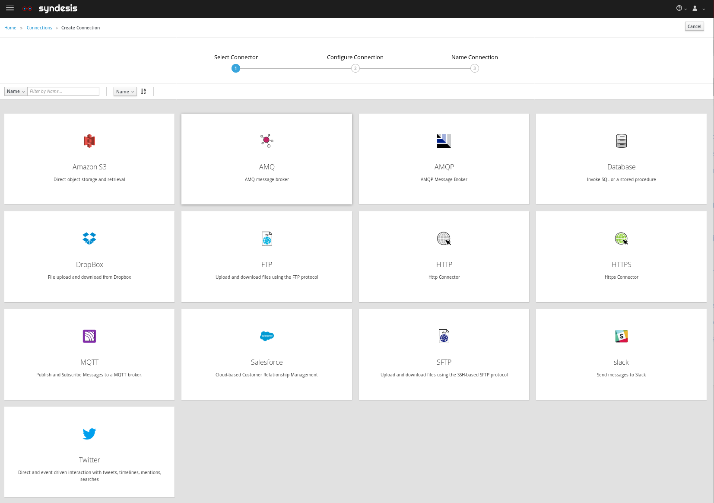
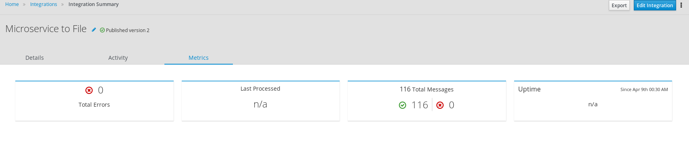
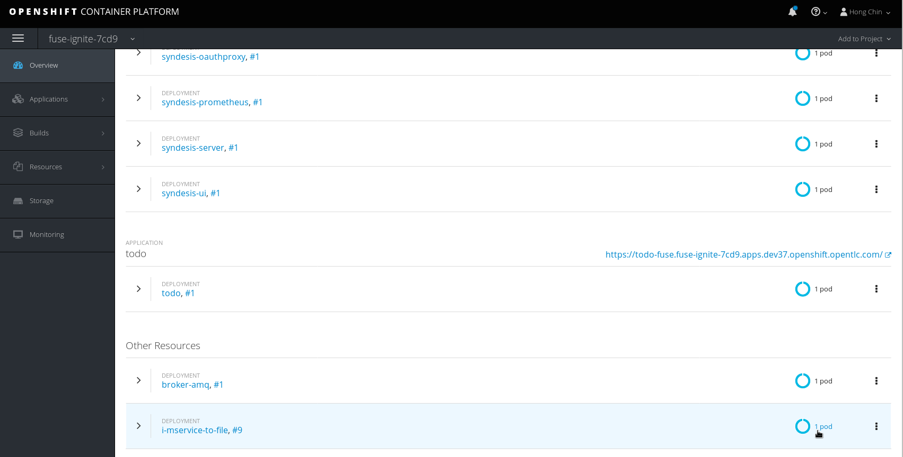
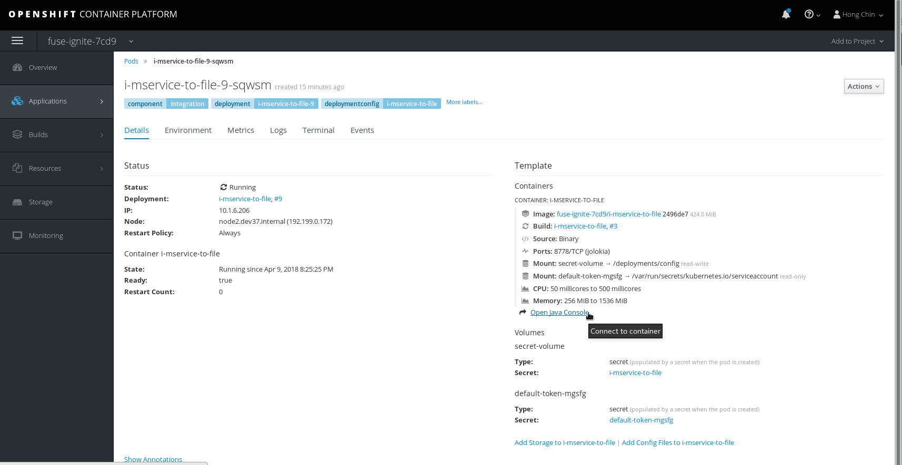
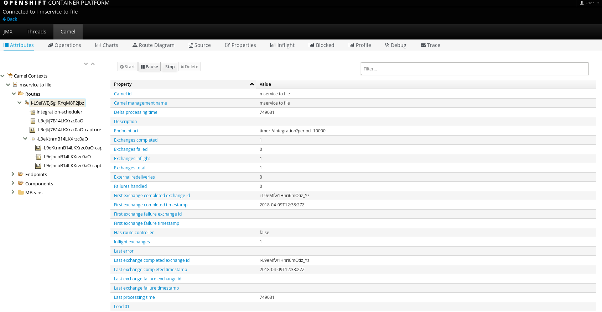
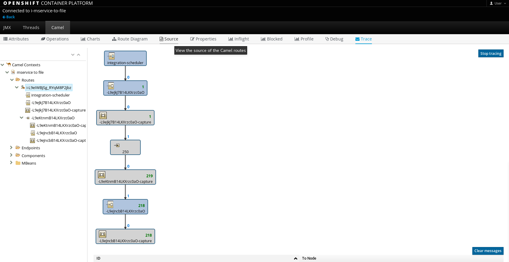
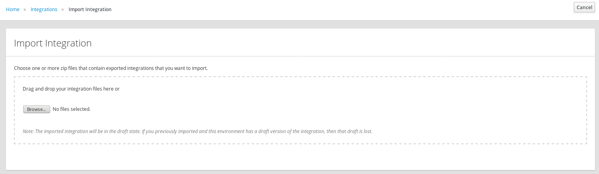

:scrollbar:
:data-uri:
:toc2:
:linkattrs:
:coursevm:

= Integration Lab - Product Data Synchronization: Microservice to Flat File scenario

This course includes at least one lab per module. Each lab is hands-on and typically takes about an hour to complete. Executing the course labs prepares you to correctly answer many of the final assessment questions.

.Goals
* Design an integration for a cloud-based data persistence solution, where JSON data from a Microservice is synchronized and persisted to a Flat File on a remote server
* Implement the planned integration using Red Hat Fuse Ignite

.Requirements
* Provisioned a Fuse Ignite environment

In this lab, you will fulfill the requirements for a cloud-based data synchronization solution, by integrating a provider of JSON data, namely a Microservice, to a remote file hosting server designated to host the destination copy of the data.
The data is hosted by Coolstore, an online store that conducts wholesale business of quality consumer products. The consumer of the data is any reseller of Coolstore products.

The data will be persisted into a flat file, which will be created upon the initial synchronization with the Microservice using a Fuse Ignite integration. This integration scenario will be real-time and will be active indefinitely (does not ever stop, if you allow it).

As the Integration actively polls the Microservice for product catalog data of an e-commerce business, called Coolstore, the flat file is constantly refreshed with the most current data that the Microservice offers. This allows any resellers of Coolstore product to be assured of data quality and therefore, confidently download the data from the remote file hosting server anytime.
This business data regarding the product catalog is utilized as part of business operations of any reseller of Coolstore products.

:numbered:

== Logon to Red Hat Fuse Ignite

. Check your email inbox for the same email you received earlier, containing a link to Red Hat Fuse Ignite.
+
CAUTION: Red Hat Fuse Ignite is supported for the following web browsers: Google Chrome, Mozilla Firefox, Microsoft Edge
+
. Click this link to display the Red Hat Fuse Ignite login page.

. Log in using your OPENTLC account.

. A webpage launches, prompting you to authorize Red Hat Fuse Ignite access to your OPENTLC account credentials:
+

+
. Select both available checkboxes and click the *Allow selected permissions* button.
+
NOTE: This authorization page will appear only once. The next time you log in, the console for Fuse Ignite appears instead of this authorization page.

== Create a HTTP connection to the Microservice

You will setup a connection to the Microservice that provides Product Catalog data in JSON format.

. On the left-hand pane of Fuse Ignite console, click *Connections*.
. Click the *Create Connection* button.
. Select the Connector named *HTTP*. The *Configure Connection* page loads.
. Provide the URL to the *Coolstore Product Catalog Microservice* as earlier identified in the *Fuse Ignite Environment Setup Lab* of Module 1.
. Click *Validate* and observe the successful result.
+

+
. Click *Next*. The *Add Connection Details* page loads.
. Provide `coolstore-product-catalog-microservice` as the name of the HTTP connection.
. Click *Create* to complete the connection creation process.

== Setup a web hosting account

You will utilize a remote file hosting server in order to provide the environment for hosting the destination endpoint (which is a flat file) of the Fuse Ignite Integration.

. Setup a user account with a free web-hosting service provider. Ensure that you are able to utilize FTP and SFTP services using this account.
+
[NOTE]
The following lab involves an account from link:https://infinityfree.net/[Infinity Free]
. Note the Login ID and Password for your new account, as the Fuse Ignite integration creation process will require these particulars.

== Create an FTP connection to the web hosting service provider

You will setup a connection to the web hosting service where the flat file containing JSON data will be stored.

. On the left-hand pane of Fuse Ignite console, click *Connections*.
. Select the Connector named *FTP*.
+

+
. Proceed to populate the form with the *Host*, *User name* and *Password* of your web hosting service account.
. Click *Next*. The *Name Connection* page is displayed.
. Provide `hosting-server` as the name of the FTP connection.
. Click *Create* to complete the connection creation process.

== Create an Integration from the HTTP connection to the FTP connection

You will setup an integration between the Microservice and the web hosting service.

. On the left-hand pane of Fuse Ignite console, click *Integrations*.
. Click *Create Integration*.
. Select the `coolstore-product-catalog-microservice` connection, on the *Choose a Start Connection* page.
. On the *Choose an Action* page, select *Periodic invoke URL*.
. On the *Properties* page, assign the following values to the fields:
+
[.noredheader,cols="5,5,5",caption=""]
|======
|*URL Path*|*HTTP Method*|*Period*
|/products|GET|5 Seconds
|======
+
. Click *Next*. The *Specify Output Data Type* page is displayed.
. Click the *Select Type* drop-down box, to display all the options. Note that JSON and XML schemas and document instances are supported data types.
. Leave the option as *Type specification not required*.
. Click *Done*. The `coolstore-product-catalog-microservice` connection is now officially the *start connection* in the Integration.
. In the Fuse Ignite console, notice that you are currently at the *Choose a Finish Connection* page.
. Select the `hosting-server` connection icon.
. On the *Choose an Action* page, select the *Upload* option.
. On the *Properties* page, assign the following values to the fields:
+
[.noredheader,cols="5,5",caption=""]
|======
|*File name expression*|*FTP Directory*
|product-catalog.txt|./htdocs
|======
+
. Click *Next*. On the *Specify Input Data Type* page, validate the available data types by displaying the options from the *Select Type* dropdown box.
. Leave the options as default, and click *Done*. The `hosting-server` connection is now part of the Integration.
. At the top-left hand corner of the Fuse Ignite console, select the field with the text `Enter integration name...`
. Provide _Microservice to File_ as the name for the integration.
. At the upper right corner of the console, click *Publish*.
. While the integration is being deployed, click the *Done* button.
. Once the green checkbox icon appears next to the _Microservice to File_ integration, it indicates that the integration has been successfully deployed.

Now, testing of the data synchronization integration can proceed.

== Test the _Microservice to File_ Integration

You will setup a connection to the web hosting service where the flat file containing JSON data will be stored.

=== Interprete JSON output from Microservice

. Click *Integrations*, in the left-hand pane of the Fuse Ignite console.
. Select the _Microservice to File_ integration.
. Validate that the _Microservice to File_ integration is active.
. In a separate web browser window, access the *Coolstore Product Catalog Microservice* using the URL earlier identified from the confirmation email.
. Test the `/products` API operation.
. Note the response in JSON format, displayed in the web browser window.

*Question:* Can you identify the individual products listed as well as their attributes?

=== Validate data quality

. Using an FTP client, or a web-based console (if available), login and navigate to the root directory of your web hosting service account.
. Navigate to the `./htdocs` subdirectory.
. Locate and download the `product-catalog.txt` file to your local PC.
. Locate the `product-catalog.txt` file on your local PC and open it using your favorite text editor.
. Compare the contents of the `product-catalog.txt` file, with the response from the test of the `/products` API operation of the *Coolstore Product Catalog Microservice* using the Swagger user interface of the microservice.
+
*Question:* Do the contents of the flat file differ from the JSON-based response from the earlier API operation test? What are your conclusions regarding the function of the _Microservice to File_ integration?
+
. On the *Integration Summary* page of the Fuse Ignite console, explore both the *Activity* and *Metrics* tabs.
+

+
[NOTE]
Additional step activity are logged and made available through the *Activity* tab, while the uptime, total number of messages and errors are listed under the *Metrics* tab.

=== Test the data transfer

. Using the FTP client, or a web-based console (if available), delete the `product-catalog.txt` files from the remote web host as well as the local PC.
. After a minute or more, list the contents of the `./htdocs` subdirectory.
. Verify that the `product-catalog.txt` file appears again.
* *Question:* If the _Microservice to File_ integration is not active, will this file appear under these circumstances?
. Locate and download the `product-catalog.txt` file to your local PC.
. Locate the `product-catalog.txt` file on your local PC and open it using your favorite text editor.
. Compare the contents of the `product-catalog.txt` file, with the JSON-based response from the *Coolstore Product Catalog Microservice* which is displayed in the web browser window.

*Question:* Does this validates that the _Microservice to File_ integration achieves its objective of real-time data synchronization for the benefit of resellers of Coolstore products?

== [OPTIONAL] Design integrations to enable microservice operations

You will implement the rest of the API operations of the *Coolstore Product Catalog Microservice*. It is likely that other connectors (apart from HTTP and FTP) have to be used for this lab exercise, so you are encouraged to complete other labs before attempting this lab exercise.

. Access the Swagger user interface of the *Coolstore Product Catalog Microservice*, using the URL that was provided by the earlier confirmation email.
. Test the various API operations of the microservice through the use of the Swagger user interface, taking note of the parameters and responses.
. Provide an architecture design, with description, of each new Fuse Ignite integration that supports a distinct API operation of the *Coolstore Product Catalog Microservice*. Every integration will have to map to a distinct endpoint of *Coolstore Product Catalog Microservice*, thereby enabling a business operation. For instance, the _Microservice to File_ integration performs a retrieval of the current product catalog.

*Question:* Should all API operations of this microservice be implemented using Fuse Ignite integrations, or is there a better alternative for some API operations? Does this hybrid integration approach suit any business use case that you have been across?

== Monitoring of Camel Route within the integration

You will analyse the statistics regarding the Camel Route that the _Microservice to File_ integration is built on.

As the underlying technology for Fuse Ignite integration are Apache Camel routes, it is useful to access the Hawtio Console, embedded in every integration, in order to monitor the Camel routes and inflight exchange messages.

. From the OpenShift Management Console, select the *Overview* tab from the menu.
. Select the pod icon next to the _Microservice to File_ deployment.
+

+
[NOTE]
Each Fuse Ignite integration is containerized in its own OpenShift Pod.
Having access to the Pod logs for each integration helps in diagnosing the status and issues regarding the use of the integration.
+
. Click the link *Open Java Console*. This will launch the Hawtio Console that monitors the activity and performance statistics of the Apache Camel Route that forms the structure of the integration.
+

+
. Navigate the console and take note of the various statistics for the Camel Route that belongs to the  _Microservice to File_ integration.
. Select the *Attributes* tab on the Hawtio Console menu bar. Note the number of inflight exchanges, delta processing time, last processing time, minimum processing times.
+

+
. Select the *Trace* tab on the Hawtio Console menu bar. Activate tracing on the page displayed.
+

+
. Observe the trace statistics and the inflight exchange activity.

*Question:* Are you able to explain these statistics meaningfully to a business stakeholder who intends to understand the performance of the solution?

== Import and Export of Integration

You will backup your integration and subsequently import and re-test the integration.

. Click the *Integrations* tab, located on the left-hand panel.
. Click the _Microservice to File_ integration.
. Click on the *Export* button located at the top right-hand corner of the Fuse Ignite console.
. Save the archive file.
. Using your favorite file archival tool, unzip the archive file.
. Analyse the contents of the JSON files that were extracted from the archive file.
+
*QUESTION:* Can you recognise the configuration for the _Microservice to File_ integration?
+
. Click the *Integrations* tab, located on the left-hand panel.
. Click on the *Import* button located at the top right-hand corner of the Fuse Ignite console.
+

+
. Click the *Browse* button on the *Import Integration* page.
. Select the archive file which you exported earlier and click *Open*. The *Integrations* page is displayed.
. Notice the _Microservice to File_ integration is no longer in *Published* state, rather its status is *Draft*.
. Click on the icon of three vertical dots, next to the green check box.
. From the pop-up window, select *Publish*.
. Once the status of _Microservice to File_ integration becomes *Published*, repeat the earlier tests in this lab.

*QUESTION:* Can you validate that behaviour of the _Microservice to File_ integration remains the same even after re-import?

[NOTE]
If you are using the Fuse Ignite Technology Preview release, exactly one integration at a time can be active (ie: in publish state).
Though you can create another Fuse Ignite integration, you cannot publish it while another integration is active.
As a good housekeeping practice, it is recommended to `unpublish` any integration that you no longer wish to test.

== Housekeeping

You will clean up the integration. as a housekeeping best practice.

. In the left-hand pane, click *Integrations*.
. Locate the entry for the _Microservice to File_ integration.
. Click the icon displaying three black dots in a vertical sequence, located right of the green check box. A drop down list appears.
. Select *Unpublish* from the drop down list, followed by selecting *OK* in the pop-up window. This will deactivate the integration.
* If you are utilizing the Fuse Ignite Technical Preview, some other integration can now be published and tested.
+
[NOTE]
The next few steps are optional. Use them only when you are certain that the integration will never be required again.
+
. Locate the entry for the _Microservice to File_ integration.
. Click the icon displaying three black dots in a vertical sequence, located right of the green check box. A drop down list appears.
. Click *Delete Integration*, followed by clicking *OK*, at the bottom of the summary pane.

You have completed, tested and cleaned up your integration in Fuse Ignite.

ifdef::showscript[]

endif::showscript[]
