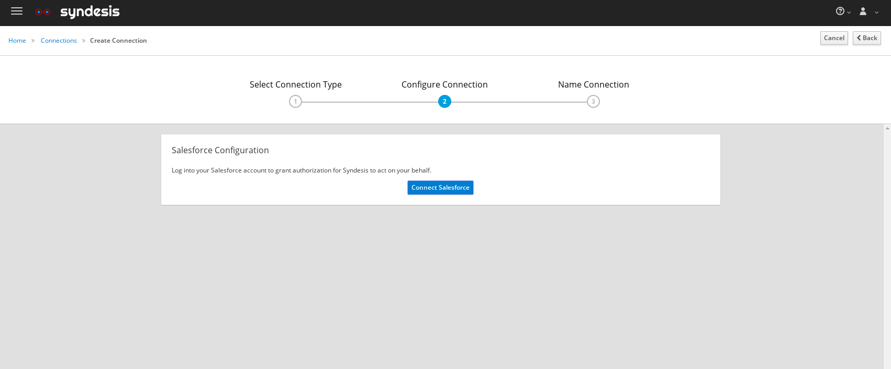
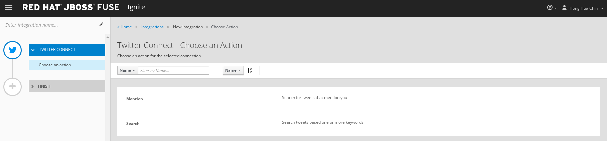
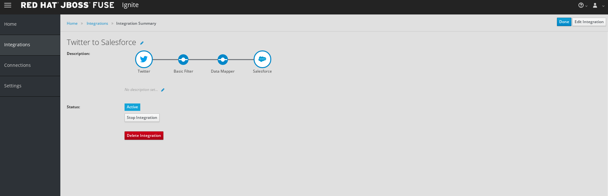

:scrollbar:
:data-uri:
:toc2:
:linkattrs:
:coursevm:

== Twitter to Salesforce Integration Lab

NOTE: This lab takes about an hour to complete. It covers topics you need to know to correctly complete the final assessment.

.Goal
* Create an Integration from Twitter to Salesforce using Fuse Ignite

.Requirements
* A Twitter account
* A Salesforce developer account
** Salesforce API access is used with this account
** You can register for a free developer account link:https://developer.salesforce.com/signup[here].

.Overview
Coolstore, an online wholesaler of quality products, plans to capture leads in Salesforce every time a tweet on Twitter mentions their latest product.

In this lab, you integrate two popular cloud services--Twitter and Salesforce--in order to meet the Coolstore business use case for a marketing scenario. This use case involves the capturing of marketing leads in Salesforce whenever a potential client tweets a message on Twitter.

:numbered:

== Log In to Fuse Ignite Console
. Log in to the OpenShift Container Platform web console if you are not already logged in.
+
TIP: The link is in your confirmation email, if you need it.

. Click your *fuse-ignite-$GUID* project.
. Click the URL of your Fuse Ignite console.
. Log in using your OPENTLC credentials.
* The Fuse Ignite console appears.

. Familiarize yourself with the Fuse Ignite dashboard.
. Note the left-hand panel, and the various options on it:
+
image::images/fuseignite_dashboard.png[]
+
. Next, locate the key system metrics on the Fuse Ignite dashboard. These include Integrations, Connections, Total Messages, and Uptime.
+
****
*Question:* What does it mean to have 247 days 8 hours 15 minutes of Uptime, 350 Total Messages, 2 Integration, and 4 Connections displayed on the Fuse Ignite dashboard?
****

== Register Fuse Ignite as Client for Twitter Service

NOTE: This section assumes that you have a Twitter account set up. If you have not done so, complete the _Register Cloud Services Accounts_ section of Lab 1 first.

In this section, you register Fuse Ignite as a client application for the online Twitter service. With this accomplished, you can create integrations connecting with Twitter.

. From the Fuse Ignite console, copy the Fuse Ignite URL from the URL field in the web browser.
. In the left-hand panel of the Fuse Ignite console, click *Settings*.
. On the *OAuth Application Management* screen, locate the *Twitter* icon and click *Register* to the right of it.
* Note that both the *Client ID* and *Client Secret* fields are displayed.
. Launch another web browser window and sign in to your Twitter account at `http://apps.twitter.com`.
. Click *Create New App*:
+
image::images/twitter-apps-app-mgt.png[]
. Complete the form as follows:
.. In the *Name* field, type a unique name for your new application.
+
[NOTE]
====
The application name must be unique among all of the applications registered to your Twitter account.
====
+
.. In the *Description* field, type helpful information.
** Twitter requires some input in this field.
.. In both the *Website* and *Callback URL* fields, paste your Fuse Ignite URL (which you copied onto the clipboard earlier).
.. Remove the URI suffix `dashboard` from the end of the value in the *Callback URL* field and append the string `api/v1/credentials/callback` in its place.
** Expect the resulting URL to look similar to this: `https://fuse.fuse-7475.apps.dev37.openshift.opentlc.com/api/v1/credentials/callback`.
.. Check the *Yes* box to agree to the terms and conditions of the Twitter developer agreement.
+

. Click *Create your Twitter application*.
* A screen showing the details of your Fuse Ignite Twitter application is displayed:
+

. Select the *Keys and Access Tokens* tab:
+

. Copy the *Consumer Key* value and paste it into the *Twitter Client ID* field in your Fuse Ignite console.
. Switch back to your Twitter account, copy the *Consumer Secret* value, and paste it into the *Twitter Client Secret* field in the Fuse Ignite console.
. Click *Save*.
. When the *Registration successful!* message appears, click *OK*:
+
image::images/oauth-app-management-twitter-credentials.png[]

Your Fuse Ignite instance is now registered as a Twitter client application.

== Create Twitter Connection in Fuse Ignite

Before an integration can be created, a connection has to be created for each cloud service endpoint that will be integrated. These cloud services have to support the link:https://oauth.net/2[OAuth protocol].

In this section, you create a Twitter connection, and later in the lab, a Salesforce connection.

. In the left-hand panel of the Fuse Ignite console, click *Connections* to display the available connections.
. Click *Create Connection* to display the connector types:
+

. Select the *Twitter* connector type.
. On the *Configure Connection* screen, click *Connect Twitter*:
+
image::images/create_connection_twitter.png[]
* This opens Twitter.
. On the Twitter authorization screen, click *Authorize app*:
+

* This returns you to the Fuse Ignite console.
. On the *Name Connection* screen, type a name for your Twitter connection in the *Connection Name* field.
+
IMPORTANT: Every connection must have a unique name.
. Type a description of the connection in the *Description* field.
. Click *Create*:
+
image::images/create_connection_twitter_name.png[]
* The Twitter connection that you just created appears.

The Twitter connection in your Fuse Ignite project is now set up and can be used in multiple integrations.

== Register Fuse Ignite as Client for Salesforce

NOTE: This section assumes that you have a Salesforce account set up. If you do not, complete the _Register Cloud Services Accounts_ section of Lab 1 first.

In this section, you register Fuse Ignite with Salesforce as a prerequisite to creating a Salesforce connection.

. In the left-hand panel of the Fuse Ignite console, click *Home*.
. Copy the Fuse Ignite URL from the URL field in the web browser.
. In the left-hand panel, click *Settings*.
. On the *OAuth Application Management* screen, locate the Salesforce icon and click *Register* to the right of it:
+
image::images/oauth_client_mgt.png[]
* Note that both the *Client ID* and *Client Secret* fields are now displayed.
. Launch a new web browser window and log in to your Salesforce account.
* You set up Fuse Ignite as a connected app using this account.
+
[NOTE]
====
It is recommended that you use the Salesforce Classic user interface here. To switch, click your profile icon and select *Switch to Salesforce Classic*.
====
+
image::images/salesforce_build_create_apps.png[]
+
. On the Salesforce landing page, click *Setup*.
. Select *Build -> Create -> Apps*.
. Scroll down to *Connected Apps* and click *New*.
* The *New Connected App* screen appears:
+
image::images/salesforce_new_connected_app.png[]
. Complete the required fields:
* *Connected App Name*
* *API Name*
* *Contact Email*
. In the *API (Enable OAuth Settings)* section, complete the following:
.. Check the *Enable OAuth Settings* box.
.. In the *Callback URL* field, paste your Fuse Ignite URL (which you copied onto the clipboard earlier).
.. Replace the suffix `dashboard` in the URL with `api/v1/credentials/callback`.
** Expect the resulting URL to resemble this: `https://fuse.fuse-7475.apps.dev37.openshift.opentlc.com/api/v1/credentials/callback`.
.. In the *Selected OAuth Scopes* field, add the following options from the *Available* list to the *Selected* list:
** *Access and manage your data (api)*
** *Allow access to your unique identifier (openid)*
** *Perform requests on your behalf at any time (refresh_token, offline_access)*
.. Check the *Configure ID Token* and *Include Standard Claims* boxes.
+

. Click *Save* and note the message regarding the two- to 10-minute wait time for the application to load.
. Click *Continue* and wait for the Salesforce account screen to appear.
* Note that both the *Consumer Key* and the *Consumer Secret* associated with Fuse Ignite are displayed:
+

. Copy the *Consumer Key* value and paste it into the Salesforce *Client ID* field in your Fuse Ignite console.
. Switch back to your Salesforce account, copy the *Consumer Secret* value, and paste it into the Salesforce *Client Secret* field in the Fuse Ignite console.
. Click *Save*.
. When the *Registration successful!* message appears, click *Ok*:
+
image::images/oauth_app_mgt_salesforce.png[]

Fuse Ignite is now registered as a Salesforce client application.

== Create a Salesforce Connection in Fuse Ignite

. On the Fuse Ignite console, click the *Connections* tab.
. Click *Create Connection* to display Fuse Ignite connectors.
. Select the Salesforce connection type.
. On the *Configure Connection* screen, click *Connect Salesforce*:
+

* A Salesforce authorization screen appears, prompting you to authorize or reject this connection:
+

+
[NOTE]
====
If this error appears:  `error=redirect_uri_mismatch&error_description=redirect_uri%20must%20match%20configuration`, it indicates that an incorrect Fuse Ignite *Callback URL* was assigned in your Salesforce account. Resolve it by correcting the *Callback URL* as described in the _Register Fuse Ignite as Client for Salesforce_ section.
====
+
. Click *Allow*.
* The Fuse Ignite console reappears.
. Type a name in the *Connection Name* field.
* This field helps distinguish each connection.
. Type descriptive information in the *Description* field.
* This helps to explain the purpose for this connection.
. Click *Create* to complete the connection creation process.
* The Salesforce connection that you just created appears.

You now have a Salesforce connection in your Fuse Ignite project that can be used in multiple integrations.

== Create Integration between Twitter and Salesforce

In this section, you create an integration that monitors Twitter feeds for any mention of your Twitter account name. An identified mention triggers the first step in the integration, which creates new Salesforce records with the Twitter feed information.

=== Add Connections to Integration

. In the left-hand panel of the Fuse Ignite console, click *Integrations*.
* The available connections, including the ones for Salesforce and Twitter that you just created, are displayed.
. Click *Create Integration*.
* The *Choose a Start Connection* screen appears:
+
image::images/choose_start_connection.png[]
+
[NOTE]
====
The credentials defined for each connection are used when the integration is active. Both connections--Twitter and Salesforce--in this integration invoke the credentials that have been set in order to access the respective Twitter and Salesforce applications.
====

. Select the Twitter connection.
. Select *Mention* on the *Choose an Action* screen:
+

* The *Choose a Finish Connection* screen appears:
+

. Select the Salesforce connection.
. On the *Choose an Action* screen, select *New record*:
+
image::images/choose_an_action_salesforce_new_record.png[]
+
NOTE: Data operations (CRUDL) are typical actions. For the Salesforce connection, the action you have to define involves creating new Salesforce records based on suitable leads captured from Twitter feeds.

. Select *Contact* as the Salesforce record to create.
. Click *Done*.
* The *Add to Integration* screen is displayed:
+
image::images/add_to_integration.png[]

. (Optional) Provide configuration information to both the Twitter and Salesforce connections.
+
****
*Question:* What are the suitable configuration changes that come to mind?
****

=== Add Steps to Integration

Part of every integration are steps. A step operates on data obtained, from either a connection or another step, and makes it available to either the next connection or step.

Different types of steps are available, including a _basic filter_ step and a _data mapping_ step.
The basic filter step checks tweets that mention specific keywords. The integration continues only if that content is present. The data mapping step correlates data captured from Twitter feeds with contact fields in Salesforce.

==== Add Basic Filter Step

. On the *Add to Integration* screen, click *Add a Step*.
. Select *Basic Filter*:
+

. Start typing `text` in the first field, then select *text* when it appears in the list:
+
image::images/configure_rule_filter_text.png[]
+
NOTE: By selecting *text*, the body of the tweet serves as the content to be filtered.

. In the adjacent list, select *contains*.
* This is the filter condition that has to be met in the integration.
. Type `#FuseIgniteRocks` in the *Keywords* field.
* A valid tweet has to contain the text in this field.
. Click *Done* to create the basic filter step:
+
image::images/configure_basic_filter_step.png[]

==== Add Data Mapper Step

In this section, you create a data mapper step that correlates Twitter mention fields to Salesforce contact fields.

. In the left-hand panel of Fuse Ignite, hover over the image:images/add_filter_icon.png[] icon located between the basic filter step and the finish connection and select *Add a step*:
+
image::images/add_filter_step.png[]
. On the *Choose a Step* screen, select *Data Mapper*:
+
image::images/add_a_step_data_mapper.png[]
+
. Create a mapping between the Twitter *name* field in the *Sources* panel and the Salesforce *FirstName* and *LastName* fields in the *Target* panel.
* You need to map to both, as Salesforce uses two fields for the name.
+
[TIP]
====
If you make a mistake while creating a data mapping, it is easy to delete it. Simply click the garbage bin icon at the top of the *Mapping Details* panel:

image::images/mapping_details_garbagebin.png[]
====

.. In the *Sources* panel, scroll down to the *user* folder and expand it.
.. Scroll down and click the *name* field.
.. In the *Action* section of the *Mapping Details* panel on the right, select *Separate* from the *Action* list.
.. In the *Targets* section, start typing `FirstName` in the field, then select *FirstName* from the list that appears.
+
image::images/configure_mapper_username_firstname.png[]
+
.. Click *Add Target*.
.. In the second *Targets* section, start typing `LastName`, then select *LastName* from the list.
** Observe that the data mapper step now displays a line from the Twitter *name* field to both the Salesforce *FirstName* field and *LastName* field (The blue lines highlight the current focus.):
+

==== Create Second Mapping

In this section, you create a mapping from the Twitter *screenName* field to the Salesforce *Title* field.

. In the *Sources* panel, scroll down the list of fields and click *screenName*.
. In the *Target* panel, click  and type `title` in the search field.
. Select the *Title* field when it appears.
* The data mapper step now displays a line from the Twitter *screenName* field to the Salesforce *Title* field:
+
image::images/configure_mapper_userscreenname_title.png[]

==== Create Third Mapping

In this section, you create a mapping from the Twitter *text* field to the Salesforce *Description* field.

. In the *Sources* panel, click  and type `text` in the search field.

. Expand the *user* folder and select the *text* field:
+
image::images/source_column_text_field.png[]

. In the *Target* panel, click  and type `Description` in the search field, then click the *Description* field when it appears:
+
image::images/configure_mapper_statustext_description.png[]
+
. Click  above the *Mapping Details* panel.
* The list of data mappings you created appears:
+

. Click *Done* at the top right-hand corner of the console.

=== Complete Integration Setup

Now that you have completed the integration, deploy and test it.

==== Deploy Integration

. Type `Twitter to Salesforce` in the *Enter integration name* field at the top of the left-hand panel in the Fuse Ignite console.
. Click *Publish*.
* Deployment of the integration begins immediately and lasts several minutes.
. Click *Integrations*.
. Select the *Twitter to Salesforce* integration and verify that it is active:
+

==== Validate Integration

In this section, you test that the integration creates a Salesforce record only when you send a tweet that contains the specific keyword criteria defined in the basic filter step.

. Start with a negative test case by sending a tweet that meets the following criteria:
* Contains your Twitter handle with the `@` prefix
* Does not contain the keywords specified in the basic filter step
+
.Sample Tweet
----
@Hong loves #FuseIgnite.
----
. After a minute, confirm that your Twitter handle (without the `@` prefix) does not exist in any Salesforce contact record.
. Next, try a positive test case by sending a tweet that meets the following criteria:
* Contains your Twitter handle with a `@` prefix
* Contains the keywords specified in the basic filter step
+
.Sample Tweet
----
@Hong believes #FuseIgniteRocks.
----
+
. After a few minutes, confirm that a contact record containing your Twitter handle (without the `@` prefix) was created in Salesforce:
+
image::images/salesforce_lead_summary.png[]
+
****
*Questions:*

* What are the fields in the Salesforce contact record that capture the information from your tweet?
* Can you recognize the various parts of the text from the tweet?
****
+
TIP: Verify that the text from your tweet is captured in the *Description* field and your Twitter handle is captured in the *Title* field.

. (Optional) Recreate the integration, this time using the *Search criteria* functionality of *Twitter Connect* and the phrase `#FuseIgniteRocks` as the criteria for tweets to be captured as leads.
+
****
*Question:* What are the other changes that you have to make in order to complete this integration?
****

== Clean Up Integration

. In the left-hand panel of the Fuse Ignite console, click *Integrations*.
. Select the *Twitter to Salesforce* integration:
+
image::images/integrations_twitter_salesforce.png[]

. Click *Stop Integration*:
+

. Click *OK* at the bottom of the summary panel.
* This deactivates the integration.

. Select the inactive *Twitter to Salesforce* integration.
. Click *Delete Integration*, then click *OK* at the bottom of the summary panel.
+
[TIP]
Practice good housekeeping: Delete integrations that are no longer needed. This releases the resources used by the integrations back to the Fuse Ignite system resource pool.

You have completed, tested, and cleaned up your integration in Fuse Ignite.

ifdef::showscript[]

endif::showscript[]
