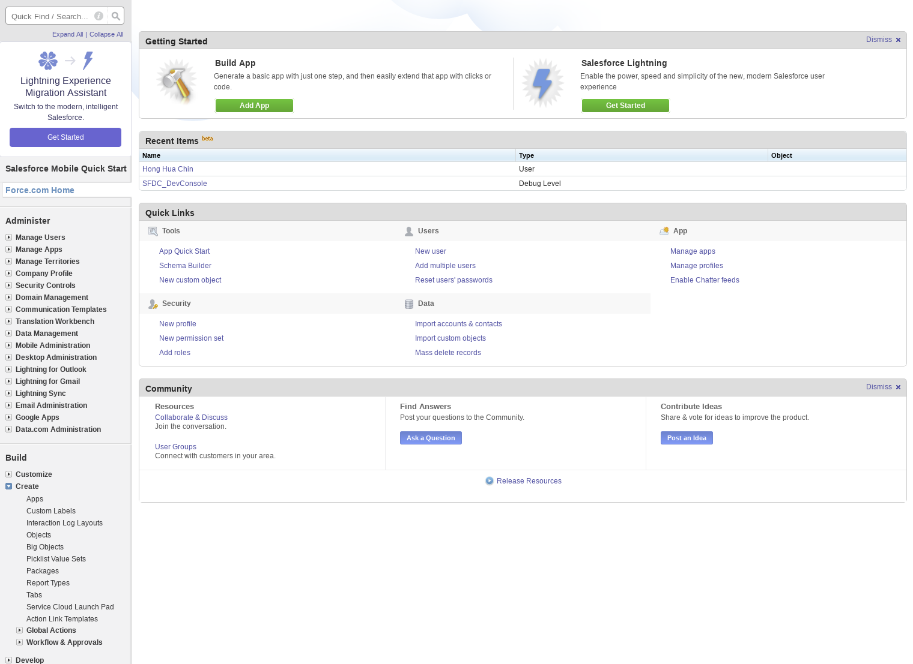
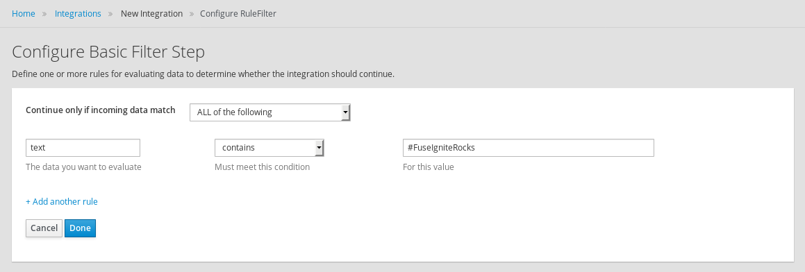
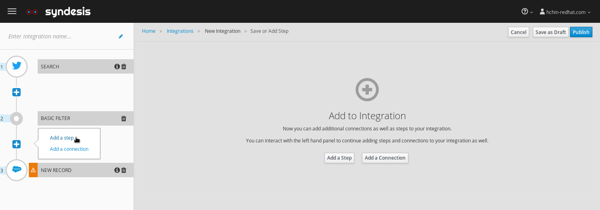
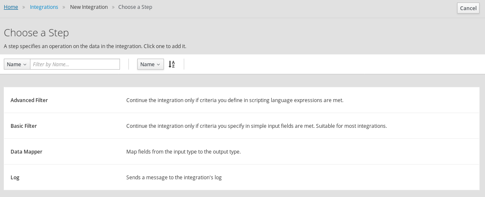
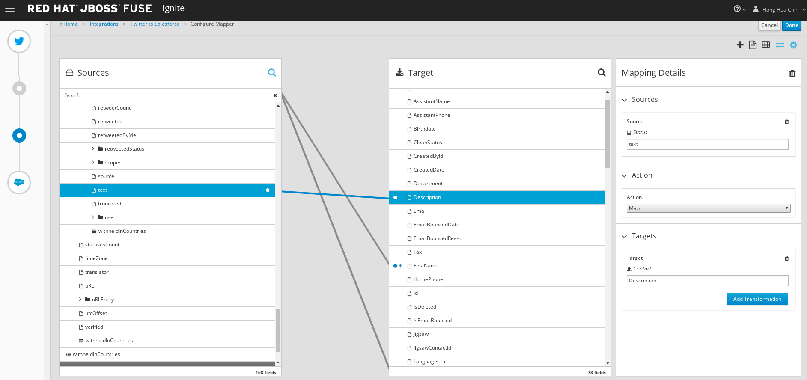
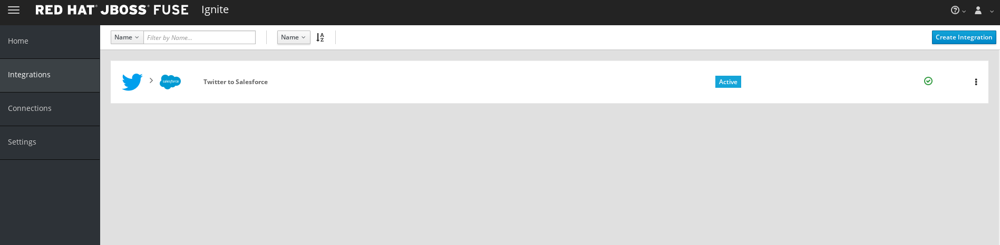

:scrollbar:
:data-uri:
:toc2:
:linkattrs:
:coursevm:

= Integration Lab - Twitter to Salesforce scenario

This course includes at least one lab per module. Each lab is hands-on and typically takes about an hour to complete. Executing the course labs prepares you to correctly answer many of the final assessment questions.

.Goals
* Create an Integration using Red Hat Fuse Ignite from Twitter to Salesforce

.Requirements
* Registered for a Twitter account
* Registered for a Salesforce Developer account
** Salesforce API access will be used with this account
** A free Developer account can be registered link:https://developer.salesforce.com/signup[here].

Coolstore, an online store of fine products, plan to capture leads in Salesforce, every time a tweet on Twitter mentions their latest product.

image::images/arch-twitter-salesforce.png[]

In this lab, you will integrate two popular cloud services: Twitter and Salesforce, in order to meet the Coolstore business use case for a marketing scenario. This use case involves capturing of marketing leads in Salesforce, whenever a potential client "tweets" a message on Twitter.

:numbered:

== Logon to Red Hat Fuse Ignite

. Check your email inbox for the same email you received earlier, containing a link to Red Hat Fuse Ignite.
+
CAUTION: Red Hat Fuse Ignite is supported for the following web browsers: Google Chrome, Mozilla Firefox, Microsoft Edge
+
. Click this link to display the Red Hat Fuse Ignite login page.

. Log in using your OPENTLC account.

. A webpage launches, prompting you to authorize Red Hat Fuse Ignite access to your OPENTLC account credentials:
+
image::images/fuseignite_oauth.png[]
+
. Select both available checkboxes and click the *Allow selected permissions* button.
+
NOTE: This authorization page will appear only once. The next time you log in, the console for Fuse Ignite appears instead of this authorization page.

. Familiarize yourself with the Fuse Ignite Dashboard.
. Note the left-hand pane, and the various tabs on it.
+

+
. Next, locate the key system metrics on the Fuse Ignite Dashboard. These are counts of *Integrations*, *Connections*, *Total Messages* and *Uptime*.
+
[QUESTION]
What does it mean to have 247 days 8 hours 15 minutes of Uptime, 350 Total Messages, 2 Integration and 4 Connections displayed on the Fuse Ignite Dashboard?

== Register Fuse Ignite as a client for Twitter service

This section assumes that you have a Twitter account setup. If you have not done so, complete the _Cloud services account registration_ section of Lab 1 first.

Next, register Fuse Ignite as a client application for the online Twitter service. With this accomplished, any number of integrations connecting Twitter can be created.

. At the Fuse Ignite console, copy the Fuse Ignite URL from URL field in the web browser.
. On the left-hand pane of the Fuse Ignite console, click *Settings*.
. On the *OAuth Application Management* webpage, locate the _Twitter_ icon.
. On the right of the _Twitter_ icon, click the *Register* button.
. Notice both the *Client ID* and *Client Secret* fields are displayed.
. Launch another web browser window, and type `http://apps.twitter.com` in the URL field.
. After typing, hit the *Enter* button on your keyboard.
. When the login page is fully loaded, log into your *Twitter* account.
+

+
. Click *Create New App*.
. In the _Name_ field, provide the name of this new app.
+
NOTE: The app name must be unique among all other apps registered using your *Twitter* account.
+
. In the _Description_ field, enter helpful information. Twitter requires some input in this field.
. In both the _Website_ and _Callback URL_ fields, paste your Fuse Ignite URL (which you copied earlier into the clipboard) .
. Remove the URI suffix `dashboard` from the end of the value in the _Callback URL_ field.
. Append the string `api/v1/credentials/callback` to the value in the _Callback URL_ field.
+
NOTE: For example: https://fuse-fuse7475.apps.dev.openshift.opentlc.com/api/v1/credentials/callback
+
image::images/twitter-create-an-app.png[]
+
. Click *Yes*, and thereby agreeing to the terms and conditions of the *Twitter* developer agreement.
. Click *Create your Twitter application*. A webpage showing the details of your Twitter app (Fuse Ignite) is loaded.
+
image::images/twitter-app-details.png[]
+
. Select the *Keys and Access Tokens* tab.
. The `Consumer Key` appears on the web page. Copy it.
+
image::images/twitter-keys-access-tokens.png[]
+
. In the other web browser window, select the *Settings* tab on the Fuse Ignite console.
. Paste the *Twitter* `Consumer Key` into the *Twitter Client ID* field.
. In the web browser window displaying your Twitter account, locate the Twitter *Keys and Access Tokens* tab.
. Copy the `Consumer Secret`.
. Paste the string into the *Twitter Client Secret* field in the Fuse Ignite console.
. On the Fuse Ignite console, click *Save*. After the page loads and a *Registration successful!* message appears, click *OK*.
+

Your Red Hat Fuse Ignite instance is now registered as a Twitter client application.

== Create a Twitter Connection on Fuse Ignite

Before an integration can be created, a connection has to be created for each cloud service endpoint that will be integrated. These cloud services have to support the link:https://oauth.net/2[OAuth protocol].

A Twitter connection will be created, followed by the creation of a Salesforce connection.

. On the left-hand pane of the Fuse Ignite console, click Connections to display any available connections.
. Click *Create Connection* to display connectors in Fuse Ignite.
+
image::images/create_connection_wizard.png[]
+
. Select the *Twitter* connector type. A page loads, displaying the current state of the connection creation process, as *Configure Connection*.
. Click *Connect Twitter*.
+

+
. On the Twitter authorization webpage, click *Authorize app* to return to Fuse Ignite.
+
image::images/twitter-authorize-app.png[]
+
. Provide a name for the *Connection Name* field. Every connection is uniquely distinguished by its name.
. Provide a description of the connection in the *Description* field.
. Click *Create*. Notice the Twitter connection is now available.
+

The Twitter connection in your Fuse Ignite project has been setup and can be reused in multiple integrations.

== Register Fuse Ignite as a client for Salesforce

This section assumes that you have a Salesforce account setup. If you have not done so, complete the _Cloud services account registration_ section of Lab 1 first.

You will register Fuse Ignite with Salesforce once, as a pre-requisite to creating a Salesforce connection.

. On the left-hand pane of the Fuse Ignite console, click *Home*.
. At the Fuse Ignite console, copy the Fuse Ignite URL from URL field in the web browser.
. On the left-hand pane, click *Settings*.
. Locate the Salesforce icon. Right of the icon, click *Register*, which is located on the *OAuth Application Management* page.
. The *Client ID* and *Client Secret* fields are now displayed. You will populate these fields in a while.
. Launch a new web browser window and log in to your Salesforce account. You will setup Fuse Ignite as a connected app using this account.
+
NOTE: You are recommended to proceed using the Salesforce Classic user interface. To switch, click your profile icon and select *Switch to Salesforce Classic*.
+

+
. On the Salesforce landing page, click *Setup*.
. Select *Build > Create > Apps*.
. Scroll down to *Connected Apps* and click *New*. The *New Connected App* page loads.
+

+
. Enter the required information in the following fields:
.. *Connected App Name*
.. *API Name*
.. *Contact Email*
. Select the *Enable OAuth Settings* checkbox.
. Paste the Fuse Ignite URL, which was earlier copied, in the *Callback URL* field. Replace the suffix `dashboard` in the URL with  `api/v1/credentials/callback`. For example, the *Callback URL* value will resemble `https://fuse-fuse7475.apps.dev.openshift.opentlc.com/api/v1/credentials/callback`
. In the *Selected OAuth Scopes* section, from the table of options, ensure the following options are added:
.. *Access and manage your data (api)*
.. *Allow access to your unique identifier (openid)*
.. *Perform requests on your behalf at any time (refresh_token, offline_access)*
. Check the boxes next to *Include ID Token* and *Include Standard Claims*
+
image::images/salesforce_enable_oauth_settings.png[]
+
. Click *Save* to effect the changes.
. Read the message regarding the `2-10 minutes` wait time for the application to load.
. Click *Continue*. The Salesforce account page will load after a while.
. Notice both the consumer key and the consumer secret associated to Fuse Ignite have been generated and are displayed.
+
image::images/salesforce_connected_app_fuse_ignite.png[]
+
. Copy both the consumer key and the consumer secret, to either a clipboard or to your favorite code editor.
. In the browser for the Fuse Ignite console, click on the *Settings* link on the left-hand pane. The *OAuth Client Management* page appears.
. Click the *Register* button in the row containing the Salesforce icon.
+

+
. In the *Client ID* field, enter the Salesforce-generated consumer key for Fuse Ignite.
. In the *Client Secret* field, enter the Salesforce-generated consumer secret for Fuse Ignite.
. Click *Save*.
+

+
. Note that the *Registration successful! You can validate these values when creating a connection Salesforce* message appears.
. Click *Ok*.

Red Hat Fuse Ignite is now registered as a Salesforce client application.

== Create a Salesforce Connection on Fuse Ignite

. On the Fuse Ignite console, click the *Connections* tab.
. Click *Create Connection* to display Fuse Ignite connectors.
. Select the Salesforce connection type.
. On the *Salesforce Configuration* page,
+
image::images/create_connection_salesforce.png[]
+
. Click *Validate*, followed by *Ok*.
. Click *Connect Salesforce*. A Salesforce authorization page appears, prompting you to authorize or reject this connection.
+
image::images/salesforce_allow_access.png[]
+
[NOTE]
In the event this error appears:  `error=redirect_uri_mismatch&error_description=redirect_uri%20must%20match%20configuration` note that it indicates that an incorrect Fuse Ignite *Callback URL* has been assigned in your Salesforce account. Resolve it by correcting the *Callback URL* as described in the section *Register Fuse Ignite as a client for Salesforce*.
+
. Click *Allow*. The Fuse Ignite console reappears.
. Provide a name in the *Connection Name* field. This field helps distinguish every connection.
. Provide descriptive information in the *Description* field. This helps to explain what the purpose for this connection.
. Click *Create* to complete the connection creation process. Notice the Salesforce connection that you just created appears.

You have created a Salesforce connection, which can be used in multiple integrations.

== Create an Integration between Twitter and Salesforce

Next, create an integration that monitors Twitter feeds for any mention of your Twitter account name. An identified mention triggers the first step in the integration, which will create new Salesforce records with the Twitter feed information.

image::images/fuseignite_connections.png[]

=== Add Connections to the Integration

. On the left-hand pane of the Fuse Ignite console, select the *Integrations* tab. The available connections, including the ones for Salesforce and Twitter which you just created, are displayed.
+
image::images/choose_start_connection.png[]
+
. Click *Create Integration*. The *Choose a Start Connection* page appears.
+
NOTE: The credentials defined for every connection are used when the integration is active. Both connections (for Twitter and Salesforce) in this Integration invoke credentials that have been set, in order to access the respective Twitter and Salesforce applications.
+
image::images/choose_an_action_twitter_mention.png[]
+
. Select the Twitter connection.
. Select *Mention* on the *Choose an Action* page. The *Choose a Finish Connection* page apppears.
+
image::images/choose_finish_connection.png[]
+
. Click the Salesforce connection.
. On the *Choose an Action* page, click *New record*.
+
NOTE: Data operations (CRUDL) are typical actions. For the Salesforce connection, the action you have to define involves creating new Salesforce records based on suitable leads captured from Twitter feeds.
+

+
. Choose *Contact* as the Salesforce record to create.
. Complete the connection creation process, by clicking *Done*.
. The *Add to Integration* page is displayed.
+

*Optional activity:* provide configuration information to both the Twitter and Salesforce connections. What will be the suitable configuration changes that comes to mind?

=== Add Steps to the Integration

Part of every integration are steps. A step operates on data obtained, from either a connection or a step, and makes it available to either the next connection or step.

Different types of steps are available, including a basic filter step and a data mapping step.
A _basic filter_ step checks tweets that mention specific keywords. The integration continues only if that content is present.
A data mapping step that correlates data captured from Twitter feeds with contact fields in Salesforce.

==== Add a Basic Filter step

. On the *Add to Integration* page, click the *Add a Step* button.
. Add a _basic filter_ step, by selecting *Basic Filter*.
+
image::images/add_a_step_basic_filter.png[]
+
. Enter *text* in the first field. Click on *text* which appears within the drop-down list for this field.
+
NOTE: By selecting *text*, the body of the tweet serves as the content to be filtered.
+

+
. In the adjacent drop-down list, select *contains*. This will be the filter condition that has to be met in the integration.
. Type *#FuseIgniteRocks* into the empty *Keywords..* field. A valid tweet will have to contain the text in this field.
. Click *Done*. The _basic filter_ step has been created.
+

==== Add a Data Mapper step

A _data mapper_ step that correlates Twitter mention fields to Salesforce contact fields is created next.

. In the left-hand pane of Fuse Ignite, move your arrow icon over the plus sign *'+'* located between the _basic filter step_ and the _finish connection_ (ie: Salesforce connection).
+

+
. Click *Add a Step* on the pop-up display which appears.
+

+
. Click *Data Mapper*. Observe the data fields displayed in two columns, *Sources* and *Target* on the Fuse Ignite console.
. Create a mapping - starting from the *name* field in the *Sources* column and ending with both the *FirstName* and *LastName* fields in the *Target* column.
+
[NOTE]
The Twitter *name* field has to be mapped to two distinct fields in Salesforce: *FirstName* and *LastName* respectively.
+
[TIP]
If you made a mistake in creating a data mapping, it is easy to delete it. Simply click the garbage bin icon at the top of the *Mapping Details* pane, as shown below:
+

+
. In the *Sources* column, scroll down to the *user* field and expand it.
. Click the *name* field, located further down the list of fields.
. Click the downward-facing caret *V*.
. In the *Mapping Details* tab (located to the right of the console), under *Action*, select *Separate*.
. Within the *Targets* section, replace the value of the field `[None]` with the text *FirstName*.
. Select *FirstName* from the drop-down list that appears below the field.
+

+
. Click *Add Target*, on the lower right of the screen.
. Within the second *Targets* section, replace the value of the field `[None]` with the text *LastName*.
. When *LastName* appears within a drop-down list below this field, select it.
+
NOTE: Notice that the _data mapper_ step displays a line from the Twitter *name* field to the Salesforce *FirstName* field, as well as a line from the Twitter *name* field to the Salesforce *LastName* field. Line of current focus is indicated in blue.
+
image::images/configure_mapper_username_firstname_lastname.png[]

==== Create a mapping from the Twitter *screenName* field to the Salesforce *Title* field

. In the *Sources* column, scroll down the list of fields and click on the *screenName* field.
. In the *Target* column, click the magnifying glass. Within the search field, enter the text *Title*.
. Select the *Title* field which appears in the *Target* column.
+
NOTE: Like before, the _data mapper_ step displays a line from the Twitter *screenName* field to the Salesforce *Title* field.

==== Create a mapping from the Twitter *text* field to the Salesforce *Description* field

. In the *Sources* column, click the magnifying glass. In the search field located on the same column, enter the string *text*.
+

+
. With the *user* tab structure expanded, select the field *text* in the *Sources* column.
+

+
. Enter *Description* in the search field of the *Target* column. A field titled *Description* appears below.
. Click the *Description* field to complete the data mapping creation.
+

+
. Click the grid icon located at the upper right of the Fuse Ignite console. The list of data mappings you have created appear.
. Click *Done* in the upper right of the console.
+
image::images/configure_mapper_grid.png[]

=== Complete the Integration setup

Now that you have completed the Integration, deploy and test it.

. Enter the name of the Integration _Twitter to Salesforce_ within the *Integration Name* field, on the left-hand pane.
. Click *Publish*. Deployment of the integration begins immediately and lasts several minutes.
. Select *Integrations* tab.
. Enter the name of the integration _Twitter to Salesforce_ in the left-hand pane, and validate that the integration is active.
+
image::images/twitter_to_salesforce_integration.png[]
+
. In addition, validate that the integration creates a Salesforce record only when you send a tweet that contains the specific keyword criteria defined in the _basic filter_ step.
. Proceed with a negative test case, by sending a Twitter tweet which:
.. Contains your Twitter handle with a `@` prefix
.. Does not contain the keywords specified in the _basic filter_ step. For instance:
+
----
@Hong loves #FuseIgnite.
----
+
. After a minute, validate that your Twitter handle (less the `@` prefix) does not exist in any Salesforce contact record.
. Proceed with a positive test case, by sending a Twitter tweet which:
.. Contains your Twitter handle with a `@` prefix
.. Contains the keywords specified in the _basic filter_ step. For instance:
+
----
@Hong believes #FuseIgniteRocks.
----
+
. After a few minutes, validate that a contact record containing your Twitter handle (without the `@` prefix) has been created in Salesforce.
+

+
. *Question:* What are the fields in the Salesforce contact record that capture the information from your earlier tweet? Can you recognise the various parts of the text from the tweet?
+
[NOTE]
Verify that the text from your tweet is captured in the *Description* field, while your Twitter handle is captured in the *Title* field.
+
. [Optional] Recreate your integration, this time use the *Search criteria* functionality of *Twitter Connect* and the criteria for tweets to be captured as leads should be the phrase `#FuseIgniteRocks`.
+
*Question:* What are the rest of the changes that you have to make in order to complete this integration?

== Integration clean-up

. In the left-hand pane of the Fuse Ignite console, click *Integrations*.
. Select the _Twitter to Salesforce_  integration.
+

+
. Click *Stop Integration*, followed by clicking *OK* in the the integration summary. This will deactivate the integration.
+
image::images/integration_summary_stop.png[]
+
. Select the inactive integration _Twitter to Salesforce_.
. Click *Delete Integration*, followed by clicking *OK*, at the bottom of the summary pane.
+
[TIP]
Practice good housekeeping: delete integrations that are no longer needed. This will release resources used by the deleted integrations, back to the Fuse Ignite system resource pool.

You have completed, tests and cleaned up your first integration in Fuse Ignite.

ifdef::showscript[]

endif::showscript[]
