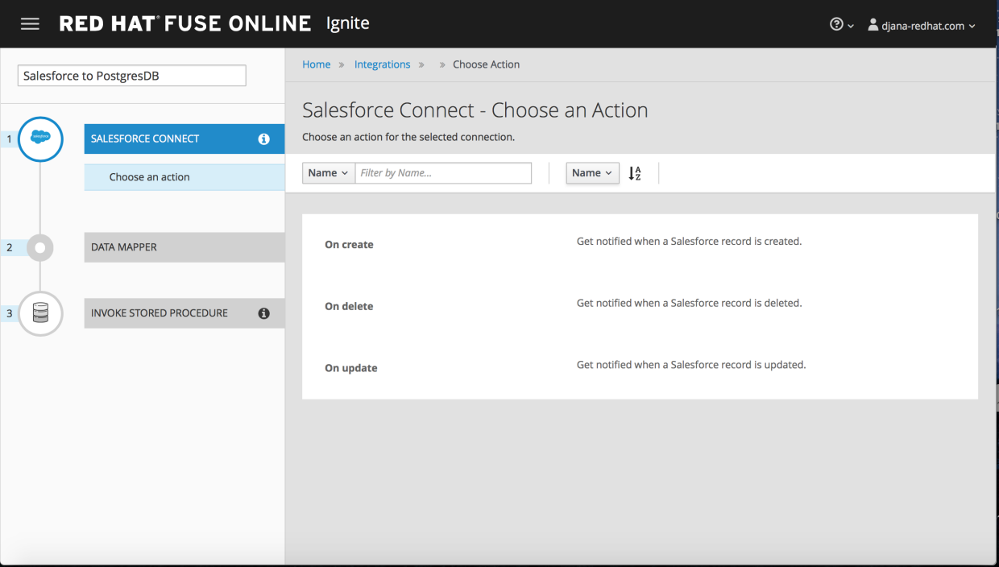

:scrollbar:
:data-uri:
:toc2:
:linkattrs:
:coursevm:

== Salesforce to PostgreSQL Integration Lab

NOTE: This lab takes about an hour to complete. It covers topics you need to know to correctly complete the final assessment.

.Goal
* Create an Integration from Salesforce to a PostgreSQL database using Fuse Ignite

.Requirements
* A Salesforce developer account

.Overview

Coolstore, an online wholesaler of quality products, plans to replicate the data that they captured in Salesforce as part of a customer lead capture project. The replica of the data will reside on a PostgreSQL database. This enables business analytics jobs to be executed on the replica of the lead data.

image::images/arch-salesforce-db.png[]

In this lab, you integrate two popular technology products--Salesforce and PostgreSQL--in order to meet the above-mentioned business use case for Coolstore's data replication project.

:numbered:

== Log In to Fuse Ignite Console
. Log in to the OpenShift Container Platform web console if you are not already logged in.
+
TIP: The link is in your confirmation email, if you need it.

. Click your *fuse-ignite-$GUID* project.
. Click the URL of your Fuse Ignite console.
. Log in using your OPENTLC credentials.
* The Fuse Ignite console appears.

== Register Fuse Ignite as Client for Salesforce

In the previous lab, you registered Fuse Ignite with Salesforce.

If you have not completed the previous lab, complete the _Register Fuse Ignite as Client for Salesforce_ section before proceeding to the next section of this lab.

== Create Salesforce Connection in Fuse Ignite

In the previous lab, you created a Salesforce connection. You can reuse this connection in the next integration.

If you have not completed the previous lab, complete the _Create Salesforce Connection in Fuse Ignite_ section before proceeding to the next section of this lab.

== Create Integration Between Salesforce and PostgreSQL

. In the left-hand panel of the Fuse Ignite console, click *Integrations*.
. Click *Create Integration*.
. On the *Choose a Start Connection* screen, select the Salesforce connection.
. On the *Choose an Action* screen, select *On create*:
+

+
. On the *On create* screen, select *Lead* from the list of choices in the *Object name* field:
+

. Click *Done*.
* The Salesforce connection is now officially the start connection in the integration.
+
NOTE: The integration monitors for a notification arising from the creation of a Salesforce lead record. Data from new leads are immediately passed to the next step within the integration.

== Add PostgresDB Connection to Integration

In this section, you create the finish connection to the integration.

. In the left-hand panel, select *Finish*:
+

. Select the *PostgresDB* connection icon.
+
NOTE: Credentials defined with the PostgresDB database connection are used when connecting to the database.

. On the *Choose an Action* screen, select *Invoke stored procedure*:
+

* Data is sent to a database stored procedure as part of the integration.
. On the *Invoke SQL stored procedure* screen, select *add_lead* from the *Procedure Name* field:
+
image::images/invoke_sql_add_lead.png[]
* This is a prepackaged stored procedure for use with the database. The selected stored procedure determines the requirements for steps in the integration, which in this case are the Salesforce fields required in the mapping to respective database fields.
. Click *Done*.
* The PostgresDB connection is now part of the integration.

== Add Data Mapping Step

To complete the integration, Salesforce fields have to be mapped to respective PostgresDB fields through a data mapping step.

. Hover over the image:images/add_filter_icon.png[] in the left-hand panel below the start connection and select *Add a Step*:
+
image::images/db_save_add_step.png[]
+
. Select *Data Mapper*:
+

* The available data fields appear.
+
[TIP]
====
If you make a mistake while creating a data mapping, it is easy to delete it. Simply click the garbage bin icon at the top of the *Mapping Details* panel:

image::images/mapping_details_garbagebin.png[]
====
. Map the source *Company* field (in the Salesforce data schema) to the target *company* field (in the PostgresDB data schema):
.. In the *Sources* panel, scroll down and click *Company*.
.. In the *Target* panel, click *company*.
* A line from the source field to the target field is established by the data mapper:
+
image::images/configure_mapper_company.png[]

. In the same manner, create a data mapping between the Salesforce *Email* field and the PostgresDB *email* field.
. Create a data mapping between the Salesforce *FirstName* field and the PostgresDB *first_and_last_name* field.
* A line connecting the Salesforce *FirstName* field to the PostgresDB *first_and_last_name* field is displayed.

. Next, combine the Salesforce *FirstName* and *LastName* fields with the PostgresDB *first_and_last_name* field.

.. With *FirstName* on the *Sources* panel selected, select *Combine* from the *Action* list on the *Mapping Details* panel.
.. Click *Add Source*.
.. In the *Source* section (second from the top of the *Mapping Details* panel) start typing `LastName` where *[None]* is displayed, then select *LastName* from the list.
** A line connecting the Salesforce *LastName* field to the PostgresDB *first_and_last_name* field is displayed:
+
image::images/configure_mapper_mapping_details_lastname.png[]

. Create the following data mappings:
+
[cols=2,width="50%",options="header"]
|=======
|Sources Field|Target Field
|LeadSource|lead_source
|Status|lead_status
|Phone|phone
|Rating|rating
|=======

. Click *Done* at the top right corner of the Fuse Ignite console.
+
image::images/configure_mapper_all_mapped.png[]
+
. At the top left corner of the Fuse Ignite console, in the *Enter integration name...* field, type `Salesforce to PostgresDB`.
. At the top right corner of the console, click *Publish*.
. While the integration is being deployed, click *Done*:
+
image::images/salesforce_to_postgresdb_published.png[]
* A green check mark appears next to the Salesforce to PostgresDB integration when the integration is successfully deployed:
+

Now, you can proceed with testing the integration.

== Test Salesforce to PostgresDB Integration

. Click *Integrations* in the left-hand panel of the Fuse Ignite console.
. Select the *Salesforce to PostgresDB* integration and validate that it is active:
+

. On your Salesforce console, click the *Home* tab and select *More -> New Lead*:
+

. Enter information in the following fields:
* First Name
* Last Name
* Email
* Phone
* Company
. Click *Create*.
. Select the lead and click *Edit*.
. Make selections in the following fields:
* Lead Source
* Lead Status
* Rating
+
image::images/salesforce_lead_create.png[]
. Click *Save*.
. Launch a new web browser window.
. Copy the URL of your Fuse Ignite installation, paste it into the new browser window, and append the string `todo-` as shown:
+
.Sample URL
-----
https://todo-fuse-fuse-9123.apps.dev.openshift.opentlc.com/
-----
+
NOTE: This is the URL for the To Do application, which captures notifications of new leads created in Salesforce. The application serves as a web interface for the embedded PostgresSQL database in Fuse Ignite. The database contains a replica of the Salesforce lead information, which was replicated using the Salesforce to PostgresDB integration.

. Press *Enter* to access the To Do application and observe that a notification is displayed regarding a new Salesforce lead:
+
image::images/todo_lead_notification.png[]

== Query PostgreSQL to Locate Replicated Data (Optional)

You can perform a lookup of the table in PostgreSQL that contains the data that you just replicated from Salesforce using Fuse Ignite.

The following instructions apply to the infrastructure of Fuse Ignite, and are good learning material if you intend to access data using the command line.

. In a command-line terminal, log in to your OpenShift environment:
+
----
$ oc login https://master.<$Environment_ID>.openshift.opentlc.com:443 -u <$your-OPENTLC-ID>
----
+
[TIP]
====
Substitute the `<$Environment_ID>` with the environment ID that you received in the confirmation email, and <$your-OPENTLC-ID> with your OPENTLC ID.
====
+
. Enter the following command to retrieve details of the OpenShift pods for Fuse Ignite:
+
----
$ oc get pods

NAME                          READY     STATUS      RESTARTS   AGE
i-sfdc-db-1-build             0/1       Completed   0          18m
i-sfdc-db-3-pzqh6             1/1       Running     0          7m
syndesis-amq-2-xkgq4          1/1       Running     0          3d
syndesis-db-1-k2gzd           1/1       Running     0          3d
syndesis-meta-1-6kq7p         1/1       Running     0          3d
syndesis-oauthproxy-1-nzwts   1/1       Running     0          3d
syndesis-prometheus-1-xmrqj   1/1       Running     0          3d
syndesis-server-1-58tzv       1/1       Running     0          3d
syndesis-ui-1-kjgwj           1/1       Running     0          3d
todo-1-build                  0/1       Completed   0          3d
todo-1-qdnm8                  1/1       Running     0          3d
----

. From the results, identify the OpenShift pod containing the PostgreSQL database.
* Expect the name of the pod to contain the prefix `syndesis-db`.

. In the terminal, enter the following command, substituting the name of the pod used in this example with the name of the pod in your Fuse Ignite environment:
+

----
$ oc rsh syndesis-db-1-k2gzd
----

. At the shell prompt, enter the following command:
+
----
sh-4.2$ psql -Usampledb
----

. At the `sampledb` prompt, enter the following command:
+
----
sampledb-> \d
List of relations
Schema |    Name     |   Type   |  Owner
--------+-------------+----------+----------
public | contact     | table    | sampledb
public | todo        | table    | sampledb
public | todo_id_seq | sequence | sampledb
(3 rows)

----
+
****
*Question*: How many database schemas are in place and what are they?
****
. Enter the following command:
+

----
sampledb-> \x
Expanded display is on.
----

. Enter this SQL query:
+
----
sampledb=> SELECT * FROM todo LIMIT 10;
-[ RECORD 1 ]-----------------------------------------------------------------------------------------------------------------
id        | 1
task      | Open - Not Contacted Lead: Please contact Jay Boss from A Red Hat Business Partner via phone: +1-565-7823-159 via email: info@rhbp.io. .
completed | 0
----
+
[NOTE]
====
The `todo` database contains the data replicated from Salesforce, using the Salesforce to PostgresDB integration in Fuse Ignite.
====

. Validate that the data is the same as the lead data that you created in Salesforce.
. Exit the PostgreSQL shell as well as the OpenShift pod shell, using these commands:
+

----
sampledb=> \q
sh-4.2$ exit
----

== Clean Up Integration

Remember, if you are using the Fuse Ignite Technology Preview release, exactly one integration at a time can be active. Although you can create a second sample integration, you cannot publish it while another integration is active. It is recommended that you clean up your integrations when you are finished.

. In the left-hand panel of the Fuse Ignite console, click *Integrations*.
. Select the *Salesforce to PostgresDB* integration.
. Click *Stop Integration*, then click *OK* in the the integration summary panel.
* This deactivates the integration.

You have completed, tested, and cleaned up your integration in Fuse Ignite.

ifdef::showscript[]

endif::showscript[]
