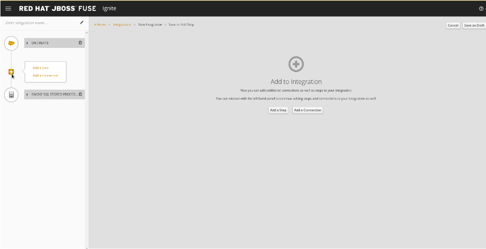
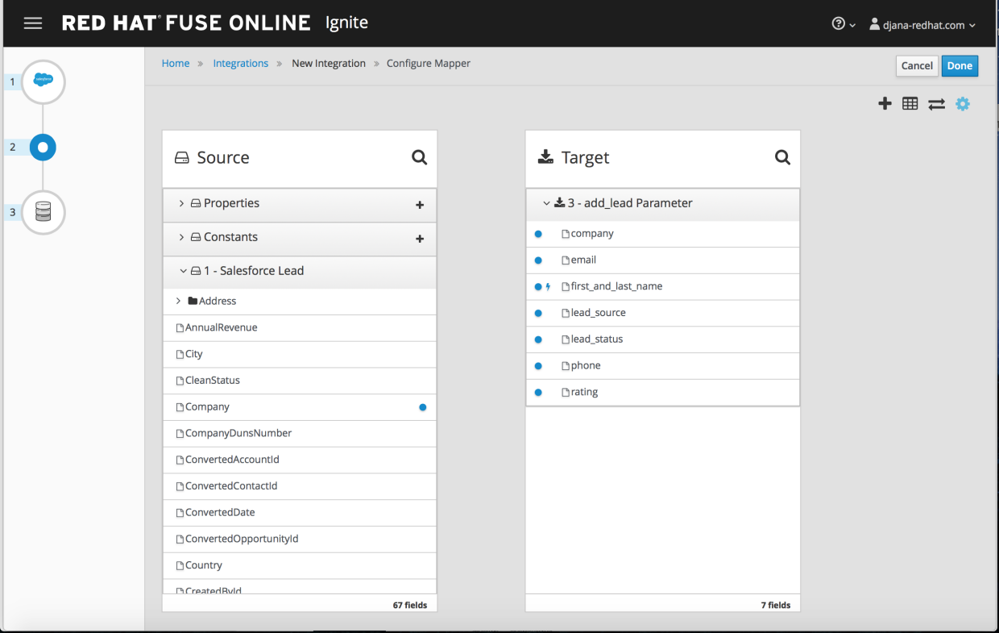

:scrollbar:
:data-uri:
:toc2:
:linkattrs:
:coursevm:

= Integration Lab - Salesforce to PostgresDB scenario

This course includes at least one lab per module. Each lab is hands-on and typically takes about an hour to complete. Executing the course labs prepares you to correctly answer many of the final assessment questions.

.Goals
* Create an Integration using Red Hat Fuse Ignite from Salesforce to PostgresDB Database

.Requirements
* Registered for a Salesforce Developer account

Coolstore, an online store of fine products, plans to replicate the data that they captured in Salesforce, as part of a customer lead capture project.
The replica of the data will reside on a PostgresDB database. This enables business analytical jobs can be executed on this replica of the lead data.

In this lab, you will integrate two popular technology products: Salesforce and PostgresDB Database, in order to meet the above-mentioned business use case for Coolstore's data replication project.

:numbered:

== Logon to Red Hat Fuse Ignite

. Check your email inbox for the same email you received earlier, containing a link to Red Hat Fuse Ignite.
+
CAUTION: Red Hat Fuse Ignite is supported for the following web browsers: Google Chrome, Mozilla Firefox, Microsoft Edge
+
. Click this link to display the Red Hat Fuse Ignite login page.

. Log in using your OPENTLC account.

. A webpage launches, prompting you to authorize Red Hat Fuse Ignite access to your OPENTLC account credentials:
+
image::images/fuseignite_oauth.png[]
+
. Select both available checkboxes and click the *Allow selected permissions* button.
+
NOTE: This authorization page will appear only once. The next time you log in, the console for Fuse Ignite appears instead of this authorization page.

== Register Fuse Ignite as a client for Salesforce

In the earlier lab *Integration Lab - Twitter to Salesforce scenario* you have registered Fuse Ignite with Salesforce.

If you have not completed that lab, complete the section in that lab titled *Register Fuse Ignite as a client for Salesforce* before proceeding to the next section of this lab.

== Create a Salesforce Connection on Fuse Ignite

In the earlier lab *Integration Lab - Twitter to Salesforce scenario* you have created a Salesforce connection. Since you already have a Salesforce connection, you can reuse it the next integration to be created.

If you have not completed that lab, complete the section in that lab titled *Create a Salesforce Connection on Fuse Ignite* before proceeding to the next section of this lab.

== Create an Integration between Salesforce and PostgresDB database

. On the left-hand pane of Fuse Ignite console, click *Integrations*.
. Click *Create Integration*.
. Select the Salesforce connection, on the *Choose a Start Connection* page.
. Click the *On create* option, on the *Choose an Action* page.
+
image::images/salesforce_connection_on_create.png[]
+
. On the *On create* page, select *Lead* from the list of choices in the *Object name* field.
. Click *Done*. The Salesforce connection is now officially the *start connection* in the Integration.
+
image::images/configure_on_create_lead.png[]
+
NOTE: The Integration monitors for a notification arising from the creation of a Salesforce lead record. Data from this new lead is immediately passed to the next step within the integration. The *finish connection will be created next, followed by the creation of this step.

== Add the PostgresDB connection to the Integration

. In the Fuse Ignite console, select the *Finish Connection* page.
+
image::images/choose_finish_connection_db.png[]
+
. Select the `PostgresDB` connection icon.
+
NOTE: Credentials defined with the PostgresDB database connection are used when connecting to the database.
+
. Click *Invoke SQL stored procedure* on the *Choose an Action* page. Data is sent to a database stored procedure, as part of the integration.
+
image::images/choose_an_action_sql.png[]
+
. On the *Invoke SQL stored procedure* page, select _add_lead_ from the *Procedure Name* field. This is a pre-packaged stored procedure for use with the database. The selected stored procedure determines the requirements for steps in the integration, which in this case are the Salesforce fields required in the mapping to respective database fields.
. Click *Done*. The PostgresDB connection is now part of the Integration.
+
image::images/invoke_sql_add_lead.png[]

== Add a data mapping step

To complete the integration, Salesforce fields have to be mapped to respective PostgresDB fields through the use of a _data mapping_ step.

. Mouse-hover over the plus sign on the left-hand pane. The plus sign is located right below the *START* connection.
+

+
. Click *Add a Step* in the pop-up window.
. Click *Data Mapper*. The data fields that can selected for the mapping appear.
+
image::images/db_add_a_step_data_mapper.png[]
+
[TIP]
If you made a mistake in creating a data mapping, it is easy to delete it. Simply click the garbage bin icon at the top of the *Mapping Details* pane, as seen below:
+
image::images/mapping_details_garbagebin.png[]
+
. Map the source `Company` field (in the Salesforce data schema) to the target `company` field (in the PostgresDB data scheme).
.. On the *Sources* column, scroll down and click `Company`.
.. On the *Target* column, click `company`. A line from the source field to the target field has been established by the data mapper.
+

+
. In the same manner, create these data mappings:
.. from the Salesforce `Email` field to the PostgresDB `email` field, and
.. from the Salesforce `FirstName` field to the PostgresDB `first_and_last_name` field.
+
[NOTE]
A line connecting the Salesforce `FirstName` field to the PostgresDB `first_and_last_name` field is displayed. The next activity will be to combine the `FirstName` and `LastName` *Sources* fields into the `first_and_last_name` *Target* field.
+
. With `FirstName` on the *Sources* column selected, select *Combine* from the *Action* field on the *Mapping Details* pane.
. Click the *Add Source* button.
. Highlight the text `[None]` that appears in the new *Source* section (second from the top of the *Mapping Details* pane).
. Replace the text `[None]` with `LastName`. A drop-down list appears below the field.
. Select `LastName` from the drop-down list.
. A line connecting the Salesforce `LastName` field to the PostgresDB `first_and_last_name` field is displayed. This is the mapping established by the data mapper.
+

+
. Create the following data mappings:
+
[width="25%"]
|=======
|*Map This _Sources_ Field*|*To This _Target_ Field*
|`LeadSource`|`lead_source`
|`Status`|`lead_status`
|`Phone`|`phone`
|`Rating`|`rating`
|=======
+
. Click the *Done* button located on the upper right of the Fuse Ignite console.
+

+
. At the top-left hand corner of the Fuse Ignite console, select the field with the text `Enter integration name...`
. Provide _Salesforce to PostgresDB_ as the name for the integration.
. At the upper right corner of the console, click *Publish*.
+

+
. While the integration is being deployed, click the *Done* button.
+
image::images/fuse_ignite_console_integrations_2.png[]
+
. Once the green checkbox icon appears next to the _Salesforce to PostgresDB_ integration, it indicates that the integration has been successfully deployed.

Now, testing of the integration can proceed.

== Test the _Salesforce to PostgresDB_ Integration

. Click *Integrations*, in the left-hand pane of the Fuse Ignite console.
. Select the _Salesforce to PostgresDB_ integration.
. Validate that the _Salesforce to PostgresDB_ integration is active.
+
image::images/salesforce_to_postgresdb_integration_summary.png[]
+
. Create a new lead in Salesforce. The lead should be complete with these fields:
.. Company
.. Email
.. First Name
.. Last Name
.. Lead Source
.. Lead Status
.. Phone
.. Rating
+

+
. Launch a new web browser window.
. In front of the URL of the Fuse Ignite installation, append the string `todo-`. For instance: https://todo-fuse-fuse9123.apps.dev.openshift.opentlc.com/ will be the new URL.
+
NOTE: This is the URL for the *To Do App* which captures notifications of new leads created in Salesforce. It does so by reading, from the PostgresDB database, the records created by the Integration.
+
. Access the *To Do App* at its URL using the web browser.
. Observe that a notification is displayed in the *To Do App* regarding a new Salesforce lead.
+

+
[NOTE]
If you are using the Fuse Ignite Technology Preview release, exactly one integration at a time can be active.
Though you can create another sample integration, you cannot publish it while another integration is active.

== [OPTIONAL] Query PostgresDB to locate the replicated data

You can perform a lookup of the table in PostgresDB that contains the data that was just replicated from Salesforce using Fuse Ignite.
The following instructions applies to the infrastructure of Fuse Ignite, and should be good learning material if you intend to access data using command line.

. In a command-line terminal, type this command to login to your OpenShift environment:
+
----
$ oc login https://master.<$guid>.openshift.opentlc.com:443 -u <$your-OPENTLC-ID>
----
+
[TIP]
Substitute the `<$guid>` with the GUID that was sent to you by email, and <$your-OPENTLC-ID> with your OPENTLC ID.
+
. Type this command to retrieve details of the OpenShift pods for Fuse Ignite:
+
----
$ oc get pods

NAME                          READY     STATUS      RESTARTS   AGE
i-sfdc-db-1-build             0/1       Completed   0          18m
i-sfdc-db-3-pzqh6             1/1       Running     0          7m
syndesis-amq-2-xkgq4          1/1       Running     0          3d
syndesis-db-1-k2gzd           1/1       Running     0          3d
syndesis-meta-1-6kq7p         1/1       Running     0          3d
syndesis-oauthproxy-1-nzwts   1/1       Running     0          3d
syndesis-prometheus-1-xmrqj   1/1       Running     0          3d
syndesis-server-1-58tzv       1/1       Running     0          3d
syndesis-ui-1-kjgwj           1/1       Running     0          3d
todo-1-build                  0/1       Completed   0          3d
todo-1-qdnm8                  1/1       Running     0          3d
----
+
. From the results, identify the OpenShift pod containing the PostgresDB. The name of the pod should contain the prefix `syndesis-db`
. In the terminal, type this command, substituting the name of the pod used in this example, with the name of the pod in your Fuse Ignite environment.
+
----
$ oc rsh syndesis-db-1-k2gzd
----
+
. At the shell prompt, type the following:
+
----
sh-4.2$ psql -Usampledb
----
+
. At the `sampledb` prompt, type the following:
+
----
sampledb-> \d
List of relations
Schema |    Name     |   Type   |  Owner
--------+-------------+----------+----------
public | contact     | table    | sampledb
public | todo        | table    | sampledb
public | todo_id_seq | sequence | sampledb
(3 rows)

----
+
*Question*: How many database schemas are in-place and what are they?
. Type in the next command:
+
----
sampledb-> \x
Expanded display is on.
----
+
. Proceed to type this SQL query:
+
----
sampledb=> SELECT * FROM contact LIMIT 10;
-[ RECORD 1 ]-----------
first_name  | Joe
last_name   | Jackson
company     | Red Hat
lead_source | db
create_date | 2018-03-30
----
+
[NOTE]
The `contact` database contains the data replicated from Salesforce.
+
. Validate that the data is the same as the case data observed in Salesforce.
. Leave the PostgresDB shell as well as the OpenShift pod shell, using these commands:
+
----
sampledb=> \q
sh-4.2$ exit
----

== Integration clean-up

. In the left-hand pane, click *Integrations*.
. Select the entry for the _Salesforce to PostgresDB_ integration.
. Click *Stop Integration*, followed by clicking *OK* in the the integration summary. This will deactivate the integration.
. When you require an integration, proceed to delete it.
. Select the inactive integration _Salesforce to PostgresDB_.
. Click *Delete Integration*, followed by clicking *OK*, at the bottom of the summary pane.

You have completed, tests and cleaned up your integration in Fuse Ignite.

ifdef::showscript[]

endif::showscript[]
