:scrollbar:
:data-uri:
:toc2:
:linkattrs:
:coursevm:

== Database to RESTful Service Connector Lab

NOTE: This lab takes about an hour to complete. It covers topics you need to know to correctly complete the final assessment.

.Goals
* Create an API client connector to an external REST service, using a Swagger document
* Create an integration using this new API client connector and the PostgresDB connector, using Fuse Ignite
* Use a data mapper step to map fields between the PostgresDB schema and the external REST service schema

.Overview
CoolWater Inc. is a local water utility company that requires you to implement a payment management system that provides their clients with a convenient online water bill payment interface. The design of the integration involves capturing input from the To Do web application in a PostgreSQL database, which then initiates a REST API connection to a web service that displays the water bill payment details on the customer billing portal of CoolWater Inc. In this lab, you implement this client use case that supports recurring billing for clients of CoolWater Inc.

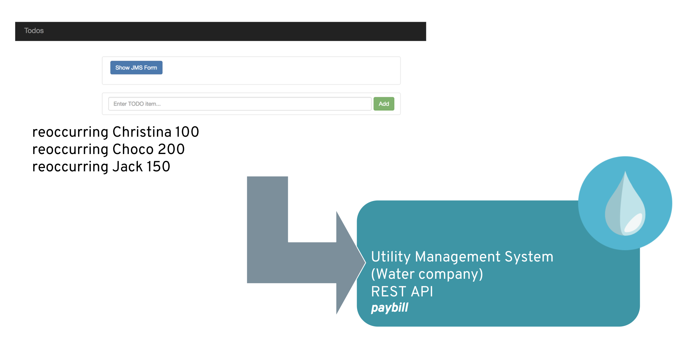

:numbered:

== Log In to Fuse Ignite Console

. Log in to the OpenShift Container Platform web console if you are not already logged in.
+
TIP: The link is in your confirmation email, if you need it.

. Click your *fuse-ignite-$GUID* project.
. Click the URL of your Fuse Ignite console.
. Log in using your OPENTLC credentials.
* The Fuse Ignite console appears.

== Access To Do Application

In this section, you access the web application that triggers the Fuse Ignite integration.

. In the left-hand panel of the Fuse Ignite console, click *Home*.
. Copy the URL for the Fuse Ignite console.
. Open another browser window, paste the URL into the URL field, and append `todo-` as shown:
+
.Sample URL
----
https://todo-fuse.fuse-ignite-<guid>.apps.<$Environment_ID>.openshift.opentlc.com
----
. Press *Enter* to access the To Do application:
+
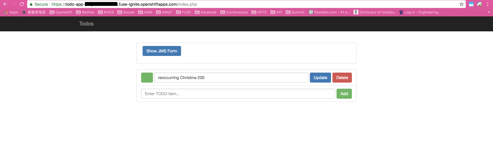
+
[NOTE]
====
Data posted from the To Do application is persisted in the PostgreSQL database embedded in Fuse Ignite.

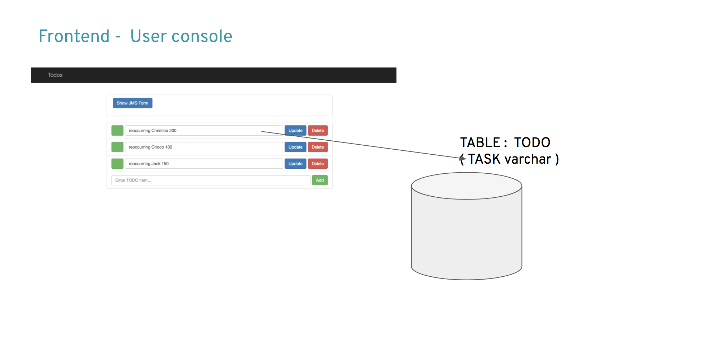
====

== Access Customer Billing Portal

In this section, you access the CoolWater Inc. customer billing portal, which is exposed using REST APIs.

. Using a new web browser window, launch the link:https://water-company-tp3demo.4b63.pro-ap-southeast-2.openshiftapps.com/main[billing portal].
* You return to this portal later in the lab to view the payment results. At this point, the Fuse Ignite integration has not been set up to use this billing portal.
+
image::images/01-Step-37.png[]
+
[NOTE]
Note that the results expire every three hours.

== Create API Client Connector

Next, you create an API client connector using an existing Swagger document.

[NOTE]
A link:https://swagger.io/docs/specification/about/[Swagger] document is a JSON object, developed with the link:https://github.com/OAI/OpenAPI-Specification/blob/master/versions/3.0.0.md[OpenAPI Specification] in mind.
It serves as both a standards-based interface, as well as documentation, for a RESTful service. With the Swagger interface, minimal implementation logic needs to be generated in order to connect to RESTful services. This ease of use has led to the rapid adoption of Swagger in application development projects.

. In the left-hand panel of the Fuse Ignite console, select *Customizations*:
+
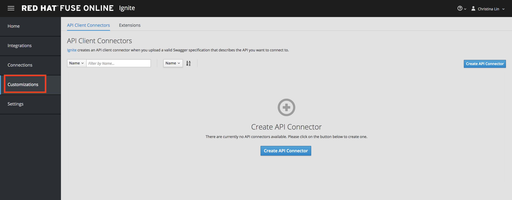

. On the *API Client Connectors* screen, click *Create API Connector*.
* The *Upload Swagger Specification* screen appears. You have the option to either upload a Swagger document through a file upload facility, or to access a hosted Swagger document.
+
. Select the *Use a URL* radio button.
. Enter the location of the Swagger document for the customer billing portal REST service: `https://raw.githubusercontent.com/weimeilin79/fuse7tp3demo/master/waterpayment.yml`.
+
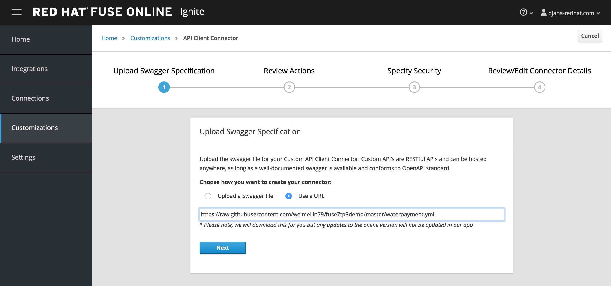
. Click *Next*.
* The *Review Actions* screen appears:
+
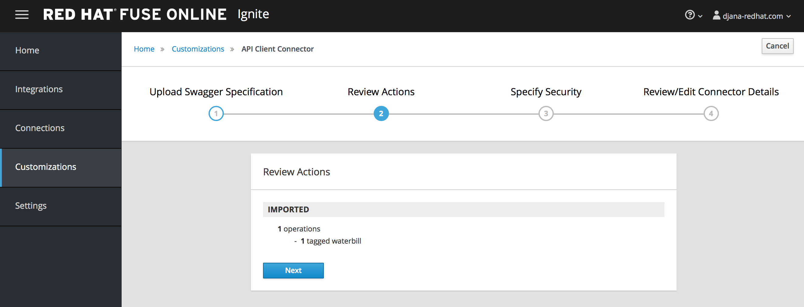
+
****
*Question:* Can you recognize the various actions that are available on the customer billing portal and the number of operations that are imported? 

* *Hint* You use these operations while using the API client connector as part of an active integration, and understanding their objectives is important for your integration project.
****
+
. Click *Next*.
* The *Specify Security* screen appears:
+
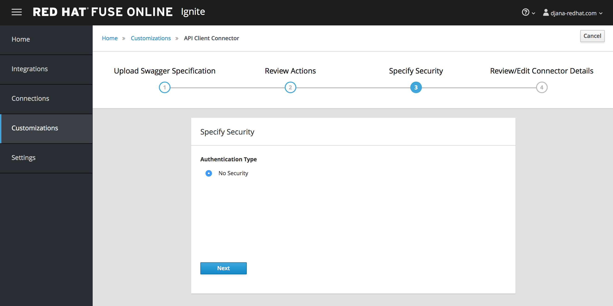

. Click *Next*.
* The *Review/Edit Connector Details* screen appears:
+
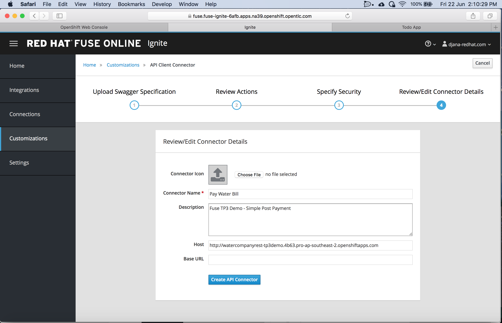
+
. Review and take note of the the data on the screen.
. Click *Create API Connector*.
* The new *Pay Water Bill* connector appears as an entry on the *API Client Connectors* screen:
+
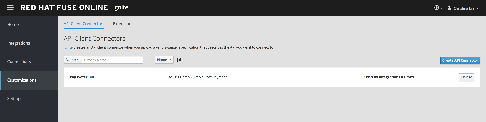

* Note the description of the connector, as well as the frequency of use by Fuse Ignite integrations.
. Select the *Pay Water Bill* connector.
* The details of the connector appear, including the imported operations, host, base URL, and description.
+
****
*Question:* Using a web browser to view the Swagger document for the customer billing portal, can you identify similar details regarding the *Pay Water Bill* connector that you just set up?
****

You have now created an API client connector to a RESTful service, using a Swagger document.

== Create Connection

In this section, you create a connection using the *Pay Water Bill* API client connector. This provides access to the customer billing portal's hosted RESTful service.

. In the left-hand panel of the Fuse Ignite console, select *Connections*:
+
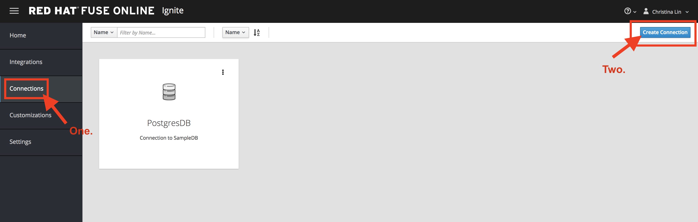

. Click *Create Connection*.
* The *Create Connection* screen appears.
. Select *Pay Water Bill*:
+
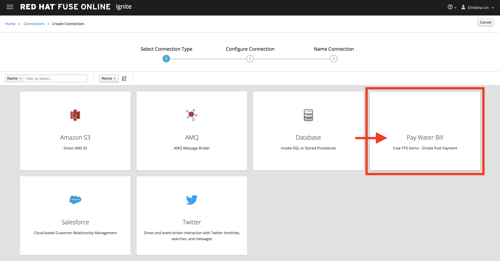
. On the *Pay Water Bill Configuration* screen, enter `/` as the *Base path*.
. Take note of the other fields and their values:
+
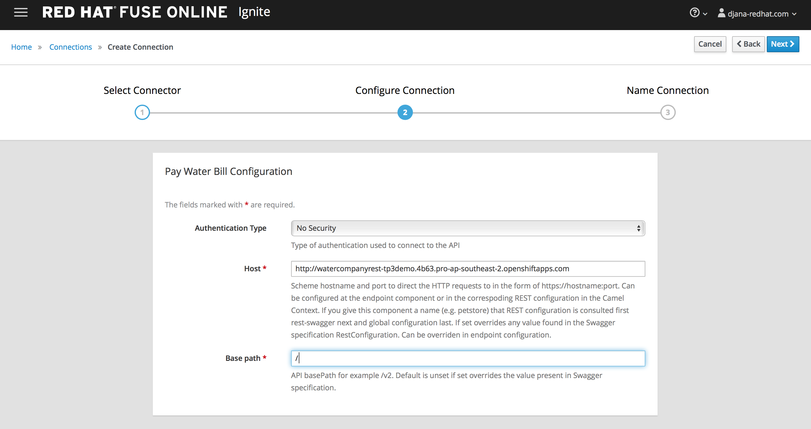
. Click *Next*.
. On the *Name Connection* screen, type `PayBill` in the *Connection Name* field:
+
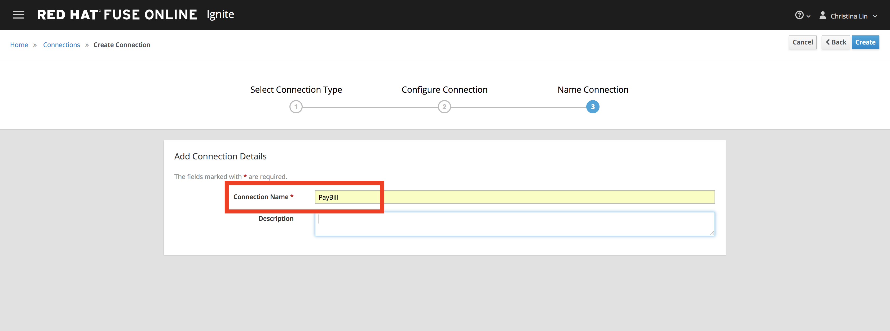

. Click *Create*.
* The *Connections* screen appears with the *PayBill* connection displayed:
+
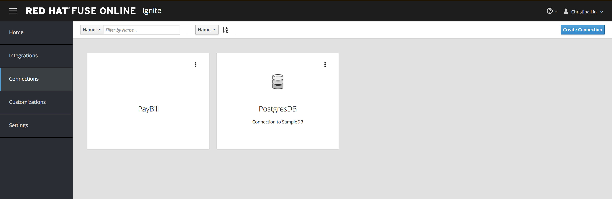

The *PayBill* connection is now ready for use as part of an integration. In the same manner, you can create a wide variety of connections and access them on the *Connections* screen.

== Create Integration

In this section, you create an integration between the PostgresDB connection (the PostgreSQL database) and the PayBill connection (the customer billing portal REST service).

=== Add PostgresDB Connection to Integration

. In the left-hand panel of the Fuse Ignite console, select *Integrations*, then click *Create Integration*:
+
image::images/01-Step-15.png[]

* This displays the *Choose a Start Connection* screen at the *START* connection point of the integration you are creating. The available connections, including the *PayBill* connection that you just created, are displayed.

. Select the *PostgresDB* connection:
+
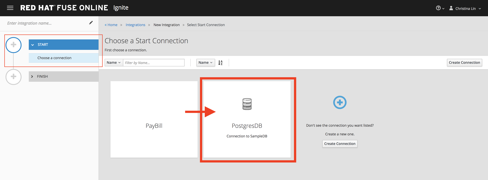
+
[NOTE]
====
Credentials defined with the PostgresDB connection are used when connecting to the database.
====
+
. On the *Choose an Action* screen, select *Periodic SQL Invocation*:
+
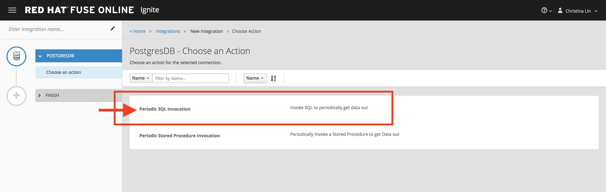

* Recurring payment data from the To Do application is inserted into the PostgreSQL database, as part of the integration.

. Provide the following data for these fields:
* *SQL Statement*: `SELECT TASK FROM TODO WHERE TASK LIKE 'recurring%'`
* *Period*: *30000* and *Milliseconds*
+
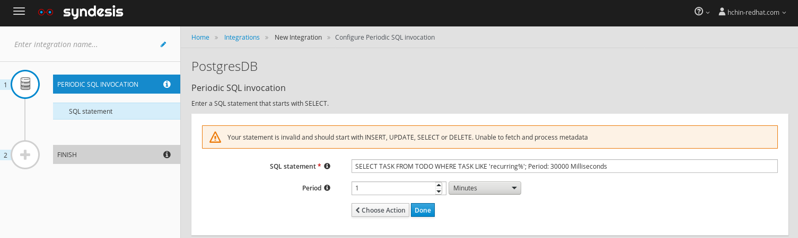

. Click *Done*.

=== Add PayBill Connection to Integration

. On the *Choose a Finish Connection* screen, select *PayBill*:
+
image::images/01-Step-19.png[]
* This assigns *PayBill* as the *FINISH* connection of the integration.

. On the *Choose an Action* screen, select *Payment*:
+
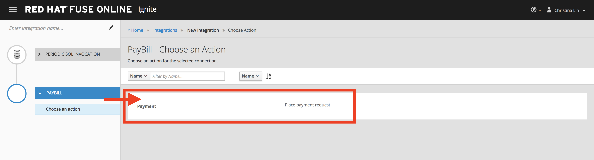
* This initiates a water utility bill payment.

=== Add Data Mapping Step

. In the left-hand panel, hover over the image:images/add_filter_icon.png[] icon located between the *PERIODIC SQL INVOCATION* connection and the *PAYMENT* connection, then select *Add a step*:
+
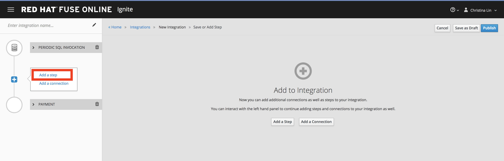

. On the *Choose a Step* screen, select *Data Mapper*:
+
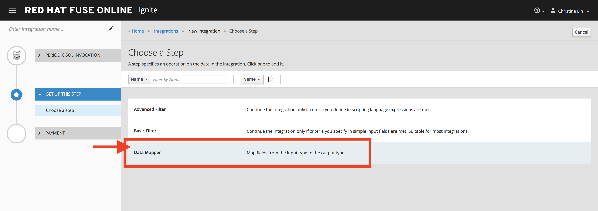
+
[NOTE]
On the *Configure Mapper* screen that appears, the *Sources* panel displays the fields in the output from the To Do application, while the *Target* panel displays the fields from the CoolWater REST API service.

. In the *Target* panel, expand the body folder to reveal *amount* and *senderID* fields.
. Drag the *task* field from the *Sources* panel to the *senderId* field in the *Target* panel.
* A solid line appears, connecting the two fields:
+
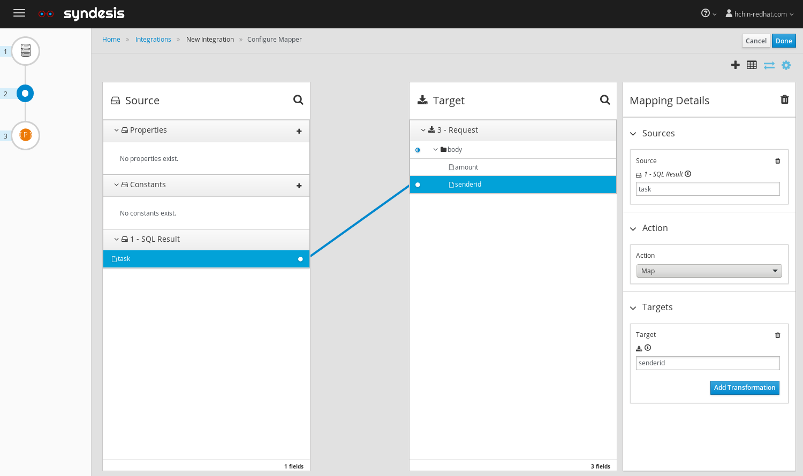

. In the *Action* section of the *Mapping Details* panel on the right, select *Separate* from the *Action* list.
. Leave *Space* selected in the *Separator* field:
+
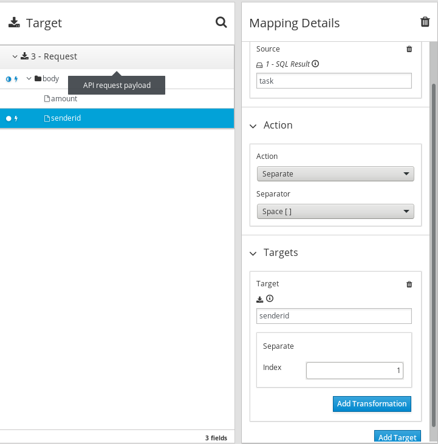
+
. Click *Add Transformation*.
. In the *Targets* section of the *Mapping Details* panel, type `2` in the *Index* field.
. Click *Add Transformation* and select *Trim* from the *Transformation* list that appears.
. Click *Add Target*:
+
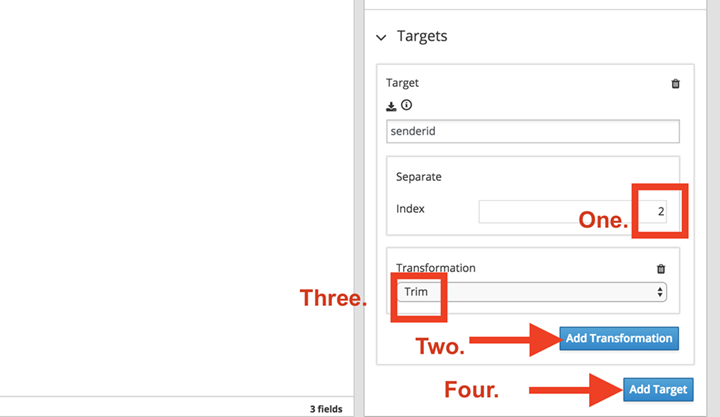

. Type `amount` in the *Target* field and make sure that the *Index* field is set to `3`:
+
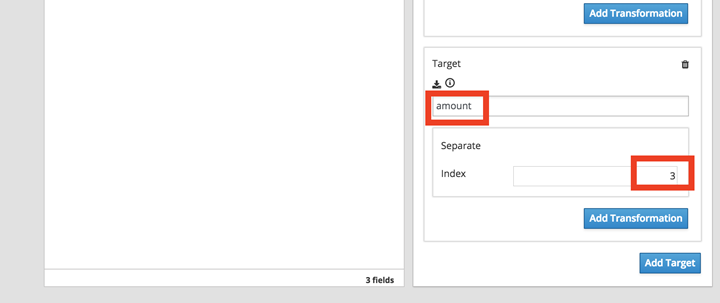

. Click *Done*:
+
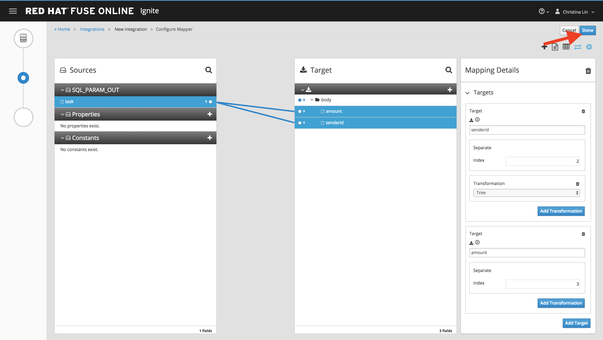

. Click *Save as Draft* to save this integration.
. Type `PayRecurringBill` in the *Integration Name* field and provide a meaningful description:
+
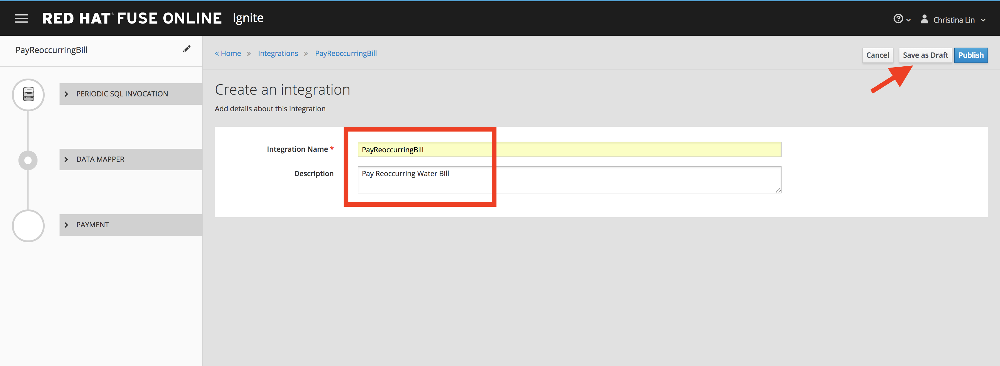

. Click *Publish* to start the integration.
* You can monitor the status on the *Integration Summary* screen:
+
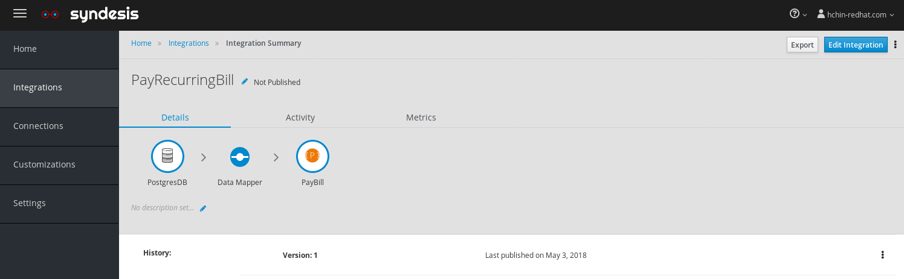

. Once the integration status is *Published*, click *Done*.

== Test Integration

In this section, you test the integration.

. Access the To Do application.
. In the form, enter `recurring <name> 200`, replacing `<name>` with any name:
+
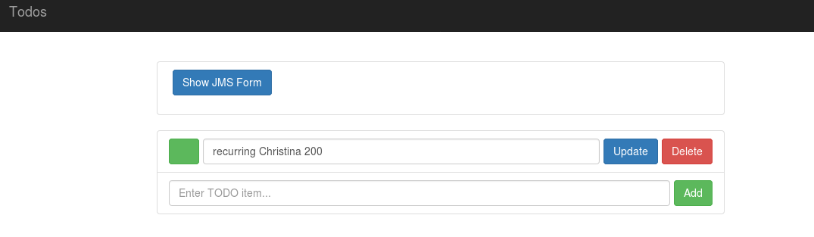

. Launch the link:https://water-company-tp3demo.4b63.pro-ap-southeast-2.openshiftapps.com/main[customer billing portal] back-end dashboard and observe the results:
+
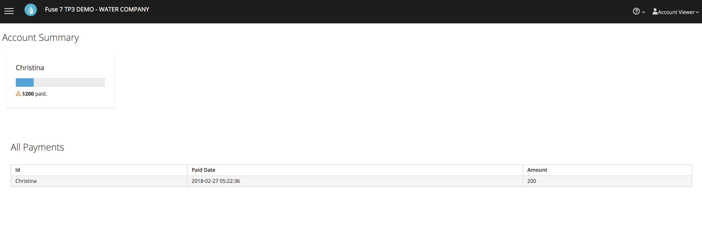
+
. On the form submission screen of the To Do application, enter another value: `recurring <name> 100`, replacing `<name>` with a different name:
+
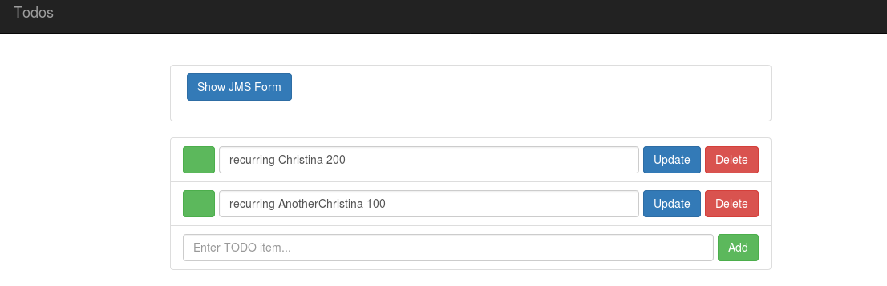

. Launch the link:https://water-company-tp3demo.4b63.pro-ap-southeast-2.openshiftapps.com/main[customer billing portal] back-end dashboard and observe the results:
+
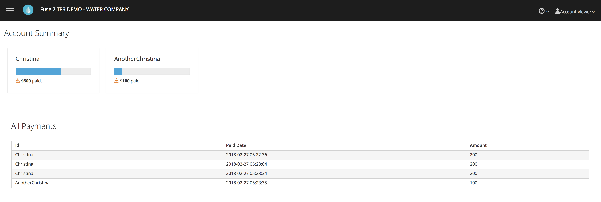

. Delete all entries from the To Do application:
+
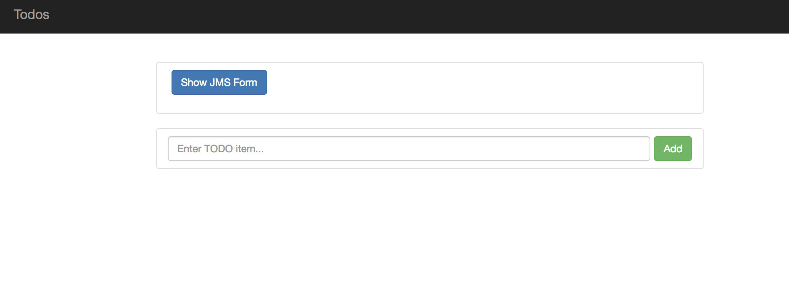

. Repeat the test, this time making multiple entries in the To Do application, some without the word `recurring`.
. Record your observations.
+
****
*Questions:*

* What conclusions can you make from all of the test results you have collected?
* Can you think of other use cases that also require this integration design?
****

== Clean Up Integration

In this section, you clean up the integration as a housekeeping best practice.

. In the left-hand panel, click *Integrations*.
. Locate the *PayRecurringBill* integration.
. Click image:images/more_options_icon.png[] (*More Options*) next to the green check box and select *Unpublish*.
. Click *OK*.
* This deactivates the integration.
* If you are using the Fuse Ignite Technology Preview release, other integrations can now be published and tested.
+
[NOTE]
The next two steps are optional. Use them only when you are certain you do not need the integration anymore.
+
. Locate the *PayRecurringBill* integration and click image:images/more_options_icon.png[] (*More Options*), and then select *Delete Integration*.
. Click *OK* at the bottom of the summary panel.

You have completed, tested, and cleaned up your integration in Fuse Ignite.

ifdef::showscript[]

endif::showscript[]
