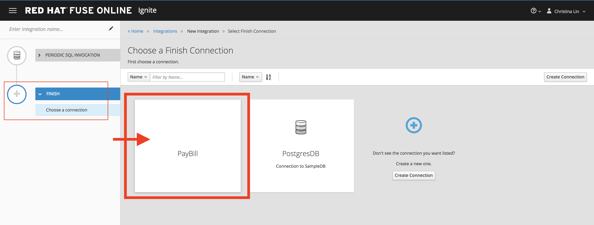

:scrollbar:
:data-uri:
:toc2:
:linkattrs:
:coursevm:

= API Client Connector Lab - Database to RESTful Service Scenario

This course includes at least one lab per module. Each lab is hands-on and typically takes about an hour to complete. Executing the course labs prepares you to correctly answer many of the final assessment questions.

.Goals
* Create an API Client Connector to an external REST service, using a swagger document
* Create an Integration using this new API Client Connection and the PostgresDB Connector, using Red Hat Fuse Ignite
* Use a Data Mapper step to map fields between the schema of PostgresDB and the schema of the external REST service

CoolWater Inc. is a local water utility company. CoolWater Inc. requires you to implement a payment management system that extends an online service to their clients, for convenience of water bill payment.
The design of the integration will involve capturing of input from a web application (called To Do App) in a PostgresDB database, which will then initiate a API REST connection to a web service that displays the payment information on the customer billing portal of CoolWater Inc.
Implement this client use case that supports recurring billing for clients of CoolWater Inc.

:numbered:

== Logon to Red Hat Fuse Ignite

. Check your email inbox for the same email you received earlier, containing a link to Red Hat Fuse Ignite.
+
CAUTION: Red Hat Fuse Ignite is supported for the following web browsers: Google Chrome, Mozilla Firefox, Microsoft Edge
+
. Click this link to display the Red Hat Fuse Ignite login page.

. Log in using your OPENTLC account. The Fuse Ignite console page appears.

== Access To Do App

You will access the web application that will trigger the Fuse Ignite integration.

. On the left-hand panel of the Fuse Ignite console, click *Home*.
. Copy the URL for the Fuse Ignite console.
. At the front of the URL, append `todo-`. You now have a URL in the form: `https://todo-fuse.fuse-
ignite.<guid>.apps.dev37.openshift.opentlc.com`
. Using this URL, access the *To Do App* from another web browser window.
+
image::images/01-Step-02.png[]
+
[NOTE]
Data posted from the *To Do App* will be persisted in the PostgresDB embedded in Fuse Ignite.
+
image::images/01-Step-03.png[]

== Access Customer Billing Portal

You will access the CoolWater Inc. customer billing portal, which is exposed using REST APIs as well.

. Using a new web browser window, link:https://water-company-tp3demo.4b63.pro-ap-southeast-2.openshiftapps.com/main[launch] the billing portal.
. Return to this portal later in the lab, in order to view the payment results. Currently, the Fuse Ignite integration has not been setup to use this billing portal yet.
+
image::images/01-Step-37.png[]
+
[NOTE]
Note that the results expire every three hour interval.

== Create an API Client Connector

Next, create an API Client Connector using an existing Swagger document.

[NOTE]
A link:https://swagger.io/docs/specification/about/[Swagger] document is a JSON object, developed with the link:https://github.com/OAI/OpenAPI-Specification/blob/master/versions/3.0.0.md[OpenAPI] specification in mind.
It serves as both an standard-based interface, as well as documentation, for a RESTful service. With the Swagger interface, minimal  implementation logic needs to be generated, in order to connect to RESTful services. This ease of use has led to the rapid adoption of the Swagger in application development projects.

. On the Red Hat Fuse Ignite console, click on the *Customizations* link on the left-hand pane.
+
image::images/01-Step-04.png[]
+
. On the page displayed, click on the "Create API Client Connector" button.
+
[NOTE]
On the `Upload Swagger` page, you have the option to either upload a Swagger document through a file upload facility, or to access a hosted Swagger document.
+
. Select the *Use a URL* radio button.
. Enter the location of the Swagger Document for the _Customer Billing Portal_ REST Service: `https://raw.githubusercontent.com/weimeilin79/fuse7tp3demo/master/waterpayment.yml`
+

+
. Click the *Next* button. The *Review Swagger Actions* page appears.
*QUESTION: Can you recognize the various actions that are available on _Customer Billing Portal_ and the number of operations that are imported? These operations will be used during the use of the API client connection as part of an active integration and understanding their objectives are important for your integration project.
+

+
. Click the *Next* button. The *Specify Security* page appears.
+

+
. Click the *Next* button. The *General Connector Info* page appears.
+

+
. Review and take note of the the data on the page.
+

+
. Click the *Create Connector* button. The new *Pay Water Bill* connector appears as an entry on the *API Client Connectors* page of the Fuse Ignite console.
. Note the description of the connector as well as the frequency of use by Fuse Ignite integrations.
. Click on the *Pay Water Bill* connector. The details of the connector appear, including _imported operations_, _host_, _base URL_ and _description_.

*QUESTION:* Using a web browser to view the Swagger document for _Customer Billing Portal_, can you identify similar details regarding the *Pay Water Bill* connector that you just setup?

You have created an API client connector to a RESTful service, using a Swagger document.

== Create a connection using the API Client Connector to a RESTful service

You will create a connection using the *Pay Water Bill* connector. This will provide access to the hosted RESTful service _Customer Billing Portal_.

. Select the *Connections* tab on the left-hand pane of the Fuse Ignite console.
+

+
. Click the *Create Connection* button. The *Create Connection* page appears.
. Select the *Pay Water Bill* icon. The *Pay Water Bill Configuration* page appears.
+
image::images/01-Step-11.png[]
+
. Enter "/" as the *Base path*.
. Take note of the fields and their values found on this page.
+

+
. Click the *Next* button.
+

+
. Provide the name of the connection as *PayBill*.
+
image::images/01-Step-13.png[]
+
. Click the *Create* button. The *Connections* page appears, with the *PayBill* icon displayed.
+

This indicates that the *PayBill* connection is ready for use as part of an integration. In the same manner, you can create a wide variety of connections and access them via their respective icons on the *Connections* page.

== Create an Integration between the PostgresDB connection and the PayBill connection

You will create an integration that involves the PostgresDB database and the _Customer Billing Portal_ REST Service.

=== Add the PostgresDB connection to the Integration

. Select the *Integrations* tab on the left-hand pane of the Fuse Ignite console.
+
image::images/01-Step-15.png[]
+
. Click the *Create Integration* button.
+

+
[NOTE]
Notice that you are currently at the *START* connection point of the integration you are creating. The available connections, including the *PayBill* Connection which you just created, are displayed.
+
. In the Fuse Ignite console, notice that the *Choose a Start Connection* page is displayed.
. Select the `PostgresDB` connection icon.
+
NOTE: Credentials defined with the PostgresDB database connection are used when connecting to the database.
+
. Select *Periodic SQL Invocation* on the *Choose an Action* page. Recurring billing data from the *To Do App* will be inserted into PostgresDB, as part of the integration.
+

+
. Provide the following data for these fields:
+
[.noredheader,cols="5,15",caption=""]
|======
|*Field Name*|*Value*
|SQL Statement|SELECT TASK FROM TODO WHERE TASK LIKE 'recurring%';
|Period|30000 Milliseconds
|======
+

+
. Click *Done*.

=== Add the PayBill Connection to the Integration

. On the *Choose a Finish Connection* page, select the *PayBill* icon. *PayBill* is assigned as the *FINISH* connection of the integration.
+

+
. On the *Choose an Action* page, click *Payment*, which will kick off water utility bill payment.
+

=== Add a data mapping step

. In the left panel, move your mouse cursor over the *+* sign between the *PERIODIC SQL INVOCATION* connection and the *PAYMENT* connection.
. In the pop-up window that appears, click *Add a step*.
+
image::images/01-Step-21.png[]
+
. On the *Choose a Step* page, click *Data Mapper*.
+
image::images/01-Step-22.png[]
+
[NOTE]
In the Data Mapper, the *Sources* panel on the left displays the fields in the output from the *To Do App*. The *Target* panel on the right displays the fields from the CoolWater Inc. REST Service API.
+
. In the *Target* panel, expand the body field. *Amount* and *senderID* fields are revealed.
. Drag the *Task* field from the *Sources* panel to the *senderId* in the Target Panel. A solid line appears, connecting the two fields.
+

+
. In the *Action* drop-down box, of the *Mapping Details* panel, select *Separate*. Notice that the *Separator* remains as _Space_.
+

+
. Click the *Add Transformation* button.
+
. In the *Target* section of the *Mapping Details* panel, enter _2_ in the *Separate Index* field.
. Click the *Add Transformation* button and select *Trim* from the *Transformation* dropdown box.
. Click the *Add Target* button.
+

+
. Enter *amount* in the *Target* field. Ensure that the *Index* is set to _3_.
+

+
. Click *Done*.
+

+
. Click *Save as Draft* to save this integration.
. Name the integration *PayRecurringBill* and provide a meaningful description.
+
image::images/01-Step-29.png[]
+
. Click *Publish* to start the integration.
+

+
. Once the integration is published, click *Done*.

== Test the integration

You will test the integration.

. Access the *To Do App*.
. In the form, provide the value: *recurring `<name>` 200*, substituting `<name>` with a name that you have in mind.
+

+
. link:https://water-company-tp3demo.4b63.pro-ap-southeast-2.openshiftapps.com/main[Launch] the *Customer Billing Portal* backend dashboard and observe the results.
+

+
. On the form submission page of the *To Do App*, provide another value: *recurring `<name>` 100*, substituting `<name>` with a different name that you have in mind.
+

+
. link:https://water-company-tp3demo.4b63.pro-ap-southeast-2.openshiftapps.com/main[Launch] the *Customer Billing Portal* backend dashboard and observe the new results.
+
image::images/01-Step-34.png[]
+
. Delete all entries from the *To Do App*
+

+
. Repeat the test, this time with multiple data entries made using the *To Do App*, some of which do not contain the word `recurring`. Record your observations.

*QUESTION:* What conclusions can you make from all the sets of test results you have collected? Can you think of other use cases that also require this integration design?

== Housekeeping

You will clean up the integration. as a housekeeping best practice.

. In the left-hand pane, click *Integrations*.
. Locate the entry for the _PayRecurringBill_ integration.
. Click the icon displaying three black dots in a vertical sequence, located right of the green check box. A drop down list appears.
. Select *Unpublish* from the drop down list, followed by selecting *OK* in the pop-up window. This will deactivate the integration.
* If you are utilizing the Fuse Ignite Technical Preview, some other integration can now be published and tested.

You have completed, tested and cleaned up your integration in Fuse Ignite.

ifdef::showscript[]

endif::showscript[]
