:scrollbar:
:data-uri:
:toc2:
:linkattrs:
:coursevm:

== API Client Connector Lab - AMQ to RESTful Service Scenario

This course includes at least one lab per module. Each lab is hands-on and typically takes about an hour to complete. Executing the course labs prepares you to correctly answer many of the final assessment questions.

.Pre-requisites
* Completed API Client Connector Lab - Database to RESTful Service Scenario

.Goals
* Create an Integration using existing API Client Connection to an external REST service and an AMQ Connection, using Red Hat Fuse Ignite
* Use a Data Mapper step to map fields between the schema of AMQ message and the schema of the external REST service

CoolWater Inc. is a local water utility company. The payment management system that you implemented at CoolWater Inc. extends an online service to their clients, for convenience of water bill payment. This online service is accessed via a API REST connection, facilitating payment information to be displayed on the link:https://water-company-tp3demo.4b63.pro-ap-southeast-2.openshiftapps.com/main[_Customer Billing Portal_] of CoolWater Inc. The portal conducts a data-cleanup every 3 hour interval.

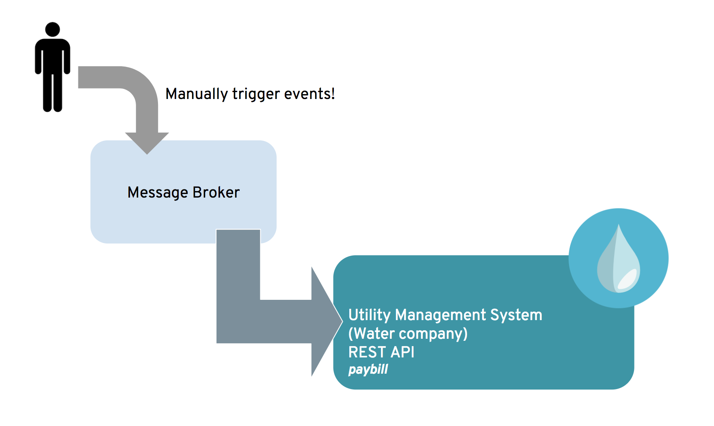

You are tasked to implement an event-triggered recurring payment solution, that must utilize the existing IT infrastructure of CoolWater Inc. This simulates recurring payments that are scheduled on a monthly basis, and an event triggers a single payment once the payment date arrives.

Status of the recurring payments can be viewed from the link:https://water-company-tp3demo.4b63.pro-ap-southeast-2.openshiftapps.com/main[_Customer Billing Portal_].

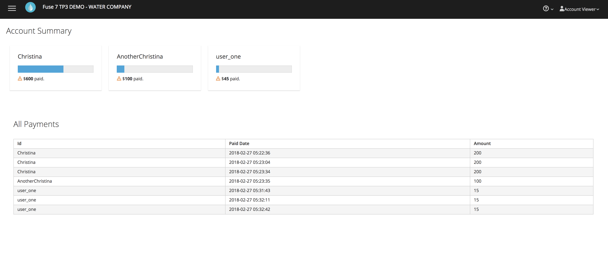

:numbered:

=== Logon to Red Hat Fuse Ignite

. Check your email inbox for the same email you received earlier, containing a link to the OpenShift Management Console for the PaaS environment, where Red Hat Fuse Ignite is installed.
+
CAUTION: Red Hat Fuse Ignite is supported for the following web browsers: Google Chrome, Mozilla Firefox, Microsoft Edge
+
. Click this link to display the OpenShift Management Console.
. Log in using your OPENTLC account.
. Select the Fuse Ignite project, with the `GUID` assigned to you through email, from the list of projects.
+
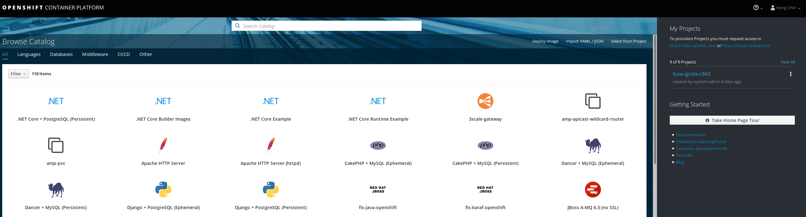
+
. Locate the URL for the Red Hat Fuse Ignite login page.
. Access the Red Hat Fuse Ignite login page, using a separate browser tab.
. Log in using your OPENTLC account. The Fuse Ignite console page appears.

=== Configure the AMQ console

You will start the AMQ broker provided as part of the Fuse Ignite installation.

. Using the OpenShift Management Console, click on the active OpenShift pod icon, right of the `Syndesis-AMQ` deployment.
+
image::images/01-Step-53.png[]
+
[NOTE]
OpenShift pods are similar to virtual machine instances as far as a container is concerned. Each pod is allocated its own internal IP address, and containers within pods can share their local storage and networking.
+
. Access the AMQ console by clicking on the *Open Java Console* link.
+
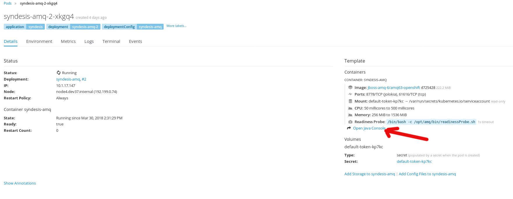
+
. At the AMQ console, click on the *Create* tab, located on the horizontal menu bar.
+
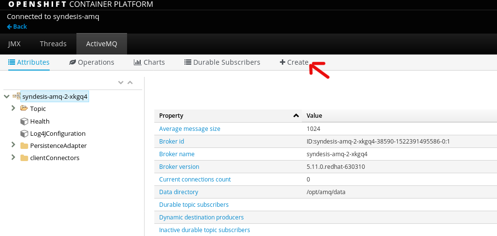
+
. Enter the following, then click the *Create Queue* button:
+
----
Queue name: paymentevent

Destination Type: Queue
----
+
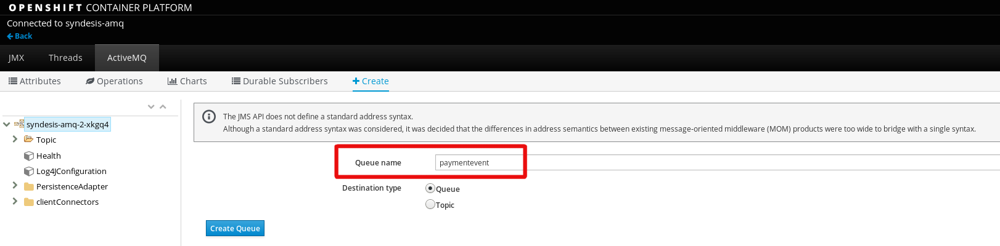
+
. On the left-hand panel, expand the *Queue* tab.
. Validate that the queue `paymentevent` is created.
. Access *Preferences* from the *User* icon, located on the top right hand corner of the console.
+
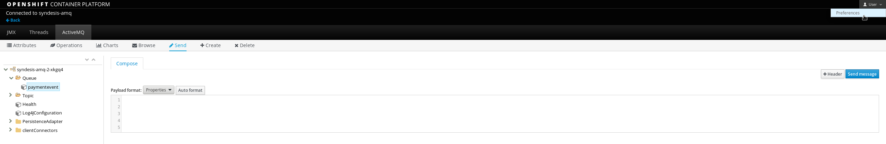
+
. Select *ActiveMQ8 from the left-hand panel.
. Provide the following values to these fields:
+
----
Activemq user name: ignite

Activemq password: ignite
----
+
. And click the *Done* button on the left panel.
+
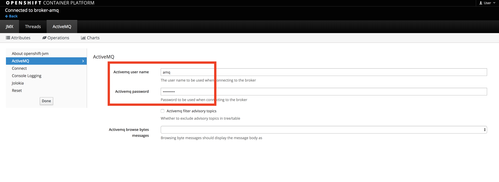
+
. Switch to the browser tab for the Fuse Ignite console.
. In the left-hand panel of the Fuse Ignite console, click *Connections*, and click on *Create Connection*.
+
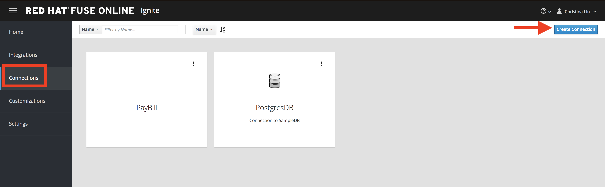
+
. Select *AMQ* as the Connection Type.
+
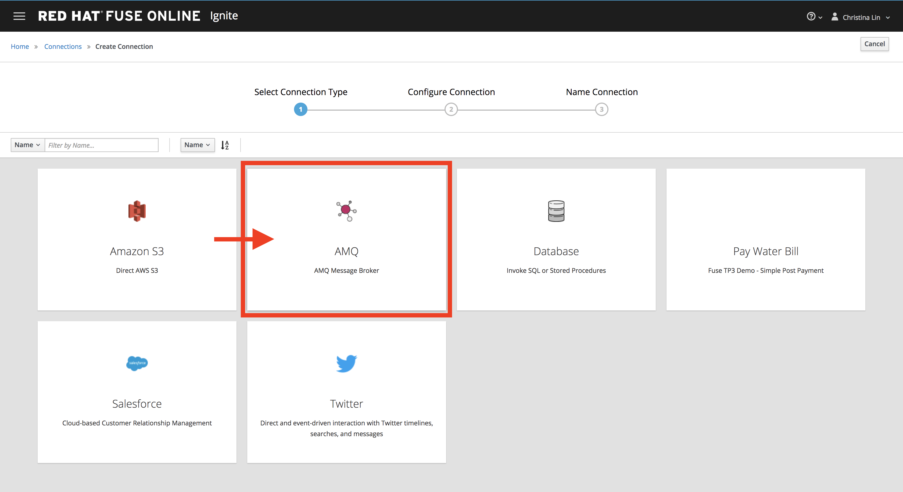
+
. Enter the following values:
+
----
Base URL: tcp://syndesis-amq-tcp:61616

User Name: ignite

Password: ignite
----
+
. Click *Validate*.
. Click *Next*.
+
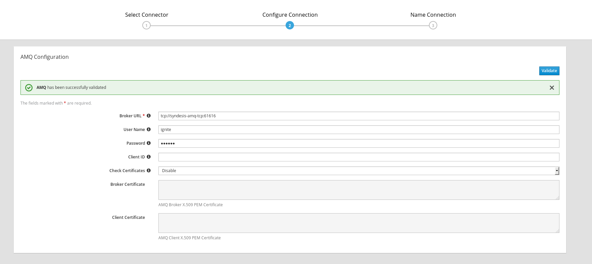
+
. Name your connection `DefaultBroker` and click *Create* button.
+
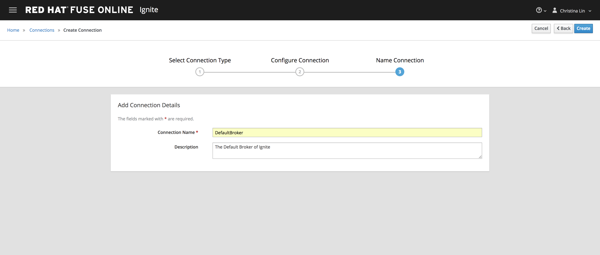
+
. Notice the `DefaultBroker` AMQ Connection is listed on the list of Connections.
+
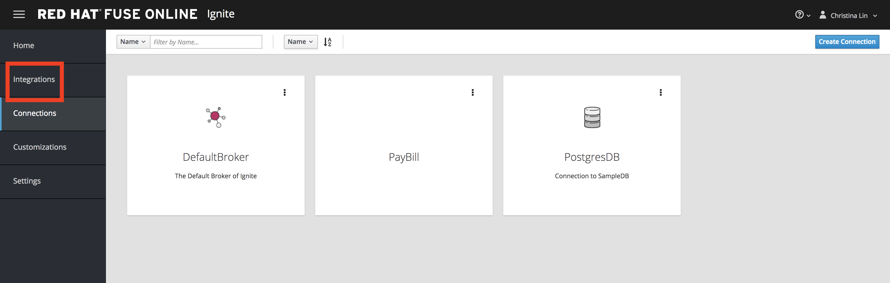

=== Create the integration

. In the left-hand panel of the Fuse Ignite console, select *Integrations*.
. Click on *Create Integration*
+
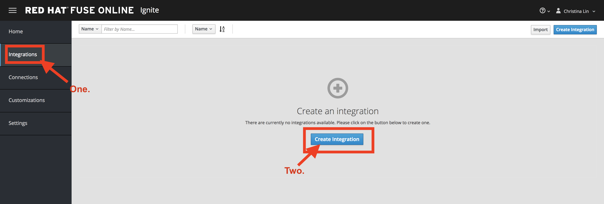
+
. On the *Choose a Start Connection* page, select the *DefaultBroker* connection.
+
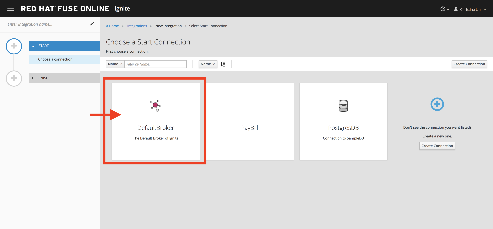
+
. Choose *Subscribe for messages*. This Connection will listen for events sent to the AMQ broker.
+
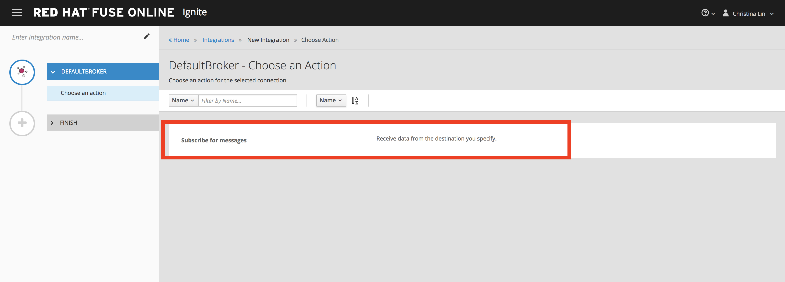
+
. On the *Subscribe for messages* page, ensure these fields contain the following values:
+
----
Destination Name: paymentevent
Destination Type: Queue
----
+
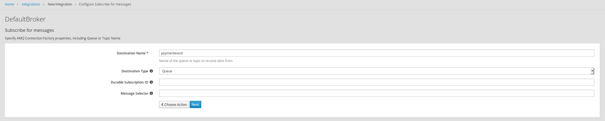
+
. Click *Next*.
. On the *Specify Output Data Type* page, select *JSON Instance* from the *Select Type* drop-down box.
+
[NOTE]
With this type *JSON Instance* explictly stated, at this stage of the connection configuration, the AMQ Connection will recognise the document, sent from the *To Do App* to the AMQ Broker, as a JSON document.
+
. Click *Done*.
+
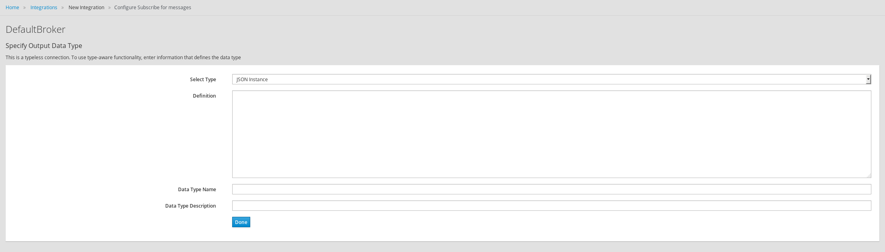
+
. Switch to the AMQ Console, and select *Send* from the horizontal menu bar.
+
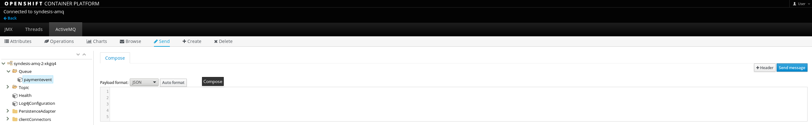
+
. Select *JSON* as the *Payload Format* and click *Send message*.
+
[NOTE]
This step is essential in providing the source payload, in order for the Data Mapper tool in Fuse Ignite to visualize the source data types.
+
. Select *Browse* from the horizontal menu bar.
. Locate and examine the contents of the message that you just sent. Validate that the message is in JSON format.
+
. On the *Choose a Finish Connection* page, click *PayBill* connection that you created in the previous lab.
+
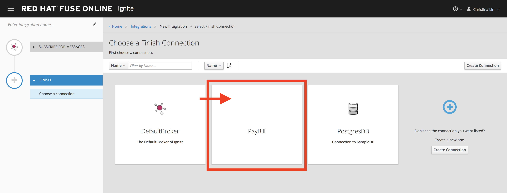
+
. On the *Choose an Action* page, click *Payment*, which will kick off water utility bill payment.
+
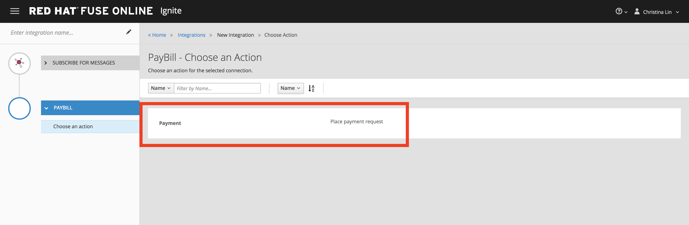
+
. In the left-hand panel, move your mouse cursor over the *+* sign located between the *SUBSCRIBE FOR MESSAGES* step and the *PAYMENT* step.
.In the pop-up window, click *Add a Step*.
+
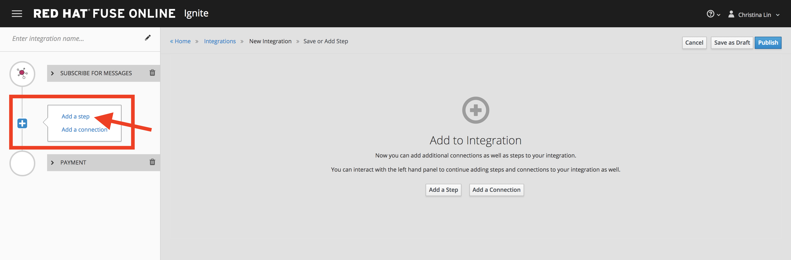
+
. On the *Choose a Step* page, click *Data Mapper*.
+
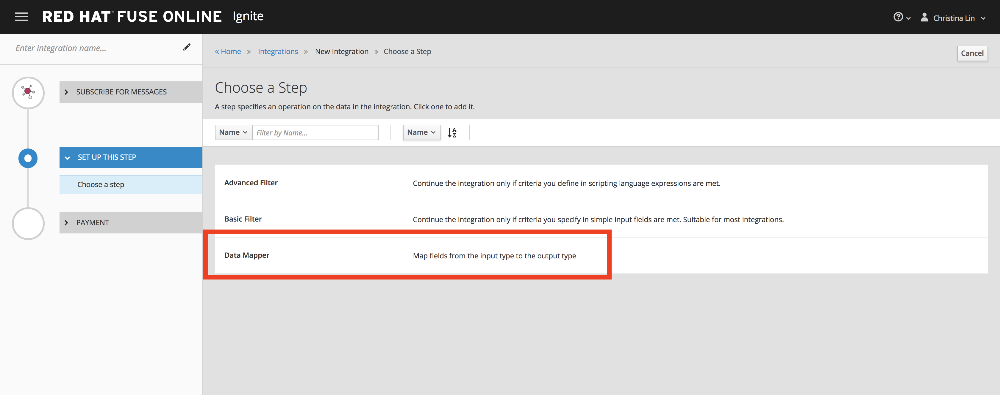
+
[NOTE]
In the *Data Mapper*, the *Sources* panel on the left displays the fields of source data. The *Target* panel on the right displays the fields of the target data. The source data in this case will be constant data types that you will create during configuration time. The target data will be the fields from the _Customer Billing Portal_ API of CoolWater Inc.
+
image::images/01-Step-73.png[]
+
. In the *Sources* panel, expand the body field. click on the '+ ' sign in Constant.
+
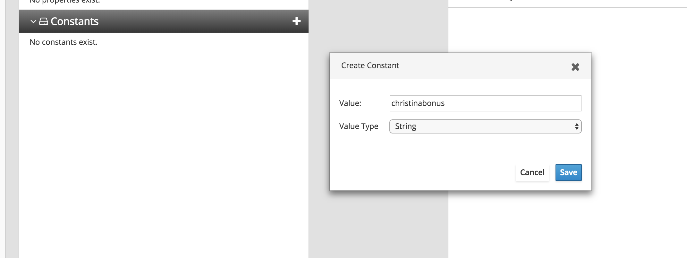
+
. Create two constants, where <YOUR_NAME> should be substituted with a name:
+
----
50: String
<YOUR_NAME>: String
----
+
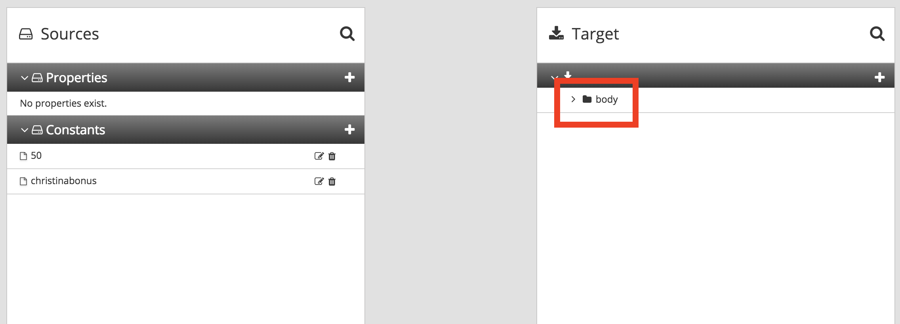
+
. In the *Target* panel, expand the *body* field. *Amount* and *senderid* fields are displayed.
. Map both constants in the *Source* panel with the fields in the *Target* panel accordingly:
+
[.noredheader,cols="5,5",caption=""]
|======
|*Source*|*Target*
|50|amount
|<YOUR_NAME>|senderid
|======
+
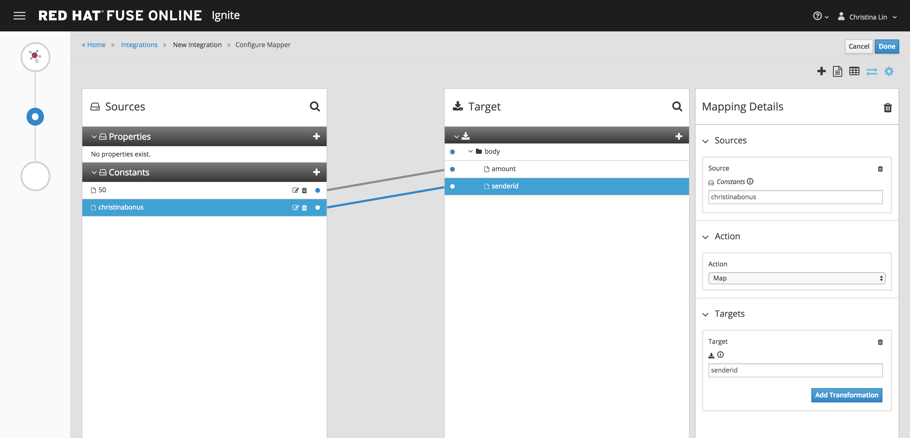
+
. Name your integration `SinglePayment` and click *Publish*.
+
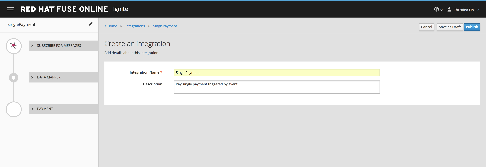
+
. Click *Done*, once the state of the `SinglePayment` integration becomes *Published*.
+
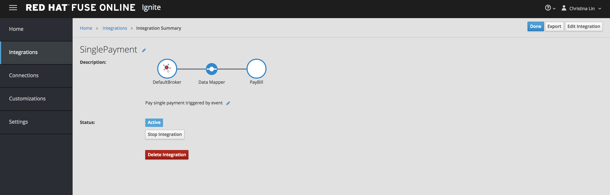

==== Test the integration

. At the AMQ console menu bar, click *Send*. The *Compose* page is displayed.
. Enter `pay` in the *Payload format*.
. Click the *Send message* button.
+
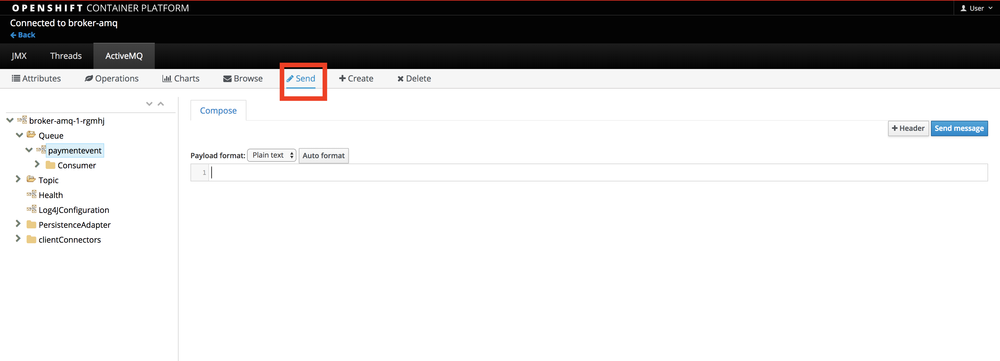
+
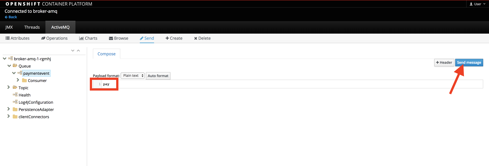
+
. link:https://water-company-tp3demo.4b63.pro-ap-southeast-2.openshiftapps.com/main[Launch] the _Customer Billing Portal_ for CoolWater Inc.
. Validate your observations against the expected outcome of testing the `SinglePayment` integration.
. Repeat your tests as many times as you wish.
+
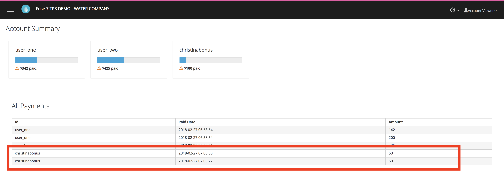

=== Housekeeping

You will clean up the integration. as a housekeeping best practice.

. In the left-hand pane, click *Integrations*.
. Locate the entry for the `SinglePayment` integration.
. Click the icon displaying three black dots in a vertical sequence, located right of the green check box. A drop down list appears.
. Select *Unpublish* from the drop down list, followed by selecting *OK* in the pop-up window. This will deactivate the integration.
* If you are utilizing the Fuse Ignite Technical Preview, some other integration can now be published and tested.
+
[NOTE]
The next few steps are optional. Use them only when you are certain that the integration will never be required again.
+
. Locate the entry for the `SinglePayment` integration.
. Click the icon displaying three black dots in a vertical sequence, located right of the green check box. A drop down list appears.
. Click *Delete Integration*, followed by clicking *OK*, at the bottom of the summary pane.

You have completed, tested and cleaned up your integration in Fuse Ignite.

ifdef::showscript[]

endif::showscript[]
