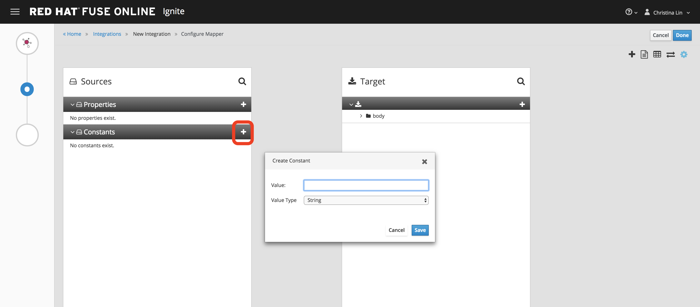

:scrollbar:
:data-uri:
:toc2:
:linkattrs:
:coursevm:

== AMQ to RESTful Service Connector Lab

NOTE: This lab takes about an hour to complete. It covers topics you need to know to correctly complete the final assessment.

.Prerequisite
* Completion of _Database to RESTful Service Connector Lab_

.Goals
* Create an integration using the existing API client connector to an external REST service and an AMQ connector, using Fuse Ignite
* Use a data mapper step to map fields between the AMQ message schema and the external REST service schema

CoolWater Inc. is a local water utility company. The payment management system that you implemented for CoolWater provides their clients with a convenient online water bill payment interface. This online service is accessed via a REST API connection to a web service that displays the water bill payment details on Coolwater's link:https://water-company-tp3demo.4b63.pro-ap-southeast-2.openshiftapps.com/main[customer billing portal]. The portal conducts a data cleanup every three hours.

image::images/01-Step-50.png[]

You are tasked with implementing an event-triggered recurring payment solution that must utilize Coolwater's existing IT infrastructure. This simulates recurring payments that are scheduled on a monthly basis, and an event triggers a single payment once the payment date arrives.

Status of the recurring payments can be viewed from the link:https://water-company-tp3demo.4b63.pro-ap-southeast-2.openshiftapps.com/main[customer billing portal].

:numbered:

== Log In to Fuse Ignite Console

. Log in to the OpenShift Container Platform web console if you are not already logged in.
+
TIP: The link is in your confirmation email, if you need it.

. Click your *fuse-ignite-$GUID* project.
+

. Right-click the URL of your Fuse Ignite console and open it in a new browser window.
. Log in using your OPENTLC credentials.
* The Fuse Ignite console appears.

== Configure AMQ Broker

In this section, you set up the AMQ broker provided as part of the Fuse Ignite installation.

. In the OpenShift Container Platform web console, click the active OpenShift pod icon to the right of the deployment with AMQ in the name. For example `broker-amq` or `syndesis-amq`:
+
image::images/01-Step-53.png[]
+
[NOTE]
====
OpenShift pods are similar to virtual machine instances as far as a container is concerned. Each pod is allocated its own internal IP address, and containers within pods can share their local storage and networking.
====
+
. Click the *Open Java Console* link to access the ActiveMQ console:
+
image::images/01-Step-54.png[]

. In the *ActiveMQ* console, click the *Create* tab:
+

. Complete the form as follows:
.. In the *Queue name* field type `paymentevent`.
.. For *Destination type*, select the *Queue* radio button.
+
image::images/01-Step-57.png[]

. Click *Create Queue*.

. In the left-hand panel, expand the *Queue* folder and confirm that the `paymentevent` queue was created.
. In the top right corner of the console, click *User* and select *Preferences*:
+
image::images/01-Step-58.png[]

. In the left-hand panel, select *ActiveMQ* and complete the fields as follows:
* *Activemq user name*: `uservKL`
* *Activemq password*: `RA8oNMOg`
. Click *Done*.

== Create Start Connection

. Switch to the browser window displaying the Fuse Ignite console.
. In the left-hand panel, click *Connections*, then click *Create Connection*:
+
image::images/01-Step-60.png[]
+
. On the *Select Connection Type* screen, select *AMQ*:
+
image::images/01-Step-61.png[]
+
. Complete the following fields:
* *Broker URL*: `tcp://syndesis-amq-tcp:61616`
* *User Name*: `uservKL`
* *Password*: `RA8oNMOg`
+

. Click *Validate*, then click *Next*.

. On the *Name Connection* screen, type `DefaultBroker` as the name of the connection, enter a useful description, and click *Create*:
+

* Note that the *DefaultBroker* AMQ connection is now available on the *Connections* screen:
+
image::images/01-Step-65.png[]

== Create Integration

=== Configure Start Connection

. In the left-hand panel of the Fuse Ignite console, click *Integrations* and then *Create Integration*:
+
image::images/01-Step-15.png[]

. On the *Choose a Start Connection* screen, select the *DefaultBroker* connection:
+
image::images/01-Step-66.png[]

. Select *Subscribe for messages*:
+
image::images/01-Step-67.png[]
* This connection listens for events sent to the AMQ broker.

. On the *Subscribe for messages* screen, complete the following fields:
* *Destination Name*: `paymentevent`
* *Destination Type*: *Queue*
+

. Click *Next*.
. On the *Specify Output Data Type* screen, select *JSON Instance* from the *Select Type* list:
+

+
[NOTE]
With *JSON Instance* explicitly stated at this stage of the connection configuration, the AMQ connection will recognize documents sent from the To Do application to the AMQ Broker as JSON documents.

. Enter the following in the *Definition* field, then click *Done*:
+
----
{
"id": 1,
"name": "Billy Joel",
"bonus": 1250
}
----

=== Create Source Payload

. Switch to the AMQ console and select the *Send* tab:
+

+
. Select *JSON* as the *Payload format* and populate the text field with this message:
+
----
{
"id": 1,
"name": "Billy Joel",
"bonus": 1250
}
----
+
. Click *Send message*.
+
[NOTE]
====
Providing the source payload is an essential step that enables the Data Mapper tool in Fuse Ignite to visualize the source data types.
====
+
. Select the *Browse* tab and locate the contents of the message that you just sent to confirm that the message is in JSON format.

=== Configure Finish Connection

. In the Fuse Ignite console, on the *Choose a Finish Connection* screen, select *PayBill*:
+
image::images/01-Step-69.png[]

. On the *Choose an Action* screen, select *Payment*:
+
image::images/01-Step-70.png[]
* This initiates a water utility bill payment.

=== Add Steps

. In the left-hand panel, hover over the image:images/add_filter_icon.png[] icon located between the *SUBSCRIBE FOR MESSAGES* step and the *PAYMENT* step and select *Add a Step*:
+

. On the *Choose a Step* screen, select *Data Mapper*:
+
image::images/01-Step-72.png[]
+
[NOTE]
On the *Configure Mapper* screen that appears, the *Sources* panel displays the constant data types that you create during configuration, while the *Target* panel displays the fields from the CoolWater customer billing portal API.

. In the *Sources* panel, click the  to the right of *Constants*:
+

. Using the *Create Constant* form, create two constants as follows, making sure to replace `<YOUR_NAME>` with a name:
.. *Value*: `50`, *Value type*: *String*
.. *Value*: `<YOUR_NAME>`, *Value type*: *String*

. In the *Target* panel, expand the *body* folder:
+

* This displays the *Amount* and *senderid* fields.

. Map *50* in the *Source* panel with *amount* in the *Target* panel.
. Map *<YOUR_NAME>* in the *Source* panel with *senderid* in the *Target* panel.
* Expect the *Configure Mapper* screen to resemble this when you are done:
+
image::images/01-Step-76.png[]

=== Publish Integration

. Name your integration `SinglePayment` and click *Publish*:
+
image::images/01-Step-77.png[]

. When the *SinglePayment* integration has a status of *Active*, click *Done*:
+
image::images/01-Step-78.png[]

== Test Integration

. In the AMQ console, select the *Send* tab.
* The *Compose* screen is displayed.
. Select *JSON* as the *Payload format* and populate the text field with this message:
+
----
{
"id": 1,
"name": "Billy Joel",
"bonus": 1250
}
----

. Click *Send message*.
+
image::images/01-Step-79.png[]

. Launch the link:https://water-company-tp3demo.4b63.pro-ap-southeast-2.openshiftapps.com/main[customer billing portal] for CoolWater Inc.
. Validate your observations against the expected outcomes of testing the *SinglePayment* integration.
. Repeat your tests as many times as you wish:
+
image::images/01-Step-81.png[]

== Clean Up Integration

In this section, you clean up the integration as a housekeeping best practice.

. In the left-hand panel, click *Integrations*.
. Locate the *SinglePayment* integration.
. Click image:images/more_options_icon.png[] (*More Options*) next to the green check box and select *Unpublish*.
. Click *OK*.
* This deactivates the integration.
* If you are utilizing the Fuse Ignite Technology Preview, other integration can now be published and tested.
+
[NOTE]
The next two steps are optional. Use them only when you are certain that you will not need the integration anymore.

. Locate the *SinglePayment* integration and click image:images/more_options_icon.png[] (*More Options*), then select *Delete Integration*.
. Click *OK* at the bottom of the summary panel.

You have completed, tested, and cleaned up your integration in Fuse Ignite.

ifdef::showscript[]

endif::showscript[]
