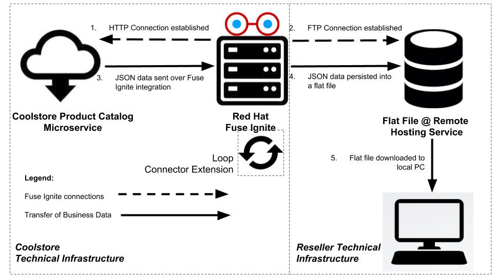
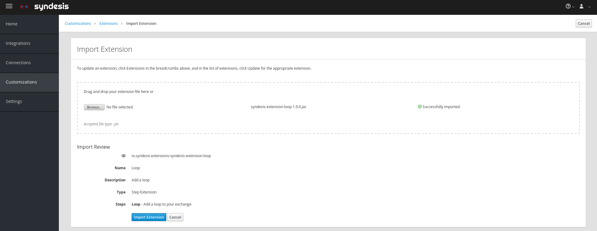
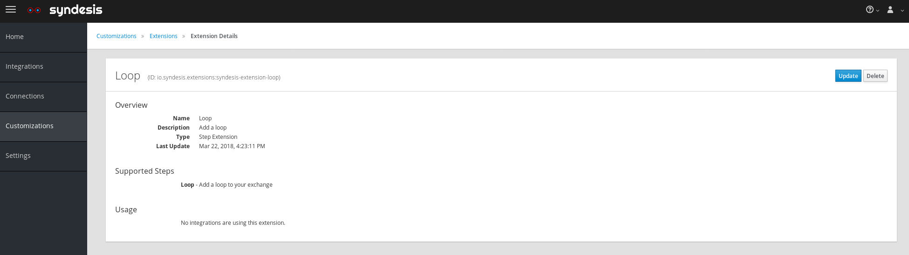
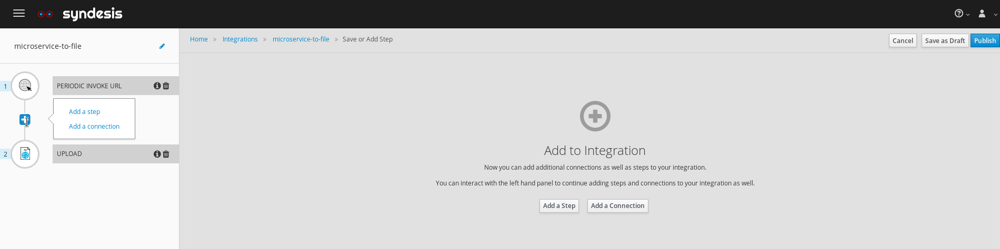
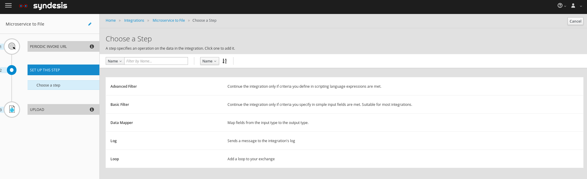
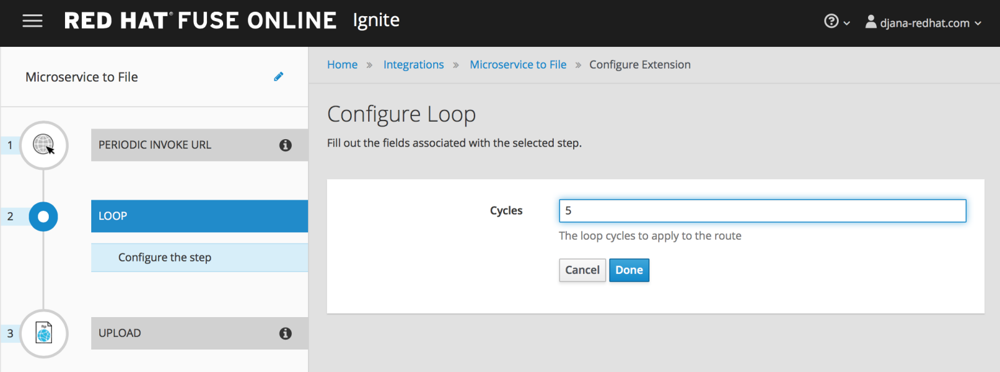

:scrollbar:
:data-uri:
:toc2:
:linkattrs:
:coursevm:

== Connector Technical Extensions Lab

NOTE: This lab takes about an hour to complete. It covers topics you need to know to correctly complete the final assessment.

.Goals
* Customize an existing technical extension
* Implement a technical extension as a connector
* Using Fuse Ignite, create an integration using this technical extension connector
* Test the integration

.Prerequisites
* Completion of _Microservice to Flat File Integration Lab_
* Apache Maven installed on your local PC
+
NOTE: If you do not already have Apache Maven installed, download link:https://maven.apache.org/download.html[Apache Maven] and follow the link:https://maven.apache.org/install.html[Installing Apache Maven] instructions to complete the installation.

.Overview

In this lab, you enhance your existing Microservice to File integration from Module 2 by adding a technical extension that adds loop cycles to the synchronization process.

An application developer can build a technical extension that serves as the implementation for a custom step. The application developer transfers the technical extension as a JAR archive to the citizen developer, who uploads the technical extension into the Fuse Ignite project environment. The citizen developer then creates a custom step using the technical extension, and reuses it in multiple integrations.

[NOTE]
Use the link:https://access.redhat.com/documentation/en-us/red_hat_jboss_fuse/6.3/html/tooling_user_guide/igniteextension/[Tooling User Guide] to learn how a technical extension is developed. This guide points out the conventions that must be followed regarding the contents of a custom-developed technical extension’s JSON file.

The community project for Fuse Ignite is called Syndesis. Apache Maven archetype dependencies in the `io.syndesis.extension.api` package are used in technical extensions as part of a Fuse Ignite integration.

The following are examples of import statements for these dependencies in a connector extension called `LoopAction`. The extension extends the use of the `Step` class, which has a dependency on `io.syndesis.extension.api.Step`:

----
import io.syndesis.extension.api.Step;
import io.syndesis.extension.api.annotations.Action;
import io.syndesis.extension.api.annotations.ConfigurationProperty;

@Action(id = "loop", name = "Loop", description = "Add a loop to your exchange", tags = { "loop", "extension"})
public class LoopAction implements Step {
----

:numbered:

== Log In to Fuse Ignite Console

. Log in to the OpenShift Container Platform web console if you are not already logged in.
+
TIP: The link is in your confirmation email, if you need it.

. Click your *fuse-ignite-$GUID* project.
. Click the URL of your Fuse Ignite console.
. Log in using your OPENTLC credentials.
* The Fuse Ignite console appears.

== Import Microservice to Flat File Integration

In this section, you set up the *Microservice to File* integration again.

. Import the *Microservice to File* integration that you backed up in an earlier lab.
. Make sure that the *Microservice to File* integration is published and active.

== Set Up Apache Maven Repository

In this section, you set up the Apache Maven repository for use in the compilation of technical extensions.

. Download this link:https://drive.google.com/open?id=11lJ0IFCxFJIcg9Ex_D8iYxZ7iZqhu1Zf[Apache Maven repository] (zipped archive).
* It contains previously compiled Apache Maven archetypes that are used in the compilation of the Fuse Ignite technical extensions.
. Extract the contents of the zipped archive into the `$lab_dir` working directory.
. Make a note of the directory path for this local Apache Maven repository.
. Download the Apache Maven link:https://raw.githubusercontent.com/gpe-mw-training/fuse-ipaas-labs/master/04_technical_extensions/settings.xml[settings.xml file], which contains references to the Apache Maven repositories.
. Copy the `settings.xml` file into your `~/.m2` directory, where at least one local Apache Maven repository will reside.
. Open `~/.m2/settings.xml` for editing, using your favorite editor.
. Confirm that the contents between the `<repositories>` and `</repositories>` tags resembles this:
+
----
<repository>
  <id>maven-central</id>
  <name>Central Repository for Maven builds</name>
  <url>http://central.maven.org/maven2/</url>
  <layout>default</layout>
</repository>
<repository>
  <id>maven-redhat</id>
  <name>Repository for Maven builds</name>
  <url>https://maven.repository.redhat.com/earlyaccess/all</url>
  <layout>default</layout>
</repository>
<repository>
  <id>redhat-ga-repository</id>
  <name>Red Hat GA repository</name>
  <url>http://maven.repository.redhat.com/ga/</url>
  <releases>
    <enabled>true</enabled>
    <updatePolicy>never</updatePolicy>
  </releases>
  <snapshots>
    <enabled>true</enabled>
    <updatePolicy>daily</updatePolicy>
  </snapshots>
</repository>
<repository>
  <id>fuse-public-repository</id>
  <name>FuseSource Community Release Repository</name>
  <url>https://repo.fusesource.com/nexus/content/groups/public</url>
  <snapshots>
    <enabled>true</enabled>
  </snapshots>
  <releases>
    <enabled>true</enabled>
    <updatePolicy>never</updatePolicy>
  </releases>
</repository>
<repository>
  <id>fusesource-ea</id>
  <name>JBoss Community Early Access Release Repository</name>
  <url>https://repo.fusesource.com/nexus/content/groups/ea</url>
  <snapshots>
    <enabled>true</enabled>
  </snapshots>
  <releases>
    <enabled>true</enabled>
    <updatePolicy>never</updatePolicy>
  </releases>
  <repository>
      <id>tech-extensions</id>
      <name>Repository for Syndesis builds</name>
      <url>file:///tmp/maven-syndesis-extension-1.0.0.fuse-000027</url>
      <layout>default</layout>
  </repository>
</repository>
----
* These are the Apache Maven repositories where the Apache Maven archetypes used for the compilation of Fuse Ignite reside. These repositories play a key role in the build process.

. Replace references to the `/tmp` directory with `/$lab_dir/maven-syndesis-extension-1.0.0.fuse-000027`, where `$lab_dir` is the path of your working directory:
+
.Sample Path
----
file:///fuseignite/maven-syndesis-extension-1.0.0.fuse-000027
----

. Review your changes and save the `~/.m2/settings.xml` file.

== Compile Technical Extension (Optional)

In this section, you compile a technical extension as part of the integration. Note that this section is optional, as a precompiled technical extension is provided for your use in subsequent lab sections.

. Using a new web browser window, download the link:https://github.com/syndesisio/syndesis-extensions/releases[latest technical extensions release] for Fuse Ignite.
. Extract the archive containing the technical extensions into the `$lab_dir` working directory.
. Using a command-line terminal window, navigate to the `syndesis-extension-loop` subdirectory, which contains the code for the technical extension.
. Within the `syndesis-extension-loop` subdirectory, compile the technical extension using the following command:
+
----
$ mvn clean install
----
+
.Sample Output
----
[INFO]
[INFO] --- maven-install-plugin:2.4:install (default-install) @ syndesis-extension-loop ---
[INFO] Installing /hong/syndesis-extensions-syndesis-extensions-1.0.0.fuse-000027/syndesis-extension-loop/target/syndesis-extension-loop-1.0.0.fuse-000027.jar to /root/.m2/repository/io/syndesis/extensions/syndesis-extension-loop/1.0.0.fuse-000027/syndesis-extension-loop-1.0.0.fuse-000027.jar
[INFO] Installing /hong/syndesis-extensions-syndesis-extensions-1.0.0.fuse-000027/syndesis-extension-loop/pom.xml to /root/.m2/repository/io/syndesis/extensions/syndesis-extension-loop/1.0.0.fuse-000027/syndesis-extension-loop-1.0.0.fuse-000027.pom
[INFO] ------------------------------------------------------------------------
[INFO] BUILD SUCCESS
[INFO] ------------------------------------------------------------------------
[INFO] Total time: 6.465 s
[INFO] Finished at: 2018-05-16T21:50:19+08:00
[INFO] ------------------------------------------------------------------------
----
* This confirms that compilation of the technical extension was successful.

. Locate the `syndesis-extension-loop-1.0.0.fuse-000027.jar` file in the `target` subdirectory of the `syndesis-extension-loop` directory.
* This is the JAR archive file containing the `syndesis-extension-loop` technical extension.
+
[TIP]
You can either move or copy this JAR archive file to a directory with a shorter name--for example, `/tmp`&#8212;to speed up import of the technical extension in the next section.

== Import Technical Extension

In this section, you import the compiled technical extension into Fuse Ignite, which forms a part of the integration that you enhance.

. If you skipped the previous optional section, locate the precompiled technical extension by navigating to the following directory:
+
----
$lab_dir/maven-syndesis-extension-1.0.0.fuse-000027/io/syndesis/extensions/syndesis-extension-loop/1.0.0.fuse-000027
----
* The `syndesis-extension-loop-1.0.0.fuse-000027.jar` file contains the `syndesis-extension-loop` technical extension.
. In the left-hand panel of the Fuse Ignite console, click *Customizations*.
. Select the *Extensions* tab located at the top of the console.
. Click *Import Extension*:
+
image::images/import-extensions.png[]
+
. Click *Browse* and select the JAR archive file containing the `syndesis-extension-loop` technical extension.
. Note the name, ID, type, description, and time of last update of the technical extension, then click *Import Extension*:
+

+
[TIP]
If the import of an archive file containing a technical extension fails, it is likely that the extension contains invalid code--according to the rules contained in the Meta OpenShift pod--that causes the validation to fail. Analyze and debug the code using Red Hat Developer Studio and the link:https://access.redhat.com/documentation/en-us/red_hat_jboss_fuse/6.3/html/tooling_user_guide/igniteextension/[Tooling User Guide] before attempting the import process again.

* The *Extension Details* screen appears and displays the overview information, supported steps (the objective of the extension), and the integrations using the extension:
+

. Click *Update*.
. In the left-hand panel, select *Customizations -> Extensions*.
* The details of the *Loop* technical extension are displayed, including the function of the step and the name of the extension.

The technical extension that you imported is now available for use with any integration.

== Test Integration Without Custom Step

In this section, you test the integration and validate the results.

. Log in to your remote hosting service and delete the file containing the product catalog data.
. Log out of the remote hosting service.
. Wait for a few seconds, then log back in to your remote hosting service.
. Confirm that the file containing the product catalog data is present.
. Repeat this test multiple times and with each test, record the time it takes for the file to reappear on the remote hosting service.

== Add Custom Step

In this section, you add the newly imported technical extension as a custom step to an integration. This exercise uses the Microservice to File integration you set up in the first lab in Module 2. If you did not complete that lab, go back and complete it now.

. In the left-hand panel of Fuse Ignite console, click *Integrations*.
. Select the *Microservice to File* integration.
. Click *Edit Integration* at the top right corner of the console.
. On the *Integration Editor* screen, hover over the Data Mapper custom step between the *Start Connection* and the *Finish Connection* and click the trash bin icon.
* The custom step is deleted.
. In the center of the main panel, click *Add a Step*.
* Alternatively, you can also hover over the image:images/add_filter_icon.png[] icon located between the connections and select *Add a step*:
+

. On the *Choose a Step* screen, select *Loop*:
+

* This custom step is available because you imported the technical extension earlier in the lab.

. Type a positive value in the *Cycles* field and click *Next*:
+

. Click *Publish*.

Once the integration is active (a green check box appears and the state of the integration becomes *Published*), you can proceed with testing the integration.

== Test and Monitor Integration

In this section, you test the integration with the new custom step and validate the results.

. Access the Hawtio console embedded in the integration pod, as you did previously in the first lab in Module 2.
. Using the Hawtio console, monitor the various statistics of this edition of the integration.
. Compare and analyze both sets of statistical results--the first set before the custom step was added, and the latest set after the custom step was added.
. Log in to your remote hosting service and delete the file containing the product catalog data.
. Log out of the remote hosting service.
. Wait for at least 1 minute.
. Log back in to your remote hosting service.
. Confirm that the file containing the product catalog data is present.
. Repeat this test multiple times and with each test, record the time it takes for the file to reappear on the remote hosting service.
+
****
*Question:* What observations can you make regarding the performance results of both editions of the Microservice to File integration--without the custom step and with the custom step?
****

== Replace Loop Extension (Optional)

In this optional exercise, you experiment with the use of different connector extensions by replacing the loop extension with other extensions.

. Replace the existing loop connector extension with other link:https://github.com/syndesisio/syndesis-extensions[extensions] from the upstream community project.
. Test the integration upon implementing each extension and observe the results.
+
****
*Questions:*

* Does the behavior of the integration change?
** If so, compile a list of the behavioral changes referencing each extension used.

* Which technical extension augments the test results in terms of the time difference between the two editions of the Microservice to File integration (without a custom step and with a custom step)?
****

== Clean Up Integration

In this section, you clean up the integration as a housekeeping best practice.

. In the left-hand panel, click *Integrations*.
. Locate the *Microservice to File* integration.
. Click image:images/more_options_icon.png[] (*More Options*) next to the green check box and select *Unpublish*.
. Click *OK*
* This deactivates the integration.
* If you are utilizing the Fuse Ignite Technology Preview, other integration can now be published and tested.
+
[NOTE]
====
The next two steps are optional. Use them only when you are certain that you do not need the integration anymore.
====
+
. Locate the *Microservice to File* integration, click image:images/more_options_icon.png[] (*More Options*), and select *Delete Integration*.
. Click *OK* at the bottom of the summary panel.

You have now implemented and tested a connector extension as a custom step in an integration.

ifdef::showscript[]

== Compile Syndesis Code (Optional)

In order to compile a technical extension, you need the compiled code base of Syndesis, the community project for Fuse Ignite. Extension archetype dependencies of the `io.syndesis.extension.api` package have to be compiled prior to the compilation and use of technical extensions within a Fuse Ignite integration.

The following are examples of import statements for these dependencies in a connector extension called `LoopAction`, followed by a `Step`, which has a dependency on  `io.syndesis.extension.api.Step`:

----
import io.syndesis.extension.api.Step;
import io.syndesis.extension.api.annotations.Action;
import io.syndesis.extension.api.annotations.ConfigurationProperty;

@Action(id = "loop", name = "Loop", description = "Add a loop to your exchange", tags = { "loop", "extension"})
public class LoopAction implements Step {

----

In this optional exercise, you compile the code base for the Syndesis community project. If you wish, you can skip this exercise, as the code base is provided in the next section.

. Using a command-line terminal window, download the link:https://github.com/syndesisio/syndesis/releases/tag/syndesis-1.3.4.fuse-000002[Syndesis code base] zip archive into the `$lab_dir` working directory. 
. Expand the zip archive.
. Navigate to the subdirectory called `/syndesis/tools/bin` and execute the command to compile the `Syndesis` code:
+
----
$ cd $lab_dir/syndesis/tools/bin
$ ./syndesis build -b -f -c
----
* A successful compilation results in the following messages:
+
----
[INFO] ------------------------------------------------------------------------
[INFO] Reactor Summary:
[INFO]
[INFO] Syndesis ........................................... SUCCESS [  5.967 s]
[INFO] Common ............................................. SUCCESS [  1.292 s]
[INFO] Common :: Util ..................................... SUCCESS [ 56.218 s]
[INFO] Common :: Model .................................... SUCCESS [ 36.371 s]
[INFO] Extension .......................................... SUCCESS [  0.163 s]
[INFO] Extension :: API ................................... SUCCESS [ 17.801 s]
[INFO] Extension :: Annotation Processor .................. SUCCESS [ 15.057 s]
[INFO] Extension :: Archetype :: Spring Boot .............. SUCCESS [ 16.070 s]
[INFO] Extension :: Archetype :: Java ..................... SUCCESS [  1.857 s]
[INFO] Extension :: Archetype :: Camel XML ................ SUCCESS [  1.407 s]
[INFO] Extension :: Bill of Materials (BOM) ............... SUCCESS [  0.089 s]
[INFO] Extension :: Converter ............................. SUCCESS [ 24.066 s]
[INFO] Extension :: Maven Plugin .......................... SUCCESS [ 59.604 s]
[INFO] Extension :: Example :: Log Step ................... SUCCESS [  4.359 s]
[INFO] Integration ........................................ SUCCESS [  0.257 s]
[INFO] Integration :: API ................................. SUCCESS [  8.266 s]
[INFO] Integration :: Component Proxy ..................... SUCCESS [ 26.747 s]
[INFO] Integration :: Runtime ............................. SUCCESS [ 54.052 s]
[INFO] Integration :: Project Generator ................... SUCCESS [ 17.176 s]
[INFO] Connector .......................................... SUCCESS [  8.055 s]
[INFO] Connector :: Support :: Util ....................... SUCCESS [  6.197 s]
[INFO] Connector :: Support :: Verifier ................... SUCCESS [  3.445 s]
[INFO] Connector :: Support :: Maven Plugin ............... SUCCESS [  7.517 s]
[INFO] Connector :: Twitter ............................... SUCCESS [  2.590 s]
[INFO] Connector :: FTP ................................... SUCCESS [  2.008 s]
[INFO] Connector :: SFTP .................................. SUCCESS [  1.636 s]
[INFO] Connector :: DropBox ............................... SUCCESS [  7.517 s]
[INFO] Connector :: AWS S3 ................................ SUCCESS [01:03 min]
[INFO] Connector :: Support :: Test ....................... SUCCESS [  3.098 s]
[INFO] Connector :: ActiveMQ .............................. SUCCESS [ 39.478 s]
[INFO] Connector :: AMQP .................................. SUCCESS [ 11.485 s]
[INFO] Connector :: SQL ................................... SUCCESS [01:22 min]
[INFO] Connector :: MQTT .................................. SUCCESS [ 20.804 s]
[INFO] Connector :: HTTP .................................. SUCCESS [  8.053 s]
[INFO] Connector :: Salesforce ............................ SUCCESS [ 14.954 s]
[INFO] Connector :: Slack ................................. SUCCESS [  2.755 s]
[INFO] Connector :: Support :: Catalog .................... SUCCESS [  4.150 s]
[INFO] Connector :: OData ................................. SUCCESS [  0.023 s]
[INFO] Connector :: OData :: Model ........................ SUCCESS [ 13.588 s]
[INFO] Connector :: OData :: Create ....................... SUCCESS [ 27.206 s]
[INFO] Connector :: OData :: Retrieve ..................... SUCCESS [  8.018 s]
[INFO] Connector :: OData :: Replace ...................... SUCCESS [  7.945 s]
[INFO] Connector :: OData :: Update ....................... SUCCESS [  2.479 s]
[INFO] Connector :: OData :: Delete ....................... SUCCESS [  2.424 s]
[INFO] Connector :: REST Swagger .......................... SUCCESS [ 13.790 s]
[INFO] Server ............................................. SUCCESS [  0.130 s]
[INFO] Server :: DAO ...................................... SUCCESS [ 23.987 s]
[INFO] Server :: Connector Generator ...................... SUCCESS [ 55.221 s]
[INFO] Server :: OpenShift Services ....................... SUCCESS [ 21.559 s]
[INFO] Server :: Controller ............................... SUCCESS [ 11.512 s]
[INFO] Server :: Credential ............................... SUCCESS [ 32.745 s]
[INFO] Server :: JsonDB ................................... SUCCESS [ 19.015 s]
[INFO] Server :: Verifier ................................. SUCCESS [  8.684 s]
[INFO] Server :: Inspector ................................ SUCCESS [ 11.952 s]
[INFO] Server :: Endpoint ................................. SUCCESS [ 48.063 s]
[INFO] Server :: Logging :: JsonDB ........................ SUCCESS [ 18.670 s]
[INFO] Server :: FileStore ................................ SUCCESS [  9.780 s]
[INFO] Server :: Metrics :: JsonDB ........................ SUCCESS [ 20.300 s]
[INFO] Server :: Metrics :: Prometheus .................... SUCCESS [ 15.546 s]
[INFO] Server :: Builder :: Maven Plugin .................. SUCCESS [ 13.601 s]
[INFO] Server :: Runtime .................................. SUCCESS [07:09 min]
[INFO] Server :: Builder :: Image Generator ............... SUCCESS [  7.863 s]
[INFO] S2I ................................................ SUCCESS [ 16.589 s]
[INFO] Meta ............................................... SUCCESS [ 22.880 s]
[INFO] UI ................................................. SUCCESS [05:53 min]
[INFO] ------------------------------------------------------------------------
[INFO] BUILD SUCCESS
[INFO] ------------------------------------------------------------------------
[INFO] Total time: 31:08 min
[INFO] Finished at: 2018-03-21T23:19:50+08:00
[INFO] Final Memory: 420M/878M
[INFO] ------------------------------------------------------------------------
----

endif::showscript[]
