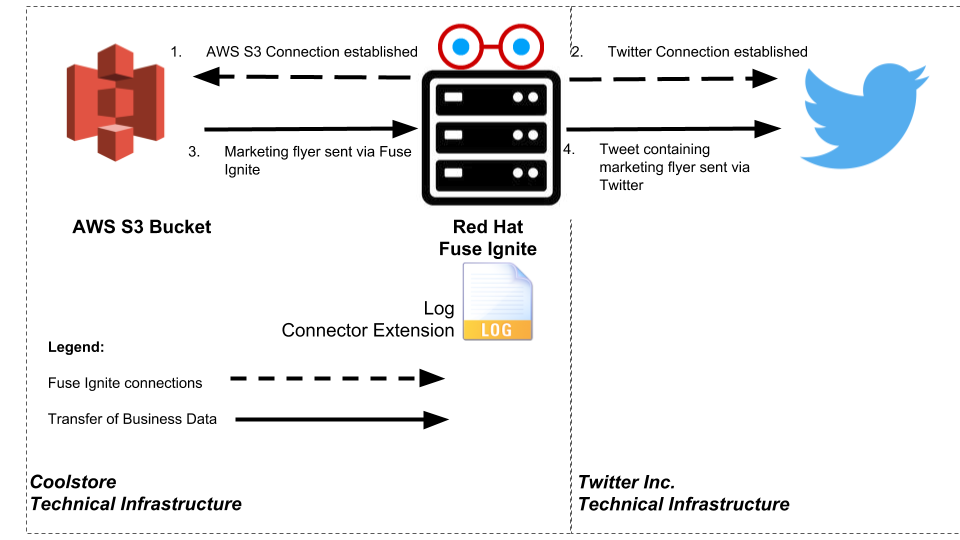

:scrollbar:
:data-uri:
:toc2:
:linkattrs:
:coursevm:

== Connector Technical Extensions Lab - utilize a technical extension in a marketing campaign use case

This course includes at least one lab per module. Each lab is hands-on and typically takes about an hour to complete. Executing the course labs prepares you to correctly answer many of the final assessment questions.

.Goals
* Create an integration using AWS S3 and Twitter connectors
* Create a custom step in Red Hat Fuse Ignite using a `syndesis-extension-log-body` technical extension
* Introduce the custom step into the integration

.Requirements
* Completion of Lab 1 of Module 4 - *Connector Technical Extensions Lab - Customize and implement an existing technical extension as a connector*
* Completion of Lab 2 of Module 2 - *Twitter to Salesforce Lab*
* Registered for a Twitter account
* Registered for a AWS account
* JDK 1.8 installed

`Coolstore` marketing department intends to launch a demand generation campaign for a new product.
A promotional flyer has to be sent over social media channels as a tweet.
You have been asked to design an integration solution which this campaign will depend on.

In order to meet your organization's requirements for a demand generation campaign, your Fuse Ignite integration design will utilize 2 connectors: a AWS S3 connector and a Twitter connector, as well as a pre-packaged technical extension `log`, which writes a message to the log stream. You will create a custom step using this pre-packaged technical extension and then utilize the custom step in a new integration, using Red Hat Fuse Ignite.

:numbered:

=== Logon to Red Hat Fuse Ignite

You will proceed to utilize the Fuse Ignite environment.

. Check your email inbox for the same email you received earlier, containing a link to Red Hat Fuse Ignite.
+
CAUTION: Red Hat Fuse Ignite is supported for the following web browsers: Google Chrome, Mozilla Firefox, Microsoft Edge
+
. Click this link to display the Red Hat Fuse Ignite login page.

. Log in using your OPENTLC account. The Fuse Ignite console page appears.

=== Compile a technical extension

You will implement a custom step in a Fuse Ignite integration, through the use of a logging mechanism, developed as a Fuse Ignite technical extension.
`Coolstore` marketing department will like every notification to be recorded every time the marketing flyer is delivered by Twitter.

You will now compile the code for a pre-developed technical extension, `syndesis-extension-log-body` that will perform recording of marketing notifications.

. Using a command-line terminal window, navigate to the subdirectory `syndesis-extension-log-body` located in the directory containing technical extensions.
. Within the subdirectory `syndesis-extension-loop`, compile the technical extension, using the command:
+
----
$ mvn -N install
----
+
. A successful compilation of the technical extension results in the following message:
+
----
Downloading from oss-sonatype-snapshots: https://oss.sonatype.org/content/repositories/snapshots/io/syndesis/extension/extension-converter/1.3-SNAPSHOT/maven-metadata.xml
[INFO] HV000001: Hibernate Validator 5.3.5.Final
[INFO] Loaded base partial metadata configuration file: null
[INFO] Looking for configuration to override at Maven Plugin configuration level.
[INFO] Created file /hong/syndesis-extensions-master/syndesis-extension-log-body/target/classes/META-INF/syndesis/syndesis-extension-definition.json
[INFO]
[INFO] --- maven-jar-plugin:2.4:jar (default-jar) @ syndesis-extension-log-body ---
[INFO] Building jar: /hong/syndesis-extensions-master/syndesis-extension-log-body/target/syndesis-extension-log-body-1.0.0.jar
[INFO] META-INF/maven/io.syndesis.extensions/syndesis-extension-log-body/pom.xml already added, skipping
[INFO] META-INF/maven/io.syndesis.extensions/syndesis-extension-log-body/pom.properties already added, skipping
[INFO]
[INFO] --- extension-maven-plugin:1.3-SNAPSHOT:repackage-extension (default) @ syndesis-extension-log-body ---
[INFO] Resolving artifact io.syndesis.extension:extension-bom:pom:1.3-SNAPSHOT from [central (https://repo.maven.apache.org/maven2, default, releases)]
[INFO]
[INFO] --- maven-install-plugin:2.4:install (default-install) @ syndesis-extension-log-body ---
[INFO] Installing /hong/syndesis-extensions-master/syndesis-extension-log-body/target/syndesis-extension-log-body-1.0.0.jar to /root/.m2/repository/io/syndesis/extensions/syndesis-extension-log-body/1.0.0/syndesis-extension-log-body-1.0.0.jar
[INFO] Installing /hong/syndesis-extensions-master/syndesis-extension-log-body/pom.xml to /root/.m2/repository/io/syndesis/extensions/syndesis-extension-log-body/1.0.0/syndesis-extension-log-body-1.0.0.pom
[INFO] ------------------------------------------------------------------------
[INFO] BUILD SUCCESS
[INFO] ------------------------------------------------------------------------
[INFO] Total time: 16.352 s
[INFO] Finished at: 2018-03-27T18:09:41+08:00
[INFO] ------------------------------------------------------------------------
----

=== Import the technical extension

You will now import into Fuse Ignite, a pre-developed technical extension, `syndesis-extension-log-body` that will perform this recording of marketing notifications.

. Using a command-line terminal window, navigate to the subdirectory `syndesis-extension-log-body` located in the directory containing extensions.

//screenshots of Fuse Ignite Console

. Select the *Customizations* tab on the left-hand pane of Red Hat Fuse Ignite Console.

. Select the *Extensions* tab.

. Click the *Import Extension* button.

. Click *Browse* and select the JAR file containing the `syndesis-extension-log-body` technical extension.
+
[NOTE]
The archive file containing the `syndesis-extension-log-body` technical extension is validated and extracted. On the Fuse Ignite console, the technical extension’s name, ID, and description are listed, additionally `syndesis-extension-log-body` is indicated as the custom step that the technical extension defines.

. Click *Import*. This custom step becomes available for use in any integration, with the details of the technical extension displayed.

=== Create a AWS S3 Bucket

You will create an AWS S3 Bucket that will host the promotional image that will be broadcasted over social media.

. Launch a new browser windiw, login to your AWS account using the link:https://console.aws.amazon.com/console/home[AWS Console].
. Setup your S3 bucket by following the instructions on the link:https://docs.aws.amazon.com/AmazonS3/latest/gsg/CreatingABucket.html[AWS documentation].
. Note down (on your favorite text editor) the following information your AWS account
.. ARN (Amazon Resource Name) for the S3 bucket
.. Access Key
.. Secret Key
.. Region.

=== Create a connection using the Fuse Ignite AWS S3 connector

You will create a connection to your AWS S3 bucket.

. On the left-hand panel of the Fuse Ignite console, click *Connections*.
. Select the *AWS S3* connector. The AWS S3 connection creation page loads.
. Fill in all the fields for the Amazon S3 Configuration, using the account information which you noted in the previous section of the lab.
. Click *Validate*. A successful validation should be reflected in the message that appears.
. Provide *AWS-S3* as the name of the connection.
. Click *Done* to make the configuration changes to the connection final.

=== Create an integration using the AWS S3 connection and the Twitter connection

You will create an integration using two connections you have created.

. On the left-hand panel of the Fuse Ignite console, click *Integrations*. The Integration creation wizard is displayed.
. Select on the left-hand panel, the *Start Connection*.
. Click on the *AWS-S3* connection.
. Click *Next* and then *Done* to complete the setup of the *Start* connection.
. Select on the left-hand panel, the *Finish Connection*.
. Click on the *Twitter* connection.
//. Select the *mention* option from the dropdown box.
//. Provide *Fuse Ignite* as the value in the *Keyword* field.
. Click *Next* and then *Done* to complete the setup of the *Finish* connection.
. Move your pointer cursor over the *+* sign, which is wedged between the *Start* connection and the *Finish* connection.
. Select *Add a step* located on the callout, next to the *+* sign.
. Select from the drop down box, the `syndesis-extension-log-body` technical extension that you should just created.
. Provide the value *Flyer was sent* in the message field for the custom step.
. Click *Done*. The custom step has been added to the integration.
. Name the integration _AWS S3 to Twitter_.
. Click *Publish*. The integration will be deployed.

=== Test the integration

You will test the integration by initiating a demand generation campaign.

. On the left-hand panel of the Fuse Ignite console, click *Integrations*.
. Once the state of the _AWS S3 to Twitter_ integration changes to *Published*, proceed to test it.
. Upload to your AWS S3 bucket, the image containing the promotional flyer found in the link:https://github.com/gpe-mw-training/fuse-ipaas-labs[lab assets].
. Check the log of the OpenShift Pod _AWS S3 to Twitter_ for log entries containing the string *Flyer was sent*.
. Logon to your Twitter account and validate that the image of the promotional flyer appears in a tweet that was recently sent.

=== Housekeeping

You will clean up the integration. as a housekeeping best practice.

. In the left-hand pane, click *Integrations*.
. Locate the entry for the _AWS S3 to Twitter_ integration.
. Click the icon displaying three black dots in a vertical sequence, located right of the green check box. A drop down list appears.
. Select *Unpublish* from the drop down list, followed by selecting *OK* in the pop-up window. This will deactivate the integration.
* If you are utilizing the Fuse Ignite Technical Preview, some other integration can now be published and tested.
+
[NOTE]
The next few steps are optional. Use them only when you are certain that the integration will never be required again.
+
. Locate the entry for the _AWS S3 to Twitter_ integration.
. Click the icon displaying three black dots in a vertical sequence, located right of the green check box. A drop down list appears.
. Click *Delete Integration*, followed by clicking *OK*, at the bottom of the summary pane.

You have completed, tested and cleaned up your integration in Fuse Ignite.

ifdef::showscript[]

=== Examine existing technical extensions

Next, register Fuse Ignite as a client application for the online Twitter service. With this accomplished, any number of integrations connecting Twitter can be created.

. At the Fuse Ignite console, copy the Fuse Ignite URL from URL field in the web browser.
. On the left-hand panel of the Fuse Ignite console, click *Settings*.
. On the *OAuth Application Management* webpage, notice the _Twitter_ icon.
. On the left of the _Twitter_ icon, click the *Register* button.
. Notice both the *Client ID* and *Client Secret* fields are displayed.
. Launch another web browser window, and type `http://apps.twitter.com` in the URL field.
. After typing, hit the *Enter* button on your keyboard.
. When the login page is fully loaded, log into your *Twitter* account.
. Click *Create New App*.
. In the _Name_ field, provide the name of this new app.
+
NOTE: The app name must be unique among all other apps registered using your *Twitter* account.
+
. In the _Description_ field, enter helpful information. Twitter requires some input in this field.

. In both the _Website_ and _Callback URL_ fields, paste your Fuse Ignite URL (which you copied earlier into the clipboard) .

. Remove the URI suffix `dashboard` from the end of the value in the _Callback URL_ field.
. Append the string `api/v1/credentials/callback` to the value in the _Callback URL_ field.
+
NOTE: For example: https://app-proj9128.7b63.fuse-ignite.openshiftapps.com/api/v1/credentials/callback.
+
. Click *Yes*, and thereby agreeing to the terms and conditions of the *Twitter* developer agreement.
. Click *Create your Twitter application*.
. Select the *Keys and Access Tokens* tab.
. The `Consumer Key` appears on the web page. Copy it.
. In the other web browser window, select the *Settings* tab on the Fuse Ignite console.
. Paste the *Twitter* `Consumer Key` into the *Twitter Client ID* field.
. In the web browser window for your Twitter account, locate the *Twitter Keys and Access Tokens* tab.
. Copy the `Consumer Secret`.
. Paste the string into the *Twitter Client Secret* field in the Fuse Ignite console.
. Click *Save*. followed by clicking *OK*.

You have completed the setup of Fuse Ignite as a Twitter client application.

=== Create Salesforce Connection

Before an integration can be created, a connection has to be created for each cloud service endpoint that will be integrated. These cloud services have to support the link:https://oauth.net/2[OAuth protocol].

. On the Fuse Ignite console, click the *Connections* tab.

=== Create Twitter Connection

. On the Fuse Ignite console, click the *Connections* tab.

=== Create Integration between Salesforce and Twitter

The integration starts by accessing the Salesforce application from which data is retrieved from.

. Select the Salesforce connection. This is the *start* connection point of the integration you are creating.
. Select the *action* that the *start* connection has to perform.
. As an option (and this varies among connections), provide configuration information to the *start* connection. For instance, indicate if the action involves either a Salesforce lead or a Salesforce opportunity.
. Select the Twitter connection. This is the *finish* connection which accesses the application that consumes the data retrieved by the *start* connection, thereby completing the integration.
. Select the *action* that the *finish* connection is required to perform. Similarly to the earlier *action* selected, this *action* can involve data update.
. As an option, provide configuration information to the *finish* connection.
. Click *Publish* to begin testing the integration.
+
NOTE: As the business use case evolves, additional connections to other applications can be introduced as part of the integration. These connections can exist anywhere between the *start* connection and the *finish* connection.
+
. OPTIONAL: Add new connections into the integration.
. OPTIONAL: Add several steps in order to manipulate the data used in the integration. _Data filtering and _data mapping_ are recommended steps to introduce.

endif::showscript[]
