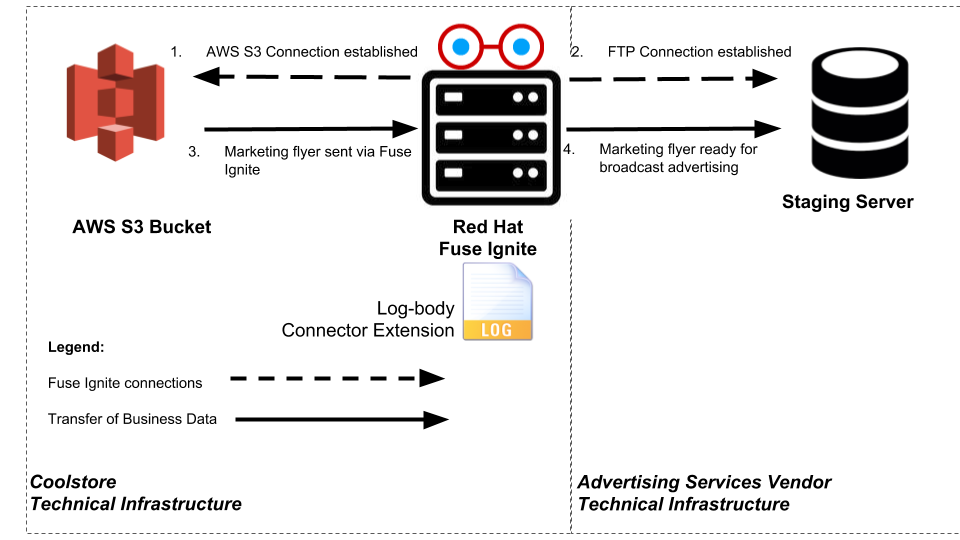
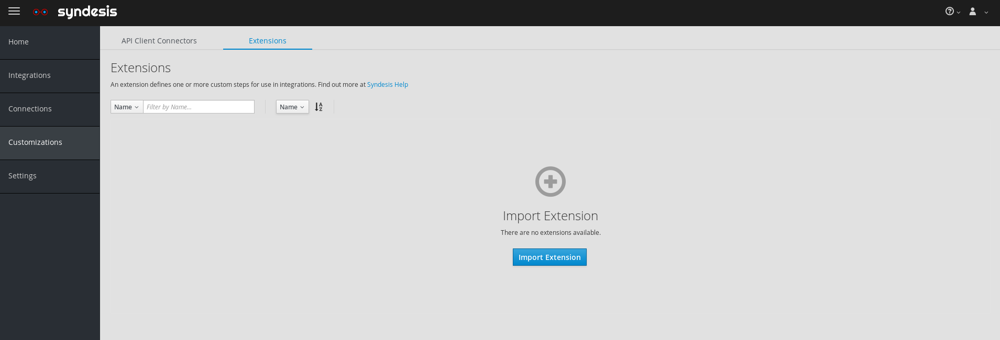
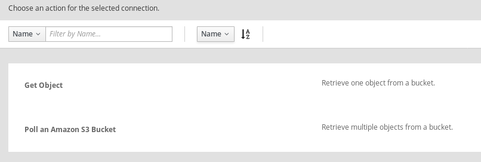
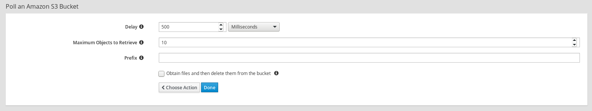

:scrollbar:
:data-uri:
:toc2:
:linkattrs:
:coursevm:

== Connector Technical Extensions for File Replication Lab

NOTE: This lab takes about an hour to complete. It covers topics you need to know to correctly complete the final assessment.

.Goals
* Create an integration using both AWS S3 and FTP connectors
* Create a custom step in Fuse Ignite using the `syndesis-extension-log-body` technical extension
* Introduce the custom step into the integration

.Requirements
* Completion of _Microservice to Flat File Integration Lab_
* Completion of _Connector Technical Extensions Lab_
* An AWS account
* JDK 1.8 installed

.Overview
The Coolstore marketing department intends to launch a demand generation campaign for new promotions. They signed a contract with an advertising services vendor that is responsible for broadcast advertising of Coolstore's latest promotions. The Coolstore marketing department will design a promotional flyer that must be sent to the advertising services vendor for multi-channel broadcast use via social media, print advertising and (e)mailers.

Your task is to design the file replication solution for the transfer of the digital image of the promotional flyer.

In order to meet the marketing department's requirements for a demand generation campaign, your Fuse Ignite integration design uses two connectors--an AWS S3 connector and an FTP connector--as well as a prepackaged technical extension log, which writes a message to the log stream. You create a custom step using this prepackaged technical extension and then use it in a new Fuse Ignite integration.

The marketing flyer resides in an AWS S3 bucket, which is replicated using a Fuse Ignite integration to a staging server where the flyer is to be retrieved for multi-channel broadcasts. The custom step you implement logs a notification regarding the availability of the promotional flyer. The Coolstore marketing department requires that every notification is recorded and sent to the advertising services vendor every time that the marketing flyer is successfully replicated and hosted on the vendor's staging server infrastructure.

:numbered:

== Log In to Fuse Ignite Console

. Log in to the OpenShift Container Platform web console if you are not already logged in.
+
TIP: The link is in your confirmation email, if you need it.

. Click your *fuse-ignite-$GUID* project.
. Click the URL of your Fuse Ignite console.
. Log in using your OPENTLC credentials.
* The Fuse Ignite console appears.

== Compile Technical Extension (Optional)

In this section, you compile a technical extension, `syndesis-extension-log-body`, that records marketing notifications. Note that this section is optional, as a precompiled technical extension is provided for your use in subsequent lab sections.

. Using a command-line terminal window, navigate to the `syndesis-extension-log-body` subdirectory, which contains the code for the technical extension.
. Within the `syndesis-extension-log-body` subdirectory, compile the technical extension using the following command:
+
----
$ mvn -N install
----
+
.Sample Output
----
Downloading from oss-sonatype-snapshots: https://oss.sonatype.org/content/repositories/snapshots/io/syndesis/extension/extension-converter/1.3-SNAPSHOT/maven-metadata.xml
[INFO] HV000001: Hibernate Validator 5.3.5.Final
[INFO] Loaded base partial metadata configuration file: null
[INFO] Looking for configuration to override at Maven Plugin configuration level.
[INFO] Created file /hong/syndesis-extensions-master/syndesis-extension-log-body/target/classes/META-INF/syndesis/syndesis-extension-definition.json
[INFO]
[INFO] --- maven-jar-plugin:2.4:jar (default-jar) @ syndesis-extension-log-body ---
[INFO] Building jar: /hong/syndesis-extensions-master/syndesis-extension-log-body/target/syndesis-extension-log-body-1.0.0.jar
[INFO] META-INF/maven/io.syndesis.extensions/syndesis-extension-log-body/pom.xml already added, skipping
[INFO] META-INF/maven/io.syndesis.extensions/syndesis-extension-log-body/pom.properties already added, skipping
[INFO]
[INFO] --- extension-maven-plugin:1.3-SNAPSHOT:repackage-extension (default) @ syndesis-extension-log-body ---
[INFO] Resolving artifact io.syndesis.extension:extension-bom:pom:1.3-SNAPSHOT from [central (https://repo.maven.apache.org/maven2, default, releases)]
[INFO]
[INFO] --- maven-install-plugin:2.4:install (default-install) @ syndesis-extension-log-body ---
[INFO] Installing /hong/syndesis-extensions-master/syndesis-extension-log-body/target/syndesis-extension-log-body-1.0.0.jar to /root/.m2/repository/io/syndesis/extensions/syndesis-extension-log-body/1.0.0/syndesis-extension-log-body-1.0.0.jar
[INFO] Installing /hong/syndesis-extensions-master/syndesis-extension-log-body/pom.xml to /root/.m2/repository/io/syndesis/extensions/syndesis-extension-log-body/1.0.0/syndesis-extension-log-body-1.0.0.pom
[INFO] ------------------------------------------------------------------------
[INFO] BUILD SUCCESS
[INFO] ------------------------------------------------------------------------
[INFO] Total time: 16.352 s
[INFO] Finished at: 2018-03-27T18:09:41+08:00
[INFO] ------------------------------------------------------------------------
----
* This confirms that compilation of the technical extension was successful.

. Locate the `syndesis-extension-log-body-1.0.0.fuse-000018.jar` file in the `target` subdirectory of the `syndesis-extension-log-body` directory.
* This is the JAR archive file containing the `syndesis-extension-log-body` technical extension.
+
[TIP]
You can either move or copy this JAR archive file to a directory with a shorter name--for example, `/tmp`&#8212;to speed up import of the technical extension in the next section.

== Import Technical Extension

In this section, you import the `syndesis-extension-log-body` technical extension into Fuse Ignite.

NOTE: When you completed the previous lab, the code base for the `Syndesis` community project was located in the `$lab_dir` working directory.

. If you skipped the previous optional section, locate the precompiled technical extension by navigating to the following directory:
+
----
$lab_dir/maven-syndesis-extension-1.0.0.fuse-000018/io/syndesis/extensions/syndesis-extension-log-body/1.0.0.fuse-000018
----
+
[NOTE]
The `syndesis-extension-log-body-1.0.0.fuse-000018.jar` file contains the `syndesis-extension-log-body` technical extension.

. In the left-hand panel of the Fuse Ignite console, click *Customizations*.
. Select the *Extensions* tab, then click *Import Extension*:
+

. Click *Browse* and select the JAR file containing the `syndesis-extension-log-body` technical extension.
* The archive file containing the `syndesis-extension-log-body` technical extension is validated and extracted.

. Click *Import Extension*.
* The technical extension’s name, ID, and description are listed, and `syndesis-extension-log-body` is indicated as the custom step that the technical extension defines.

This custom step is now available for use in any integration.

== Create AWS S3 Bucket

In this section, you create an AWS S3 bucket that hosts the promotional image to be broadcast over social media.

. Launch a new browser window and log in to your AWS account using the link:https://console.aws.amazon.com/console/home[AWS console].
. Follow the instructions in the link:https://docs.aws.amazon.com/AmazonS3/latest/gsg/CreatingABucket.html[AWS documentation] to set up your S3 bucket.
. In your favorite text editor, make a note of the following information about your AWS account:
* ARN (Amazon Resource Name) for the S3 bucket
* Access key
* Secret key
* Region

== Create Connection Using AWS S3 Connector

In this section, you create a connection to your AWS S3 bucket using the AWS S3 connector in Fuse Ignite.

. In the left-hand panel of the Fuse Ignite console, click *Connections*.
. Select the *AWS S3* connector.
* The AWS S3 connection creation screen appears.
. Fill in all of the fields for the Amazon S3 configuration, using the account information that you noted in the previous section.
. Click *Validate*.
* Expect to see a successful validation message.
. Type `AWS-S3` as the name of the connection.
. Click *Done*.
* This makes the configuration changes to the connection final.

== Create Integration

In this section, you create an integration using the AWS S3 connection and the FTP connection.

NOTE: You created the FTP connection in the first lab of Module 2.

=== Configure Start Connection

. In the left-hand panel of the Fuse Ignite console, click *Integrations* and then *Create Integration*.
. On the *Choose a Start Connection* screen, select the *AWS-S3* connection.
. On the *Choose an Action* screen, select *Poll an Amazon S3 Bucket*:
+

. On the *Poll an Amazon S3 Bucket* screen, examine the configurable fields:
+

* *Delay*: Determines the delay interval between polls of the S3 bucket.
* *Maximum Objects to Retrieve*: Determines the maximum number of files in the S3 bucket to be polled and fetched.
* *Prefix*: The criteria used by the filename filter that determines which file to fetch.

. Click *Done*.
* This completes the setup of the *Start* connection.

=== Configure Finish Connection

. In the left-hand panel, select *FINISH*.
. Select the *FTP* connection.
. In the *File name expression* field, type `coolstore-flyer.png`.
. In the *FTP directory* field, type `./htdocs`.
. Click *Next* and then *Done*.
* This completes the setup of the *Finish* connection.

=== Add Step

. In the left-hand panel, hover over the image:images/add_filter_icon.png[] icon located between the *START* connection and the *FINISH* connection and select *Add a step*.
. On the *Choose a Step* screen, select the *syndesis-extension-log-body* technical extension that you created.
. In the *Message* field, type `Flyer is ready on staging server`.
. Click *Done*.
* This adds the custom step to the integration.

=== Complete Integration

. Name the integration `AWS S3 to FTP`.
. Click *Publish*.
* This deploys the integration.
+
****
*Questions:*

* What changes have to be made to either the FTP connection or its setup as part of the integration in the case of multiple promotional flyers in a wide variety of file formats that need to be staged on the vendor's server?
*  Are there also changes that have to made to the AWS S3 connection and its setup during integration design?
****

== Test Integration

In this section, you test the integration by initiating a demand generation campaign.

. In the left-hand panel of the Fuse Ignite console, click *Integrations*.
. Once the state of the *AWS S3 to FTP* integration changes to *Published*, proceed to test it.
. Upload the promotional flyer link:https://raw.githubusercontent.com/gpe-mw-training/fuse-ipaas-labs/master/04_technical_extensions/coolstore-flyer.png[digital image] to your AWS S3 bucket.
. Check the *AWS S3 to FTP* OpenShift pod's log for entries containing the `Flyer is ready on staging server` string.
. Log in to your remote hosting account and validate that the digital image--the promotional flyer--appears in the `htdocs` directory.
+
****
*Question:* Imagine that access to the OpenShift pod logs by both members of the Coolstore marketing department and their advertising services vendor is no longer a viable option due to enhanced corporate security restrictions. What alternative means of both logging and log retrieval can you incorporate in your solution design to address this change?
****

== Clean Up Integration

In this section, you clean up the integration as a housekeeping best practice.

. In the left-hand panel, click *Integrations*.
. Locate the *AWS S3 to FTP* integration.
. Click  (*More Options*) next to the green check box and select *Unpublish*.
. Click *OK*
* This deactivates the integration.
* If you are utilizing the Fuse Ignite Technology Preview, other integration can now be published and tested.
+
[NOTE]
The next two steps are optional. Use them only when you are certain that you do not need the integration anymore.

. Locate the *AWS S3 to FTP* integration, click  (*More Options*), and select *Delete Integration*.
. Click *OK* at the bottom of the summary panel.

You have completed, tested, and cleaned up your integration in Fuse Ignite.

ifdef::showscript[]

endif::showscript[]
