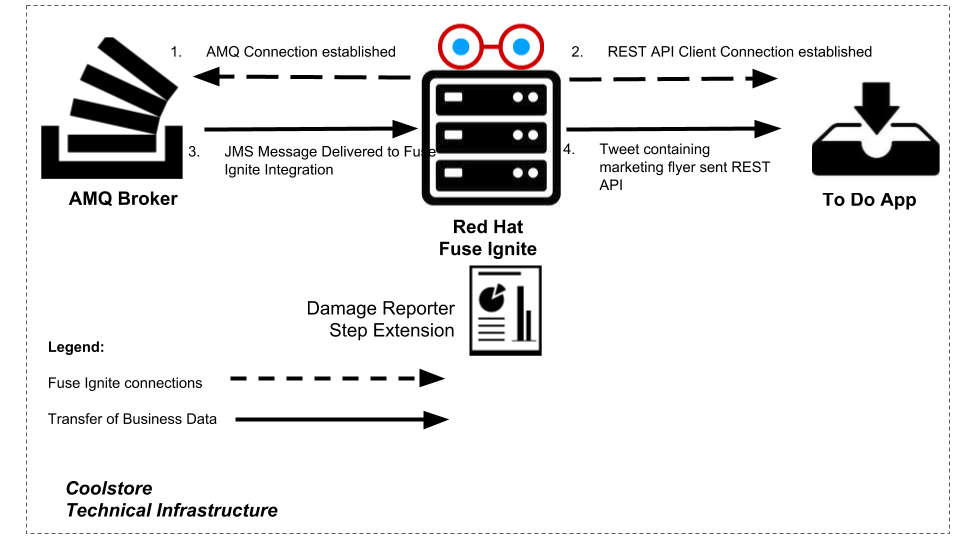
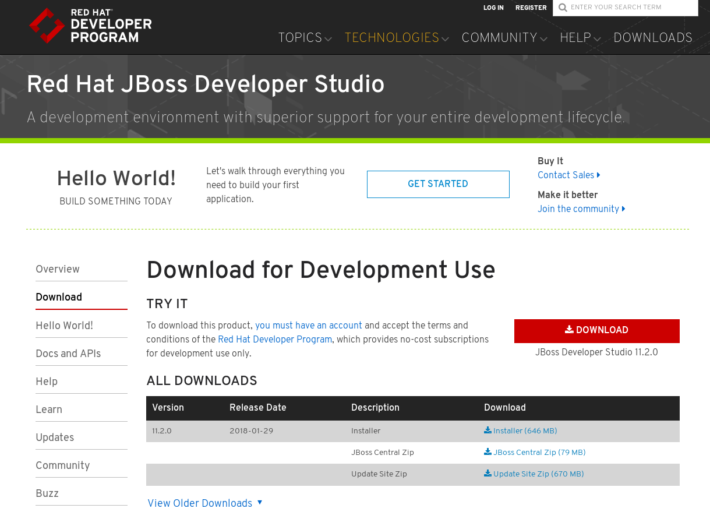
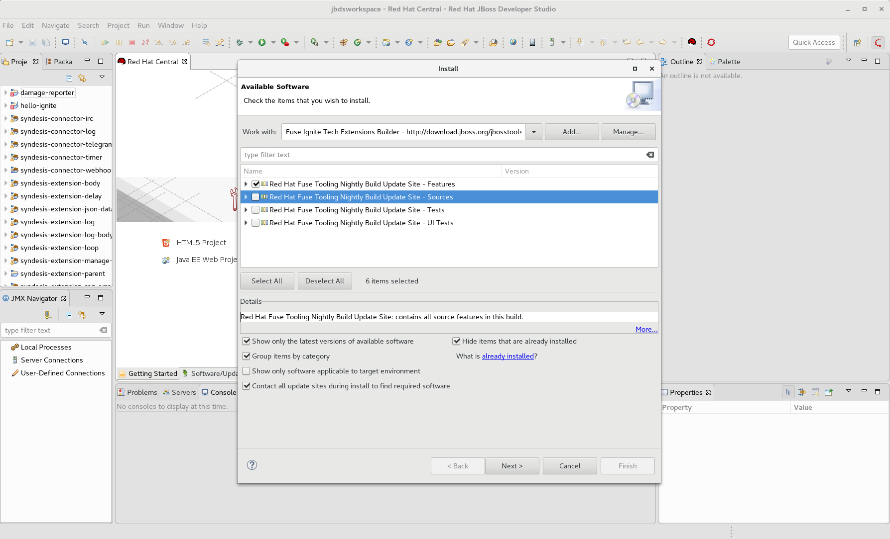
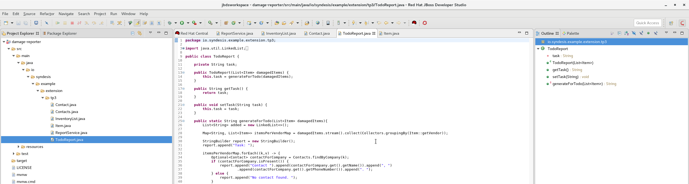

:scrollbar:
:data-uri:
:toc2:
:linkattrs:
:coursevm:

== Step Technical Extensions Lab - Products Damage Reporting

This course includes at least one lab per module. Each lab is hands-on and typically takes about an hour to complete. Executing the course labs prepares you to correctly answer many of the final assessment questions.

.Goals
* Create an integration using a custom developed Spring CDI application as a step extension
* Amend the code in the Spring CDI application in order to alter behaviour of the step extension
* Test the integration

.Requirements
* JDK 1.8 installed

A consumer goods company `Coolstore` intends to provide a damage reporting service for products sold and shipped from vendor locations.
The management of `Coolstore` plans to utilize Fuse Ignite and both the shapeless connectors and the technical extensions features to implement this product damage reporting service for their vendor shipments.
Below is the sequence of events that allows the Damage Reporting service, on Fuse Ignite, to analyze and report the status of product shipments.

:numbered:

=== Logon to Red Hat Fuse Ignite

You will proceed to utilize the Fuse Ignite environment.

. Check your email inbox for the same email you received earlier, containing a link to Red Hat Fuse Ignite.
+
CAUTION: Red Hat Fuse Ignite is supported for the following web browsers: Google Chrome, Mozilla Firefox, Microsoft Edge
+
. Click this link to display the Red Hat Fuse Ignite login page.

. Log in using your OPENTLC account. The Fuse Ignite console page appears.

=== Install JBoss Developer Studio

You will install JBoss Developer Studio (JBDS) 11.2 and the Fuse Ignite Technical Extension plugin.

. Download version 11.2 of link:http://[JBDS], which is packaged within a JAR archive.
+

+
. Once download is complete, launch a command-line terminal window.
. In the window, change working directory to the one containing the JAR archive for JBDS 11.2
. Execute the command:
+
----
$ java -jar devstudio-11.2.0.GA-installer-standalone.jar
----
+
. Accept the defaults shown by the installation wizard, and click *Next* on every window of the wizard, followed finally by clicking *Install* to begin installation.
. After installation is complete, launch JBoss Developer Studio (either from command line or by clicking the JBDS icon).
. From the menu selection bar, select *Help* -> *Install New Software*.
. Click the *Add* button next to the *Work with* field.
. In the *Name* field, provide the text: `Fuse Integration Tooling Builds`
. In the *Location* field, provide the following URL: `http://download.jboss.org/jbosstools/oxygen/snapshots/builds/jbosstools-fuse_master/`
. Click *Ok*.
. After the available repository names appear within the *Install New Software* wizard, select the checkbox next to `Red Hat Fuse Tooling Nightly Build Update Site - Features`.
+

+
. Click *Next*.
. Review the items to be installed and click *Next*.
. Accept the terms and conditions, then click *Finish*. The installation of the latest nightly build for the Fuse Ignite Technical Extension plugin.
. After the plugin is installed, agree to allow JBDS to restart.

=== Import the Damage Reporter application into your JBDS workspace

. Using a new web browser, link:https://github.com/syndesisio/fuse-online-tp3-sample-extension/releases[download] the *latest* source code release for the `Damage Reporter` step extension, in .zip archive format.
. From the JBDS menu bar, select *File -> Import -> Existing Maven Projects*.
. Using the wizard, navigate to the directory containing the `pom.xml` for the `damage-reporter` project.
. After the project import process completes, you will notice a `damage-reporter` project from the *Project Explorer* view in JBDS.

=== Customize the Damage Reporter application

You will customize the Spring-based application `Damage Reporter` to address a new business requirement from `Coolstore` Management.

[NOTE]
Learn how a technical extension is developed with the link:https://access.redhat.com/documentation/en-us/red_hat_jboss_fuse/6.3/html/tooling_user_guide/igniteextension/[JBoss Fuse Tooling Guide]. You will appreciate from this guide that certain conventions regarding a custom developed technical extension’s JSON file contents must be observed.

[TIP]
For technical extensions that you develope based on an Apache Camel route, and not a bean, the entry point of the extension must correspond to a Camel endpoint on that route. In addition, you have to specify both the input data shape and the output data shape, for a technical extension that transforms data types.

. Walkthrough the code of the `damage-reporter` project located in your JBDS workspace.
+

+
* *QUESTION:* Can you map the interaction flows between the six Java classes, either using a whiteboard or your favorite UML modeling tool?
* Discuss and compare your findings with your instructor, your classmate or your colleague. If there are differences, try to arrive on a consensus.
. Make necessary code changes to include the following new contacts:
+
[.noredheader,cols="5,5,5",caption=""]
|======
|*Name*|*Number*|*Company*
|Andreas Chang|937 512 235|Westside Premium
|Bala Gopal|988 345 111|Finest Goods
|Sergio Lucini|862 223 402|Eastside Specialty Outlets
|======
+
. Once the changes are made, save them.
. Perform a `mvn clean install` and export the `damage-reporter` project as a .JAR archive file to your local working directory.

=== Import the Damage Reporter application into Fuse Ignite

You will create a custom step, which will use the technical extension as part of the integration.

A selection of native steps are available in Red Hat Fuse Ignite. They are developed for consumption and manipulation of integration data.

This supply chain integration scenario require the use of a custom step which identifies electronic goods (like smart phones, computer monitors, wireless network routers) that are damaged during transport.

Now, create such a custom step using a pre-developed technical extension, that will identify the damaged goods.

. Select the *Customizations* tab on the left-hand pane of Red Hat Fuse Ignite Console.

. Select the *Extensions* tab.

. Click the *Import Extension* button.

. Click *Browse* and select the JAR file containing the *Damage Reporter* technical extension.
+
[NOTE]
The archive file is validated and extracted. On the Fuse Ignite console, the technical extension’s name, ID, and description are listed, additionally `log` is indicated as the custom step that the technical extension defines.

. Click *Import*. The custom step becomes available for use in any integration, with the details of the technical extension displayed.

=== Create an AMQ connection

You will create an AMQ connection.

. On the left-hand panel of the Fuse Ignite console, click *Connections*.
. Select the *AMQ* connector. The *AMQ* connection creation page loads.
. Configure the connection by entering:
.. In the *Broker URL* field, enter `tcp://broker-amq-tcp:61616` where the messages are delivered and resides.
.. In the *Username* field, enter `amq` as authorized user account.
.. In the *Password* field, enter `topSecret` as the password.
. Leaving all other fields alone, click *Validate*.
. When validation is successful, click Next.
. In the *Connection Name* field, enter `AMQ Broker`.
. In the *Description* field, enter the text `Product status update`.
. Click *Create* to begin connection creation. Notice the new AMQ connection on the Fuse Ignite console.

=== Create a REST API connector

You will create a REST API connection to the *ToDo* application that will be used in this scenario as a message client.

. On the left-hand panel of the Fuse Ignite console, click *Home*.
. Copy the URL for the Fuse Ignite console.
. At the end of the URL, replace the URI path `/dashboard` with `/swagger.json`. You now have a URL in the form: `https://todo-app-<guid>.fuse-
ignite.openshiftapps.com/swagger.json`
. In the Ignite navigation panel, click *Customizations*.
. Click *Create API Connector*.
. Select *Use a URL*.
. In the input box, paste the URL for your Swagger specification and click *Next*.
. On the *Review Swagger Actions* page, click *Next*.
. Click *Next* again to accept *HTTP Basic Authorization*.
. On the *General Connector Info* page, in the *Host* field, paste the URL for your Swagger
specification without the `swagger.json`. For instance: `https://todo-
app-<guid>.fuse-ignite.openshiftapps.com.`
. Click *Create Connector*. Notice the *API Client Connectors* tab contains a `Todo App API` which was just created.

=== Create a REST API connection using the connector

You will create a connection to the *Todo App API*.

1. On the Fuse Ignite console, click *Connections*.
2. Click *Create Connection*.
3. Click the *Todo App API* connector that you have just created.
4. In the *Configuration* wizard, notice that Fuse Ignite populates the *Authentication Type*,
Base Path*, and *Host* fields from the connector information.
5. In the *Password* field, enter `jboss`.
6. In the *Username* field, enter `jboss`.
7. Click *Next*.
8. In the *Connection Name* field, enter `Todo App API Client`.
9. Leave the *Description* field empty.
10. Click *Create*. Notice the connection you have created appears as an icon.

=== Create a Damage Reporting integration

You will create an integration using two connections you have created.

. On the left-hand panel of the Fuse Ignite console, click *Integrations*. The Integration creation wizard is displayed.
. Select on the left-hand panel, the *Start Connection*.
. Click on the *AMQ* connection.
. Click *Next* and then *Done* to complete the setup of the *Start* connection.
. Select on the left-hand panel, the *Finish Connection*.
. Click on the *Todo App API Client* connection.
//. Select the *mention* option from the dropdown box.
//. Provide *Fuse Ignite* as the value in the *Keyword* field.
. Click *Next* and then *Done* to complete the setup of the *Finish* connection.
. Move your pointer cursor over the *+* sign, which is wedged between the *Start* connection and the *Finish* connection.
. Select *Add a step* located on the callout, next to the *+* sign.
. Select from the drop down box, the `log` technical extension that you should just created.
. Provide the value *Flyer was sent* in the message field for the custom step.
. Click *Done*. The custom step has been added to the integration.
. Name the integration _Damage Reporting_.
. Click *Publish*. The integration will be deployed.

=== Implement a custom step in the integration

//include custom step screenshot

You will add the custom step using *Damage Reporter*.

. In the center of the console, click *Add a Step*.
. On the *Choose a Step* page, click *Damage Reporter*.
. In the left panel, hover over the `+` sign between the damage reporter step and the finish
connection to display a pop-up in which you click Add a Step .
. On the *Choose a Step* page, click *Data Mapper*.
+
[NOTE]
In the data mapper, the *Sources* panel on the left displays the fields in the output from the damage reporter step. The *Target* panel on the
right displays the fields in the database that the *To Do App API* accesses.
+
. In the *Sources* panel, click the *task* field.
. In the *Target* panel, expand the *body* field and click *task*.
. Click Done.

=== Test the integration

You will test the integration.

. On the Fuse Ignite console, click *Integrations*.
. Confirm that your *Damage Reporting* integration is *Published* and active.
. In a new web browser window, go to the *To Do app* display by appending *todo-* in front of the URL
for your Fuse Ignite installation. The resulting URL should resemble `https://todo-app-<guid>.fuse-
ignite.openshiftapps.com/``
. Using the *To Do app*, click *Show JMS Form* to display a field for a XML message.
. Click *Send JMS Message* to send that message to the AMQ broker.
+
[NOTE]
Successful execution returns a task from the *To Do app client API*. The task identifies the ID of
the damaged item as well as the contact information for its vendor.
+
. Edit the *XML message* to specify two damaged items:
.. Click *Show JMS Form* to display the message input box again.
.. In the XML message, change the entry for the undamaged item to specify
damaged="true".
.. Click *Send JMS Message*. The *To Do app client API* returns a new task that contains IDs for
two damaged items and contact information for the two vendors.
. Edit the XML message to specify an unknown vendor:
.. Click *Show JMS Form*.
.. In the XML message, for an item that has damaged="true", change the name of the
vendor.
.. Click *Send JMS Message*. The *To Do app client API* returns a new task that indicates that
there is no contact information for the vendors of `Coolstore`.

=== Housekeeping

You will clean up the integration. as a housekeeping best practice.

. In the left-hand pane, click *Integrations*.
. Locate the entry for the _Damage Reporting_ integration.
. Click the icon displaying three black dots in a vertical sequence, located right of the green check box. A drop down list appears.
. Select *Unpublish* from the drop down list, followed by selecting *OK* in the pop-up window. This will deactivate the integration.
* If you are utilizing the Fuse Ignite Technical Preview, some other integration can now be published and tested.
+
[NOTE]
The next few steps are optional. Use them only when you are certain that the integration will never be required again.
+
. Locate the entry for the _Damage Reporting_ integration.
. Click the icon displaying three black dots in a vertical sequence, located right of the green check box. A drop down list appears.
. Click *Delete Integration*, followed by clicking *OK*, at the bottom of the summary pane.

You have completed, tested and cleaned up your integration in Fuse Ignite.

ifdef::showscript[]

=== Examine existing technical extensions

Next, register Fuse Ignite as a client application for the online Twitter service. With this accomplished, any number of integrations connecting Twitter can be created.

. At the Fuse Ignite console, copy the Fuse Ignite URL from URL field in the web browser.
. On the left-hand panel of the Fuse Ignite console, click *Settings*.
. On the *OAuth Application Management* webpage, notice the _Twitter_ icon.
. On the left of the _Twitter_ icon, click the *Register* button.
. Notice both the *Client ID* and *Client Secret* fields are displayed.
. Launch another web browser window, and type `http://apps.twitter.com` in the URL field.
. After typing, hit the *Enter* button on your keyboard.
. When the login page is fully loaded, log into your *Twitter* account.
. Click *Create New App*.
. In the _Name_ field, provide the name of this new app.
+
NOTE: The app name must be unique among all other apps registered using your *Twitter* account.
+
. In the _Description_ field, enter helpful information. Twitter requires some input in this field.

. In both the _Website_ and _Callback URL_ fields, paste your Fuse Ignite URL (which you copied earlier into the clipboard) .

. Remove the URI suffix `dashboard` from the end of the value in the _Callback URL_ field.
. Append the string `api/v1/credentials/callback` to the value in the _Callback URL_ field.
+
NOTE: For example: https://app-proj9128.7b63.fuse-ignite.openshiftapps.com/api/v1/credentials/callback.
+
. Click *Yes*, and thereby agreeing to the terms and conditions of the *Twitter* developer agreement.
. Click *Create your Twitter application*.
. Select the *Keys and Access Tokens* tab.
. The `Consumer Key` appears on the web page. Copy it.
. In the other web browser window, select the *Settings* tab on the Fuse Ignite console.
. Paste the *Twitter* `Consumer Key` into the *Twitter Client ID* field.
. In the web browser window for your Twitter account, locate the *Twitter Keys and Access Tokens* tab.
. Copy the `Consumer Secret`.
. Paste the string into the *Twitter Client Secret* field in the Fuse Ignite console.
. Click *Save*. followed by clicking *OK*.

You have completed the setup of Fuse Ignite as a Twitter client application.

=== Create Salesforce Connection

Before an integration can be created, a connection has to be created for each cloud service endpoint that will be integrated. These cloud services have to support the link:https://oauth.net/2[OAuth protocol].

. On the Fuse Ignite console, click the *Connections* tab.

=== Create Twitter Connection

. On the Fuse Ignite console, click the *Connections* tab.

=== Create Integration between Salesforce and Twitter

The integration starts by accessing the Salesforce application from which data is retrieved from.

. Select the Salesforce connection. This is the *start* connection point of the integration you are creating.
. Select the *action* that the *start* connection has to perform.
. As an option (and this varies among connections), provide configuration information to the *start* connection. For instance, indicate if the action involves either a Salesforce lead or a Salesforce opportunity.
. Select the Twitter connection. This is the *finish* connection which accesses the application that consumes the data retrieved by the *start* connection, thereby completing the integration.
. Select the *action* that the *finish* connection is required to perform. Similarly to the earlier *action* selected, this *action* can involve data update.
. As an option, provide configuration information to the *finish* connection.
. Click *Publish* to begin testing the integration.
+
NOTE: As the business use case evolves, additional connections to other applications can be introduced as part of the integration. These connections can exist anywhere between the *start* connection and the *finish* connection.
+
. OPTIONAL: Add new connections into the integration.
. OPTIONAL: Add several steps in order to manipulate the data used in the integration. _Data filtering and _data mapping_ are recommended steps to introduce.

endif::showscript[]
