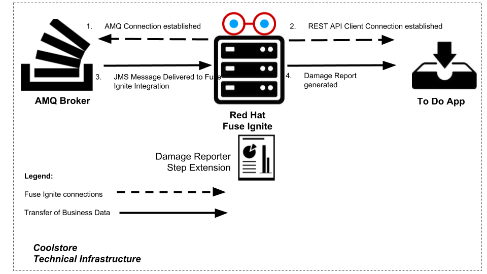

:scrollbar:
:data-uri:
:toc2:
:linkattrs:
:coursevm:

== Step Technical Extensions Lab

NOTE: This lab takes about an hour to complete. It covers topics you need to know to correctly complete the final assessment.

.Goals
* Create an integration using a custom-developed Spring CDI application as a step extension
* Amend the code in the Spring CDI application to alter the step extension behavior
* Test the integration

.Requirements
* Completion of _AMQ to RESTful Service Connector Lab_
* Completion of _Connector Technical Extensions for File Replication Lab_
* JDK 1.8 installed

.Overview
A consumer goods company, Coolstore, intends to provide a damage reporting service for products sold and shipped from vendor locations. Coolstore management plans to use Fuse Ignite, shapeless connectors, and technical extensions to implement this damaged-product reporting service.

The diagram below documents the sequence of events that allows the damage reporting service on Fuse Ignite to analyze and report the status of product shipments.

Coolstore wants you to log the status of each damaged-product report. In this lab, you create a Fuse Ignite integration that implements a custom step that uses a logging mechanism developed as a Fuse Ignite technical extension to achieve this objective.

:numbered:

== Log In to Fuse Ignite Console

. Log in to the OpenShift Container Platform web console if you are not already logged in.
+
TIP: The link is in your confirmation email, if you need it.

. Click your *fuse-ignite-$GUID* project.
. Click the URL of your Fuse Ignite console.
. Log in using your OPENTLC credentials.
* The Fuse Ignite console appears.

== Install Red Hat Developer Studio

In this section, you install Developer Studio 11.2 and the Fuse Ignite technical extension plug-in.

. Download version 11.2 of link:https://developers.redhat.com/products/devstudio/download/[Developer Studio], which is packaged as a JAR archive:
+
image::images/jbds-download.png[]

. Once the download is complete, launch a command-line terminal window and change to the directory containing the JAR archive for Developer Studio 11.2.
. Execute the following command:
+
----
$ java -jar devstudio-11.2.0.GA-installer-standalone.jar
----

. Accept the defaults provided by the installation wizard by clicking *Next* on every screen, and then click *Install*.
. After the installation is complete, launch Developer Studio, either from the command line or by clicking the Developer Studio icon.
. Select *Help -> Install New Software*.
. To the right of the *Work with* field, click *Add* and complete the fields as follows:
* *Name*: `Fuse Integration Tooling Builds`
* *Location*: `http://download.jboss.org/jbosstools/oxygen/snapshots/builds/jbosstools-fuse_master/`
. Click *OK*.
. After the available repository names appear on the *Available Software* screen, check the box next to *Red Hat Fuse Tooling Nightly Build Update Site - Features*, then click *Next*:
+

. Review the items to be installed and click *Next*.
. Accept the terms and conditions and click *Finish*.
* This starts the installation of the Fuse Ignite technical extension plug-in.
. After the plug-in is installed, agree to allow Developer Studio to restart.

== Import Damage Reporter Application

In this section, you import the damage reporter application into Developer Studio for analysis and eventual compilation of the code.

. Download the repository containing the lab assets to the `<$lab_dir>` working directory using `git`:
+
----
$ cd <$lab_dir>
$ git clone https://github.com/gpe-mw-training/fuse-ipaas-labs
----

. From the Developer Studio menu, select *File -> Import -> Existing Maven Projects*.
. Navigate to the directory containing the `pom.xml` file for the `damage-reporter` project:
+
----
/<$lab_dir>/fuse_ipaas_labs/04_technical_extensions/damage_reporter
----
. After the project finishes importing, look for the `damage-reporter` project in the *Project Explorer* view in Developer Studio.
+
[NOTE]
The `damage-reporter` project is a Java application that uses an Apache Camel route. The project also implements a Spring-managed component called `reportService`, which generates a list of damaged items that are eventually included, together with the vendor contact list, in the damaged-product report.

. In the *Project Explorer* view, navigate through the `damage-reporter` project source code by expanding all of the subdirectory branches of the `src/main/java` directory structure.
. Inspect the Java source files.
+
****
*Question:* Which Java source file implements the Spring-based `reportService` and which Java source file handles the damage report generation?
****
+
. Locate the `syndesis-extension-definition.json` extension definition file and double-click it.
* It resides in the `../resources/META-INF/syndesis` subdirectory.
. Analyze the contents of the extension definition file, and visualize the use of this extension:
+
image::images/extension-definition.png[]

. Expand the *Outline* view and inspect the structure of the extension definition:
+

+
****
*Questions:*

* Looking at the extension definition, what configurable aspects of the technical extension can you identify?
* If you had a new requirement for a complex data structure or shape as an input, how would you design the technical extension?
****
+
. In the *Project Explorer* view, navigate to the `../resources/camel` subdirectory in the `damage-reporter` project.
. Locate the `extension.xml` file, which contains the Apache Camel route definition:
+
image::images/extension-camel-route.png[]
+
[NOTE]
In Fuse Ignite, every technical extension consists of implementation code as well as a technical extension definition file. The definition file defines the action that the extension performs, the type of implementation (either Camel endpoint or bean), the input data type, and the output data type. By changing the data types, different types of data (shapeless or shaped) can be handled using custom technical extensions.

. Analyze the `damage-report` Camel route, using both the *Source* and *Design* tabs of the Camel Editor plug-in.
+
****
*Questions:*

* What other possible exceptional circumstances, apart from reporting damaged products, can this damage reporting application be used for?
* How would you redesign the Camel route to meet those use case requirements?
****

== Customize Damage Reporter Application

In this section, you customize the Spring-based damage reporter application to address a new business requirement from Coolstore management.

[NOTE]
Use the link:https://access.redhat.com/documentation/en-us/red_hat_jboss_fuse/6.3/html/tooling_user_guide/igniteextension/[Tooling User Guide] to learn how a technical extension is developed. This guide points out the conventions that must be followed regarding the contents of a custom-developed technical extension’s JSON file.

[TIP]
For technical extensions that you develop based on an Apache Camel route instead of a bean, the entry point of the extension must correspond to a Camel endpoint on that route. In addition, you have to specify both the input data shape and the output data shape for a technical extension that transforms data types.

. Walk through the `damage-reporter` project's code in your Developer Studio workspace:
+
image::images/damage-reporter-jbds.png[]
+
****
*Question:*

* Can you map the interactions between the six Java classes, using either a whiteboard or your favorite UML modeling tool?
** Discuss and compare your findings with your instructor, a classmate, or a colleague. If there are differences, try to arrive at a consensus.
****

. Make the necessary code changes to include the following new contacts:
+
[options="header",cols="5,5,5"]
|======
|Name|Number|Company
|Andreas Chang|937 512 235|Westside Premium
|Bala Gopal|988 345 111|Finest Goods
|Sergio Lucini|862 223 402|Eastside Specialty Outlets
|======

. Save your changes.
. Compile the `damage-reporter` project:
.. In the *Project Explorer* view, right-click the project and select *Run As -> Run Configurations*:
+
image::images/run-as-run-configurations.png[]
+
.. In the *Run Configurations* window, type `clean install` in the *Goals* field.
.. Make sure that the *User settings* field has the correct path for your Apache Maven `settings.xml` file.
.. Click *Apply*, then click *Run*.
+
[NOTE]
This sequence of steps is equivalent to executing the `mvn clean install` command from the command line.
+
image::images/run-configurations.png[]

. From the *Console* view, validate that the compilation of the `damage-reporter` project is a success:
+

+
.Sample Output
----
[INFO] --- syndesis-maven-plugin:1.2.9:repackage-extension (repackage) @ damage-reporter ---
[INFO] Resolving artifact org.springframework.boot:spring-boot-dependencies:pom:1.5.8.RELEASE from [central (https://repo.maven.apache.org/maven2, default, releases)]
[INFO] Resolving artifact org.apache.camel:camel-spring-boot-dependencies:pom:2.21.0 from [central (https://repo.maven.apache.org/maven2, default, releases)]
[INFO] Resolving artifact io.syndesis:syndesis-rest-parent:pom:RELEASE from [central (https://repo.maven.apache.org/maven2, default, releases)]
[INFO] Resolving artifact io.syndesis:integration-runtime:pom:RELEASE from [central (https://repo.maven.apache.org/maven2, default, releases)]
[INFO]
[INFO] --- maven-install-plugin:2.4:install (default-install) @ damage-reporter ---
[INFO] Installing /hong/fuse-online-tp3-sample-extension-1.2.9/target/damage-reporter-1.2.9.jar to /root/.m2/repository/io/syndesis/example/damage-reporter/1.2.9/damage-reporter-1.2.9.jar
[INFO] Installing /hong/fuse-online-tp3-sample-extension-1.2.9/pom.xml to /root/.m2/repository/io/syndesis/example/damage-reporter/1.2.9/damage-reporter-1.2.9.pom
[INFO] ------------------------------------------------------------------------
[INFO] BUILD SUCCESS
[INFO] ------------------------------------------------------------------------
[INFO] Total time: 6.235 s
[INFO] Finished at: 2018-04-04T16:19:23+08:00
[INFO] Final Memory: 51M/483M
[INFO] ------------------------------------------------------------------------
----

== Export Damage Reporter Application

In this section, you export the `damage-reporter` project from Developer Studio to your local working directory as a JAR archive file.

. In the *Project Explorer* view, expand the `target` branch of the `damage-reporter` project.
. Right-click the JAR file and select *Export*:
+

+
. In the *Export* window, select `File System` and navigate to your preferred working directory:
+
image::images/export-file-system.png[]
+
. Click *Finish*.
+
TIP: If you are not able to successfully compile and download the damage reporter application, you can download the link:https://github.com/gpe-mw-training/fuse-ipaas-labs/blob/master/04_technical_extensions/damage-reporter-1.3.4.jar?raw=true[precompiled damage reporter application].

== Import Damage Reporter Application into Fuse Ignite

In this section, you create a custom step that uses a technical extension as part of the integration.

A selection of native steps are available in Fuse Ignite that were developed for the consumption and manipulation of integration data. This supply chain integration scenario requires the use of a custom step that identifies electronic goods (such as smartphones, computer monitors, and wireless network routers) that were damaged during transport. In this section, you create such a custom step using a previously developed technical extension that identifies the damaged goods.

. In the left-hand panel of the Fuse Ignite console, click *Customizations*.

. Select the *Extensions* tab.

. Click *Import Extension*.

. Click *Browse* and select the JAR file containing the damage reporter technical extension.
* The archive file is validated and extracted.

. On the Fuse Ignite console, note that the technical extension’s name, ID, and description are listed, and `Damage Reporter` is listed under Supported Steps as the custom step that the technical extension defines.

. Click *Import*.
* The details of the technical extension are displayed.

The custom step is now available for use in any integration.

== Configure the AMQ broker

In this section, you set up the AMQ broker included in the Fuse Ignite installation.

. From the OpenShift Container Platform web console, click the active OpenShift pod icon to the right of the deployment with `amq` in the name, such as `broker-amq`:
+
image::images/01-Step-53.png[]
+
[NOTE]
OpenShift pods are similar to virtual machine instances as far as a container is concerned. Each pod is allocated its own internal IP address, and containers within pods can share their local storage and networking.

. Click the *Open Java Console* link to access the ActiveMQ console:
+

+
. In the ActiveMQ console, click the *Create* tab:
+
image::images/01-Step-56.png[]
+
. Complete the form as follows:
.. In the *Queue name* field, type `inventoryReceived`.
.. For *Destination type*, select the *Queue* radio button.
. Click *Create Queue*.
. In the left-hand panel, expand the *Queue* folder and confirm that the `inventoryReceived` queue was created.

== Create an AMQ connection

In this section, you create an AMQ connection if you have not done so already. If you created an AMQ connection in a previous lab, you can skip this section and proceed to the <<CrossRefAnchor>> section.

. Switch to the browser window displaying the Fuse Ignite console.
. In the left-hand panel, click *Connections*, then click *Create Connection*.
. Select the *AMQ* connector:
+

. On the *Configure Connection* screen, complete the fields as follows:
* *Broker URL*: `tcp://syndesis-amq-tcp:61616`
** This is where the messages are delivered and reside.
* *User Name*: `uservKL`
* *Password*: `RA8oNMOg`
* Leave all other fields as is
. Click *Validate*, then click *Next*.
. On the *Name Connection* screen, complete the fields as follows:
* *Connection Name*: `AMQ Broker`
* *Description*: `Product status update`
. Click *Create*.
* Expect to see the new AMQ connection in the Fuse Ignite console.

[[CrossRefAnchor]]
== Remove To Do Application's Route Security

. In the OpenShift Container Platform web console, navigate to *Applications -> Routes*.
. Click *todo* to go to the todo route page.
. Click *Actions* and select *Edit*:
+

. Scroll down to the *Security* section and locate the *Secure route* check box:
+

. Uncheck the box to remove security on the To Do application's route:
+

. Click *Save*.

== Create REST API Connector

In this section, you create a REST API connection to the To Do application that is used in this scenario as a message client.

. In the left-hand panel of the Fuse Ignite console, click *Home*.
. Copy the URL for the Fuse Ignite console.
. At the front of the URL, insert `todo-` and at the end of the URL, append `/swagger.json`.
* You now have a URL for the Swagger specification for the To Do application that resembles this:
+
.Sample URL
----
https://todo-fuse.fuse-ignite-<$GUID>.apps.<$Environment_ID>.openshift.opentlc.com/swagger.json
----

. In the left-hand panel, click *Customizations*.
. Click *Create API Connector*.
. Select the *Use a URL* radio button.
. Paste the URL for your Swagger specification into the field and click *Next*.
. On the *Review Swagger Actions* screen, click *Next*.
. Click *Next* again to accept *HTTP Basic Authorization*.
. On the *General Connector Info* screen, in the *Host* field, paste the To Do application's Swagger specification URL and remove `/swagger.json` from the end:
+
.Sample URL
----
https://todo-fuse.fuse-ignite-<$GUID>.apps.<$Environment_ID>.openshift.opentlc.com
----
+
. Click *Create Connector*.
* The *Todo App API* now appears on the *API Client Connectors* screen.

== Create REST API Connection

In this section, you create a connection to the Todo App API.

. In the left-hand panel of the Fuse Ignite console, click *Connections*.
. Click *Create Connection*.
. Select the *Todo App API* connector that you created.
* On the *Configure Connection* screen, note that Fuse Ignite populates the *Authentication Type*,
*Base Path*, and *Host* fields from the connector information.
. In the *Username* field, type `uservKL`.
. In the *Password* field, type `RA8oNMOg`.
. Click *Next*.
. In the *Connection Name* field, type `Todo App API Client`.
. Leave the *Description* field empty.
. Click *Create*.
* Expect to see the connection appear on the *Connections* screen.

== Create Damage Reporter Integration

In this section, you create an integration using the two connections you have created.

. In the left-hand panel of the Fuse Ignite console, click *Integrations* and then *Create Integration*.
. On the *Choose a Start Connection* screen, select the *AMQ* connection.
. On the *Choose an Action* screen, select the *Subscribe for messages* action:
+

* This action sets the *AMQ Broker* connection as a queue subscriber.
. On the *Subscribe for messages* screen, complete the following fields:
* *Destination Name*: `inventoryReceived`
* *Destination Type*: *Queue*
+

+
. Click *Next* and then *Done*.
* This completes the setup of the *Start* connection.
. In the left-hand panel, select *FINISH*.
. On the *Choose a Finish Connection* screen, select *Todo App API Client*.
. On the *Choose an Action* screen, select *Create Task*.
. Click *Next*, and then click *Done*.
* This completes the setup of the *Finish* connection.

== Implement Custom Step

//include custom step screenshot

In this section, you add the damage reporter custom step to the integration.

. In the center of the console, click *Add a Step*.
. On the *Choose a Step* screen, select *Damage Reporter*.
. In the left-hand panel, hover over the image:images/add_filter_icon.png[] icon located between the *Damage Reporter* step and the *Finish* connection and select *Add a Step*.
. On the *Choose a Step* screen, select *Data Mapper*.
+
[NOTE]
In the data mapper, the *Sources* panel on the left displays the fields in the output from the damage reporter step. The *Target* panel on the right displays the database fields that the *Todo App API* accesses.

. In the *Sources* panel, click *task*.
. In the *Target* panel, expand the *body* folder and click *task*.
. Click *Done*.
* The custom step is added to the integration.

== Publish Integration

. Name the integration `Damage Reporting`.
. Click *Publish*.
* This deploys the integration.
+
****
*Question:* At this stage, are you able to visualize the objective of the integration based on its design and anticipate the results?
****

== Test Integration

In this section, you test the integration.

. In the Fuse Ignite console, click *Home* and copy the URL of your Fuse Ignite installation.
. In the left-hand panel, click *Integrations*.
. Confirm that the *Damage Reporting* integration is *Published* and active before proceeding.
. Open another browser window, paste the URL into the URL field, and append `todo-` as shown:
+
.Sample URL
----
https://todo-fuse.fuse-ignite-<$GUID>.apps.<$Environment_ID>.openshift.opentlc.com
----

. Press *Enter* to access the To Do application.
. Click *Show JMS Form* to display the XML message.
. Click *Send JMS Message* to send that message to the AMQ broker.
* Successful execution returns a task from the Todo App API that identifies the ID of the damaged item as well as the contact information for its vendor.

. Edit the *XML message* to specify two damaged items:
.. Click *Show JMS Form* to display the message field again.
.. In the XML message, change the entry for the undamaged item to `damaged="true"`.
.. Click *Send JMS Message*.
* The Todo app API returns a new task that contains IDs for two damaged items and contact information for the two vendors.
. Edit the XML message to specify an unknown vendor:
.. Click *Show JMS Form*.
.. In the XML message, for an item that has `damaged="true"`, change the name of the vendor.
.. Click *Send JMS Message*.
* The Todo App API returns a new task that indicates that there is no contact information for one of the Coolstore vendors.

== Clean Up Integration

In this section, you clean up the integration as a housekeeping best practice.

. In the left-hand panel, click *Integrations*.
. Locate the *Damage Reporting* integration.
. Click  (*More Options*) next to the green check box and select *Unpublish*.
. Click *OK*
* This deactivates the integration.
* If you are utilizing the Fuse Ignite Technology Preview, other integration can now be published and tested.
+
[NOTE]
The next two steps are optional. Use them only when you are certain that you do not need the integration anymore.

. Locate the *Damage Reporting* integration, click  (*More Options*), and select *Delete Integration*.
. Click *OK* at the bottom of the summary panel.

You have completed, tested, and cleaned up your integration in Fuse Ignite.

ifdef::showscript[]

endif::showscript[]
