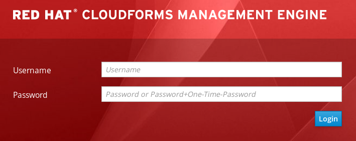
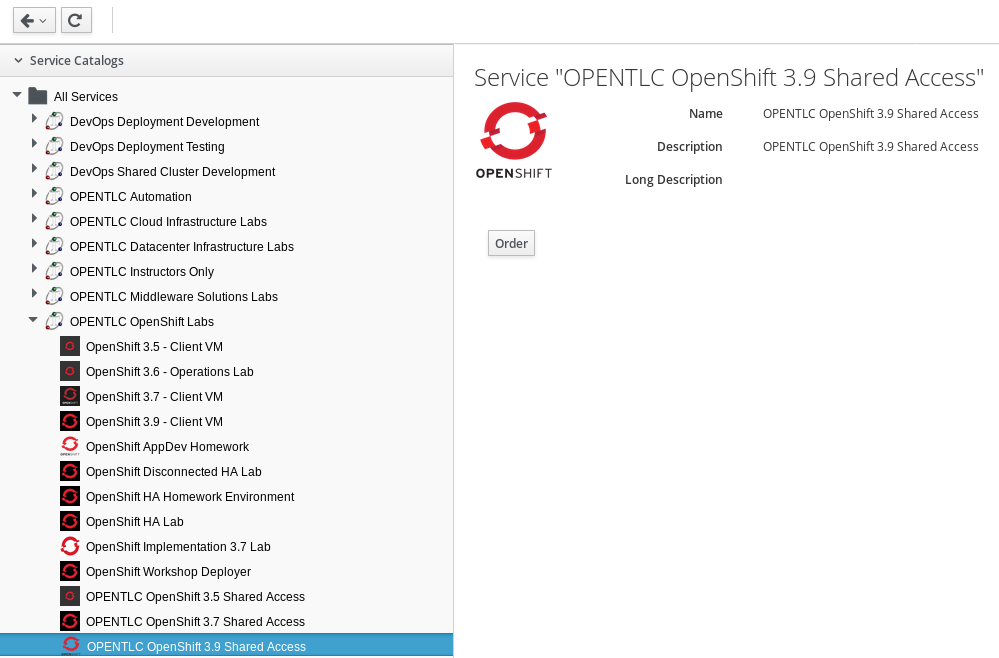
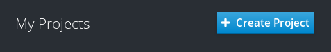
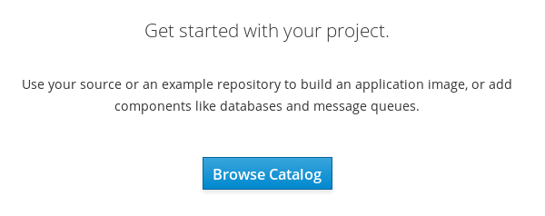
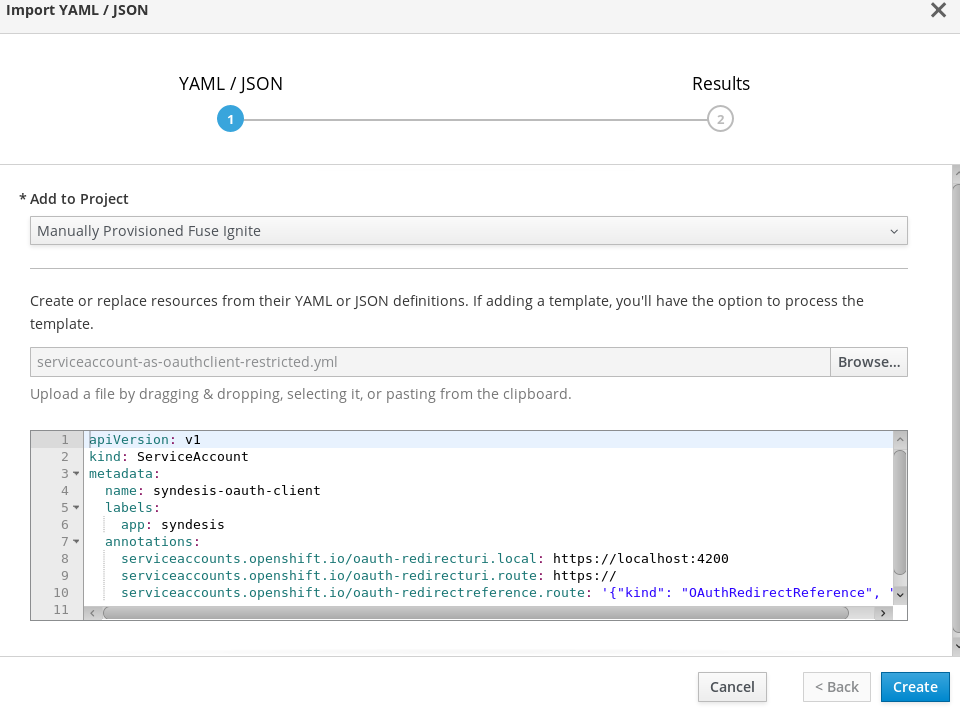
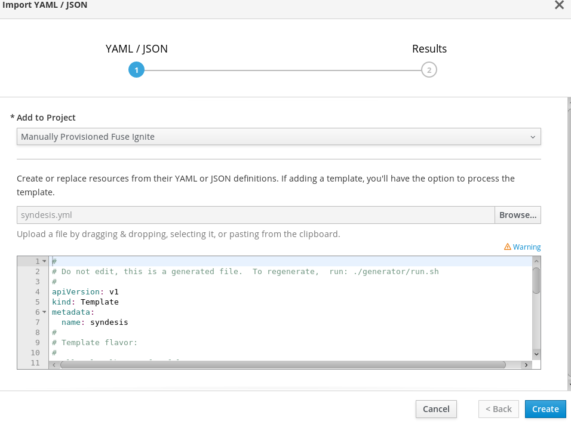
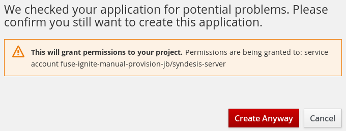
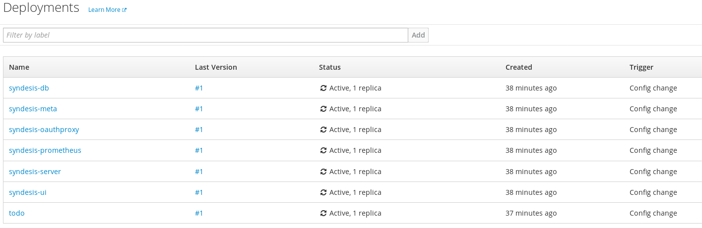
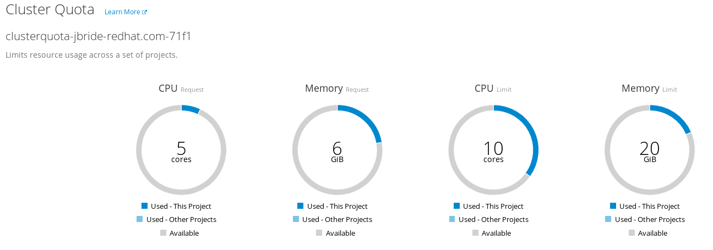
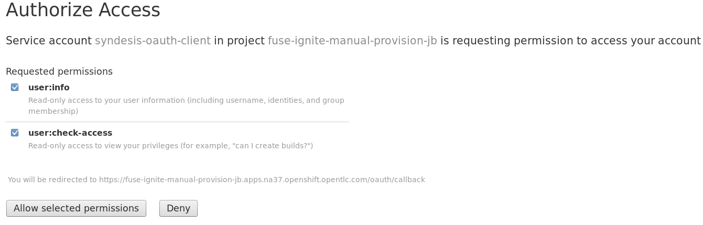

:scrollbar:
:data-uri:
:toc2:
:linkattrs:
:ignite_template: link:https://raw.githubusercontent.com/syndesisio/syndesis/master/install/syndesis.yml[Fuse Ignite template]
:ignite_sa: link:https://raw.githubusercontent.com/syndesisio/syndesis/master/install/support/serviceaccount-as-oauthclient-restricted.yml[OAuth Client Service Account]

== Fuse Ignite Provisioning Lab

.Goal
* Provision Fuse Ignite in an OpenShift environment

:numbered:

.Overview

The Ignite component is available through either of the following:

* Hosted on link://https://manage.openshift.com/[OpenShift Online] as a Software-as-a-Service offering called _Red Hat Fuse Online_.
** This lab does not discuss access to nor utilization of this approach.

* As a component of Red Hat Fuse called _Fuse Ignite_ that is deployed in an OpenShift Container Platform environment.
** The focus of this lab is on this approach.

Fuse Ignite is provisioned in a single remote OpenShift project. For the purposes of this lab, this single remote OpenShift project is provided to you and does not require you to install OpenShift Container Platform.

== Install `oc` Utility

The majority of the Fuse Ignite installation procedures described in this lab use the OpenShift Container Platform web console. There is one step in the process that needs to be executed at the command line using the OpenShift `oc` utility.

. If you do not already have version 3.7 of the `oc` utility installed on your local machine, download it from the link:https://access.redhat.com/downloads/content/290[Red Hat Customer Portal] and install it on your local machine.

== Provision OpenShift Container Platform Environment

In this section of the lab, you register for the ability to create a project in your remote OpenShift lab environment.

. In your browser, navigate to the link:https://labs.opentlc.com/[OPENTLC lab portal] and use your OPENTLC credentials to log in:
+

. Navigate to *Services -> Catalogs -> OPENTLC OpenShift Labs -> OPENTLC OpenShift 3.7 Shared Access*:
+

. Click *Order* in the panel on the right.

. In the next panel, check the confirmation box and then click *Submit* in the lower right corner.

. Expect to receive an email confirming that your environment has been provisioned.

. Save this email--it confirms your access to a remote OpenShift Container Platform environment.

* Pay particular attention to the URL of the OpenShift Container Platform master node referenced in this email. You navigate to this OpenShift Container Platform master node for the duration of this course.

=== Create Fuse Ignite Project

. Using your browser, access the master node of the OpenShift Container Platform provided in the lab confirmation email.
.. Click through the browser's warnings that it has no knowledge of the Certificate Authority associated to your OpenShift Container Platform web console--it is secured using a self-signed certificate.

. Log in using your OPENTLC credentials.

. In the right-hand panel of the home page, click *Create Project*:
+

. Fill in the pop-up form with the following values:

.. *Name*: `fuse-ignite-manual-provision-<your initials>`
.. *Display Name*: `Manually Provisioned Fuse Ignite`
.. *Description*: `Manually Provisioned Fuse Ignite`
. Click *Create*.

. Select the new project and navigate to *Resources -> Quota*:
.. In the *Cluster Quota* section, review the details of the `clusterquota` assigned to your user account.
** This is set by the OpenShift system administrator to define resource limits at an aggregate level.
.. Scroll down to the *Limit Range* section.
** This displays the `limitrange` automatically assigned to your OpenShift Container Platform project.
** This is set by the OpenShift system administrator to define limits and defaults on individual pods and containers.
** The assigned `clusterquota` and `limitrange` allow for a successful deployment of Fuse Ignite.

. At the command line, authenticate into your OpenShift environment using the `oc` utility:
+
-----
$ oc login <openshift master URL> -u <opentlc userId>
-----

Now that you have access to an OpenShift Container Platform lab environment and have created a project, you are prepared to provision Fuse Ignite in that project.

== Review Fuse Ignite Artifacts

Fuse Ignite includes an OpenShift template that defines most of the artifacts to be provisioned for a Fuse Ignite deployment. Generally, the templates are intended to be tweaked as needed by application developers. However, for the purposes of this lab, the {ignite_template} is sufficient without changes.

. Point your browser to the {ignite_sa} and save a copy to your local file system so that you can study it more easily.
+
[NOTE]
====
Service accounts have access to limited basic user information (including the checking of user access) and role-based privileges within the service account’s own namespace. Therefore, a service account can be used as a limited OAuth client.
====
+
. Point your browser to the {ignite_template} and save a copy to your local file system so that you can study it more easily.
. Open the template in a text editor and observe the following:
* The majority of the template consists of a list of `parameters` (starting at about line 19) and a list of template `objects` (starting at about line 132).
* There are two `DeploymentConfig` artifacts defined that, when started, create two pods:
** `syndesis-ui`: The Web application that provides the Fuse Ignite console interface
** `syndesis-db`: A PostgreSQL-based database useful for integration use cases that require a relational database
** `syndesis-meta`: Validator for all configurations
** `syndesis-oauthproxy`: Interacts with the OAuth2 provider implementation of OpenShift to proxy authentication and authorization needs for the Fuse Ignite web application
** `syndesis-server`: The Red Hat Fuse server where Camel-based routes are executed at runtime
** `todo`: A simple PHP-based example web application that tracks To-Do items in the `syndesis-db` PostgreSQL database
** `syndesis-prometheus`: Log monitoring

. Study the template and test your understanding of the template by answering the following questions:
.. What is the name of the parameter to pass to this template that defines the memory limit assigned to the `syndesis-server` container?
.. How many persistent volumes are needed by a Fuse Ignite deployment?

ifdef::showscript[]

Answers:

* The parameter is SERVER_MEMORY_LIMIT
* The necessary number of PVs is 3

endif::showscript[]

. Create the one remaining artifact that is needed--a `ServiceAccount` used by the `syndesis-oauth-client` functionality:
.. Use your favorite text editor to edit the OAuth Client Service Account file you previously saved to your local file system.
.. Note the annotations that specify redirect URLs, in particular, these two:
** The `serviceaccounts.openshift.io/oauth-redirecturi.local` annotation specifies the static URL for the Fuse Ignite console interface (`syndesis-ui`)
** The `serviceaccounts.openshift.io/oauth-redirectreference.route` annotation specifies the dynamic redirect URL for the Syndesis route. All ingresses for the latter route are considered valid.

== Provision Fuse Ignite

. In the OpenShift Container Platform web console, navigate to the *Overview* screen of your *Manually Provisioned Fuse Ignite* project.

. Import the Syndesis OAuth service account:
.. Click *Browse Catalog*:
+

.. Click *Import YAML/JSON*:
+
image::images/click_yaml.png[]
.. Complete the form as follows:
... In the *Add to Project* list, select your project.
... Click *Browse* and select the `serviceaccount-as-oauthclient-restricted.yml` file that you previously downloaded to your local file system.
.. Once the *Create* button is enabled, click it:
+

** A notice appears indicating that the service account has been successfully imported into your project.

. Determine the token associated with your new `syndesis-oauth-client` service account:
.. Using the `oc` utility, execute the following command:
+
-----
$ oc sa get-token syndesis-oauth-client -n fuse-ignite-manual-provision-<your initials>

...

eyJhbGciOiJSUzI1NiIsInR5cCI6IkpXVCJ9.eyJpc3MiOiJrdWJlcm5ldGVzL3NlcnZpY2VhY2NvdW50Iiwia3ViZXJuZXRlcy5pby9zZXJ2aWNlYWNjb3VudC9uYW1lc3BhY2UiOiJmdXNlLWlnbml0ZS1tYW51YWwtcHJvdmlzaW9uLWpiIiwia3ViZXJuZXRlcy5pby9zZXJ2aWNlYWNjb3VudC9zZWNyZXQubmFtZSI6InN5bmRlc2lzLW9hdXRoLWNsaWVudC10b2tlbi1jdnpidiIsImt1YmVybmV0ZXMuaW8vc2VydmljZWFjY291bnQvc2VydmljZS1hY2NvdW50Lm5hbWUiOiJzeW5kZXNpcy1vYXV0aC1jbGllbnQiLCJrdWJlcm5ldGVzLmlvL3NlcnZpY2VhY2NvdW50L3NlcnZpY2UtYWNjb3VudC51aWQiOiJiZTI4NDY4NS0yZTJmLTExZTgtOGMyZi0wMjM3YWJjMTM2MWUiLCJzdWIiOiJzeXN0ZW06c2VydmljZWFjY291bnQ6ZnVzZS1pZ25pdGUtbWFudWFsLXByb3Zpc2lvbi1qYjpzeW5kZXNpcy1vYXV0aC1jbGllbnQifQ.Z_wdbqQbyYLGlrh_AofgCxIhpt9X4awRh-h8zpPWs004VLpFNkL_8-56QZXCIeFGT3WdO6j6ZnfQubXiOKmIZ66IIroGaaSBYolZwCiiSmQZuywq4uXn6-rvk_ctTEs9ssMovsiQ1SqCg_B_jIawYdIcrlnqUaQsdW6C8R9ZFHmp06sAsRjJ2BbQetBuM5EFfyzYK6IJ41sysGujJ0P8n-MDw1-9i600qXG8eQGDG4CyBtQRuBXbSMyyCCTk9LlRMrsLbmRxTQ_4S4K8YDbkgP6OZQRW4yOhDICrGXCquENzjrkBW4B0dbNh51YvLvbQGY8v8sWI_e1etbBWe7kghg
-----
* Later, you copy and paste this long token string as a parameter of the Fuse Ignite template.

. Import the Fuse Ignite template:
.. Follow the same procedure as before to access the *Import YAML/JSON* pop-up.
.. Complete the form as follows:
... In the *Add to Project* list, select your project.
... Click *Browse* and select the `syndesis.yml` template that you previously downloaded to your local file system.
.. Once the *Create* button is enabled, click it:
+

.. In the *Add Template* pop-up, make sure that the *Process the Template* box is checked and  click *Continue*.
.. Change the values of the following template parameters:
** *ROUTE_HOSTNAME*: Enter a string in this format: `{openshift project}.{openshift apps domain}`
*** Expect your string to resemble this: `fuse-ignite-manual-provision-jb.apps.na37.openshift.opentlc.com`
** *OpenShift project to deploy into*: Enter your OpenShift project name
** *OPENSHIFT_OAUTH_CLIENT_SECRET*: Copy and paste the token string of your `syndesis-oauth-client`

.. Click *Create*.
.. Click *Create Anyway*:
+

** This grants permissions to the `syndesis-server` service account to access your OpenShift project.

== Verify

. Return to the *Overview* screen of your *Manually Provisioned Fuse Ignite* project.
. Navigate to *Builds -> Builds*.
* Expect to see that a build called `todo`, the example PHP web application, is in progress and working toward completion.
. Once the `todo` build is in a completed status, navigate to *Applications -> Deployments*.
. Wait a few minutes and confirm that the following list of deployments are all in an *Active,1 replica* status:
+

. Check on the resultant pods by navigating to *Applications -> Pods*.
* With the exception of the `todo` builder pod, expect all pods to have the *Running* status and none of the pod names to have the `*-deploy` suffix.

. In the OpenShift Container Platform web console, navigate to *Resources -> Quota*.
* Expect to see that your Fuse Ignite deployment is well within the limits defined by `clusterquota`:
+

. Review the routes by navigating to *Applications -> Routes*.
. Click the *Hostname* link for the *syndesis* route.
. Accept the self-signed certificates used to secure the Fuse Ignite web console.
. Authenticate using your OPENTLC credentials.
* Authentication and resource authorization occurs with the _Authorization Code Flow_ of the OAuth2 protocol.
* A web page launches, prompting you to authorize the Fuse Ignite application access to your OPENTLC account credentials.
. Select both check boxes and click *Allow selected permissions*:
+

* Once you log in, expect to see the Fuse Ignite *Home* screen:
+
image::images/fi_home.png[]

You have successfully provisioned Fuse Ignite in an OpenShift Container Platform environment.
